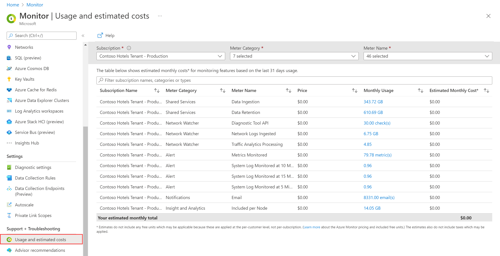
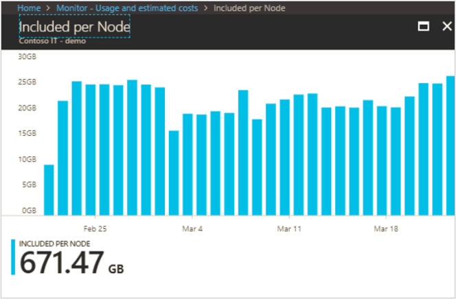

# Azure Monitor cost and usage
This article describes how to view usage and estimated costs across multiple Azure monitoring features. 

## Azure Monitor pricing model
The basic Azure Monitor billing model is a cloud-friendly, consumption-based pricing (pay-as-you-go) where you pay for only what you use. The following table describes the different types of usage that are charged in Azure Monitor. Detailed costs are provided in [Azure Monitor pricing](https://azure.microsoft.com/pricing/details/monitor/).

| Type | Description |
|:---|:---|
| Logs | Ingestion, retention, and export of data in Log Analytics workspaces and legacy Application insights resources. There are also costs for retrieving data from tables Configured for [Basic Logs](logs/basic-logs-configure.md) or [Archived Logs](logs/data-retention-archive.md). This will typically be the bulk of Azure Monitor charges for most customers. |
| Platform Logs | [Diagnostic and auditing information](essentials/resource-logs.md) charged for [certain services](essentials/resource-logs-categories.md#costs) when sent to destinations other than a Log Analytics workspace. |
| Metrics | There is no charge for [standard metrics](essentials/metrics-supported.md) collected from Azure resources. There is a cost for cost for collecting [custom metrics](essentials/metrics-custom-overview.md) and for retrieving metrics from the [REST API](essentials/rest-api-walkthrough.md#retrieve-metric-values). |
| Alerts | Charged based on the type and number of of signals used by the alert rule, its frequency, and the type of notification used in response.  |

> [!NOTE]
> There is a cost for [multi-step web tests](app/availability-multistep.md), but this feature has been deprecated.

### Application insights billing
Since [workspace-based Application Insights resources](app/create-workspace-resource.md) store their data in a Log Analytics workspace, the billing for data ingestion and retention is done by the workspace where the Application Insights data is located. Application Insights data types in the workspace receive 90 days of retention without charges. Usage of web tests and enabling alerting on custom metric dimensions is still billed through Application Insights. There's no data volume charge for using the [Live Metrics Stream](app/live-stream.md). On your Azure bill or in [Azure Cost Management + Billing](), your data ingestion and data retention for a [classic Application Insights resource](app/create-new-resource.md) will be reported with a meter category of Log Analytics.

[Multi-step web tests](app/availability-multistep.md) incur extra charges. There's no separate charge for ping tests of a single page. Telemetry from ping tests and multi-step tests is charged the same as data usage  for other telemetry from your app.

The Application Insights option to [Enable alerting on custom metric dimensions](app/pre-aggregated-metrics-log-metrics.md#custom-metrics-dimensions-and-pre-aggregation) can also increase costs because this can result in the creation of more pre-aggregation metrics. Learn more about log-based and pre-aggregated metrics in Application Insights and about pricing for Azure Monitor custom metrics.

#### Workspace-based Application Insights

For Application Insights resources which send their data to a Log Analytics workspace, called [workspace-based Application Insights resources](app/create-workspace-resource.md), the billing for data ingestion and retention is done by the workspace where the Application Insights data is located. This enables you to leverage all options of the Log Analytics [pricing model](logs/cost-logs.md), including **Commitment Tiers** in addition to Pay-As-You-Go. Commitment Tiers offer pricing up to 30% lower than Pay-As-You-Go. Log Analytics also has more options for data retention, including [retention by data type](../logs/data-retention-archive.md#get-retention-and-archive-policy-by-table). Application Insights data types in the workspace receive 90 days of retention without charges. Usage of web tests and enabling alerting on custom metric dimensions is still reported through Application Insights. Learn how to track data ingestion and retention costs in Log Analytics using the [Usage and estimated costs](../logs/manage-cost-storage.md#understand-your-usage-and-estimate-costs), [Azure Cost Management + Billing](../logs/manage-cost-storage.md#viewing-log-analytics-usage-on-your-azure-bill) and [Log Analytics queries](#data-volume-for-workspace-based-application-insights-resources). 

## Viewing Azure Monitor usage and charges
There are multiple ways to view and analyze your Azure Monitor billing and estimated charges 

Azure provides useful functionality in the [Azure Cost Management + Billing](../cost-management-billing/costs/quick-acm-cost-analysis.md?toc=/azure/billing/TOC.json) hub. After you open the hub, select **Cost Management** and select the [scope](../cost-management-billing/costs/understand-work-scopes.md) (the set of resources to investigate). You might need additional access to Cost Management data ([learn more](../cost-management-billing/costs/assign-access-acm-data.md)).

To see the Azure Monitor costs for the last 30 days, select the **Daily Costs** tile, select **Last 30 days** under **Relative dates**, and add a filter that selects the service names:

- **Azure Monitor**
- **Application Insights**
- **Log Analytics**
- **Insight and Analytics**

The result is a view like the following example:

You can drill in from this accumulated cost summary to get the finer details in the **Cost by resource** view. In the current pricing tiers, Azure log data is charged on the same set of meters whether it originates from Log Analytics or Application Insights. 

To separate costs from your Log Analytics or Application Insights usage, you can add a filter on **Resource type**. To see all Application Insights costs, filter **Resource type** to **microsoft.insights/components**. For Log Analytics costs, filter **Resource type** to **microsoft.operationalinsights/workspaces**. 

More details about your usage are available if you [download your usage from the Azure portal](../cost-management-billing/understand/download-azure-daily-usage.md). In the downloaded Excel spreadsheet, you can see usage per Azure resource per day. You can find usage from your Application Insights resources by filtering on the **Meter Category** column to show **Application Insights** and **Log Analytics**. Then add a **contains microsoft.insights/components** filter on the **Instance ID** column. 

Most Application Insights usage is reported on meters with **Log Analytics** for **Meter Category**, because there's a single log back end for all Azure Monitor components. Only Application Insights resources on legacy pricing tiers and multiple-step web tests are reported with **Application Insights** for **Meter Category**. The usage is shown in the **Consumed Quantity** column, and the unit for each entry is shown in the **Unit of Measure** column. More details are available to help you [understand your Microsoft Azure bill](../cost-management-billing/understand/review-individual-bill.md). 

## Viewing billed usage

The easiest way to view your billed usage for a particular Log Analytics workspace is to go to the **Overview** page of the workspace and click **View Cost** in the upper right corner of the **Essentials** section at the top of the page. This will launch the Cost Analysis from Azure Cost Management + Billing already scoped to this workspace.  You might need additional access to Cost 
Management data ([learn more](../cost-management-billing/costs/assign-access-acm-data.md))

The easiest way to see the billed usage for a single Application Insights resource, which isn't a workspace-baed resource is to go to the resource's Overview page and click View Cost in the upper right corner. You might need elevated access to Cost Management data (learn more).

:::image type="content" source="../logs/media/view-bill/view-cost-option.png" lightbox="media/view-bill/view-cost-option.png" alt-text="Screenshot of option to view cost for Log ANalytics workspace.":::

Alternatively, you can start in the [Azure Cost Management + Billing](../cost-management-billing/costs/quick-acm-cost-analysis.md?toc=%2fazure%2fbilling%2fTOC.json) hub where you can use the **Cost analysis** functionality to view your Azure resource expenses. Add a filter by **Resource type** using *microsoft.operationalinsights/workspace* for a Log Analytics workspace or *microsoft.operationalinsights/cluster* for dedicated clusters. For **Group by**, select **Meter category** or **Meter**. Other services, like Microsoft Defender for Cloud and Microsoft Sentinel, also bill their usage against Log Analytics workspace resources. To see the mapping to the service name, you can select the Table view instead of a chart.

## Download usage
To gain more understanding of your usage, you can [download your usage from the Azure portal](../cost-management-billing/understand/download-azure-daily-usage.md). For step-by-step instructions, review this [tutorial](../cost-management-billing/costs/tutorial-export-acm-data.md). In the downloaded spreadsheet, you can see usage per Azure resource (for example, Log Analytics workspace) per day. In this Excel spreadsheet, usage from your Log Analytics workspaces can be found by first filtering on the **Meter Category** column to show **Log Analytics**, **Insight and Analytics** (used by some of the legacy pricing tiers), and **Azure Monitor** (used by commitment tier pricing tiers). Then add a filter on the **Instance ID** column of *contains workspace* or *contains cluster* (the latter to include Log Analytics Cluster usage). The usage is shown in the **Consumed Quantity** column and the unit for each entry in the *Unit of Measure* column. For more information, see [Review your individual Azure subscription bill](../cost-management-billing/understand/review-individual-bill.md). 

## Usage and estimated costs

Another option for viewing your Azure Monitor usage is the **Usage and estimated costs** page in the Monitor hub. This page shows the usage of core monitoring features such as [alerting, metrics, and notifications](https://azure.microsoft.com/pricing/details/monitor/); [Azure Log Analytics](https://azure.microsoft.com/pricing/details/log-analytics/); and [Azure Application Insights](https://azure.microsoft.com/pricing/details/application-insights/). For customers on the pricing plans available before April 2018, this page also includes Log Analytics usage purchased through the Insights and Analytics offer.

On this page, users can view their resource usage for the past 31 days, aggregated per subscription. Drill-ins show usage trends over the 31-day period. A lot of data needs to come together for this estimate, so please be patient as the page loads.

This example shows monitoring usage and an estimate of the resulting costs:

Select the link in the **MONTHLY USAGE** column to open a chart that shows usage trends over the last 31-day period: 

> [!NOTE]
> Using **Cost Management** in the **Azure Cost Management + Billing** hub is the preferred approach to broadly understanding monitoring costs.  The **Usage and estimated costs** experiences for [Log Analytics](logs/manage-cost-storage.md#understand-your-usage-and-estimate-costs)  and [Application Insights](app/pricing.md#understand-your-usage-and-estimate-costs) provide deeper insights for each of those parts of Azure Monitor.

## Understand your usage and optimizing your pricing tier
To learn about your usage trends and choose the most cost-effective log Analytics pricing tier, use **Log Analytics Usage and Estimated Costs**. This shows how much data is collected by each solution, how much data is being retained, and an estimate of your costs for each pricing tier based on recent data ingestion patterns. 

:::image type="content" source="../logs/media/manage-cost-storage/usage-estimated-cost-dashboard-01.png" alt-text="Usage and estimated costs":::

To explore your data in more detail, select on the icon in the upper-right corner of either chart on the **Usage and Estimated Costs** page. Now you can work with this query to explore more details of your usage.  

:::image type="content" source="../logs/media/manage-cost-storage/logs.png" alt-text="Logs view":::

From the **Usage and Estimated Costs** page, you can review your data volume for the month. This includes all the billable data received and retained in your Log Analytics workspace.  
 
Log Analytics charges are added to your Azure bill. You can see details of your Azure bill under the **Billing** section of the Azure portal or in the [Azure Billing Portal](https://account.windowsazure.com/Subscriptions).  

## Operations Management Suite subscription entitlements

Customers who purchased Microsoft Operations Management Suite E1 and E2 are eligible for per-node data ingestion entitlements for [Log Analytics](https://www.microsoft.com/cloud-platform/operations-management-suite) and [Application Insights](app/pricing.md). Each Application Insights node includes up to 200 MB of data ingested per day (separate from Log Analytics data ingestion), with 90-day data retention at no extra cost.

To receive these entitlements for Log Analytics workspaces or Application Insights resources in a subscription, they must be use the Per-Node (OMS) pricing tier. This entitlement isn't visible in the estimated costs shown in the Usage and estimated cost pane. 

Depending on the number of nodes of the suite that your organization purchased, moving some subscriptions into a Per GB (pay-as-you-go) pricing tier might be advantageous, but this requires careful consideration.

Also, if you move a subscription to the new Azure monitoring pricing model in April 2018, the Per GB tier is the only tier available. Moving a subscription to the new Azure monitoring pricing model isn't advisable if you have an Operations Management Suite subscription.

> [!TIP]
> If your organization has Microsoft Operations Management Suite E1 or E2, it's usually best to keep your Log Analytics workspaces in the Per-Node (OMS) pricing tier and your Application Insights resources in the Enterprise pricing tier. 
>

## Next steps

