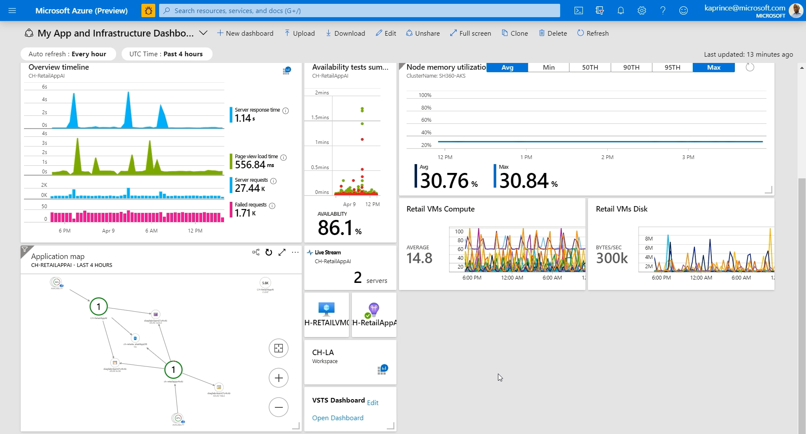
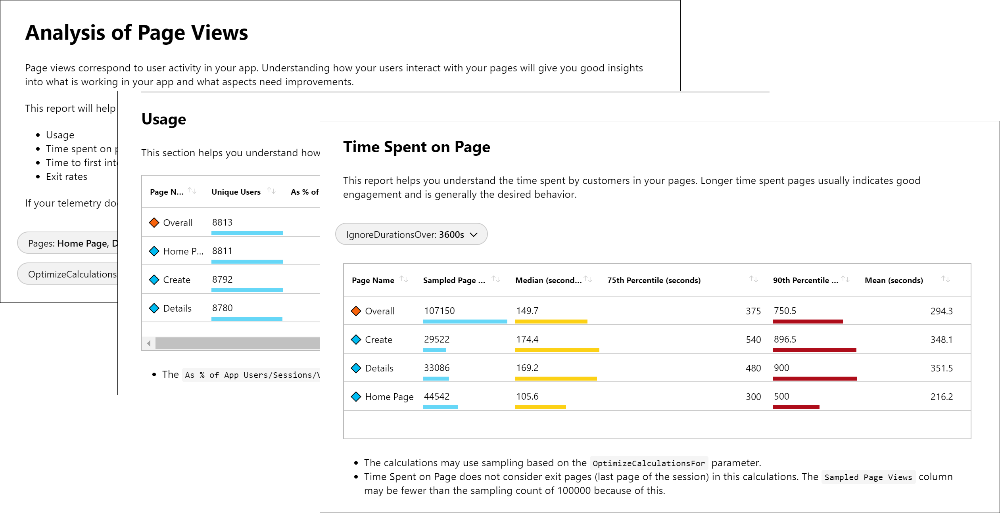

# Visualizing data from Azure Monitor
This article provides a summary of the available methods to visualize log and metric data stored in Azure Monitor.

Visualizations such as charts and graphs can help you analyze your monitoring data to drill-down on issues and identify patterns. Depending on the tool you use, you may also have the option to share visualizations with other users inside and outside of your organization.

[!INCLUDE [azure-monitor-log-analytics-rebrand](../../includes/azure-monitor-log-analytics-rebrand.md)]

## Azure Dashboards
[Azure dashboards](../azure-portal/azure-portal-dashboards.md) are the primary dashboarding technology for Azure. They're particularly useful in providing single pane of glass over your Azure infrastructure and services allowing you to quickly identify important issues.

### Advantages
- Deep integration into Azure. Visualizations can be pinned to dashboards from multiple Azure pages including Metrics Explorer, Log Analytics, and Application Insights.
- Supports both metrics and logs.
- Combine data from multiple sources including output from [metrics explorer](platform/metrics-charts.md), [Log queries](log-query/log-query-overview.md), and [maps](app/app-map.md) and availability in Application Insights.
- Option for personal or shared dashboards. Integrated with Azure [role based authentication (RBAC)](../role-based-access-control/overview.md).
- Automatic refresh. Metrics refresh depends on time range with minimum of five minutes. Logs refresh at one minute.
- Parametrized metrics dashboards with timestamp and custom parameters.
- Flexible layout options.
- Full screen mode.

### Limitations
- Limited control over log visualizations with no support for data tables. Total number of data series is limited to 10 with further data series grouped under an _other_ bucket.
- No custom parameters support for log charts.
- Log charts are limited to last 30 days.
- Log charts can only be pinned to shared dashboards.
- No interactivity with dashboard data.
- Limited contextual drill-down.

## Azure Monitor Views
[Views in Azure Monitor](platform/view-designer.md)  allow you to create custom visualizations with log data. They are used by [monitoring solutions](insights/solutions.md) to present the data they collect.

### Advantages
- Rich visualizations for log data.
- Export and import views to transfer them to other resource groups and subscriptions.
- Integrates into Azure Monitor management model with workspaces and monitoring solutions.
- [Filters](platform/view-designer-filters.md) for custom parameters.
- Interactive, supports multi-level drill-in (view that drills into another view)

### Limitations
- Supports logs but not metrics.
- No personal views. Available to all users with access to the workspace.
- No automatic refresh.
- Limited layout options.
- No support for querying across multiple workspaces or Application Insights applications.
- Queries are limited in response size to 8MB and query execution time of 110 seconds.

## Workbooks
[Workbooks](../azure-monitor/app/usage-workbooks.md) are interactive documents that provide deep insights into your data, investigation, and collaboration inside the team. Specific examples where workbooks are useful are troubleshooting guides and incident postmortem.

### Advantages
- Supports both metrics and logs.
- Supports parameters  enabling interactive reports where selecting an element in a table will dynamically update associated charts and visualizations.
- Document-like flow.
- Option for personal or shared workbooks.
- Easy, collaborative-friendly authoring experience.
- Templates support public GitHub-based template gallery.

### Limitations
- No automatic refresh.
- No dense layout like dashboards, which make workbooks less useful as a single pane of glass. Intended more for providing deeper insights.

## Power BI
[Power BI](https://powerbi.microsoft.com/documentation/powerbi-service-get-started/) is particularly useful for creating business-centric dashboards and reports, as well as reports analyzing long-term KPI trends. You can [import the results of a log query](platform/powerbi.md) into a Power BI dataset so you can take advantage of its features such as combining data from different sources and sharing reports on the web and mobile devices.

### Advantages
- Rich visualizations.
- Extensive interactivity including zoom-in and cross-filtering.
- Easy to share throughout your organization.
- Integration with other data from multiple data sources.
- Better performance with results cached in a cube.

### Limitations
- Supports logs but not metrics.
- No Azure integration. Can't manage dashboards and models through Azure Resource Manager.
- Query results need to be imported into Power BI model to configure. Limitation on result size and refresh.
- Limited data refresh of eight times per day.

## Grafana
[Grafana](https://grafana.com/) is an open platform that excels in operational dashboards. It's particularly useful for detecting and isolating and triaging operational incidents. You can add [Grafana Azure Monitor data source plugin](platform/grafana-plugin.md) to your Azure subscription to have it visualize your Azure metrics data.

### Advantages
- Rich visualizations.
- Rich ecosystem of datasources.
- Data interactivity including zoom in.
- Supports parameters.

### Limitations
- No Azure integration. Can't manage dashboards and models through Azure Resource Manager.
- Cost to support additional Grafana infrastructure or additional cost for Grafana Cloud.

## Build your own custom application
You can access data in log and metric data in Azure Monitor through their API using any REST client, which allows you to build your own custom websites and applications.

### Advantages
- Complete flexibility in UI, visualization, interactivity, and features.
- Combine metrics and log data with other data sources.

### Disadvantages
- Significant engineering effort required.

## Next steps
- Learn about the [data collected by Azure Monitor](platform/data-platform.md).
- Learn about [Azure dashboards](../azure-portal/azure-portal-dashboards.md).
- Learn about [Views in Azure Monitor](platform/view-designer.md).
- Learn about [Workbooks](../azure-monitor/app/usage-workbooks.md).
- Learn about [import log data into Power BI](../azure-monitor/platform/powerbi.md).
- Learn about the [Grafana Azure Monitor data source plugin](../azure-monitor/platform/grafana-plugin.md).

