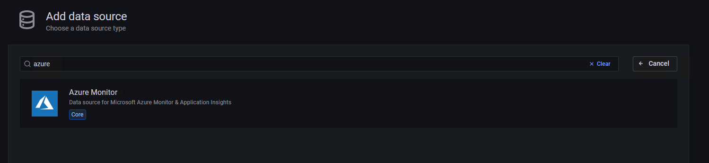
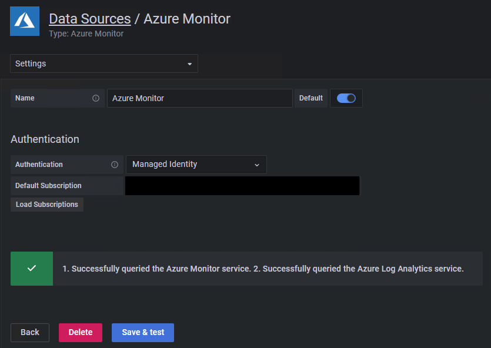
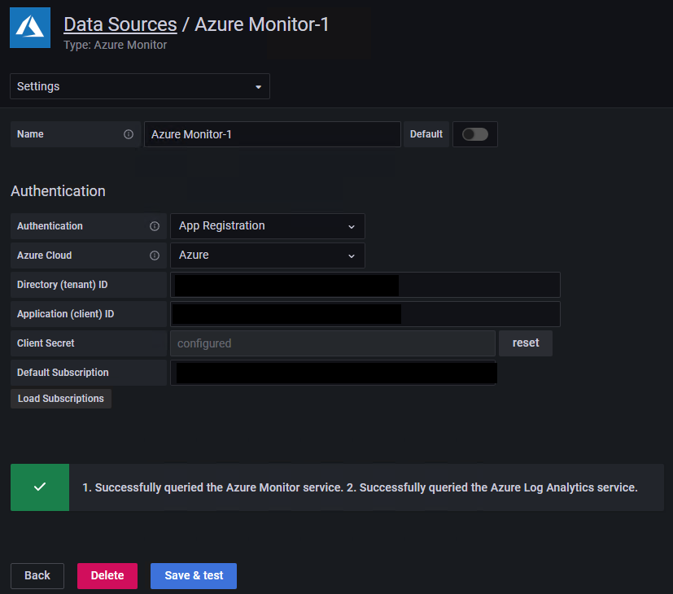
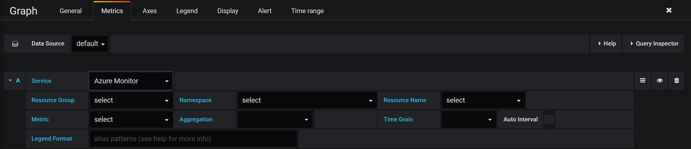
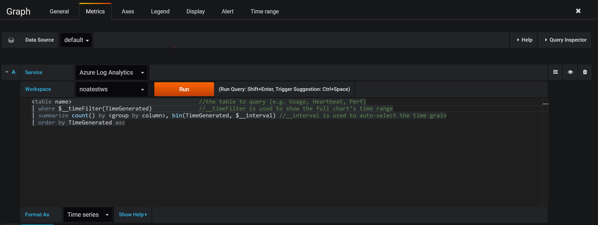
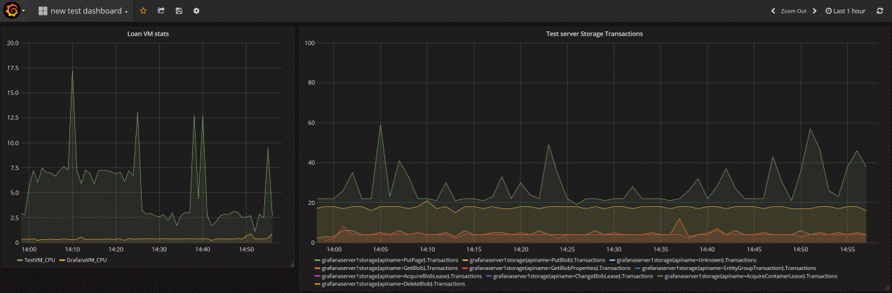
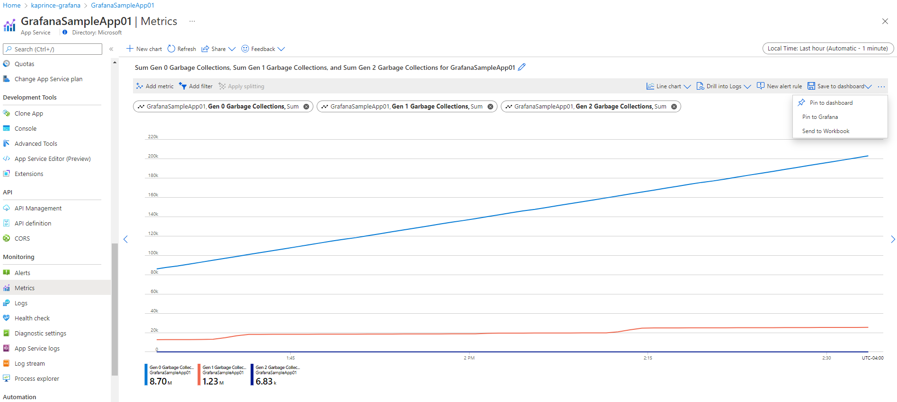
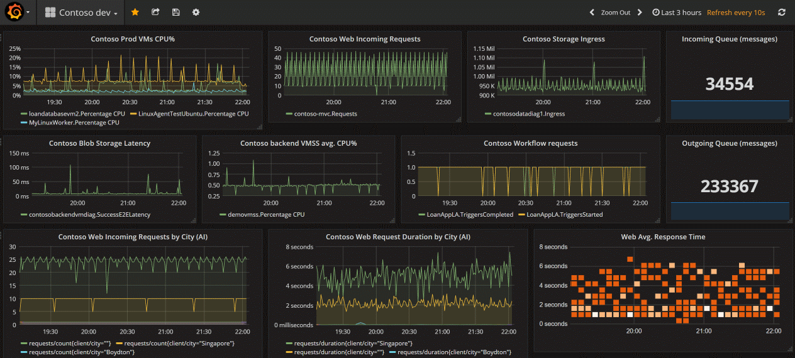

# Monitor your Azure services in Grafana
You can monitor Azure services and applications by using [Grafana](https://grafana.com/) and the included [Azure Monitor data source plug-in](https://grafana.com/docs/grafana/latest/datasources/azuremonitor/). The plug-in retrieves data from these Azure services:

- [Azure Monitor Metrics](../essentials/data-platform-metrics.md) for numeric time series data from Azure resources.
- [Azure Monitor Logs](../logs/data-platform-logs.md) for log and performance data from Azure resources that enables you to query by using the powerful Kusto Query Language (KQL). You can use Application Insights log queries to retrieve Application Insights log based metrics
    - [Application Insights log based metrics](../essentials/app-insights-metrics.md) to let you analyze the health of your monitored apps. You can use Application Insights log queries in Grafana to use the Application Insights log metrics data.
- [Azure Resource Graph](../../governance/resource-graph/overview.md) to quickly query and identify Azure resources across subscriptions.


You can then display this performance and availability data on your Grafana dashboard.

Use the following steps to set up a Grafana server and build dashboards for metrics and logs from Azure Monitor.

## Set up Grafana

Follow these steps to set up Grafana.

### Set up Azure Managed Grafana
Azure Managed Grafana is optimized for the Azure environment and works seamlessly with Azure Monitor. You can:

- Manage user authentication and access control by using Microsoft Entra identities.
- Pin charts from the Azure portal directly to Azure Managed Grafana dashboards.

Use this [quickstart guide](../../managed-grafana/quickstart-managed-grafana-portal.md) to create an Azure Managed Grafana workspace by using the Azure portal.

### Set up Grafana locally
To set up a local Grafana server, [download and install Grafana in your local environment](https://grafana.com/grafana/download).

## Sign in to Grafana

> [!IMPORTANT]
> Internet Explorer and the older Microsoft Edge browsers aren't compatible with Grafana. You must use a chromium-based browser including Microsoft Edge. For more information, see [Supported web browsers for Grafana](https://grafana.com/docs/grafana/latest/installation/requirements/#supported-web-browsers).

Sign in to Grafana by using the endpoint URL of your Azure Managed Grafana workspace or your server's IP address.

## Configure an Azure Monitor data source plug-in

Azure Managed Grafana includes an Azure Monitor data source plug-in. By default, the plug-in is preconfigured with a managed identity that can query and visualize monitoring data from all resources in the subscription in which the Grafana workspace was deployed. Skip ahead to the section "Build a Grafana dashboard."


You can expand the resources that can be viewed by your Azure Managed Grafana workspace by [configuring additional permissions](../../managed-grafana/how-to-permissions.md) to assign the included managed identity the [Monitoring Reader role](../roles-permissions-security.md) on other subscriptions or resources.

 If you're using an instance that isn't Azure Managed Grafana, you have to set up an Azure Monitor data source.

1. Select **Add data source**, filter by the name **Azure**, and select the **Azure Monitor** data source.

    

1. Pick a name for the data source and choose between managed identity or app registration for authentication.

If you're hosting Grafana on your own Azure Virtual Machines or Azure App Service instance with managed identity enabled, you can use this approach for authentication. However, if your Grafana instance isn't hosted on Azure or doesn't have managed identity enabled, you'll need to use app registration with an Azure service principal to set up authentication.

### Use managed identity

1. Enable managed identity on your VM or App Service instance and change the Grafana server managed identity support setting to **true**.
    * The managed identity of your hosting VM or App Service instance needs to have the [Monitoring Reader role](../roles-permissions-security.md) assigned for the subscription, resource group, or resources of interest.
    * You'll also need to update the setting `managed_identity_enabled = true` in the Grafana server config. For more information, see [Grafana configuration](https://grafana.com/docs/grafana/latest/administration/configuration/). After both steps are finished, you can then save and test access.

1. Select **Save & test** and Grafana will test the credentials. You should see a message similar to the following one.
    
   

### Use app registration

1. Create a service principal. Grafana uses a Microsoft Entra service principal to connect to Azure Monitor APIs and collect data. You must create, or use an existing service principal, to manage access to your Azure resources:
    * See [Create a Microsoft Entra app and service principal in the portal](../../active-directory/develop/howto-create-service-principal-portal.md) to create a service principal. Copy and save your tenant ID (Directory ID), client ID (Application ID), and client secret (Application key value).
    * View [Assign application to role](../../active-directory/develop/howto-create-service-principal-portal.md) to assign the [Monitoring Reader role](../roles-permissions-security.md) to the Microsoft Entra application on the subscription, resource group, or resource you want to monitor.
  
1. Provide the connection details you want to use:
    * When you configure the plug-in, you can indicate which Azure Cloud you want the plug-in to monitor: Public, Azure US Government, Azure Germany, or Microsoft Azure operated by 21Vianet.
        > [!NOTE]
        > Some data source fields are named differently than their correlated Azure settings:
        > * Tenant ID is the Azure Directory ID.
        > * Client ID is the Microsoft Entra Application ID.
        > * Client Secret is the Microsoft Entra Application key value.

1. Select **Save & test** and Grafana will test the credentials. You should see a message similar to the following one.
    
   

## Use out-of-the-box dashboards

Azure Monitor contains out-of-the-box dashboards to use with Azure Managed Grafana and the Azure Monitor plugin.

:::image type="content" source="media/grafana-plugin/grafana-out-of-the-box-dashboards.png" alt-text="Screenshot that shows out of the box Azure Monitor grafana dashboards.":::
 
Azure Monitor also supports out-of-the-box dashboards for seamless integration with Azure Monitor managed service for Prometheus. These dashboards are automatically deployed to Azure Managed Grafana when linked to Azure Monitor managed service for Prometheus.

:::image type="content" source="media/grafana-plugin/grafana-out-of-the-box-dashboards-prometheus.png" alt-text="Screenshot that shows out of the box Azure Monitor grafana dashboards for Azure Monitor managed service for Prometheus.":::
## Build a Grafana dashboard

1. Go to the Grafana home page and select **New Dashboard**.

1. In the new dashboard, select **Graph**. You can try other charting options, but this article uses **Graph** as an example.

1. A blank graph shows up on your dashboard. Select the panel title and select **Edit** to enter the details of the data you want to plot in this graph chart.

    

1. Select the Azure Monitor data source you've configured.
   * Visualizing Azure Monitor metrics: Select **Azure Monitor** in the service dropdown list. A list of selectors shows up where you can select the resources and metric to monitor in this chart. To collect metrics from a VM, use the namespace `Microsoft.Compute/VirtualMachines`. After you've selected VMs and metrics, you can start viewing their data in the dashboard.

     
   * Visualizing Azure Monitor log data: Select **Azure Log Analytics** in the service dropdown list. Select the workspace you want to query and set the query text. You can copy here any log query you already have or create a new one. As you enter your query, IntelliSense suggests autocomplete options. Select the visualization type, **Time series** > **Table**, and run the query.
    
     > [!NOTE]
     >
     > The default query provided with the plug-in uses two macros: `$__timeFilter()` and `$__interval`. 
     > These macros allow Grafana to dynamically calculate the time range and time grain, when you zoom in on part of a chart. You can remove these macros and use a standard time filter, such as `TimeGenerated > ago(1h)`, but that means the graph wouldn't support the zoom-in feature.
    
     

1. The following dashboard has two charts. The one on the left shows the CPU percentage of two VMs. The chart on the right shows the transactions in an Azure Storage account broken down by the Transaction API type.

    

## Pin charts from the Azure portal to Azure Managed Grafana

In addition to building your panels in Grafana, you can also quickly pin Azure Monitor visualizations from the Azure portal to new or existing Grafana dashboards by adding panels to your Grafana dashboard directly from Azure Monitor. Go to **Metrics** for your resource. Create a chart and select **Save to dashboard**, followed by **Pin to Grafana**. Choose the workspace and dashboard and select **Pin** to complete the operation.

[](media/grafana-plugin/grafana-pin-to-expanded.png#lightbox)

## Advanced Grafana features

Grafana has advanced features.

### Variables
Some query values can be selected through UI dropdowns and updated in the query. Consider the following query as an example:

```
Usage 
| where $__timeFilter(TimeGenerated) 
| summarize total_KBytes=sum(Quantity)*1024 by bin(TimeGenerated, $__interval) 
| sort by TimeGenerated
```

You can configure a variable that will list all available **Solution** values and then update your query to use it. To create a new variable, select the dashboard's **Settings** button in the top right area, select **Variables**, and then select **New**. On the variable page, define the data source and query to run to get the list of values.


After it's created, adjust the query to use the selected values, and your charts will respond accordingly:

```
Usage 
| where $__timeFilter(TimeGenerated) and Solution in ($Solutions)
| summarize total_KBytes=sum(Quantity)*1024 by bin(TimeGenerated, $__interval) 
| sort by TimeGenerated
```


### Create dashboard playlists

One of the many useful features of Grafana is the dashboard playlist. You can create multiple dashboards and add them to a playlist configuring an interval for each dashboard to show. Select **Play** to see the dashboards cycle through. You might want to display them on a large wall monitor to provide a status board for your group.


## Optional: Monitor other datasources in the same Grafana dashboards

There are many data source plug-ins that you can use to bring these metrics together in a dashboard.

Here are good reference articles on how to use Telegraf, InfluxDB, Azure Monitor managed service for Prometheus, and Docker:
 - [How to configure data sources for Azure Managed Grafana](../../managed-grafana/how-to-data-source-plugins-managed-identity.md)
 - [Use Azure Monitor managed service for Prometheus as data source for Grafana using managed system identity](../essentials/prometheus-grafana.md)
 - [How to monitor system Metrics with the TICK Stack on Ubuntu 16.04](https://www.digitalocean.com/community/tutorials/how-to-monitor-system-metrics-with-the-tick-stack-on-ubuntu-16-04)
 - [A monitoring solution for Docker hosts, containers, and containerized services](https://stefanprodan.com/2016/a-monitoring-solution-for-docker-hosts-containers-and-containerized-services/)

Here's an image of a full Grafana dashboard that has metrics from Azure Monitor and Application Insights.


## Clean up resources

If you've set up a Grafana environment on Azure, you're charged when resources are running whether you're using them or not. To avoid incurring additional charges, clean up the resource group created in this article.

1. On the left menu in the Azure portal, select **Resource groups** > **Grafana**.
1. On your resource group page, select **Delete**, enter **Grafana** in the text box, and then select **Delete**.

## Next steps
[Overview of Azure Monitor metrics](../data-platform.md)
