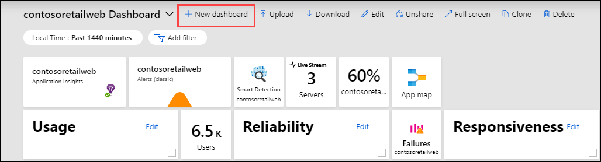
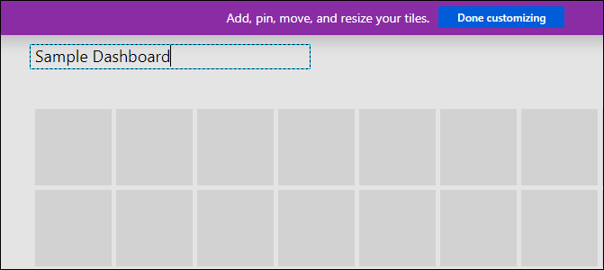

# Create and share dashboards of Log Analytics data

Log Analytics dashboards can visualize all of your saved log queries. Visualizations give you the ability to find, correlate, and share IT operational data in your organization. This tutorial covers creating a log query that will be used to support a shared dashboard that can be accessed by your IT operations support team. You learn how to:

> [!div class="checklist"]
> * Create a shared dashboard in the Azure portal.
> * Visualize a performance log query.
> * Add a log query to a shared dashboard.
> * Customize a tile in a shared dashboard.

To complete the example in this tutorial, you must have an existing virtual machine [connected to the Log Analytics workspace](../vm/monitor-virtual-machine.md).

## Sign in to the Azure portal
Sign in to the [Azure portal](https://portal.azure.com).

## Create a shared dashboard
Select **Dashboard** to open your default [dashboard](../../azure-portal/azure-portal-dashboards.md). Your dashboard will look different from the following example.


Here you can bring together operational data that's most important to IT across all your Azure resources, including telemetry from Azure Log Analytics. Before we visualize a log query, let's first create a dashboard and share it. We can then focus on our example performance log query, which will render as a line chart, and add it to the dashboard.

> [!NOTE]
> The following chart types are supported in Azure dashboards by using log queries:
> - `areachart`
> - `columnchart`
> - `piechart` (will render in dashboard as a donut)
> - `scatterchart`
> - `timechart`

To create a dashboard, select **New dashboard**.



This action creates a new, empty, private dashboard. It opens in a customization mode where you can name your dashboard and add or rearrange tiles. Edit the name of the dashboard and specify **Sample Dashboard** for this tutorial. Then select **Done customizing**.<br><br> 

When you create a dashboard, it's private by default, so you're the only person who can see it. To make it visible to others, select **Share**.


Choose a subscription and resource group for your dashboard to be published to. For convenience, you're guided toward a pattern where you place dashboards in a resource group called **dashboards**. Verify the subscription selected and then select **Publish**. Access to the information displayed in the dashboard is controlled with [Azure role-based access control](../../role-based-access-control/role-assignments-portal.md).

## Visualize a log query
[Log Analytics](../logs/log-analytics-tutorial.md) is a dedicated portal used to work with log queries and their results. Features include the ability to edit a query on multiple lines and selectively execute code. Log Analytics also uses context-sensitive IntelliSense and Smart Analytics. 

In this tutorial, you'll use Log Analytics to create a performance view in graphical form and save it for a future query. Then you'll pin it to the shared dashboard you created earlier.

Open Log Analytics by selecting **Logs** on the Azure Monitor menu. It starts with a new blank query.


Enter the following query to return processor utilization records for both Windows and Linux computers. The records are grouped by `Computer` and `TimeGenerated` and displayed in a visual chart. Select **Run** to run the query and view the resulting chart.

```Kusto
Perf 
| where CounterName == "% Processor Time" and ObjectName == "Processor" and InstanceName == "_Total" 
| summarize AggregatedValue = avg(CounterValue) by bin(TimeGenerated, 1hr), Computer 
| render timechart
```

Save the query by selecting **Save**.

:::image type="content" source="media/tutorial-logs-dashboards/save-query.png" alt-text="Screenshot that shows how to save a query and pin it to a dashboard.":::

In the **Save Query** control panel, provide a name such as **Azure VMs - Processor Utilization** and a category such as **Dashboards**. Select **Save**. This way you can create a library of common queries that you can use and modify. Finally, pin this query to the shared dashboard you created earlier. Select the **Pin to dashboard** button in the upper-right corner of the page and then select the dashboard name.

Now that we have a query pinned to the dashboard, you'll notice that it has a generic title and comment underneath it.

:::image type="content" source="media/tutorial-logs-dashboards/log-analytics-modify-dashboard-01.png" alt-text="Screenshot that shows an Azure dashboard sample.":::

 Rename the query with a meaningful name that can be easily understood by anyone who views it. Select **Edit** to customize the title and subtitle for the tile, and then select **Update**. A banner appears that asks you to publish changes or discard. Select **Save a copy**.

:::image type="content" source="media/tutorial-logs-dashboards/log-analytics-modify-dashboard-02.png" alt-text="Screenshot that shows a completed configuration of a sample dashboard.":::

## Next steps
In this tutorial, you learned how to create a dashboard in the Azure portal and add a log query to it. Follow this link to see prebuilt Log Analytics script samples.

> [!div class="nextstepaction"]
> [Log Analytics script samples](../logs/queries.md)
