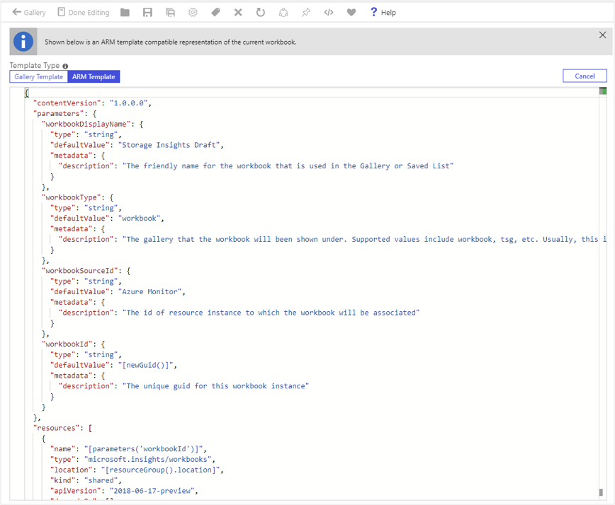

# Programmatically manage workbooks

Resource owners can create and manage their workbooks programmatically via Azure Resource Manager templates (ARM templates).

This capability can be useful in scenarios like:
* Deploying org- or domain-specific analytics reports along with resources deployments. For instance, you can deploy org-specific performance and failure workbooks for your new apps or virtual machines.
* Deploying standard reports or dashboards by using workbooks for existing resources.

The workbook will be created in the desired sub/resource-group and with the content specified in the ARM templates.

Two types of workbook resources can be managed programmatically:
* [Workbook templates](#arm-template-for-deploying-a-workbook-template)
* [Workbook instances](#arm-template-for-deploying-a-workbook-instance)

## ARM template for deploying a workbook template

1. Open a workbook you want to deploy programmatically.
1. Switch the workbook to edit mode by selecting **Edit**.
1. Open the **Advanced Editor** by using the **</>** button on the toolbar.
1. Ensure you're on the **Gallery Template** tab.

    

1. Copy the JSON in the gallery template to the clipboard.
1. The following sample ARM template deploys a workbook template to the Azure Monitor workbook gallery. Paste the JSON you copied in place of `<PASTE-COPIED-WORKBOOK_TEMPLATE_HERE>`. For a reference ARM template that creates a workbook template, see [this GitHub repository](https://github.com/microsoft/Application-Insights-Workbooks/blob/master/Documentation/ARM-template-for-creating-workbook-template).

    ```json
    {
        "$schema": "http://schema.management.azure.com/schemas/2015-01-01/deploymentTemplate.json#",
        "contentVersion": "1.0.0.0",
        "parameters": {
            "resourceName": {
                "type": "string",
                "defaultValue": "my-workbook-template",
                "metadata": {
                    "description": "The unique name for this workbook template instance"
                }
            }
        },
        "resources": [
            {
                "name": "[parameters('resourceName')]",
                "type": "microsoft.insights/workbooktemplates",
                "location": "[resourceGroup().location]",
                "apiVersion": "2019-10-17-preview",
                "dependsOn": [],
                "properties": {
                    "galleries": [
                        {
                            "name": "A Workbook Template",
                            "category": "Deployed Templates",
                            "order": 100,
                            "type": "workbook",
                            "resourceType": "Azure Monitor"
                        }
                    ],
                    "templateData": <PASTE-COPIED-WORKBOOK_TEMPLATE_HERE>
                }
            }
        ]
    }
    ```
1. In the `galleries` object, fill in the `name` and `category` keys with your values. Learn more about [parameters](#parameters) in the next section.
1. Deploy this ARM template by using either the [Azure portal](../../azure-resource-manager/templates/deploy-portal.md#deploy-resources-from-custom-template), the [command-line interface](../../azure-resource-manager/templates/deploy-cli.md), or [PowerShell](../../azure-resource-manager/templates/deploy-powershell.md).
1. Open the Azure portal and go to the workbook gallery chosen in the ARM template. In the example template, go to the Azure Monitor workbook gallery:
    1. Open the Azure portal and go to Azure Monitor.
    1. Open `Workbooks` from the table of contents.
    1. Find your template in the gallery under the category `Deployed Templates`. (It will be one of the purple items.)

### Parameters

|Parameters                |Explanation                                                                                             |
|:-------------------------|:-------------------------------------------------------------------------------------------------------|
| `name`                   | The name of the workbook template resource in Azure Resource Manager.                                  |
|`type`                    | Always microsoft.insights/workbooktemplates.                                                            |
| `location`               | The Azure location where the workbook will be created.                                               |
| `apiVersion`             | 2019-10-17 preview.                                                                                     |
| `type`                   | Always microsoft.insights/workbooktemplates.                                                            |
| `galleries`              | The set of galleries in which to show this workbook template.                                                |
| `gallery.name`           | The friendly name of the workbook template in the gallery.                                             |
| `gallery.category`       | The group in the gallery in which to place the template.                                                     |
| `gallery.order`          | A number that decides the order to show the template within a category in the gallery. Lower order implies higher priority. |
| `gallery.resourceType`   | The resource type corresponding to the gallery. This type is usually the resource type string corresponding to the resource (for example, microsoft.operationalinsights/workspaces). |
|`gallery.type`            | Referred to as workbook type. This unique key differentiates the gallery within a resource type. Application Insights, for example, has the types `workbook` and `tsg` that correspond to different workbook galleries. |

### Galleries

| Gallery                                        | Resource type                                       | Workbook type |
|:-----------------------------------------------|:----------------------------------------------------|:--------------|
| Workbooks in Azure Monitor                     | `Azure Monitor`                                     | `workbook`    |
| VM Insights in Azure Monitor                   | `Azure Monitor`                                     | `vm-insights` |
| Workbooks in Log Analytics workspace           | `microsoft.operationalinsights/workspaces`          | `workbook`    |
| Workbooks in Application Insights              | `microsoft.insights/components`                     | `workbook`    |
| Troubleshooting guides in Application Insights | `microsoft.insights/components`                     | `tsg`         |
| Usage in Application Insights                  | `microsoft.insights/components`                     | `usage`       |
| Workbooks in Kubernetes service                | `Microsoft.ContainerService/managedClusters`        | `workbook`    |
| Workbooks in resource groups                   | `microsoft.resources/subscriptions/resourcegroups`  | `workbook`    |
| Workbooks in Azure Active Directory            | `microsoft.aadiam/tenant`                           | `workbook`    |
| VM Insights in virtual machines                | `microsoft.compute/virtualmachines`                 | `insights`    |
| VM Insights in virtual machine scale sets      | `microsoft.compute/virtualmachinescalesets`         | `insights`    |

## ARM template for deploying a workbook instance

1. Open a workbook that you want to deploy programmatically.
1. Switch the workbook to edit mode by selecting **Edit**.
1. Open the **Advanced Editor** by selecting **</>**.
1. In the editor, switch **Template Type** to **ARM template**.
1. The ARM template for creating shows up in the editor. Copy the content and use as-is or merge it with a larger template that also deploys the target resource.

    

## Sample ARM template
This template shows how to deploy a workbook that displays `Hello World!`.

```json
{
    "$schema": "http://schema.management.azure.com/schemas/2015-01-01/deploymentTemplate.json#",
    "contentVersion": "1.0.0.0",
    "parameters": {
        "workbookDisplayName":  {             
            "type":"string",
            "defaultValue": "My Workbook",
            "metadata": {
                "description": "The friendly name for the workbook that is used in the Gallery or Saved List. Needs to be unique in the scope of the resource group and source" 
            }
        },
        "workbookType":  {             
            "type":"string",
            "defaultValue": "tsg",
            "metadata": {
                "description": "The gallery that the workbook will be shown under. Supported values include workbook, `tsg`, Azure Monitor, etc." 
            }
        },
        "workbookSourceId":  {             
            "type":"string",
            "defaultValue": "<insert-your-resource-id-here>",
            "metadata": {
                "description": "The id of resource instance to which the workbook will be associated" 
            }
        },
        "workbookId": {
            "type":"string",
            "defaultValue": "[newGuid()]",
            "metadata": {
                "description": "The unique guid for this workbook instance" 
            }
        }
    },    
    "resources": [
        {
            "name": "[parameters('workbookId')]",
            "type": "Microsoft.Insights/workbooks",
            "location": "[resourceGroup().location]",
            "kind": "shared",
            "apiVersion": "2018-06-17-preview",
            "dependsOn": [],
            "properties": {
                "displayName": "[parameters('workbookDisplayName')]",
                "serializedData": "{\"version\":\"Notebook/1.0\",\"items\":[{\"type\":1,\"content\":\"{\\\"json\\\":\\\"Hello World!\\\"}\",\"conditionalVisibility\":null}],\"isLocked\":false}",
                "version": "1.0",
                "sourceId": "[parameters('workbookSourceId')]",
                "category": "[parameters('workbookType')]"
            }
        }
    ],
    "outputs": {
        "workbookId": {
            "type": "string",
            "value": "[resourceId( 'Microsoft.Insights/workbooks', parameters('workbookId'))]"
        }
    }
}
```

### Template parameters

| Parameter | Description |
| :------------- |:-------------|
| `workbookDisplayName` | The friendly name for the workbook that's used in the **Gallery** or **Saved List**. Needs to be unique in the scope of the resource group and source. |
| `workbookType` | The gallery where the workbook appears. Supported values include workbook, `tsg`, and Azure Monitor. |
| `workbookSourceId` | The ID of the resource instance to which the workbook will be associated. The new workbook will show up related to this resource instance, for example, in the resource's table of contents under **Workbook**. If you want your workbook to show up in the **Workbooks** gallery in Azure Monitor, use the string **Azure Monitor** instead of a resource ID. |
| `workbookId` | The unique guid for this workbook instance. Use `[newGuid()]` to automatically create a new guid. |
| `kind` | Used to specify if the created workbook is shared. All new workbooks will use the value **shared**. |
| `location` | The Azure location where the workbook will be created. Use `[resourceGroup().location]` to create it in the same location as the resource group. |
| `serializedData` | Contains the content or payload to be used in the workbook. Use the ARM template from the workbooks UI to get the value. |

### Workbook types
Workbook types specify the workbook gallery type where the new workbook instance appears. Options include:

| Type | Gallery location |
| :------------- |:-------------|
| `workbook` | The default used in most reports, including the **Workbooks** gallery of Application Insights and Azure Monitor.  |
| `tsg` | The **Troubleshooting Guides** gallery in Application Insights. |
| `usage` | The **More** gallery under **Usage** in Application Insights. |

### Work with JSON-formatted workbook data in the serializedData template parameter

When you export an ARM template for an Azure workbook, there are often fixed resource links embedded within the exported `serializedData` template parameter. These links include potentially sensitive values such as subscription ID and resource group name, and other types of resource IDs.

The following example demonstrates the customization of an exported workbook ARM template, without resorting to string manipulation. The pattern shown in this example is intended to work with the unaltered data as exported from the Azure portal. It's also a best practice to mask out any embedded sensitive values when you manage workbooks programmatically. For this reason, the subscription ID and resource group have been masked here. No other modifications were made to the raw incoming `serializedData` value.

```json
{
  "contentVersion": "1.0.0.0",
  "parameters": {
    "workbookDisplayName": {
      "type": "string"
    },
    "workbookSourceId": {
      "type": "string",
      "defaultValue": "[resourceGroup().id]"
    },
    "workbookId": {
      "type": "string",
      "defaultValue": "[newGuid()]"
    }
  },
  "variables": {
    // serializedData from original exported Azure Resource Manager template
    "serializedData": "{\"version\":\"Notebook/1.0\",\"items\":[{\"type\":1,\"content\":{\"json\":\"Replace with Title\"},\"name\":\"text - 0\"},{\"type\":3,\"content\":{\"version\":\"KqlItem/1.0\",\"query\":\"{\\\"version\\\":\\\"ARMEndpoint/1.0\\\",\\\"data\\\":null,\\\"headers\\\":[],\\\"method\\\":\\\"GET\\\",\\\"path\\\":\\\"/subscriptions/XXXXXXXX-XXXX-XXXX-XXXX-XXXXXXXXXXXX/resourceGroups\\\",\\\"urlParams\\\":[{\\\"key\\\":\\\"api-version\\\",\\\"value\\\":\\\"2019-06-01\\\"}],\\\"batchDisabled\\\":false,\\\"transformers\\\":[{\\\"type\\\":\\\"jsonpath\\\",\\\"settings\\\":{\\\"tablePath\\\":\\\"$..*\\\",\\\"columns\\\":[]}}]}\",\"size\":0,\"queryType\":12,\"visualization\":\"map\",\"tileSettings\":{\"showBorder\":false},\"graphSettings\":{\"type\":0},\"mapSettings\":{\"locInfo\":\"AzureLoc\",\"locInfoColumn\":\"location\",\"sizeSettings\":\"location\",\"sizeAggregation\":\"Count\",\"opacity\":0.5,\"legendAggregation\":\"Count\",\"itemColorSettings\":null}},\"name\":\"query - 1\"}],\"isLocked\":false,\"fallbackResourceIds\":[\"/subscriptions/XXXXXXXX-XXXX-XXXX-XXXX-XXXXXXXXXXXX/resourceGroups/XXXXXXX\"]}",

    // parse the original into a JSON object, so that it can be manipulated
    "parsedData": "[json(variables('serializedData'))]",

    // create new JSON objects that represent only the items/properties to be modified
    "updatedTitle": {
      "content":{
        "json": "[concat('Resource Group Regions in subscription \"', subscription().displayName, '\"')]"
      }
    },
    "updatedMap": {
      "content": {
        "path": "[concat('/subscriptions/', subscription().subscriptionId, '/resourceGroups')]"
      }
    },

    // the union function applies the updates to the original data
    "updatedItems": [
      "[union(variables('parsedData')['items'][0], variables('updatedTitle'))]",
      "[union(variables('parsedData')['items'][1], variables('updatedMap'))]"
    ],

    // copy to a new workbook object, with the updated items
    "updatedWorkbookData": {
      "version": "[variables('parsedData')['version']]",
      "items": "[variables('updatedItems')]",
      "isLocked": "[variables('parsedData')['isLocked']]",
      "fallbackResourceIds": ["[parameters('workbookSourceId')]"]
    },

    // convert back to an encoded string
    "reserializedData": "[string(variables('updatedWorkbookData'))]"
  },
  "resources": [
    {
      "name": "[parameters('workbookId')]",
      "type": "microsoft.insights/workbooks",
      "location": "[resourceGroup().location]",
      "apiVersion": "2018-06-17-preview",
      "dependsOn": [],
      "kind": "shared",
      "properties": {
        "displayName": "[parameters('workbookDisplayName')]",
        "serializedData": "[variables('reserializedData')]",
        "version": "1.0",
        "sourceId": "[parameters('workbookSourceId')]",
        "category": "workbook"
      }
    }
  ],
  "outputs": {
    "workbookId": {
      "type": "string",
      "value": "[resourceId( 'microsoft.insights/workbooks', parameters('workbookId'))]"
    }
  },
  "$schema": "https://schema.management.azure.com/schemas/2019-04-01/deploymentTemplate.json#"
}
```

In this example, the following steps facilitate the customization of an exported ARM template:

1. Export the workbook as an ARM template as explained in the preceding section.
1. In the template's `variables` section:
    1. Parse the `serializedData` value into a JSON object variable, which creates a JSON structure including an array of items that represent the content of the workbook.
    1. Create new JSON objects that represent only the items/properties to be modified.
    1. Project a new set of JSON content items (`updatedItems`) by using the `union()` function to apply the modifications to the original JSON items.
    1. Create a new workbook object, `updatedWorkbookData`, that contains `updatedItems` and the `version`/`isLocked` data from the original parsed data and a corrected set of `fallbackResourceIds`.
    1. Serialize the new JSON content back into a new string variable, `reserializedData`.
1. Use the new `reserializedData` variable in place of the original `serializedData` property.
1. Deploy the new workbook resource by using the updated ARM template.

### Limitations
Currently, this mechanism can't be used to create workbook instances in the **Workbooks** gallery of Application Insights. We're working on addressing this limitation. In the meantime, we recommend that you use the **Troubleshooting Guides** gallery (workbookType: `tsg`) to deploy Application Insights-related workbooks.

## Next steps

Explore how workbooks are being used to power the new [Storage insights experience](../../storage/common/storage-insights-overview.md?toc=%2fazure%2fazure-monitor%2ftoc.json).
