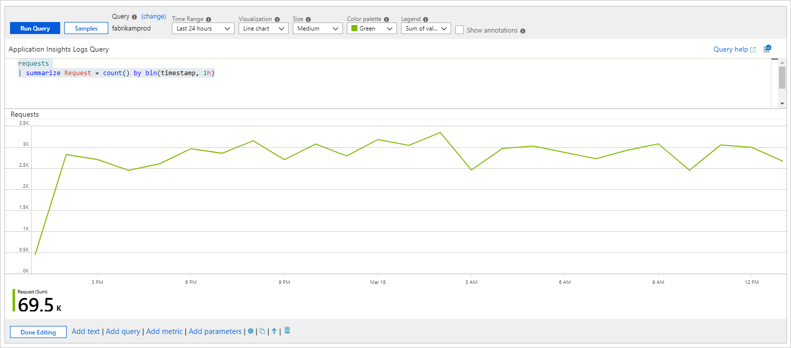
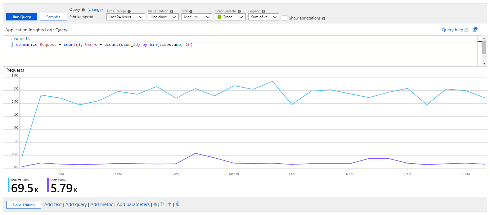
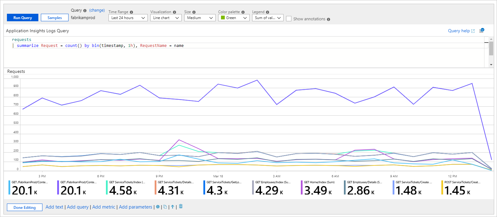
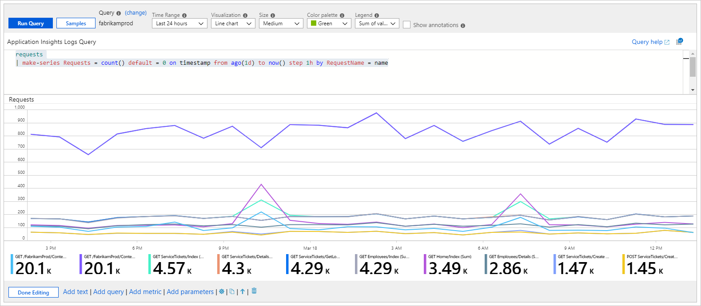
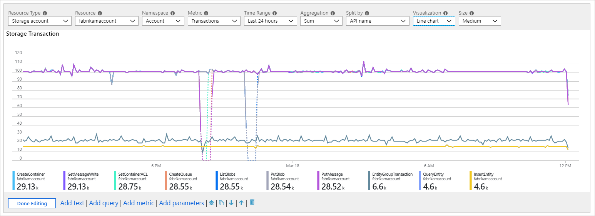
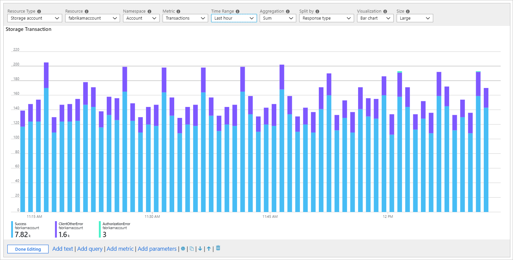
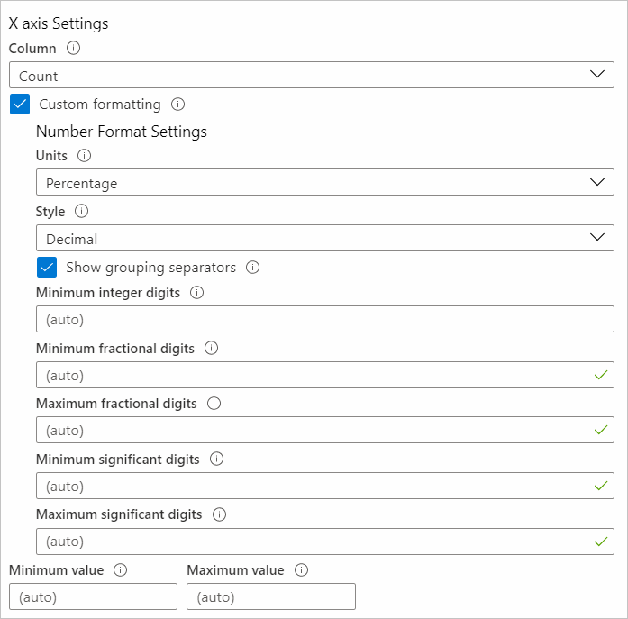

# Chart visualizations

Workbooks can take the data returned from queries in various formats to create different visualizations from that data, such as area, line, bar, or time visualizations.

You can present monitoring data as charts. Supported chart types include:

- Line
- Bar
- Bar categorical
- Area
- Scatter plot
- Pie
- Time

You can choose to customize the:

- Height
- Width
- Color palette
- Legend
- Titles
- No-data message
- Other characteristics

You can also customize axis types and series colors by using chart settings.

Workbooks support charts for both logs and metric data sources.

## Log charts

Azure Monitor logs give you detailed information about your apps and infrastructure. Log information isn't collected by default, and you have to configure data collection. Logs provide information about the state of the resource and data that's useful for diagnostics. You can use workbooks to present log data as visual charts for user analysis.

### Add a log chart

The following example shows the trend of requests to an app over the previous days.

1. Switch the workbook to edit mode by selecting **Edit** on the toolbar.
1. Use the **Add query** link to add a log query control to the workbook.
1. For **Query type**, select **Log**. For **Resource type**, select, for example, **Application Insights**, and select the resources to target.
1. Use the query editor to enter the [KQL](/azure/kusto/query/) for your analysis. An example is trend of requests.
1. Set **Visualization** to **Area**, **Bar**, **Bar (categorical)**, **Line**, **Pie**, **Scatter**, or **Time**.
1. Set other parameters like time range, visualization, size, color palette, and legend, if needed.

[](./media/workbooks-chart-visualizations/log-chart.png#lightbox)

### Log chart parameters

| Parameter | Description | Examples |
| ------------- |:-------------|:-------------|
| Query type | The type of query to use. | Logs, Azure Resource Graph |
| Resource type | The resource type to target. | Application Insights, Log Analytics, or Azure-first |
| Resources | A set of resources to get the metrics value from. | MyApp1 |
| Time range | The time window to view the log chart. | Last hour, last 24 hours |
| Visualization | The visualization to use. | Area, bar, line, pie, scatter, time, bar (categorical) |
| Size | The vertical size of the control. | Small, medium, large, or full |
| Color palette | The color palette to use in the chart. Ignored in multi-metric or segmented mode. | Blue, green, red |
| Legend | The aggregation function to use for the legend. | Sum or average of values or max, min, first, last value |
| Query | Any KQL query that returns data in the format expected by the chart visualization. | _requests \| make-series Requests = count() default = 0 on timestamp from ago(1d) to now() step 1h_ |

### Time-series charts

You can use the workbook's query control to create time-series charts such as area, bar, line, scatter, and time. You must have time and metric information in the result set to create a time-series chart.

#### Simple time series

The following query returns a table with two columns: `timestamp` and `Requests`. The query control uses `timestamp` for the x-axis and `Requests` for the y-axis.

```kusto
requests
| summarize Requests = count() by bin(timestamp, 1h)
```

[](./media/workbooks-chart-visualizations/log-chart-line-simple.png#lightbox)

#### Time series with multiple metrics

The following query returns a table with three columns: `timestamp`, `Requests`, and `Users`. The query control uses `timestamp` for the x-axis and `Requests` and `Users` as separate series on the y-axis.

```kusto
requests
| summarize Requests = count(), Users = dcount(user_Id) by bin(timestamp, 1h)
```

[](./media/workbooks-chart-visualizations/log-chart-line-multi-metric.png#lightbox)

#### Segmented time series

The following query returns a table with three columns: `timestamp`, `Requests`, and `RequestName`, where `RequestName` is a categorical column with the names of requests. The query control here uses `timestamp` for the x-axis and adds a series per value of `RequestName`.

```
requests
| summarize Request = count() by bin(timestamp, 1h), RequestName = name
```

[](./media/workbooks-chart-visualizations/log-chart-line-segmented.png#lightbox)

### Summarize vs. make-series

The examples in the previous section use the `summarize` operator because it's easier to understand. The `summarize` operator's major limitation is that it omits the results row if there are no items in the bucket. If the results row is omitted, depending on where the empty buckets are in the time range, the chart time window might shift.

We recommend using the `make-series` operator to create time-series data. You can provide default values for empty buckets.

The following query uses the `make-series` operator:

```kusto
requests
| make-series Requests = count() default = 0 on timestamp from ago(1d) to now() step 1h by RequestName = name
```

The following query shows a similar chart with the `summarize` operator:

```kusto
requests
| summarize Request = count() by bin(timestamp, 1h), RequestName = name
```

[](./media/workbooks-chart-visualizations/log-chart-line-make-series.png#lightbox)

### Categorical bar chart or histogram

You can represent a dimension or column on the x-axis by using categorical charts. Categorical charts are useful for histograms. The following example shows the distribution of requests by their result code:

```kusto
requests
| summarize Requests = count() by Result = strcat('Http ', resultCode)
| order by Requests desc
```

The query returns two columns: `Requests` metric and `Result` category. Each value of the `Result` column is represented by a bar in the chart with height proportional to the `Requests metric`.

[](./media/workbooks-chart-visualizations/log-chart-categorical-bar.png#lightbox)

### Pie charts

Pie charts allow the visualization of numerical proportion. The following example shows the proportion of requests by their result code:

```kusto
requests
| summarize Requests = count() by Result = strcat('Http ', resultCode)
| order by Requests desc
```

The query returns two columns: `Requests` metric and `Result` category. Each value of the `Result` column gets its own slice in the pie with size proportional to the `Requests` metric.

[](./media/workbooks-chart-visualizations/log-chart-pie-chart.png#lightbox)

## Metric charts

Most Azure resources emit metric data about their state and health. Examples include CPU utilization, storage availability, count of database transactions, and failing app requests. You can use workbooks to create visualizations of this data as time-series charts.

### Add a metric chart

The following example shows the number of transactions in a storage account over the prior hour. This information allows the storage owner to see the transaction trend and look for anomalies in behavior.

1. Switch the workbook to edit mode by selecting **Edit** on the toolbar.
1. Use the **Add metric** link to add a metric control to the workbook.
1. Select a resource type, for example, **Storage account**. Select the resources to target, the metric namespace and name, and the aggregation to use.
1. Set other parameters like time range, split by, visualization, size, and color palette, if needed.

[](./media/workbooks-chart-visualizations/metric-chart.png#lightbox)

### Metric chart parameters

| Parameter | Description | Examples |
| ------------- |:-------------|:-------------|
| Resource type | The resource type to target. | Storage or virtual machine |
| Resources | A set of resources to get the metrics value from. | MyStorage1 |
| Namespace | The namespace with the metric. | Storage > Blob |
| Metric | The metric to visualize. | Storage > Blob > Transactions |
| Aggregation | The aggregation function to apply to the metric. | Sum, count, average |
| Time range | The time window to view the metric in. | Last hour, last 24 hours |
| Visualization | The visualization to use. | Area, bar, line, scatter, grid |
| Split by | Optionally split the metric on a dimension. | Transactions by geo type |
| Size | The vertical size of the control. | Small, medium, or large |
| Color palette | The color palette to use in the chart. Ignored if the `Split by` parameter is used. | Blue, green, red |

### Examples

Transactions split by API name as a line chart:

[](./media/workbooks-chart-visualizations/metric-chart-storage-split-line.png#lightbox)

Transactions split by response type as a large bar chart:

[](./media/workbooks-chart-visualizations/metric-chart-storage-bar-large.png#lightbox)

Average latency as a scatter chart:

[](./media/workbooks-chart-visualizations/metric-chart-storage-scatter.png#lightbox)

## Chart settings

You can use chart settings to customize which fields are used in the:

- Chart axes
- Axis units
- Custom formatting
- Ranges
- Grouping behaviors
- Legends
- Series colors

### Settings tab

The **Settings** tab controls:

- **X-axis Settings**, **Y-axis Settings**: Includes which fields. You can use custom formatting to set the number formatting to the axis values and custom ranges.
- **Grouping Settings**: Includes which field. Sets the limits before an "Others" group is created.
- **Legend Settings**: Shows metrics like series name, colors, and numbers at the bottom, and a legend like series names and colors.


#### Custom formatting

Number formatting options are shown in this table.

| Formatting option             | Description                                                                                           |
|:---------------------------- |:-------------------------------------------------------------------------------------------------------|
| Units                      | The units for the column, such as various options for percentage, counts, time, byte, count/time, and bytes/time. For example, the unit for a value of 1234 can be set to milliseconds and it's rendered as 1.234s.                                  |
| Style                      | The format to render it as, such as decimal, currency, and percent.                                               |
| Show grouping separators       | Checkbox to show group separators. Renders 1234 as 1,234 in the US.                                    |
| Minimum integer digits     | Minimum number of integer digits to use (default 1).                                                   |
| Minimum fractional digits  | Minimum number of fractional digits to use (default 0).                                                |
| Maximum fractional digits  | Maximum number of fractional digits to use.                                                            |
| Minimum significant digits | Minimum number of significant digits to use (default 1).                                               |
| Maximum significant digits | Maximum number of significant digits to use.                                                           |



### Series Settings tab

You can adjust the labels and colors shown for series in the chart with the **Series Settings** tab:

- **Series name**: This field is used to match a series in the data and, if matched, the display label and color are displayed.
- **Comment**: This field is useful for template authors because this comment might be used by translators to localize the display labels.


## Next steps

- Learn how to create a [tile in workbooks](workbooks-tile-visualizations.md).
- Learn how to create [interactive workbooks](workbooks-interactive.md).
