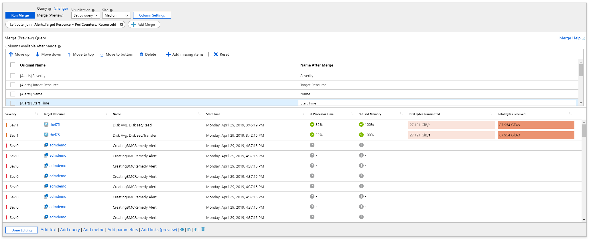

# Combine data from different sources

It is often necessary to bring together data from different sources that enhance the insights experience. An example is augmenting active alert information with related metric data. This allows users to see not just the effect (an active alert), but also potential causes (for example, high CPU usage). The monitoring domain has numerous such correlatable data sources that are often critical to the triage and diagnostic workflow.

Workbooks allow not just the querying of different data sources, but also provides simple controls that allow you to merge or join the data to provide rich insights. The `merge` control is the way to achieve it.

## Combining alerting data with Log Analytics VM performance data

The example below combines alerting data with Log Analytics VM performance data to get a rich insights grid.

## Using merge control to combine Azure Resource Graph and Log Analytics data

Here is a tutorial on using the merge control to combine Azure Resource Graph and Log Analytics data:

[https://www.youtube.com/watch?v=7nWP_YRzxHg](https://www.youtube.com/watch?v=7nWP_YRzxHg)

Workbooks support these merges:

* Inner unique join
* Full inner join
* Full outer join
* Left outer join
* Right outer join
* Left semi-join
* Right semi-join
* Left anti-join
* Right anti-join
* Union
* Duplicate table

## Next steps
 - [Getting started with Azure Workbooks](workbooks-getting-started.md).
 - [Azure workbooks data sources](workbooks-data-sources.md).