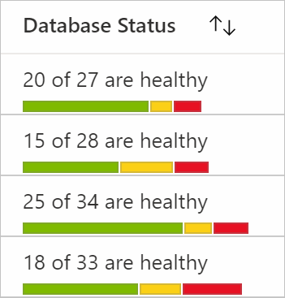
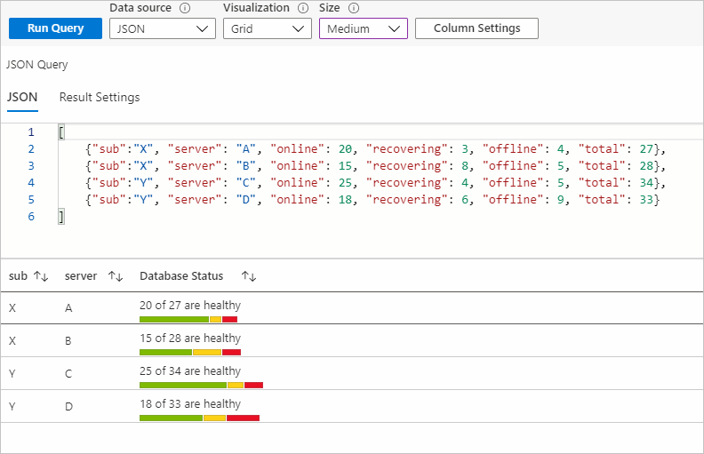
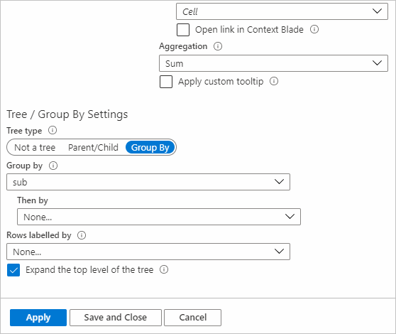
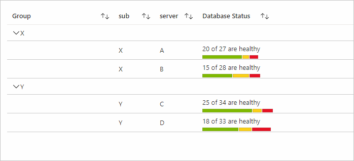
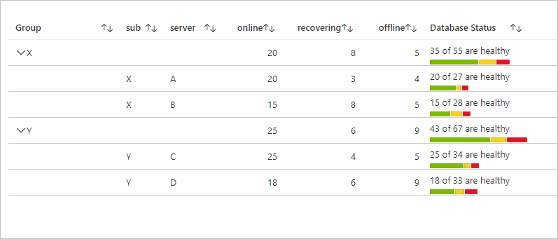
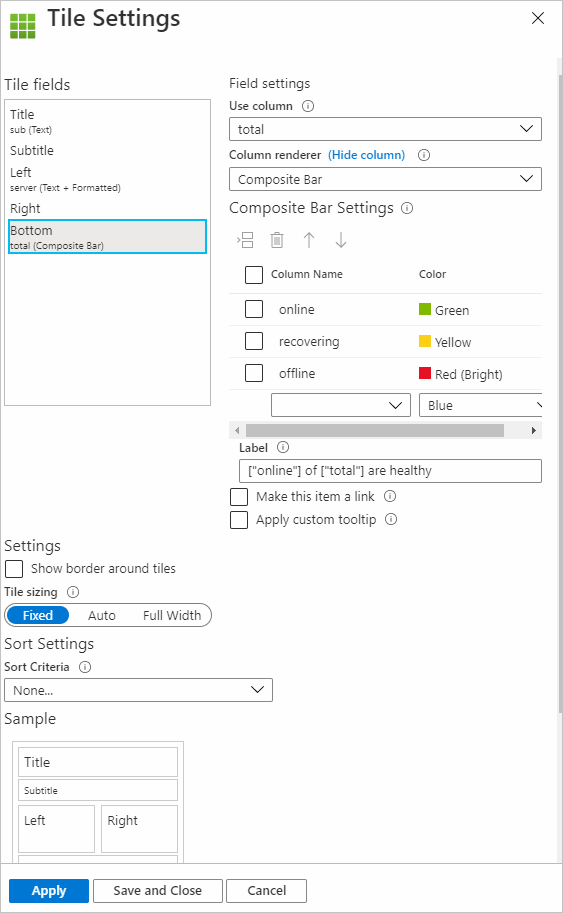
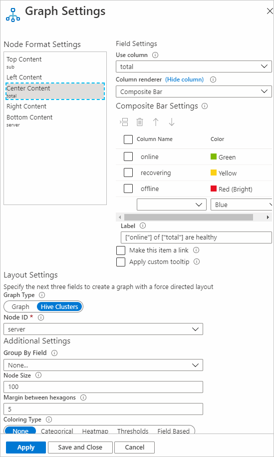

# Composite bar renderer

With Azure Workbooks, data can be rendered by using the composite bar. This bar is made up of multiple bars.

The following image shows the composite bar for database status. It shows how many servers are online, offline, and in a recovering state.



The composite bar renderer is supported for grid, tile, and graph visualizations.

## Add the composite bar renderer

1. Switch the workbook to edit mode by selecting **Edit**.
1. Select **Add** > **Add query**.
1. Set **Data source** to `JSON` and set **Visualization** to `Grid`.
1. Add the following JSON data:

    ```json
    [
        {"sub":"X", "server": "A", "online": 20, "recovering": 3, "offline": 4, "total": 27},
        {"sub":"X", "server": "B", "online": 15, "recovering": 8, "offline": 5, "total": 28},
        {"sub":"Y", "server": "C", "online": 25, "recovering": 4, "offline": 5, "total": 34},
        {"sub":"Y", "server": "D", "online": 18, "recovering": 6, "offline": 9, "total": 33}
    ]
    ```

1. Run the query.
1. Select **Column Settings** to open the settings pane.
1. Under **Columns**, select `total`. For **Column renderer**, select `Composite Bar`.
1. Under **Composite Bar Settings**, set the following settings:

    | Column Name | Color        |
    |-------------|--------------|
    | online      | Green        |
    | recovering  | Yellow       |
    | offline     | Red (Bright) |

1. For **Label**, enter `["online"] of ["total"] are healthy`.
1. In the column settings for **online**, **offline**, and **recovering**, you can set **Column renderer** to `Hidden` (optional).
1. Select the **Labels** tab and update the label for the total column as `Database Status` (optional).
1. Select **Apply**.

The composite bar settings will look like the following screenshot:


The composite bar with the preceding settings:



## Composite bar settings

Select the column name and corresponding color to render the column in that color as part of a composite bar. You can insert, delete, and move rows up and down.

### Label

The composite bar label is displayed at the top of the composite bar. You can use a mix of static text, columns, and parameters. If **Label** is empty, the value of the current columns is displayed as the label. In the previous example, if we left the **Label** field blank, the value of total columns would be displayed.

Refer to columns with `["columnName"]`.

Refer to parameters with `{paramName}`.

Both the column name and parameter name are case sensitive. You can also make labels a link by selecting **Make this item a link** and then adding link settings.

### Aggregation

Aggregations are useful for Tree/Group By visualizations. The data for a column for the group row is decided by the aggregation set for that column. Three types of aggregations are applicable for composite bars: None, Sum, and Inherit.

To add Group By settings:

1. In column settings, go to the column you want to add settings to.
1. In **Tree/Group By Settings**, under **Tree type**, select **Group By**.
1. Select the field you want to group by.

   

#### None

The setting of **None** for aggregation means that no results are displayed for that column for the group rows.



#### Sum

If aggregation is set as **Sum**, the column in the group row shows the composite bar by using the sum of the columns used to render it. The label will also use the sum of the columns referred to in it.

In the following example, **online**, **offline**, and **recovering** all have max aggregation set to them and the aggregation for the total column is **Sum**.



#### Inherit

If aggregation is set as **Inherit**, the column in the group row shows the composite bar by using the aggregation set by users for the columns used to render it. The columns used in **Label** also use the aggregation set by the user. If the current column renderer is **Composite Bar** and is referred to in the label (like **total** in the preceding example), then **Sum** is used as the aggregation for that column.

In the following example, **online**, **offline**, and **recovering** all have max aggregation set to them and the aggregation for total column is **Inherit**.


## Sorting

For grid visualizations, the sorting of the rows for the column with the composite bar renderer works based on the value that's the sum of the columns used to render the composite bar computer dynamically. In the previous examples, the value used for sorting is the sum of the **online**, **recovering**, and **offline** columns for that particular row.

## Tile visualizations

To make a composite bar renderer for a tile visualization:

1. Select **Add** > **Add query**.
1. Change the data source to `JSON`. Enter the data from the [previous example](#add-the-composite-bar-renderer).
1. Change **Visualization** to `Tiles`.
1. Run the query.
1. Select **Tile Settings**.
1. Under **Tile fields**, select **Left**.
1. Under **Field settings**, set the following settings:
    1. **Use column**: `server`
    1. **Column renderer**: `Text`
1. Under **Tile fields**, select **Bottom**.
1. Under **Field settings**, set the following settings:
    1. **Use column**: `total`
    1. **Column renderer**: `Composite Bar`
    1. Under **Composite Bar Settings**, set the following settings:

        | Column Name | Color        |
        |-------------|--------------|
        | online      | Green        |
        | recovering  | Yellow       |
        | offline     | Red (Bright) |

    1. For **Label**, enter `["online"] of ["total"] are healthy`.
1. Select **Apply**.

Composite bar settings for tiles:



The composite bar view for tiles with the preceding settings will look like this example:


## Graph visualizations

To make a composite bar renderer for a graph visualization (type Hive Clusters):

1. Select **Add** > **Add query**.
2. Change **Data source** to `JSON`. Enter the data from the [previous example](#add-the-composite-bar-renderer).
1. Change **Visualization** to `Graphs`.
1. Run the query.
1. Select **Graph Settings**.
1. Under **Node Format Settings**, select **Center Content**.
1. Under **Field settings**, set the following settings:
    1. **Use column**: `total`
    1. **Column renderer**: `Composite Bar`
    1. Under **Composite Bar Settings**, set the following settings:

        |Column Name  |     Color    |
        |-------------|--------------|
        | online      | Green        |
        | recovering  | Yellow       |
        | offline     | Red (Bright) |

   1. For **Label**, enter `["online"] of ["total"] are healthy`.
1. Under **Layout Settings**, set the following settings:
    1. **Graph Type**: `Hive Clusters`
    1. **Node ID**: `server`
    1. **Group By Field**: `None`
    1. **Node Size**: `100`
    1. **Margin between hexagons**: `5`
    1. **Coloring Type**: `None`
1. Select **Apply**.

Composite bar settings for graphs:



The composite bar view for a graph with the preceding settings will look like this example:


## Next steps

[Get started with Azure Workbooks](workbooks-getting-started.md)
