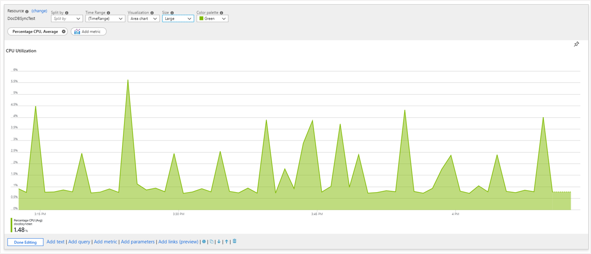
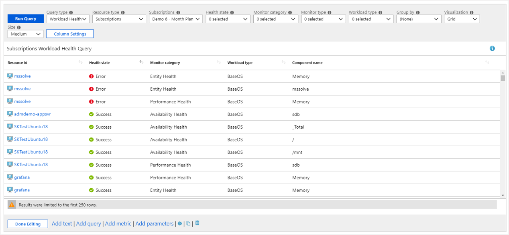
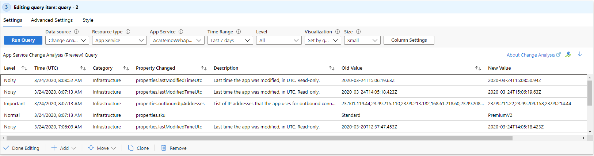

# Azure Workbooks data sources

Workbooks can extract data from these data sources:

* [Logs](../visualize/workbooks-data-sources.md#logs)
* [Metrics](../visualize/workbooks-data-sources.md#metrics)
* [Azure Resource Graph](../visualize/workbooks-data-sources.md#azure-resource-graph)
* [Workload Health](../visualize/workbooks-data-sources.md#workload-health)
* [Azure Resource Health](../visualize/workbooks-data-sources.md#azure-resource-health)
* [Azure Data Explorer](../visualize/workbooks-data-sources.md#azure-data-explorer)

## Logs

Workbooks allow querying logs from the following sources:

* Azure Monitor Logs (Application Insights Resources and Log Analytics Workspaces.)
* Resource-centric data (Activity logs)

Workbook authors can use KQL queries that transform the underlying resource data to select a result set that can visualized as text, charts, or grids.

Workbook authors can easily query across multiple resources creating a truly unified rich reporting experience.

## Metrics

Azure resources emit [metrics](../essentials/data-platform-metrics.md) that can be accessed via workbooks. Metrics can be accessed in workbooks through a specialized control that allows you to specify the target resources, the desired metrics, and their aggregation. This data can then be plotted in charts or grids.

## Azure Resource Graph

Workbooks support querying for resources and their metadata using Azure Resource Graph (ARG). This functionality is primarily used to build custom query scopes for reports. The resource scope is expressed via a KQL-subset that ARG supports – which is often sufficient for common use cases.

To make a query control use this data source, use the Query type drop-down to choose Azure Resource Graph and select the subscriptions to target. Use the Query control to add the ARG KQL-subset that selects an interesting resource subset.

## Azure Resource Manager

Workbook supports Azure Resource Manager REST operations. This allows the ability to query management.azure.com endpoint without the need to provide your own authorization header token.

To make a query control use this data source, use the Data source drop-down to choose Azure Resource Manager. Provide the appropriate parameters such as Http method, url path, headers, url parameters and/or body.

> [!NOTE]
> Only `GET`, `POST`, and `HEAD` operations are currently supported.

## Azure Data Explorer

Workbooks now have support for querying from [Azure Data Explorer](/azure/data-explorer/) clusters with the powerful [Kusto](/azure/kusto/query/index) query language.
For the **Cluster Name** field, you should add ther region name following the cluster name. For example: *mycluster.westeurope*.

## Workload health

Azure Monitor has functionality that proactively monitors the availability and performance of Windows or Linux guest operating systems. Azure Monitor models key components and their relationships, criteria for how to measure the health of those components, and which components alert you when an unhealthy condition is detected. Workbooks allow users to use this information to create rich interactive reports.

To make a query control use this data source, use the **Query type** drop-down to choose Workload Health and select subscription, resource group or VM resources to target. Use the health filter drop downs to select an interesting subset of health incidents for your analytic needs.

## Azure resource health

Workbooks support getting Azure resource health and combining it with other data sources to create rich, interactive health reports

To make a query control use this data source, use the **Query type** drop-down to choose Azure health and select the resources to target. Use the health filter drop downs to select an interesting subset of resource issues for your analytic needs.

## Change Analysis (preview)

To make a query control using [Application Change Analysis](../app/change-analysis.md) as the data source, use the *Data source* drop down and choose *Change Analysis (preview)* and select a single resource. Changes for up to the last 14 days can be shown. The *Level* drop down can be used to filter between "Important", "Normal", and "Noisy" changes, and this drop down supports workbook parameters of type [drop down](workbooks-dropdowns.md).

> [!div class="mx-imgBorder"]
> 

## Next Steps

 - [Getting started with Azure Workbooks](workbooks-getting-started.md) learning more about workbooks many rich visualizations options.
 - [Create an Azure Workbook](workbooks-create-a-workbook.md).
