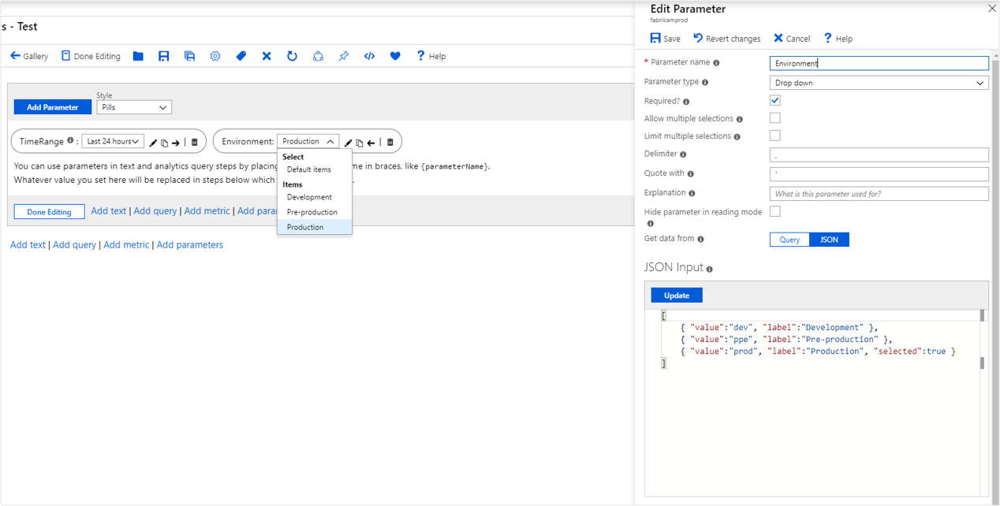
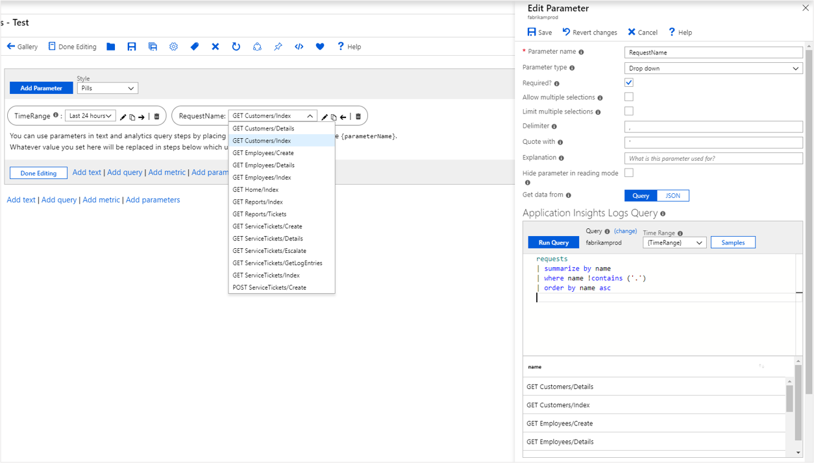
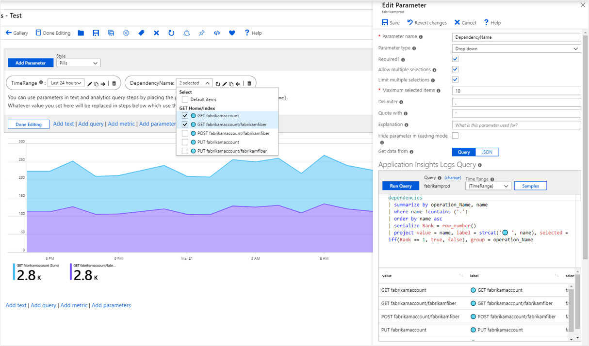

# Workbook dropdown parameters

By using dropdown parameters, you can collect one or more input values from a known set. For example, you can use a dropdown parameter to select one of your app's requests. Dropdown parameters also provide a user-friendly way to collect arbitrary inputs from users. Dropdown parameters are especially useful in enabling filtering in your interactive reports.

The easiest way to specify a dropdown parameter is by providing a static list in the parameter setting. A more interesting way is to get the list dynamically via a KQL query. You can also specify whether it's single or multi-select by using parameter settings. If it's multi-select, you can specify how the result set should be formatted, for example, as delimiter or quotation.

## Create a static dropdown parameter

1. Start with an empty workbook in edit mode.
1. Select **Add parameters** > **Add Parameter**.
1. In the new parameter pane that opens, enter:
    1. **Parameter name**: `Environment`
    1. **Parameter type**: `Drop down`
    1. **Required**: `checked`
    1. **Allow multiple selections**: `unchecked`
    1. **Get data from**: `JSON`
1. In the **JSON Input** text block, insert this JSON snippet:

    ```json
    [
        { "value":"dev", "label":"Development" },
        { "value":"ppe", "label":"Pre-production" },
        { "value":"prod", "label":"Production", "selected":true }
    ]
    ```

1. Select **Update**.
1. Select **Save** to create the parameter.
1. The **Environment** parameter will be a dropdown list with the three values.

    

## Create a static dropdown list with groups of items

If your query result/JSON contains a `group` field, the dropdown list will display groups of values. Follow the preceding sample, but use the following JSON instead:

```json
[
    { "value":"dev", "label":"Development", "group":"Development" },
    { "value":"dev-cloud", "label":"Development (Cloud)", "group":"Development" },
    { "value":"ppe", "label":"Pre-production", "group":"Test" },
    { "value":"ppe-test", "label":"Pre-production (Test)", "group":"Test" },
    { "value":"prod1", "label":"Prod 1", "selected":true, "group":"Production" },
    { "value":"prod2", "label":"Prod 2", "group":"Production" }
]
```


## Create a dynamic dropdown parameter

1. Start with an empty workbook in edit mode.
1. Select **Add parameters** > **Add Parameter**.
1. In the new parameter pane that opens, enter:
    1. **Parameter name**: `RequestName`
    1. **Parameter type**: `Drop down`
    1. **Required**: `checked`
    1. **Allow multiple selections**: `unchecked`
    1. **Get data from**: `Query`
1. In the **JSON Input** text block, insert this JSON snippet:

    ```kusto
        requests
        | summarize by name
        | order by name asc
    ```

1. Select **Run Query**.
1. Select **Save** to create the parameter.
1. The **RequestName** parameter will be a dropdown list with the names of all requests in the app.

    

## Reference a dropdown parameter

You can reference dropdown parameters.

### In KQL

1. Select **Add query** to add a query control, and then select an Application Insights resource.
1. In the KQL editor, enter this snippet:

    ```kusto
        requests
        | where name == '{RequestName}'
        | summarize Requests = count() by bin(timestamp, 1h)

    ```

1. The snippet expands on query evaluation time to:

    ```kusto
        requests
        | where name == 'GET Home/Index'
        | summarize Requests = count() by bin(timestamp, 1h)
    ```

1. Run the query to see the results. Optionally, render it as a chart.

    

## Parameter value, label, selection, and group

The query used in the preceding dynamic dropdown parameter returns a list of values that are rendered faithfully in the dropdown list. But what if you wanted a different display name or one of the names to be selected? Dropdown parameters use value, label, selection, and group columns for this functionality.

The following sample shows how to get a list of Application Insights dependencies whose display names are styled with an emoji, has the first one selected, and is grouped by operation names:

```kusto
dependencies
| summarize by operation_Name, name
| where name !contains ('.')
| order by name asc
| serialize Rank = row_number()
| project value = name, label = strcat('🌐 ', name), selected = iff(Rank == 1, true, false), group = operation_Name
```


## Dropdown parameter options

| Parameter | Description | Example |
| ------------- |:-------------|:-------------|
| `{DependencyName}` | The selected value | GET fabrikamaccount |
| `{DependencyName:label}` | The selected label | 🌐 GET fabrikamaccount |
| `{DependencyName:value}` | The selected value | GET fabrikamaccount |

## Multiple selection

The examples so far explicitly set the parameter to select only one value in the dropdown list. Dropdown parameters also support *multiple selection*. To enable this option, select the **Allow multiple selections** checkbox.

You can specify the format of the result set via the **Delimiter** and **Quote with** settings. The default returns the values as a collection in the form of **a**, **b**, **c**. You can also limit the number of selections.

The KQL referencing the parameter will need to change to work with the format of the result. The most common way to enable it is via the `in` operator.

```kusto
dependencies
| where name in ({DependencyName})
| summarize Requests = count() by bin(timestamp, 1h), name
```

This example shows the multi-select dropdown parameter at work:



## Next steps

[Getting started with Azure Workbooks](workbooks-getting-started.md)