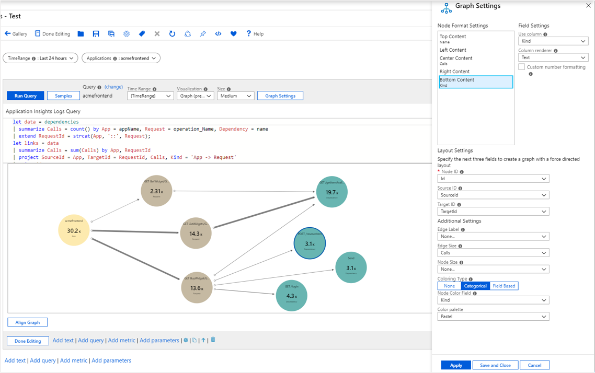
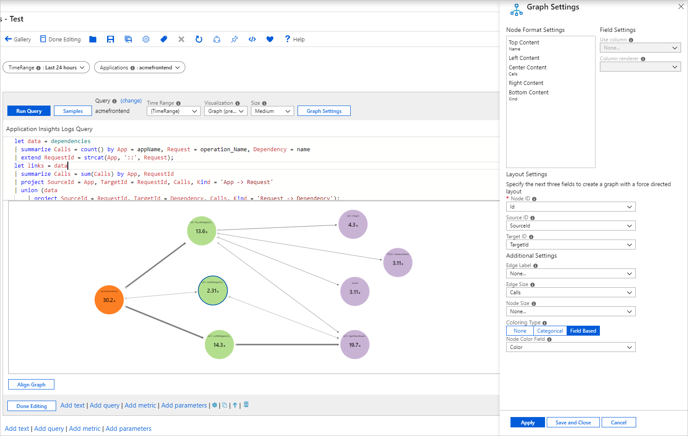

# Graph visualizations

Azure Workbooks graph visualizations support visualizing arbitrary graphs based on data from logs to show the relationships between monitoring entities.

The following graph shows data flowing in and out of a computer via various ports to and from external computers. It's colored by type, for example, computer vs. port vs. external IP. The edge sizes correspond to the amount of data flowing in between. The underlying data comes from KQL query targeting VM connections.

[](./media/workbooks-graph-visualizations/graph.png#lightbox)

Watch this video to learn how to create graphs and use links in Azure Workbooks.
> [!VIDEO https://www.microsoft.com/en-us/videoplayer/embed/RE5ah5O]

## Add a graph

1. Switch the workbook to edit mode by selecting **Edit**.
1. Use the **Add query** link to add a log query control to the workbook.
1. For **Query type**, select **Logs**. For **Resource type**, select, for example, **Application Insights**, and select the resources to target.
1. Use the query editor to enter the KQL for your analysis.

    ```kusto
    let data = dependencies
    | summarize Calls = count() by App = appName, Request = operation_Name, Dependency = name
    | extend RequestId = strcat(App, '::', Request);
    let links = data
    | summarize Calls = sum(Calls) by App, RequestId
    | project SourceId = App, TargetId = RequestId, Calls, Kind = 'App -> Request'
    | union (data
        | project SourceId = RequestId, TargetId = Dependency, Calls, Kind = 'Request -> Dependency');
    let nodes = data
    | summarize Calls = sum(Calls) by App
    | project Id = App, Name = App, Calls, Kind = 'App'
    | union (data
        | summarize Calls = sum(Calls) by RequestId, Request
        | project Id = RequestId, Name = Request, Calls, Kind = 'Request')
    | union (data
        | summarize Calls = sum(Calls) by Dependency
        | project Id = Dependency, Name = Dependency, Calls, Kind = 'Dependency');
    nodes
    | union (links)
    ```

1. Set **Visualization** to **Graph**.
1. Select **Graph Settings** to open the **Graph Settings** pane.
1. In **Node Format Settings** at the top, set:
    * **Top Content**
        - **Use column**: `Name`
        * **Column renderer**: `Text`
    * **Center Content**
        - **Use column**: `Calls`
        * **Column renderer**: `Big Number`
        * **Color palette**: `None`
    * **Bottom Content**
        - **Use column**: `Kind`
        * **Column renderer**: `Text`
1. In **Layout Settings** at the bottom, set:
    * **Node ID**: `Id`
    * **Source ID**: `SourceId`
    * **Target ID**: `TargetId`
    * **Edge Label**: `None`
    * **Edge Size**: `Calls`
    * **Node Size**: `None`
    * **Coloring Type**: `Categorical`
    * **Node Color Field**: `Kind`
    * **Color palette**: `Pastel`
1. Select **Save and Close** at the bottom of the pane.

[](./media/workbooks-graph-visualizations/graph-settings.png#lightbox)

## Graph settings

| Setting         | Description                                                                                                        |
|:----------------|:-------------------------------------------------------------------------------------------------------------------|
| `Node ID`       | Selects a column that provides the unique ID of nodes on the graph. The value of the column can be a string or a number. |
| `Source ID`     | Selects a column that provides the IDs of source nodes for edges on the graph. Values must map to a value in the `Node Id` column. |
| `Target ID`     | Selects a column that provides the IDs of target nodes for edges on the graph. Values must map to a value in the `Node Id` column. |
| `Edge Label`    | Selects a column that provides edge labels on the graph.                                                            |
| `Edge Size`     | Selects a column that provides the metric on which the edge widths will be based.                                |
| `Node Size`     | Selects a column that provides the metric on which the node areas will be based.                                 |
| `Coloring Type` | Used to choose the node coloring scheme.                                                                            |

## Node coloring types

| Coloring type | Description |
|:------------- |:------------|
| `None`        | All nodes have the same color. |
| `Categorical` | Nodes are assigned colors based on the value or category from a column in the result set. In the preceding example, the coloring is based on the column `Kind` of the result set. Supported palettes are `Default`, `Pastel`, and `Cool tone`.  |
| `Field Based` | In this type, a column provides specific RGB values to use for the node. Provides the most flexibility but usually requires more work to enable.  |

## Node format settings

You can specify what content goes to the different parts of a node: top, left, center, right, and bottom. Graphs can use any renderers' workbook supports like text, big numbers, spark lines, and icons.

## Field-based node coloring

1. Switch the workbook to edit mode by selecting **Edit**.
1. Use the **Add query** link to add a log query control to the workbook.
1. For **Query type**, select **Logs**. For **Resource type**, select, for example, **Application Insights**, and select the resources to target.
1. Use the query editor to enter the KQL for your analysis.

    ```kusto
    let data = dependencies
    | summarize Calls = count() by App = appName, Request = operation_Name, Dependency = name
    | extend RequestId = strcat(App, '::', Request);
    let links = data
    | summarize Calls = sum(Calls) by App, RequestId
    | project SourceId = App, TargetId = RequestId, Calls, Kind = 'App -> Request'
    | union (data
        | project SourceId = RequestId, TargetId = Dependency, Calls, Kind = 'Request -> Dependency');
    let nodes = data
    | summarize Calls = sum(Calls) by App
    | project Id = App, Name = App, Calls, Color = 'FD7F23'
    | union (data
        | summarize Calls = sum(Calls) by RequestId, Request
        | project Id = RequestId, Name = Request, Calls, Color = 'B3DE8E')
    | union (data
        | summarize Calls = sum(Calls) by Dependency
        | project Id = Dependency, Name = Dependency, Calls, Color = 'C9B3D5');
    nodes
    | union (links)
    ```

1. Set **Visualization** to `Graph`.
1. Select **Graph Settings** to open the **Graph Settings** pane.
1. In **Node Format Settings** at the top, set:
    * **Top Content**:
        * **Use column**: `Name`
        * **Column renderer**: `Text`
    * **Center Content**:
        * **Use column**: `Calls`
        * **Column renderer**: `Big Number`
        * **Color palette**: `None`
    * **Bottom Content**:
        * **Use column**: `Kind`
        * **Column renderer**: `Text`
1. In **Layout Settings** at the bottom, set:
    * **Node ID**:`Id`
    * **Source ID**: `SourceId`
    * **Target ID**: `TargetId`
    * **Edge Label**: `None`
    * **Edge Size**: `Calls`
    * **Node Size**: `Node`
    * **Coloring Type**: `Field Based`
    * **Node Color Field**: `Color`
1. Select **Save and Close** at the bottom of the pane.

[](./media/workbooks-graph-visualizations/graph-field-based.png#lightbox)

## Next steps

* Graphs also support the composite bar renderer. To learn more, see [Composite bar renderer](workbooks-composite-bar.md).
* Learn more about the [data sources](workbooks-data-sources.md) you can use in workbooks.
