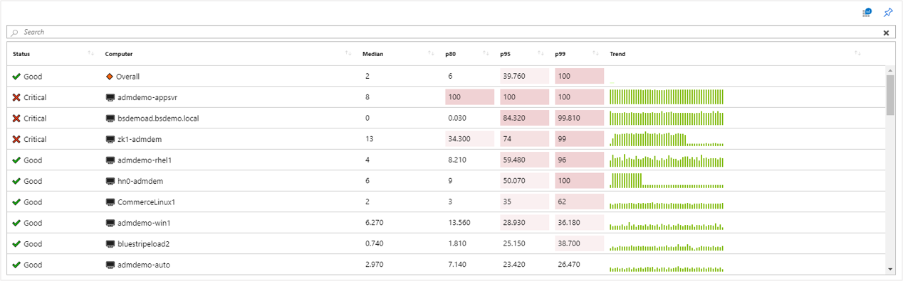
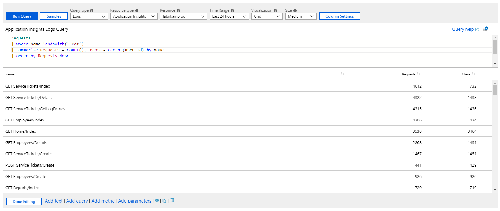
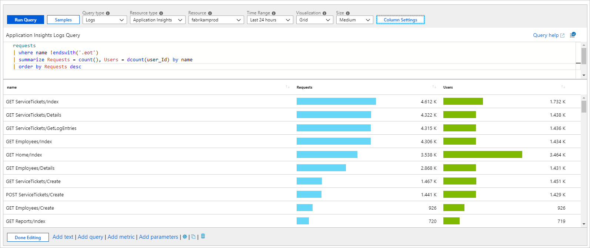
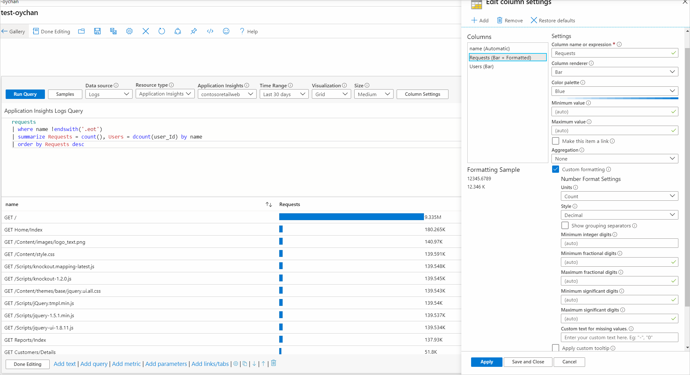
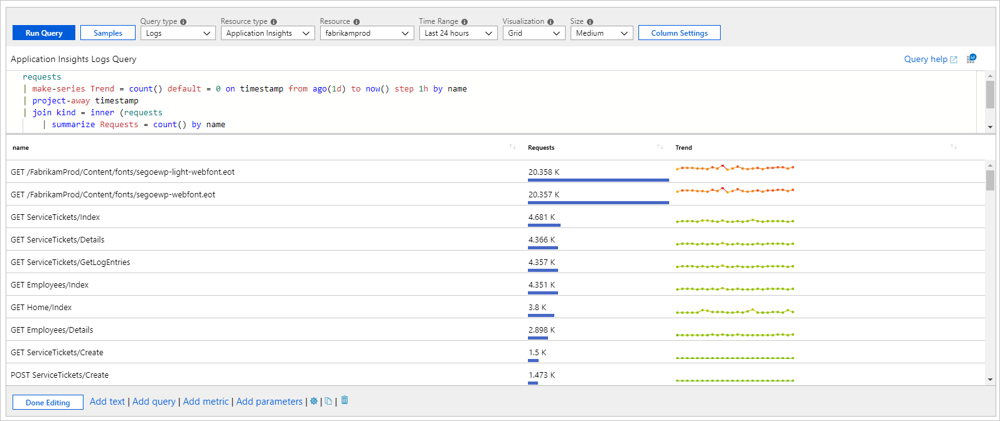
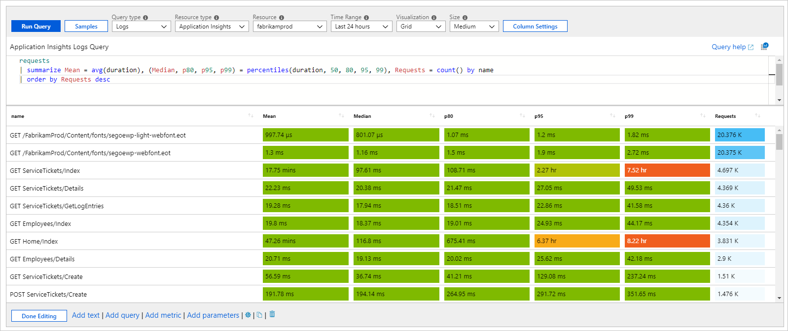
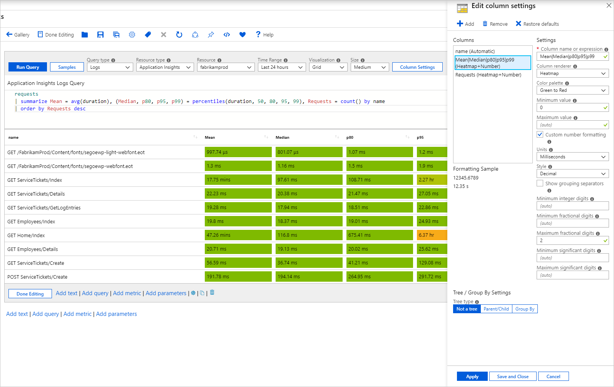
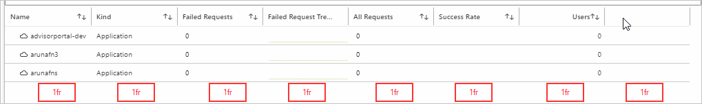

# Grid visualizations

Grids or tables are a common way to present data to users. You can individually style the columns of grids in workbooks to provide a rich UI for your reports. While a plain table shows data, it's hard to read and insights won't always be apparent. Styling the grid can help make it easier to read and interpret the data.

The following example shows a grid that combines icons, heatmaps, and spark bars to present complex information. The workbook also provides sorting, a search box, and a go-to-analytics button.

[](./media/workbooks-grid-visualizations/grid.png#lightbox)

## Add a log-based grid

1. Switch the workbook to edit mode by selecting **Edit** on the toolbar.
1. Select **Add query** to add a log query control to the workbook.
1. For **Query type**, select **Log**. For **Resource type**, select, for example, **Application Insights**, and select the resources to target.
1. Use the query editor to enter the KQL for your analysis. An example is VMs with memory below a threshold.
1. Set **Visualization** to **Grid**.
1. Set parameters like time range, size, color palette, and legend, if needed.

[](./media/workbooks-grid-visualizations/grid-query.png#lightbox)

## Log chart parameters

| Parameter | Description | Examples |
| ------------- |:-------------|:-------------|
|Query type| The type of query to use. | Logs, Azure Resource Graph |
|Resource type| The resource type to target. | Application Insights, Log Analytics, or Azure-first |
|Resources| A set of resources to get the metrics value from. | MyApp1 |
|Time range| The time window to view the log chart. | Last hour, last 24 hours |
|Visualization| The visualization to use. | Grid |
|Size| The vertical size of the control. | Small, medium, large, or full |
|Query| Any KQL query that returns data in the format expected by the chart visualization. | _requests \| summarize Requests = count() by name_ |

## Simple grid

Workbooks can render KQL results as a simple table. The following grid shows the count of requests and unique users per request type in an app:

```kusto
requests
| where name !endswith('.eot')
| summarize Requests = count(), Users = dcount(user_Id) by name
| order by Requests desc
```

[](./media/workbooks-grid-visualizations/log-chart-simple-grid.png#lightbox)

## Grid styling

Columns styled as heatmaps:

[](./media/workbooks-grid-visualizations/log-chart-grid-heatmap.png#lightbox)

Columns styled as bars:
[](./media/workbooks-grid-visualizations/log-chart-grid-bar.png#lightbox)

### Style a grid column

1. Select the **Column Setting** button on the query control toolbar.
1. In the **Edit column settings** pane, select the column to style.
1. In **Column renderer**, select **Heatmap**, **Bar**, or **Bar underneath** and select related settings to style your column.

The following example shows the **Requests** column styled as a bar:

[](./media/workbooks-grid-visualizations/log-chart-grid-column-settings-start.png#lightbox)

This option usually takes you to some other view with context coming from the cell, or it might open a URL.

### Custom formatting

You can also set the number formatting of your cell values in workbooks. To set this formatting, select the **Custom formatting** checkbox when it's available.

| Formatting option | Description |
|:------------- |:-------------|
|Units| The units for the column with various options for percentage, counts, time, byte, count/time, and bytes/time. For example, the unit for a value of 1234 can be set to milliseconds and it's rendered as 1.234 s. |
|Style| The format used to render it, such as decimal, currency, percent. |
|Show group separator| Checkbox to show group separators. Renders 1234 as 1,234 in the US. |
|Minimum integer digits| Minimum number of integer digits to use (default 1). |
|Minimum fractional digits| Minimum number of fractional digits to use (default 0).  |
|Maximum fractional digits| Maximum number of fractional digits to use. |
|Minimum significant digits| Minimum number of significant digits to use (default 1). |
|Maximum significant digits| Maximum number of significant digits to use. |
|Custom text for missing values| When a data point doesn't have a value, show this custom text instead of a blank. |

### Custom date formatting

When you've specified that a column is set to the date/time renderer, you can specify custom date formatting options by using the **Custom date formatting** checkbox.

| Formatting option | Description |
|:------------- |:-------------|
|Style| The format to render a date as short, long, or full, or a time as short or long. |
|Show time as| Allows you to decide between showing the time in local time (default) or as UTC. Depending on the date format style selected, the UTC/time zone information might not be displayed. |

## Custom column width setting

You can customize the width of any column in the grid by using the **Custom Column Width** field in **Column Settings**.


If the field is left blank, the width is automatically determined based on the number of characters in the column and the number of visible columns. The default unit is "ch," which is an abbreviation for "characters."

Selecting the **(Current Width)** button in the label fills the text field with the selected column's current width. If a value is present in the **Custom Column Width** field with no unit of measurement, the default is used.

The units of measurement available are:

| Unit of measurement | Definition           |
|:--------------------|:---------------------|
| ch                  | characters (default) |
| px                  | pixels               |
| fr                  | fractional units     |
| %                   | percentage           |

**Input validation**: If validation fails, a red guidance message appears underneath the field, but you can still apply the width. If a value is present in the input, it's parsed out. If no valid unit of measure is found, the default is used.

You can set the width to any value. There's no minimum or maximum width. The **Custom Column Width** field is disabled for hidden columns.

## Examples

Here are some examples.

### Spark lines and bar underneath

The following example shows request counts and the trend by request name:

```kusto
requests
| make-series Trend = count() default = 0 on timestamp from ago(1d) to now() step 1h by name
| project-away timestamp
| join kind = inner (requests
    | summarize Requests = count() by name
    ) on name
| project name, Requests, Trend
| order by Requests desc
```

[](./media/workbooks-grid-visualizations/log-chart-grid-spark-line.png#lightbox)

### Heatmap with shared scales and custom formatting

This example shows various request duration metrics and the counts. The heatmap renderer uses the minimum values set in settings or calculates a minimum and maximum value for the column. It assigns a background color from the selected palette for the cell. The color is based on the value of the cell relative to the minimum and maximum value of the column.

```
requests
| summarize Mean = avg(duration), (Median, p80, p95, p99) = percentiles(duration, 50, 80, 95, 99), Requests = count() by name
| order by Requests desc
```

[](./media/workbooks-grid-visualizations/log-chart-grid-shared-scale.png#lightbox)

In the preceding example, a shared palette in green or red and a scale are used to color the columns **Mean**, **Median**, **p80**, **p95**, and **p99**. A separate palette in blue is used for the **Requests** column.

#### Shared scale

To get a shared scale:

1. Use regular expressions to select more than one column to apply a setting to. For example, set the column name to **Mean|Median|p80|p95|p99** to select them all.
1. Delete default settings for the individual columns.

The new multi-column setting applies its settings to include a shared scale.

[](./media/workbooks-grid-visualizations/log-chart-grid-shared-scale-settings.png#lightbox)

### Icons to represent status

The following example shows custom status of requests based on the p95 duration:

```
requests
| summarize p95 = percentile(duration, 95) by name
| order by p95 desc
| project Status = case(p95 > 5000, 'critical', p95 > 1000, 'error', 'success'), name, p95
```

[](./media/workbooks-grid-visualizations/log-chart-grid-icons.png#lightbox)

Supported icon names:

- cancelled
- critical
- disabled
- error
- failed
- info
- none
- pending
- stopped
- question
- success
- unknown
- warning
- uninitialized
- resource
- up
- down
- left
- right
- trendup
- trenddown
- 4
- 3
- 2
- 1
- Sev0
- Sev1
- Sev2
- Sev3
- Sev4
- Fired
- Resolved
- Available
- Unavailable
- Degraded
- Unknown
- Blank

## Fractional unit percentages

The fractional unit, abbreviated as "fr," is a commonly used dynamic unit of measurement in various types of grids. As the window size or resolution changes, the fr width changes too.

The following screenshot shows a table with eight columns that are 1fr width each and all are equal widths. As the window size changes, the width of each column changes proportionally.

[](./media/workbooks-grid-visualizations/custom-column-width-fr.png#lightbox)

The following image shows the same table, except the first column is set to 50% width. This setting dynamically sets the column to half of the total grid width. Resizing the window continues to retain the 50% width unless the window size gets too small. These dynamic columns have a minimum width based on their contents. 

The remaining 50% of the grid is divided up by the eight total fractional units. The **Kind** column is set to 2fr, so it takes up one-fourth of the remaining space. Because the other columns are 1fr each, they each take up one-eighth of the right half of the grid.

[](./media/workbooks-grid-visualizations/custom-column-width-fr2.png#lightbox)

Combining fr, %, px, and ch widths is possible and works similarly to the previous examples. The widths that are set by the static units (ch and px) are hard constants that won't change even if the window or resolution is changed.

The columns set by % take up their percentage based on the total grid width. This width might not be exact because of previously minimum widths.

The columns set with fr split up the remaining grid space based on the number of fractional units they're allotted.

[](./media/workbooks-grid-visualizations/custom-column-width-fr3.png#lightbox)

## Next steps

* Learn how to create a [graph in workbooks](workbooks-graph-visualizations.md).
* Learn how to create a [tile in workbooks](workbooks-tile-visualizations.md).