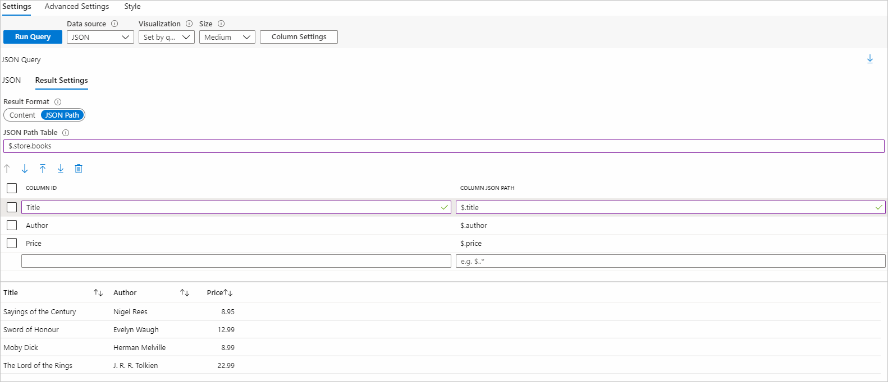

# Use JSONPath to transform JSON data in workbooks

Workbooks can query data from many sources. Some endpoints, such as [Azure Resource Manager](../../azure-resource-manager/management/overview.md) or custom endpoint, can return results in JSON. If the JSON data returned by the queried endpoint isn't configured in a format that you want, JSONPath can be used to transform the results.

JSONPath is a query language for JSON that's similar to XPath for XML. Like XPath, JSONPath allows for the extraction and filtration of data out of JSON structure.

By using JSONPath transformation, workbook authors can convert JSON into a table structure. The table can then be used to plot [workbook visualizations](./workbooks-overview.md#visualizations).

## Use JSONPath

1. Switch the workbook to edit mode by selecting **Edit**.
1. Use the **Add** > **Add query** link to add a query control to the workbook.
1. Select the data source as **JSON**.
1. Use the JSON editor to enter the following JSON snippet:

    ```json
    { "store": {
        "books": [ 
          { "category": "reference",
            "author": "Nigel Rees",
            "title": "Sayings of the Century",
            "price": 8.95
          },
          { "category": "fiction",
            "author": "Evelyn Waugh",
            "title": "Sword of Honour",
            "price": 12.99
          },
          { "category": "fiction",
            "author": "Herman Melville",
            "title": "Moby Dick",
            "isbn": "0-553-21311-3",
            "price": 8.99
          },
          { "category": "fiction",
            "author": "J. R. R. Tolkien",
            "title": "The Lord of the Rings",
            "isbn": "0-395-19395-8",
            "price": 22.99
          }
        ],
        "bicycle": {
          "color": "red",
          "price": 19.95
        }
      }
    }
    ```  

Let's assume we're given the preceding JSON object as a representation of a store's inventory. Our task is to create a table of the store's available books by listing their titles, authors, and prices.

1. Select the **Result Settings** tab and switch the result format to **JSON Path**.
1. Apply the following JSON path settings:

    - **JSON Path Table**: `$.store.books`. This field represents the path of the root of the table. In this case, we care about the store's book inventory. The table path filters the JSON to the book information.

       | Column IDs | Column JSON paths |
       |:-----------|:-----------------|
       | Title      | `$.title`        |
       | Author     | `$.author`       |
       | Price      | `$.price`        |

    Column IDs will be the column headers. Column JSON paths fields represent the path from the root of the table to the column value.

1. Apply the preceding settings by selecting **Run Query**.

   

## Next steps

- [Workbooks overview](./workbooks-overview.md)
- [Groups in Azure Monitor Workbooks](workbooks-groups.md)
