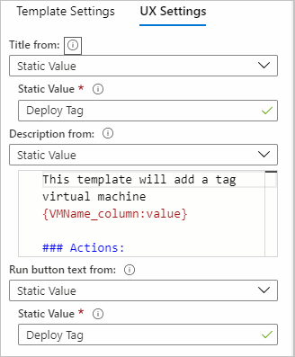
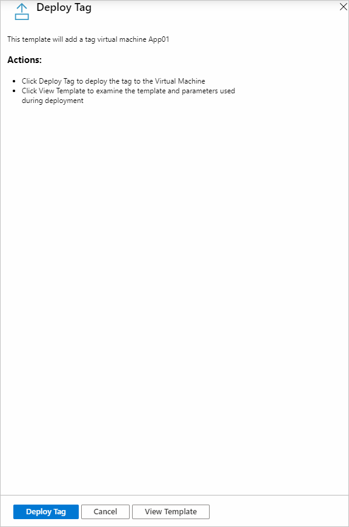
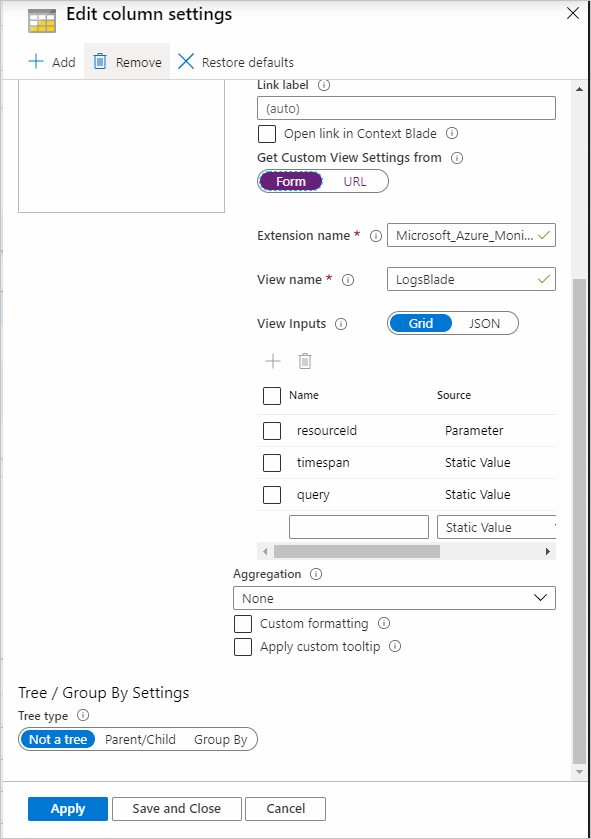
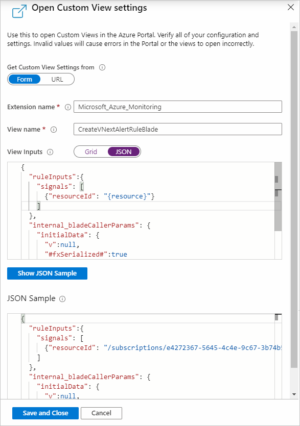
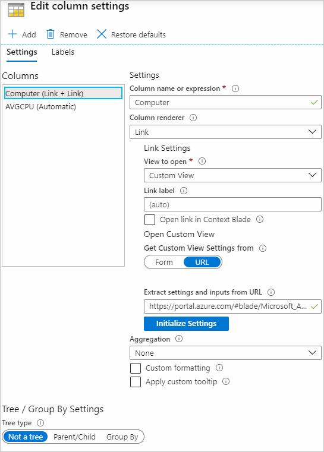
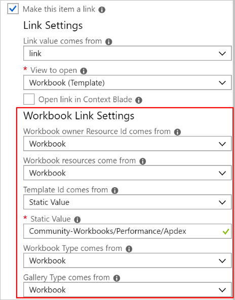
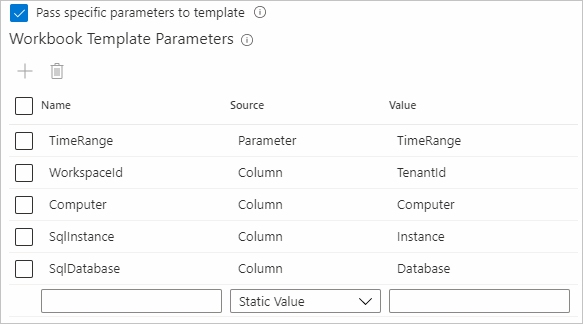

# Link actions

Link actions can be accessed through Workbook link steps or through column settings of [grids](../visualize/workbooks-grid-visualizations.md), [titles](../visualize/workbooks-tile-visualizations.md), or [graphs](../visualize/workbooks-graph-visualizations.md).

## General link actions

| Link action | Action on click |
|:------------- |:-------------|
| `Generic Details` | Shows the row values in a property grid context view. |
| `Cell Details` | Shows the cell value in a property grid context view. Useful when the cell contains a dynamic type with information (for example, json with request properties like location, role instance, etc.). |
| `Url` | The value of the cell is expected to be a valid http url, and the cell will be a link that opens up that url in a new tab.|

## Application Insights

| Link action | Action on click |
|:------------- |:-------------|
| `Custom Event Details` | Opens the Application Insights search details with the custom event ID (`itemId`) in the cell. |
| `* Details` | Similar to Custom Event Details, except for dependencies, exceptions, page views, requests, and traces. |
| `Custom Event User Flows` | Opens the Application Insights User Flows experience pivoted on the custom event name in the cell. |
| `* User Flows` | Similar to Custom Event User Flows except for exceptions, page views and requests. |
| `User Timeline` | Opens the user timeline with the user ID (`user_Id`) in the cell. |
| `Session Timeline` | Opens the Application Insights search experience for the value in the cell (for example, search for text 'abc' where abc is the value in the cell). |

`*` denotes a wildcard for the above table

## Azure resource

| Link action | Action on click |
|:------------- |:-------------|
| `ARM Deployment` | Deploy an Azure Resource Manager template.  When this item is selected, additional fields are displayed to let the author configure which Azure Resource Manager template to open, parameters for the template, etc. [See Azure Resource Manager deployment link settings](#azure-resource-manager-deployment-link-settings). |
| `Create Alert Rule` | Creates an Alert rule for a resource.  |
| `Custom View` | Opens a custom View. When this item is selected, additional fields are displayed to let the author configure the View extension, View name, and any parameters used to open the View. [See custom view](#custom-view-link-settings). |
| `Metrics` | Opens a metrics view.  |
| `Resource overview` | Open the resource's view in the portal based on the resource ID value in the cell. The author can also optionally set a `submenu` value that will open up a specific menu item in the resource view. |
| `Workbook (template)` | Open a workbook template.  When this item is selected, additional fields are displayed to let the author configure what template to open, etc.  |

## Link settings

When using the link renderer, the following settings are available:

| Setting | Explanation |
|:------------- |:-------------|
| `View to open` | Allows the author to select one of the actions enumerated above. |
| `Menu item` | If "Resource Overview" is selected, this is the menu item in the resource's overview to open. This can be used to open alerts or activity logs instead of the "overview" for the resource. Menu item values are different for each Azure `Resourcetype`.|
| `Link label` | If specified, this value will be displayed in the grid column. If this value is not specified, the value of the cell will be displayed. If you want another value to be displayed, like a heatmap or icon, do not use the `Link` renderer, instead use the appropriate renderer and select the `Make this item a link` option. |
| `Open link in Context Blade` | If specified, the link will be opened as a popup "context" view on the right side of the window instead of opening as a full view. |

When using the `Make this item a link` option, the following settings are available:

| Setting | Explanation |
|:------------- |:-------------|
| `Link value comes from` | When displaying a cell as a renderer with a link, this field specifies where the "link" value to be used in the link comes from, allowing the author to select from a dropdown of the other columns in the grid. For example, the cell may be a heatmap value, but you want the link to open up the Resource Overview for the resource ID in the row. In that case, you'd set the link value to come from the `Resource Id` field.
| `View to open` | same as above. |
| `Menu item` | same as above. |
| `Open link in Context Blade` | same as above. |

## Azure Resource Manager deployment link settings

If the selected link type is `ARM Deployment` the author must specify additional settings to open an Azure Resource Manager deployment. There are two main tabs for configurations.

### Template settings

This section defines where the template should come from and the parameters used to run the Azure Resource Manager deployment.

| Source | Explanation |
|:------------- |:-------------|
|`Resource group id comes from` | The resource ID is used to manage deployed resources. The subscription is used to manage deployed resources and costs. The resource groups are used like folders to organize and manage all your resources. If this value is not specified, the deployment will fail. Select from `Cell`, `Column`, `Static Value`, or `Parameter` in [link sources](#link-sources).|
|`ARM template URI from` | The URI to the Azure Resource Manager template itself. The template URI needs to be accessible to the users who will deploy the template. Select from `Cell`, `Column`, `Parameter`, or `Static Value`  in [link sources](#link-sources). For starters, take a look at our [quickstart templates](https://azure.microsoft.com/resources/templates/).|
|`ARM Template Parameters` | This section defines the template parameters used for the template URI defined above. These parameters will be used to deploy the template on the run page. The grid contains an expand toolbar button to help fill the parameters using the names defined in the template URI and set it to static empty values. This option can only be used when there are no parameters in the grid and the template URI has been set. The lower section is a preview of what the parameter output looks like. Select Refresh to update the preview with current changes. Parameters are typically values, whereas references are something that could point to keyvault secrets that the user has access to.    **Template Viewer blade limitation** -  does not render reference parameters correctly and will show up as null/value, thus users will not be able to correctly deploy reference parameters from Template Viewer tab.|

### UX settings

This section configures what the users will see before they run the Azure Resource Manager deployment.

| Source | Explanation |
|:------------- |:-------------|
|`Title from` | Title used on the run view. Select from `Cell`, `Column`, `Parameter`, or `Static Value` in [link sources](#link-sources).|
|`Description from` | This is the markdown text used to provide a helpful description to users when they want to deploy the template. Select from `Cell`, `Column`, `Parameter`, or `Static Value`  in [link sources](#link-sources).    **NOTE:** If `Static Value` is selected, a multi-line text box will appear. In this text box, you can resolve parameters using `{paramName}`. Also you can treat columns as parameters by appending `_column` after the column name like `{columnName_column}`. In the example image below, we can reference the column `VMName` by writing `{VMName_column}`. The value after the colon is the [parameter formatter](../visualize/workbooks-parameters.md#parameter-options), in this case it is `value`.|
|`Run button text from` | Label used on the run (execute) button to deploy the Azure Resource Manager template. This is what users will select to start deploying the Azure Resource Manager template.|

After these configurations are set, when the users select the link, it will open up the view with the UX described in the UX settings. If the user selects `Run button text from` it will deploy an Azure Resource Manager template using the values from [template settings](#template-settings). View template will open up the template viewer tab for the user to examine the template and the parameters before deploying.

## Custom view link settings

Use this to open Custom Views in the Azure portal. Verify all of the configuration and settings. Incorrect values will cause errors in the portal or fail to open the views correctly. There are two ways to configure the settings via the `Form` or `URL`.

> [!NOTE]
> Views with a menu cannot be opened in a context tab. If a view with a menu is configured to open in a context tab then no context tab will be shown when the link is selected.

### Form

| Source | Explanation |
|:------------- |:-------------|
|`Extension name` | The name of the extension that hosts the name of the View.|
|`View name` | The name of the View to open.|

#### View inputs

There are two types of inputs, grids and JSON. Use `Grid` for simple key and value tab inputs or select `JSON` to specify a nested JSON input.

- Grid
    - `Parameter Name`: The name of the View input parameter.
    - `Parameter Comes From`: Where the value of the View parameter should come from. Select from `Cell`, `Column`, `Parameter`, or `Static Value` in [link sources](#link-sources).
    > [!NOTE]
    > If `Static Value` is selected, the parameters can be resolved using brackets link `{paramName}` in the text box. Columns can be treated as parameters columns by appending `_column` after the column name like `{columnName_column}`.

    - `Parameter Value`: depending on `Parameter Comes From`, this will be a dropdown of available parameters, columns, or a static value.

    
- JSON
    - Specify your tab input in a JSON format on the editor. Like the `Grid` mode, parameters, and columns may be referenced by using `{paramName}` for parameters, and `{columnName_column}` for columns. Selecting `Show JSON Sample`, will show the expected output of all resolved parameters and columns user for the view input.

    

### URL

Paste a Portal URL containing the extension, name of the view, and any inputs needed to open the view. After selecting `Initialize Settings`, it will populate the `Form` for the author to add/modify/remove any of the view inputs.

## Workbook (template) link settings

If the selected link type is `Workbook (Template)`, the author must specify additional settings to open up the correct workbook template. The settings below have options for how the grid will find the appropriate value for each of the settings.

| Setting | Explanation |
|:------------- |:-------------|
| `Workbook owner Resource Id` | This is the Resource ID of the Azure Resource that "owns" the workbook. Commonly it is an Application Insights resource, or a Log Analytics Workspace. Inside of Azure Monitor, this may also be the literal string `"Azure Monitor"`. When the workbook is Saved, this is what the workbook will be linked to. |
| `Workbook resources` | An array of Azure Resource Ids that specify the default resource used in the workbook. For example, if the template being opened shows Virtual Machine metrics, the values here would be Virtual Machine resource IDs.  Many times, the owner, and resources are set to the same settings. |
| `Template Id` | Specify the ID of the template to be opened. If this is a community template from the gallery (the most common case), prefix the path to the template with `Community-`, like `Community-Workbooks/Performance/Apdex` for the `Workbooks/Performance/Apdex` template. If this is a link to a saved workbook/template, it is the full Azure resource ID of that item. |
| `Workbook Type` | Specify the kind of workbook template to open. The most common cases use the `Default` or `Workbook` option to use the value in the current workbook. |
| `Gallery Type` | This specifies the gallery type that will be displayed in the "Gallery" view of the template that opens. The most common cases use the `Default` or `Workbook` option to use the value in the current workbook. |
|`Location comes from` | The location field should be specified if you are opening a specific Workbook resource. If location is not specified, finding the workbook content is much slower. If you know the location, specify it. If you do not know the location or are opening a template that with no specific location, leave this field as "Default".|
|`Pass specific parameters to template` | Select to pass specific parameters to the template. If selected, only the specified parameters are passed to the template else all the parameters in the current workbook are passed to the template and in that case the parameter *names* must be the same in both workbooks for this parameter value to work.|
|`Workbook Template Parameters` | This section defines the parameters that are passed to the target template. The name should match with the name of the parameter in the target template. Select value from `Cell`, `Column`, `Parameter`, and `Static Value`. Name and value must not be empty to pass that parameter to the target template.|

For each of the above settings, the author must pick where the value in the linked workbook will come from. See [link Sources](#link-sources)

When the workbook link is opened, the new workbook view will be passed all of the values configured from the settings above.

## Link sources

| Source | Explanation |
|:------------- |:-------------|
| `Cell` | This will use the value in that cell in the grid as the link value |
| `Column` | When selected, another field will be displayed to let the author select another column in the grid.  The value of that column for the row will be used in the link value. This is commonly used to enable each row of a grid to open a different template, by setting `Template Id` field to `column`, or to open up the same workbook template for different resources, if the `Workbook resources` field is set to a column that contains an Azure Resource ID |
| `Parameter` | When selected, another field will be displayed to let the author select a parameter. The value of that parameter will be used for the value when the link is clicked |
| `Static value` | When selected, another field will be displayed to let the author type in a static value that will be used in the linked workbook. This is commonly used when all of the rows in the grid will use the same value for a field. |
| `Step` | Use the value set in the current step of the workbook. This is common in query and metrics steps to set the workbook resources in the linked workbook to those used *in the query/metrics step*, not the current workbook |
| `Workbook` | Use the value set in the current workbook. |
| `Default` | Use the default value that would be used if no value was specified. This is common for Gallery Type, where the default gallery would be set by the type of the owner resource |

## Next steps

- [Control](../visualize/workbooks-access-control.md) and share access to your workbook resources.
- Learn how to use [groups in workbooks](../visualize/workbooks-groups.md).