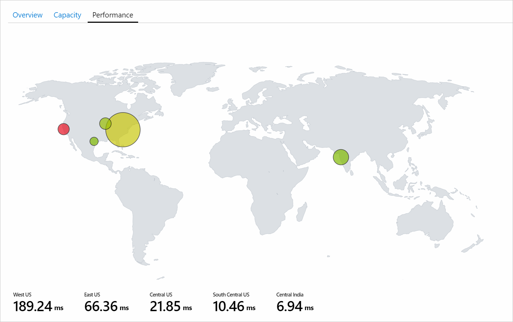
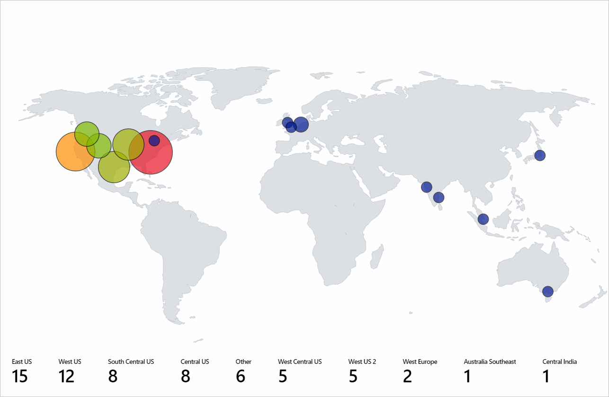
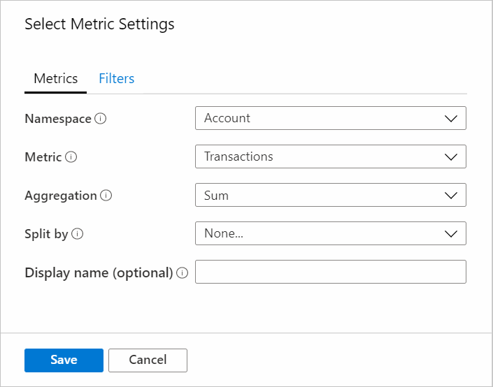

# Map visualization

The map visualization aids in pin-pointing issues in specific regions and showing high level aggregated views of the monitoring data by providing capability to aggregate all the data mapped to each location/country/region.

The screenshot below shows the total transactions and end-to-end latency for different storage accounts. Here the size is determined by the total number of transactions and the color metrics below the map show the end-to-end latency. Upon first observation, the number of transactions in the **West US** region are small compared to the **East US** region, but the end-to-end latency for the **West US** region is higher than the **East US** region. This provides initial insight that something is amiss for **West US**.



## Adding a map

Map can be visualized if the underlying data/metrics has Latitude/Longitude information, Azure resource information, Azure location information or country/region, name, or country/region code.

### Using Azure location

1. Switch the workbook to edit mode by selecting on the **Edit** toolbar item.
2. Select **Add** then *Add query*.
3. Change the *Data Source* to `Azure Resource Graph` then pick any subscription that has storage account.
4. Enter the query below for your analysis and the select **Run Query**.

    ```kusto
    where  type =~ 'microsoft.storage/storageaccounts'
    | summarize count() by location
    ```

5. Set *Size* to `Large`.
6. Set the *Visualization* to `Map`.
7. All the settings will be autopopulated. For custom settings, select the **Map Settings** button to open the settings pane.
8. Below is a screenshot of the map visualization that shows storage accounts for each Azure region for the selected subscription.



### Using Azure resource

1. Switch the workbook to edit mode by selecting on the **Edit** toolbar item.
2. Select **Add** then *Add Metric*.
3. Use a subscription that has storage accounts.
4. Change *Resource Type* to `storage account` and in *Resource* select multiple storage accounts.
5. Select **Add Metric** and add a Transaction metric.
    1. Namespace: `Account`
    2. Metric: `Transactions`
    3. Aggregation: `Sum`
    
    
1. Select **Add Metric** and add Success E2E Latency metric.
    1. Namespace: `Account`
    1. Metric: `Success E2E Latency`
    1. Aggregation: `Average`
    
    
1. Set *Size* to `Large`.
1. Set *Visualization* size to `Map`.
1. In **Map Settings** set the following settings:
    1. Location info using: `Azure Resource`
    1. Azure resource field: `Name`
    1. Size by: `microsoft.storage/storageaccounts-Transaction-Transactions`
    1. Aggregation for location: `Sum of values`
    1. Coloring Type: `Heatmap`
    1. Color by: `microsoft.storage/storageaccounts-Transaction-SuccessE2ELatency`
    1. Aggregation for color: `Sum of values`
    1. Color palette: `Green to Red`
    1. Minimum value: `0`
    1. Metric value: `microsoft.storage/storageaccounts-Transaction-SuccessE2ELatency`
    1. Aggregate other metrics by: `Sum of values`
    1. Select the **custom formatting** box
    1. Unit: `Milliseconds`
    1. Style: `Decimal`
    1. Maximum fractional digits: `2`

### Using country/region

1. Switch the workbook to edit mode by selecting on the **Edit** toolbar item.
2. Select **Add*, then *Add query*.
3. Change the *Data source* to `Log`.
4. Select *Resource type* as `Application Insights`, then pick any Application Insights resource that has pageViews data.
5. Use the query editor to enter the KQL for your analysis and select **Run Query**.

    ```kusto
    pageViews
    | project duration, itemCount, client_CountryOrRegion
    | limit 20
    ```

6. Set the size values to `Large`.
7. Set the visualization to `Map`.
8. All the settings will be autopopulated. For custom settings, select **Map Settings**.

### Using latitude/location

1. Switch the workbook to edit mode by selecting on the **Edit** toolbar item.
2. Select **Add*, then *Add query*.
3. Change the *Data source* to `JSON`.
1. Enter the JSON data in below in the query editor and select **Run Query**.
1. Set the *Size* values to `Large`.
1. Set the *Visualization* to `Map`.
1. In **Map Settings** under "Metric Settings", set *Metric Label* to `displayName` then select **Save and Close**.

The map visualization below shows users for each latitude and longitude location with the selected label for metrics.


## Map settings

### Layout settings

| Setting | Explanation |
|:-------------|:-------------|
| `Location info using` | Select a way to get the location of items shown on the map. <br> **Latitude/Longitude**: Select this option if there are columns with latitude and longitude information. Each row with latitude and longitude data will be shown as distinct item on the map. <br> **Azure location**: Select this option if there is a column that has Azure Location (eastus, westeurope, centralindia, etc.) information. Specify that column and it will fetch the corresponding latitude and longitude for each Azure location, group same location rows(based on Aggregation specified) together to show the locations on the map. <br> **Azure resource**: Select this option if there is a column that has Azure resource information (storage account, cosmosdb account, etc.). Specify that column and it will fetch the corresponding latitude and longitude for each Azure resource, group same location (Azure location) rows (based on Aggregation specified) together to show the locations on the map. <br> **Country/Region**: Select this option if there is a column that has country/region name/code (US, United States, IN,  India, CN, China) information. Specify that column and it will fetch the corresponding latitude and longitude for each Country/Region/Code and group the rows together with same Country-Region Code/Country-Region name to show the locations on the map. Country Name and Country code won't be grouped together as a single entity on the map.
| `Latitude/Longitude` | These two options will be visible if Location Info field value is: Latitude/Longitude. Select the column that has latitude in the latitude field and longitude in the longitude field respectively. |
| `Azure location field` | This option will be visible if Location Info field value is: Azure location. Select the column that the Azure location information. |
| `Azure resource field` | This option will be visible if Location Info field value is: Azure resource. Select the column that the Azure resource information. |
| `Country/Region field` | This option will be visible if Location Info field value is: Country or region. Select the column that the Country/Region information. |
| `Size by` | This option controls the size of the items shown on the map. Size depends on value in the column specified by the user. Currently, radius of the circle is directly proportional to the square root of the column's value. If 'None...' is selected, all the circles will show the default region size.|
| `Aggregation for location` | This field specifies how to aggregate the **size by** columns that has same Azure Location/Azure Resource/Country-Region. |
| `Minimum region size` | This field specifies what is the minimum radius of the item shown on the map. This is used when there is a significant difference between the size by column's values, therefore smaller items are hardly visible on the map. |
| `Maximum region size` | This field specifies what is the maximum radius of the item shown on the map. This is used when the size by column's values are extremely large and they are covering huge area of the map.|
| `Default region size` | This field specifies what is the default radius of the item shown on the map. The default radius is used when the Size By column is 'None...' or the value is 0.|
| `Minimum value` | The minimum value used to compute region size. If not specified, the minimum value will be the smallest value after aggregation. |
| `Maximum value` | The maximum value used to compute region size. If not specified, the maximum value will be the largest value after aggregation.|
| `Opacity of items on Map` | This field specifies how transparent are the items shown on the map. Opacity of 1 means, no transparency, where opacity of 0 means, items won't be visible on the map. If there are too many items on the map, opacity can be set to low value so that all the overlapping items are visible.|

### Color settings

| Coloring Type | Explanation |
|:------------- |:-------------|
| `None` | All nodes have the same color. |
| `Thresholds` | In this type, cell colors are set by threshold rules (for example, _CPU > 90%  => Red, 60% > CPU > 90% => Yellow, CPU < 60% => Green_). <ul><li> **Color by**: Value of this column will be used by Thresholds/Heatmap logic.</li> <li>**Aggregation for color**: This field specifies how to aggregate the **color by** columns that has the same Azure Location/Azure Resource/Country-Region. </li> <ul> |
| `Heatmap` | In this type, the cells are colored based on the color palette and Color by field. This will also have same **Color by** and **Aggregation for color** options as thresholds. |

### Metric settings
| Setting | Explanation |
|:------------- |:-------------|
| `Metric Label` | This option will be visible if Location Info field value is: Latitude/Longitude. Using this feature, user can pick the label to show for metrics shown below the map. |
| `Metric Value` | This field specifies metric value to be shown below the map. |
| `Create 'Others' group after` | This field specifies the limit before an "Others" group is created. |
| `Aggregate 'Others' metrics by` | This field specifies the aggregation used for "Others" group if it is shown. |
| `Custom formatting` | Use this field to  set units, style, and formatting options for number values. This is same as [grid's custom formatting](../visualize/workbooks-grid-visualizations.md#custom-formatting).|

## Next steps

- Learn how to create [honey comb visualizations in workbooks](../visualize/workbooks-honey-comb.md).