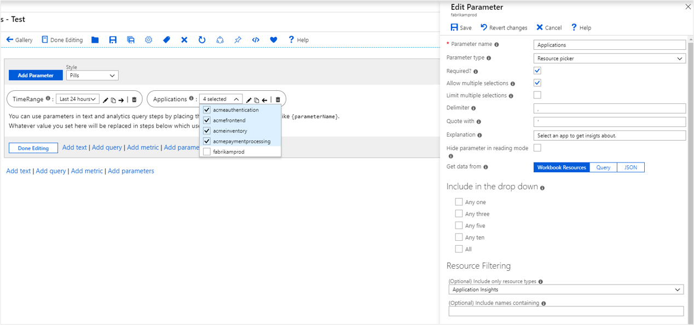
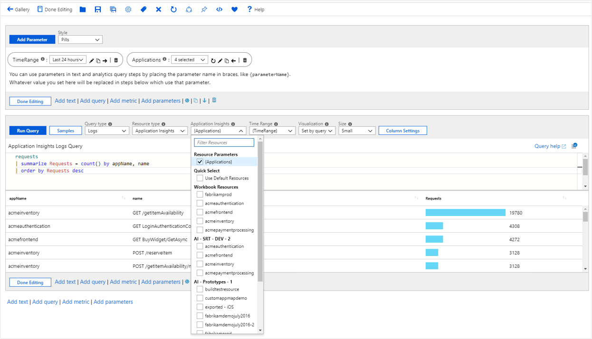

# Workbook resource parameters

Resource parameters allow picking of resources in workbooks. This functionality is useful in setting the scope from which to get the data. An example would be allowing you to select the set of VMs, which charts use later when presenting the data.

Values from resource pickers can come from the workbook context, static list, or Azure Resource Graph queries.

## Create a resource parameter (workbook resources)

1. Start with an empty workbook in edit mode.
1. Select **Add parameters** > **Add Parameter**.
1. In the new parameter pane that opens, enter:
    1. **Parameter name**: `Applications`
    1. **Parameter type**: `Resource picker`
    1. **Required**: `checked`
    1. **Allow multiple selections**: `checked`
    1. **Get data from**: `Workbook Resources`
    1. **Include only resource types**: `Application Insights`
1. Select **Save** to create the parameter.

   

## Create an Azure Resource Graph resource parameter

1. Start with an empty workbook in edit mode.
1. Select **Add parameters** > **Add Parameter**.
1. In the new parameter pane that opens, enter:
    1. **Parameter name**: `Applications`
    1. **Parameter type**: `Resource picker`
    1. **Required**: `checked`
    1. **Allow multiple selections**: `checked`
    1. **Get data from**: `Query`
    1. **Query Type**: `Azure Resource Graph`
    1. **Subscriptions**: `Use default subscriptions`
    1. In the query control, add this snippet:

    ```kusto
    where type == 'microsoft.insights/components'
    | project value = id, label = name, selected = false, group = resourceGroup
    ```

1. Select **Save** to create the parameter.

   

> [!NOTE]
> Azure Resource Graph isn't yet available in all clouds. Ensure that it's supported in your target cloud if you choose this approach.

For more information on Azure Resource Graph, see [What is Azure Resource Graph?](../../governance/resource-graph/overview.md).

## Create a JSON list resource parameter

1. Start with an empty workbook in edit mode.
1. Select **Add parameters** > **Add Parameter**.
1. In the new parameter pane that opens, enter:
    1. **Parameter name**: `Applications`
    1. **Parameter type**: `Resource picker`
    1. **Required**: `checked`
    1. **Allow multiple selections**: `checked`
    1. **Get data from**: `JSON`
    1. In the content control, add this JSON snippet:

        ```json
        [
            { "value":"/subscriptions/<sub-id>/resourceGroups/<resource-group>/providers/<resource-type>/acmeauthentication", "label": "acmeauthentication", "selected":true, "group":"Acme Backend" },
            { "value":"/subscriptions/<sub-id>/resourceGroups/<resource-group>/providers/<resource-type>/acmeweb", "label": "acmeweb", "selected":false, "group":"Acme Frontend" }
        ]
        ```

    1. Select **Update**.
1. Optionally, set `Include only resource types` to **Application Insights**.
1. Select **Save** to create the parameter.

## Reference a resource parameter

1. Select **Add query** to add a query control, and then select an Application Insights resource.
1. Use the **Application Insights** dropdown list to bind the parameter to the control. This step sets the scope of the query to the resources returned by the parameter at runtime.
1. In the KQL control, add this snippet:

    ```kusto
    requests
    | summarize Requests = count() by appName, name
    | order by Requests desc
    ```

1. Run the query to see the results.

   

This approach can be used to bind resources to other controls like metrics.

## Resource parameter options

| Parameter | Description | Example |
| ------------- |:-------------|:-------------|
| `{Applications}` | The selected resource ID. | _/subscriptions/\<sub-id\>/resourceGroups/\<resource-group\>/providers/\<resource-type\>/acmeauthentication_ |
| `{Applications:label}` | The label of the selected resource. | `acmefrontend` |
| `{Applications:value}` | The value of the selected resource. | _'/subscriptions/\<sub-id\>/resourceGroups/\<resource-group\>/providers/\<resource-type\>/acmeauthentication'_ |
| `{Applications:name}` | The name of the selected resource. | `acmefrontend` |
| `{Applications:resourceGroup}` | The resource group of the selected resource. | `acmegroup` |
| `{Applications:resourceType}` | The type of the selected resource. | _microsoft.insights/components_ |
| `{Applications:subscription}` | The subscription of the selected resource. |  |
| `{Applications:grid}` | A grid that shows the resource properties. Useful to render in a text block while debugging.  |  |

## Next steps

[Getting started with Azure Workbooks](workbooks-getting-started.md)