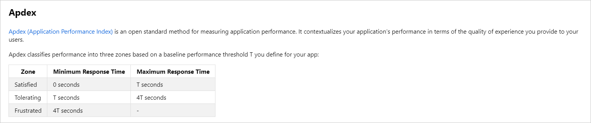
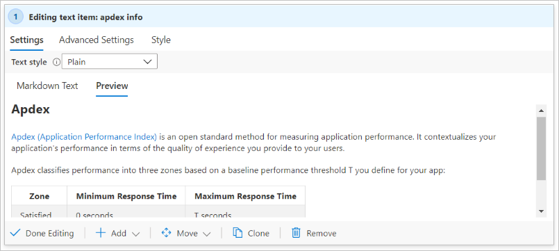
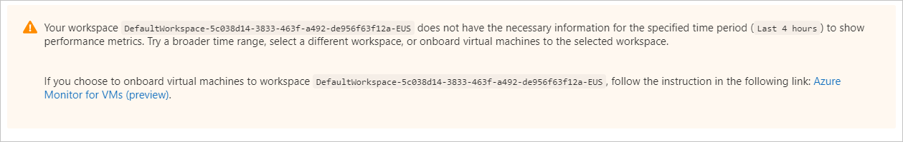

# Text visualizations

You can include text blocks in your workbooks. The text can be human analysis of telemetry, information to help users interpret your data, and section headings.

Text is added through a Markdown control, which provides full formatting control. Formatting includes different heading and font styles, hyperlinks, and tables.

Edit mode:

Preview mode:

## Add a text control

1. Switch the workbook to edit mode by selecting **Edit** on the toolbar.
1. Use the **Add text** link to add a text control to the workbook.
1. Add Markdown in the editor field.
1. Use the **Text Style** option to switch between plain Markdown and Markdown wrapped with the Azure portal's standard info, warning, success, or error styling.
1. Use the **Preview** tab to see how your content will look. While you edit, the preview shows the content inside a scrollbar area to limit its size. At runtime, the Markdown content expands to fill whatever space it needs, with no scrollbars.
1. Select **Done Editing** to finish editing the component.

> [!TIP]
> Use this [Markdown cheat sheet](https://github.com/adam-p/markdown-here/wiki/Markdown-Cheatsheet) to learn about different formatting options.

## Text styles

The following text styles are available for the text component:

| Style     | Description                                                                               |
|-----------|-------------------------------------------------------------------------------------------|
| plain   | No other formatting is applied.                                                      |
| info    | The portal's info style, with an  `ℹ` or similar icon and generally a blue background.      |
| error   | The portal's error style, with an `❌` or similar icon and generally a red background.     |
| success | The portal's success style, with a `✔` or similar icon and generally a green background.  |
| upsell  | The portal's upsell style, with a `🚀` or similar icon and generally a purple background. |
| warning | The portal's warning style, with a `⚠` or similar icon and generally a blue background.   |

Instead of selecting a specific style, you can also choose a text parameter as the source of the style. The parameter value must be one of the preceding text values. The absence of a value or any unrecognized value is treated as plain style.

An info style example:

A warning style example:

## Next steps

* Learn how to create a [chart in workbooks](workbooks-chart-visualizations.md).
* Learn how to create a [grid in workbooks](workbooks-grid-visualizations.md).
