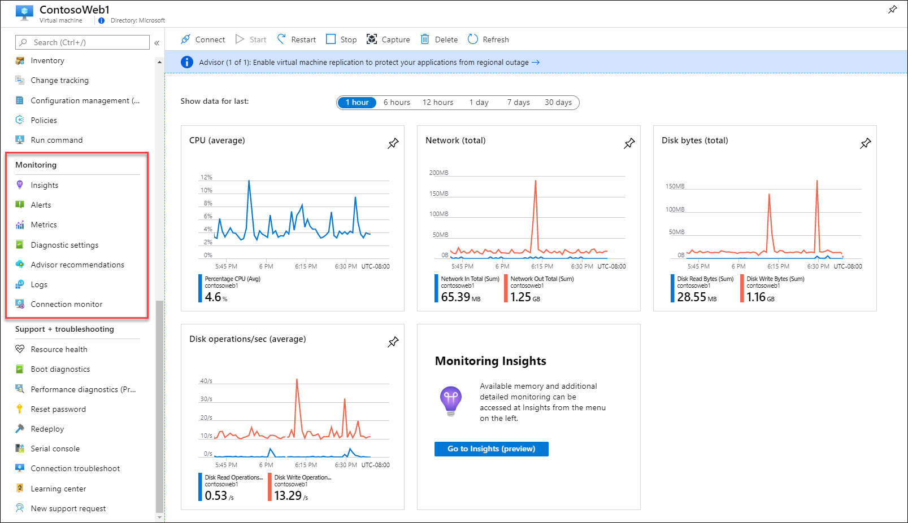
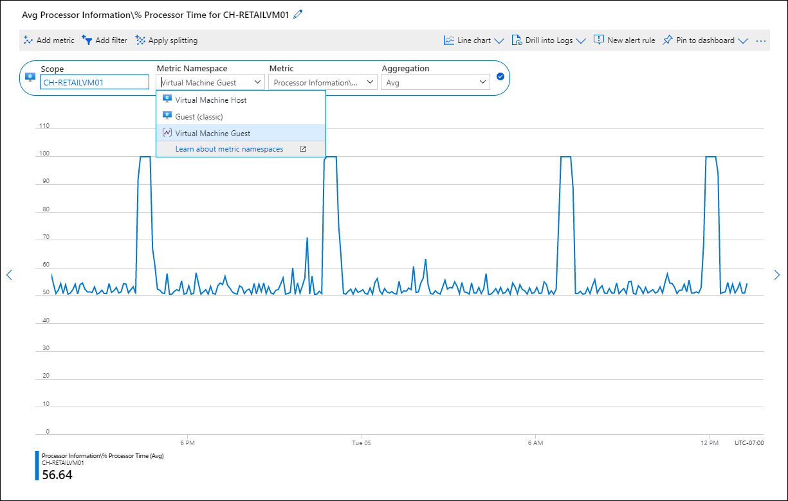
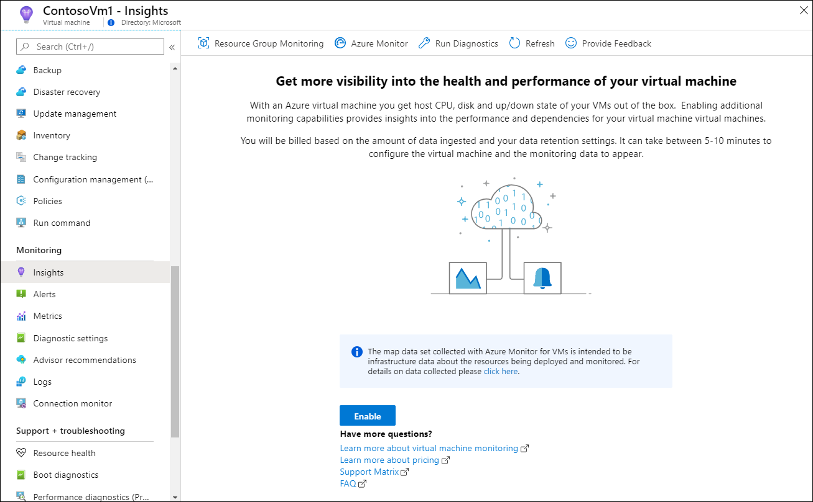

# Monitoring virtual machines with Azure Monitor - Analyze monitoring data
Once you’ve deployed agents to your virtual machines and configured data collection, data will be available for analysis. You can leverage existing views and workbooks that visualize the collected data and allow you to drill in for more analysis. Or you can perform ad hoc analysis by writing your own log queries. You can even create your own workbooks if you have custom requirements.
This section describes the different ways you can view and analyze data collected from your virtual machines.

## Understand types of data available

The basic types of data collected from virtual machines include the following:

| Data | Contents |
|:---|:---|
| Activity log | Information about changes to virtual machines including creation, configuration changes, and start/stop. |
| Metrics | Performance data collected for the host machine.  Includes performance data from guest operating system only if the diagnostic extension is installed. View this data in Metrics explorer. |
| Logs | Event and performance data collected from VM insights and from any data sources configured on the workspace. View this data in VM insights or create custom queries using Log Analytics. |

## Virtual machine monitoring menu
Once you configure collection of monitoring data for a virtual machine, you have multiple options for accessing it in the Azure portal:

- Use the **Azure Monitor** menu to access data from all monitored resources. 
- Use VM insights for monitoring sets of virtual machines at scale.
- Analyze data for a single virtual machine from its menu in the Azure portal. The table below lists different options for monitoring the virtual machines menu.

| Menu option | Description |
|:---|:---|
| Overview | Displays [platform metrics](../essentials/data-platform-metrics.md) for the virtual machine host. Click on a graph to work with this data in [metrics explorer](../essentials/metrics-getting-started.md). |
| Activity log | [Activity log](../essentials/activity-log.md#view-the-activity-log) entries filtered for the current virtual machine. |
| Insights | Opens [VM insights](../vm/vminsights-overview.md) with the map for the current virtual machine selected. |
| Alerts | Views [alerts](../alerts/alerts-overview.md) for the current virtual machine.  |
| Metrics | Open [metrics explorer](../essentials/metrics-getting-started.md) with the scope set to the current virtual machine. |
| Diagnostic settings | Enable and configure [diagnostics extension](../agents/diagnostics-extension-overview.md) for the current virtual machine. |
| Advisor recommendations | Recommendations for the current virtual machine from [Azure Advisor](../../advisor/index.yml). |
| Logs | Open [Log Analytics](../logs/log-analytics-overview.md) with the [scope](../logs/scope.md) set to the current virtual machine. |
| Connection monitor | Open [Network Watcher Connection Monitor](../../network-watcher/connection-monitor-overview.md) to monitor connections between the current virtual machine and other virtual machines. |

## Analyze metric data with metrics explorer
Select  **Metrics** from the virtual machine's menu to open metrics explorer which allows you to analyze metric data for virtual machines. See [Getting started with Azure Metrics Explorer](../essentials/metrics-getting-started.md) for details on using this tool. 

There are three namespaces used by virtual machines for metrics:

| Namespace | Description | Requirement |
|:---|:---|:---|
| Virtual Machine Host | Host metrics automatically collected for all Azure virtual machines. Detailed list of metrics at [Microsoft.Compute/virtualMachines](../essentials/metrics-supported.md#microsoftcomputevirtualmachines). | Collected automatically with no configuration required. |
| Guest (classic) | Limited set of guest operating system and application performance data. Available in metrics explorer but not other Azure Monitor features such as metric alerts.  | [Diagnostic extension](../agents/diagnostics-extension-overview.md) installed. Data is read from Azure storage.  |
| Virtual Machine Guest | Guest operating system and application performance data available to all Azure Monitor features using metrics. | For Windows, [diagnostic extension installed](../agents/diagnostics-extension-overview.md) installed with Azure Monitor sink enabled. For Linux, [Telegraf agent installed](../essentials/collect-custom-metrics-linux-telegraf.md). |

## Analyze log data with Log Analytics
Azure virtual machines will collect the following data to Azure Monitor Logs. 

VM insights enables the collection of a predetermined set of performance counters that are written to the *InsightsMetrics* table. This is the same table used by [Container insights](../containers/container-insights-overview.md). 

| Data source | Requirements | Tables |
|:---|:---|:---|
| VM insights | Enable on each virtual machine. | InsightsMetrics VMBoundPort VMComputer VMConnection VMProcess See [How to query logs from VM insights](../vm/vminsights-log-search.md) for details. |
| Activity log | Diagnostic setting for the subscription. | AzureActivity |
| Host metrics | Diagnostic setting for the virtual machine. | AzureMetrics |
| Data sources from the guest operating system | Enable Log Analytics agent and configure data sources. | See documentation for each data source. |

> [!NOTE]
> Performance data collected by the Log Analytics agent writes to the *Perf* table while VM insights will collect it to the *InsightsMetrics* table. This is the same data, but the tables have a different structure. If you have existing queries based on *Perf*, the will need to be rewritten to use *InsightsMetrics*.

### Enable VM insights
[VM insights](../vm/vminsights-overview.md) is an [insight](../monitor-reference.md) in Azure Monitor that is the primary tool for monitoring virtual machines in Azure Monitor. It provides the following additional value over standard Azure Monitor features.

- Simplified onboarding of Log Analytics agent and Dependency agent to enable monitoring of a virtual machine guest operating system and workloads. 
- Pre-defined trending performance charts and workbooks that allow you to analyze core performance metrics from the virtual machine's guest operating system.
- Dependency map that displays processes running on each virtual machine and the interconnected components with other machines and external sources.

Enable VM insights from the **Insights** option in the virtual machine menu of the Azure portal. See [Enable VM insights overview](vminsights-enable-overview.md) for details and other configuration methods.

## Next steps

* [Learn how to analyze data in Azure Monitor logs using log queries.](../logs/get-started-queries.md)
* [Learn about alerts using metrics and logs in Azure Monitor.](../alerts/alerts-overview.md)