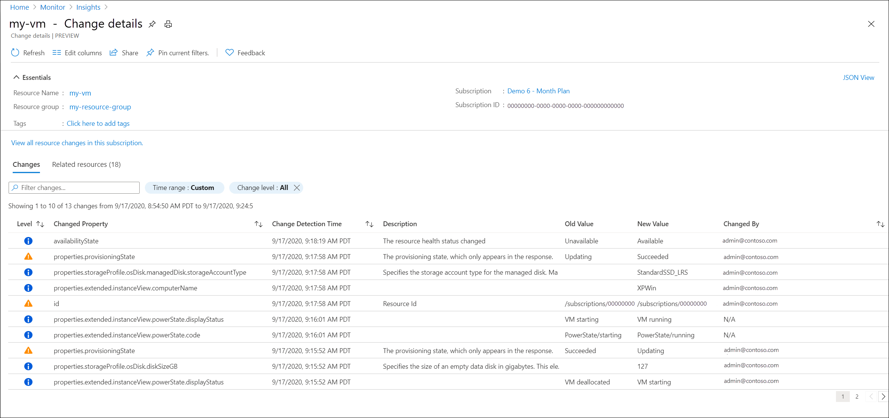

# Change analysis in VM insights
VM insights integration with [Application Change Analysis](../app/change-analysis.md) integration allows you to view any changes made to a virtual machine that may have affected it performance.

## Overview
Suppose you have a VM that beings running slow and want to investigate whether recent changes to its configuration could have affected its performance. You view the performance of the VM using VM insights and find that there is an increase in memory usage in the past hour. Change analysis can help you determine whether any configuration changes made around this time were the cause of this increase.

The Application Change Analysis service aggregates changes from [Azure Resource Graph](../../governance/resource-graph/how-to/get-resource-changes.md) as well as nested properties changes such as network security rules from Azure Resource Manager. 

## Enabling change analysis
To onboard change analysis in VM insights, you must register the *Microsoft.ChangeAnalysis* resource provider. The first time you launch VM insights or Application Change Analysis in the Azure portal, this resource provider will automatically be registered for you. Application Change Analysis is a free service that has no performance overhead on resources.

## View change analysis
Change analysis is available from the **Performance** or **Map** tab of VM insights by selecting the **Change** option. 

Click the **Investigate changes** button to launch the Application Change Analysis page filtered for the VM. You can review the listed changes to see if there are any that could have caused the issue. If you are unsure about a particular change, you can reference the **Change by** column to determine the person who made the change.

## Next steps
- Learn more about [Application Change Analysis](../app/change-analysis.md).
- Learn more about [Azure Resource Graph](../../governance/resource-graph/how-to/get-resource-changes.md). 

