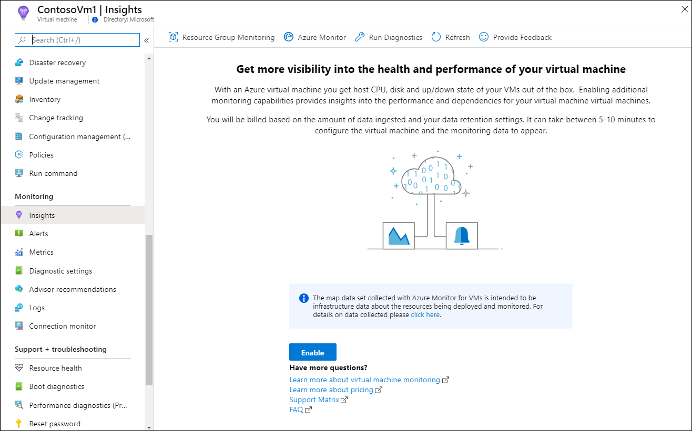

# Configure a Log Analytics workspace for VM insights
VM insights collects its data from one or more Log Analytics workspaces in Azure Monitor. Prior to onboarding agents, you must create and configure a workspace. This article describes the requirements of the workspace and how to configure it for VM insights.

> [!IMPORTANT]
> Configuration of the Log Analytics workspace is only required for using VM insights with virtual machines by using the Log Analytics agent. Virtual machines using Azure Monitor Agent don't use the VMInsights solution that's installed in this configuration. To support Azure Monitor Agent, a standard Log Analytics workspace must be created as described in [Create a Log Analytics workspace](#create-a-log-analytics-workspace).

## Overview
A single subscription can use any number of workspaces depending on your requirements. The only requirement of the workspace is that it must be located in a supported location and be configured with the VMInsights solution.

After the workspace is configured, you can use any of the available options to install the required agents on virtual machines and virtual machine scale sets and specify a workspace for them to send their data. VM insights collects data from any configured workspace in its subscription.

> [!NOTE]
> When you enable VM insights on a single virtual machine or virtual machine scale set by using the Azure portal, you can select an existing workspace or create a new one. The VMInsights solution is installed in this workspace if it isn't already. You can then use this workspace for other agents.

## Create a Log Analytics workspace

>[!NOTE]
>The information described in this section also applies to the [Service Map solution](service-map.md).

To access Log Analytics workspaces in the Azure portal, use the **Log Analytics workspaces** menu.

[](media/vminsights-configure-workspace/log-analytics-workspaces.png#lightbox)

You can create a new Log Analytics workspace by using any of the following methods:

* [Azure portal](../logs/quick-create-workspace.md)
* [Azure CLI](../logs/resource-manager-workspace.md)
* [PowerShell](../logs/powershell-workspace-configuration.md)
* [Azure Resource Manager](../logs/resource-manager-workspace.md)

For guidance on how to determine the number of workspaces you should use in your environment and how to design their access strategy, see [Design a Log Analytics workspace configuration](../logs/workspace-design.md).

## Supported regions
VM insights supports a Log Analytics workspace in any of the [regions supported by Log Analytics](https://azure.microsoft.com/global-infrastructure/services/?products=monitor&regions=all).

>[!NOTE]
>You can monitor Azure VMs in any region. The VMs themselves aren't limited to the regions supported by the Log Analytics workspace.

## Azure role-based access control
To enable and access the features in VM insights, you must have the [Log Analytics Contributor role](../logs/manage-access.md#azure-rbac) in the workspace. To view performance, health, and map data, you must have the [Monitoring Reader role](../roles-permissions-security.md#built-in-monitoring-roles) for the Azure VM. For more information about how to control access to a Log Analytics workspace, see [Manage workspaces](../logs/manage-access.md).

## Add the VMInsights solution to a workspace
Before a Log Analytics workspace can be used with VM insights, it must have the VMInsights solution installed. The methods for configuring the workspace are described in the following sections.

> [!NOTE]
> When you add the VMInsights solution to the workspace, all existing virtual machines connected to the workspace start to send data to InsightsMetrics. Data for the other data types won't be collected until you add the Dependency agent to those existing virtual machines connected to the workspace.

### Azure portal
There are three options for configuring an existing workspace by using the Azure portal:

- To configure a single workspace, on the **Azure Monitor** menu, select **Virtual Machines**. Select **Other onboarding options** and then select **Configure a workspace**. Select a subscription and a workspace and then select **Configure**.

   [](../vm/media/vminsights-enable-policy/configure-workspace.png#lightbox)

- To configure multiple workspaces, on the **Monitor** menu, select **Virtual Machines**. Then select the **Workspace configuration** tab. Set the filter values to display a list of existing workspaces. Select the checkbox next to each workspace to enable it and then select **Configure selected**.

   [](../vm/media/vminsights-enable-policy/workspace-configuration.png#lightbox)

- When you enable VM insights on a single virtual machine or virtual machine scale set by using the Azure portal, you can select an existing workspace or create a new one. The VMInsights solution is installed in this workspace if it isn't already. You can then use this workspace for other agents.

   [](../vm/media/vminsights-enable-portal/enable-vminsights-vm-portal.png#lightbox)

### Resource Manager template
The Azure Resource Manager templates for VM insights are provided in an archive file (.zip) that you can [download from our GitHub repo](https://aka.ms/VmInsightsARMTemplates). A template called **ConfigureWorkspace** configures a Log Analytics workspace for VM insights. You deploy this template by using any of the standard methods, including the following sample PowerShell and CLI commands.

# [CLI](#tab/CLI)

```azurecli
az deployment group create --name ConfigureWorkspace --resource-group my-resource-group --template-file CreateWorkspace.json  --parameters workspaceResourceId='/subscriptions/00000000-0000-0000-0000-000000000000/resourcegroups/my-resource-group/providers/microsoft.operationalinsights/workspaces/my-workspace' workspaceLocation='eastus'

```

# [PowerShell](#tab/PowerShell)

```powershell
New-AzResourceGroupDeployment -Name ConfigureWorkspace -ResourceGroupName my-resource-group -TemplateFile ConfigureWorkspace.json -workspaceResourceId /subscriptions/00000000-0000-0000-0000-000000000000/resourcegroups/my-resource-group/providers/microsoft.operationalinsights/workspaces/my-workspace -location eastus
```

---

## Remove the VMInsights solution from a workspace
If you've migrated your virtual machines to Azure Monitor Agent and no longer want to support virtual machines with the Log Analytics agent in your workspace, remove the VMInsights solution from the workspace. Removing the solution ensures that you don't collect data from any Log Analytics agents that inadvertently remain.

To remove the VMInsights solution, use the same process as [removing any other solution from a workspace](/previous-versions/azure/azure-monitor/insights/solutions#remove-a-monitoring-solution).

1. Select the **Solutions** menu in the Azure portal.
1. Locate the VMInsights solution for your workspace and select it to view its detail.
1. Select **Delete**.

   :::image type="content" source="media/vminsights-configure-workspace/remove-solution.png" lightbox="media/vminsights-configure-workspace/remove-solution.png" alt-text="Screenshot that shows deleting a solution dialog.":::

## Next steps
- See [Onboard agents to VM insights](vminsights-enable-overview.md) to connect agents to VM insights.
- See [Targeting monitoring solutions in Azure Monitor (preview)](/previous-versions/azure/azure-monitor/insights/solution-targeting) to limit the amount of data sent from a solution to the workspace.
