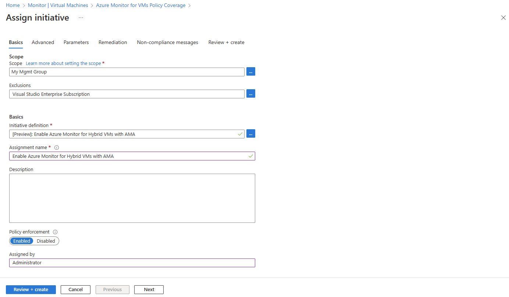
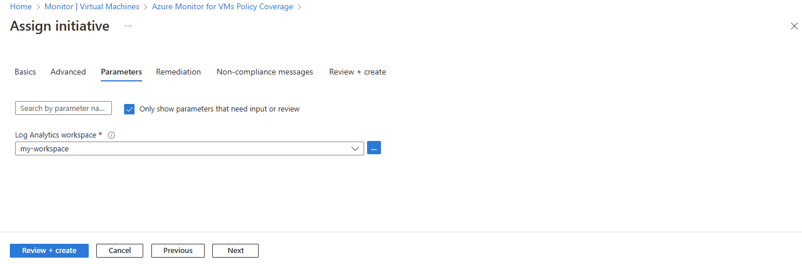
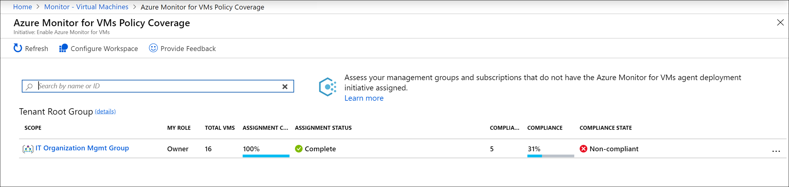
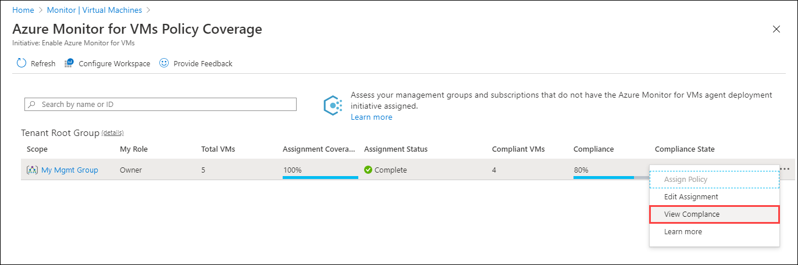
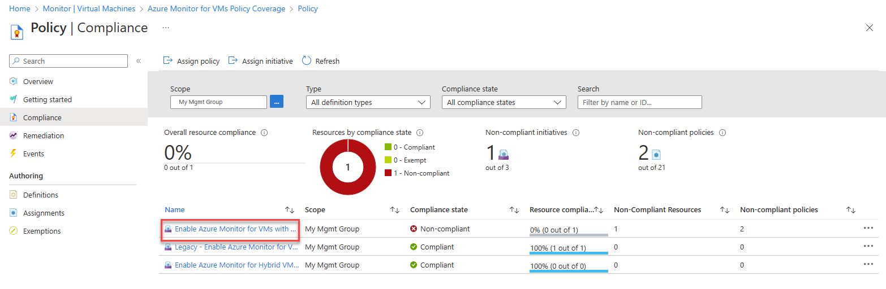
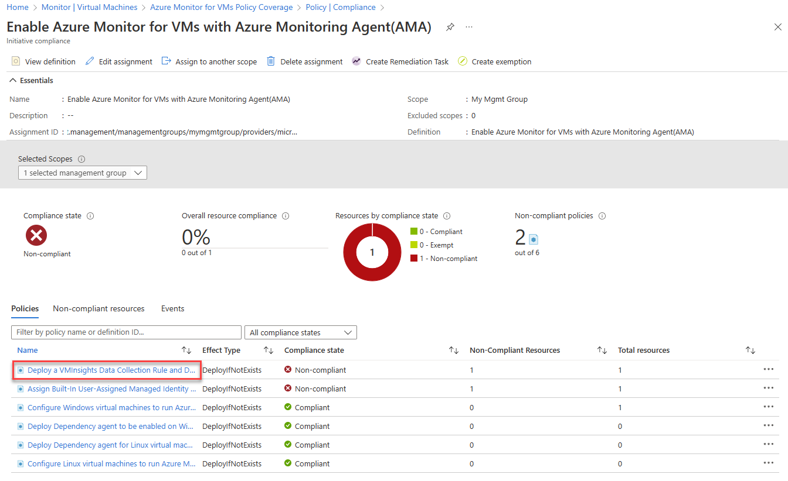
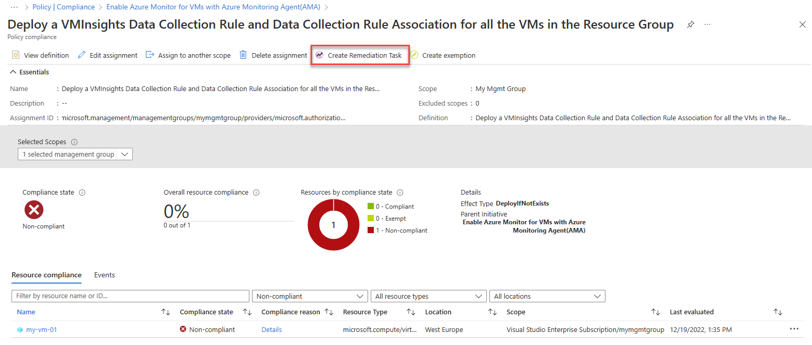
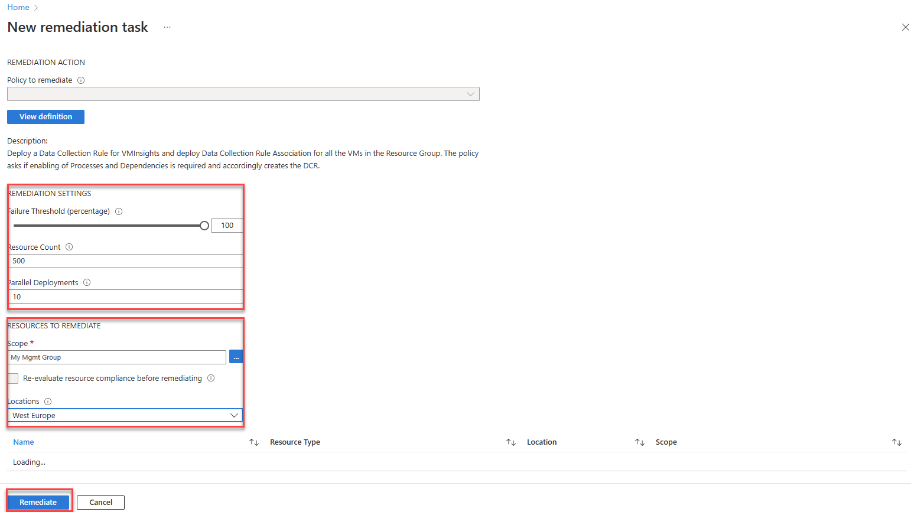
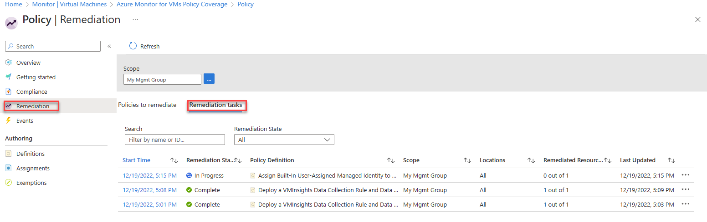

# Enable VM insights by using Azure Policy

[Azure Policy](../../governance/policy/overview.md) lets you set and enforce requirements for all new resources you create and resources you modify. VM insights policy initiatives, which are predefined sets of policies created for VM insights, install the agents required for VM insights and enable monitoring on all new virtual machines in your Azure environment. 

This article explains how to enable VM insights for Azure virtual machines, virtual machine scale sets, and hybrid virtual machines connected with Azure Arc by using predefined VM insights policy initiates.

> [!NOTE]
> For information about how to use Azure Policy with Azure virtual machine scale sets and how to work with Azure Policy directly to enable Azure virtual machines, see [Deploy Azure Monitor at scale using Azure Policy](../best-practices.md).

## VM insights initiatives
VM insights policy initiatives install Azure Monitor Agent and the Dependency agent on new virtual machines in your Azure environment. Assign these initiatives to a management group, subscription, or resource group to install the agents on Windows or Linux Azure virtual machines in the defined scope automatically.

The initiatives apply to new machines you create and machines you modify, but not to existing VMs.

|Name |Description |
|-----|------------|
| Enable Azure Monitor for VMs with Azure Monitoring Agent  | Installs Azure Monitor Agent and the Dependency agent on Azure VMs. |
| Enable Azure Monitor for virtual machine scale sets with Azure Monitoring Agent  | Installs Azure Monitor Agent and the Dependency agent on virtual machine scale sets. |
| Enable Azure Monitor for Hybrid VMs with Azure Monitoring Agent | Installs Azure Monitor Agent and Dependency agent on hybrid VMs connected with Azure Arc. |
| Legacy: Enable Azure Monitor for VMs | Installs the Log Analytics agent and Dependency agent on virtual machine scale sets. |
| Legacy: Enable Azure Monitor for virtual machine scale sets | Installs the Log Analytics agent and Dependency agent on virtual machine scale sets. |

## Support for custom images

Azure Monitor Agent-based VM insights policy and initiative definitions have a `scopeToSupportedImages` parameter that's set to `true` by default to enable onboarding Dependency Agent on supported images only. Set this parameter to `false`to allow onboarding Dependency Agent on custom images.  

## Assign a VM insights policy initiative

To assign a VM insights policy initiative to a subscription or management group from the Azure portal:

1. Search for and open **Policy**.
1. Select **Assignments** > **Assign initiative**.

    :::image type="content" source="media/vminsights-enable-policy/vm-insights-assign-initiative.png" lightbox="media/vminsights-enable-policy/vm-insights-assign-initiative.png" alt-text="Screenshot that shows the Policy Assignments screen with the Assign initiative button highlighted.":::

    The **Assign initiative** screen appears.

    

1. Configure the initiative assignment:

    1. In the **Scope** field, select the management group or subscription to which you'll assign the initiative.
    1. (Optional) Select **Exclusions** to exclude specific resources from the initiative assignment. For example, if your scope is a management group, you might specify a subscription in that management group to be excluded from the assignment.
    1. Select the ellipsis (**...**) next to **Initiative assignment** to start the policy definition picker. Select one of the VM insights initiatives.
    1. (Optional) Change the **Assignment name** and add a **Description**.
    1. On the **Parameters** tab, select a **Log Analytics workspace** to which all virtual machines in the assignment will send data. For virtual machines to send data to different workspaces, create multiple assignments, each with their own scope.
    
        If you're assigning a legacy initiative, the workspace must have the *VMInsights* solution installed, as described in [Configure Log Analytics workspace for VM insights](vminsights-configure-workspace.md).
    
        
       
        > [!NOTE]
        > If you select a workspace that's not within the scope of the assignment, grant *Log Analytics Contributor* permissions to the policy assignment's principal ID. Otherwise, you might get a deployment failure like:
        >
        > `The client '343de0fe-e724-46b8-b1fb-97090f7054ed' with object id '343de0fe-e724-46b8-b1fb-97090f7054ed' does not have authorization to perform action 'microsoft.operationalinsights/workspaces/read' over scope ...`

1. Select **Review + create** to review the initiative assignment details. Select **Create** to create the assignment.

    Don't create a remediation task at this point because you'll probably need multiple remediation tasks to enable existing virtual machines. For more information about how to create remediation tasks, see [Remediate compliance results](#create-a-remediation-task).

## Review compliance for a VM insights policy initiative

After you assign an initiative, you can review and manage compliance for the initiative across your management groups and subscriptions.

To see how many virtual machines exist in each of the management groups or subscriptions and their compliance status:

1. Search for and open **Azure Monitor**.
1. Select **Virtual machines** > **Overview** > **Other onboarding options**. Then under **Enable using policy**, select **Enable**.

    :::image type="content" source="media/vminsights-enable-policy/other-onboarding-options.png" lightbox="media/vminsights-enable-policy/other-onboarding-options.png" alt-text="Screenshot that shows other onboarding options page of VM insights with the Enable using policy option.":::

    The **Azure Monitor for VMs Policy Coverage** page appears.

    

    The following table describes the compliance information presented on the **Azure Monitor for VMs Policy Coverage** page.
    
    | Function | Description |
    |----------|-------------|
    | **Scope** | Management group or subscription to which the initiative applies.|
    | **My Role** | Your role in the scope. The role can be Reader, Owner, Contributor, or blank if you have access to the subscription but not to the management group to which it belongs. Your role determines which data you can see and whether you can assign policies or initiatives (owner), edit them, or view compliance. |
    | **Total VMs** | Total number of VMs in the scope, regardless of their status. For a management group, this number is the sum total of VMs in all related subscriptions or child management groups. |
    | **Assignment Coverage** | Percentage of VMs covered by the initiative. When you assign the initiative, the scope you select in the assignment could be the scope listed or a subset of it. For instance, if you create an assignment for a subscription (initiative scope) and not a management group (coverage scope), the value of **Assignment Coverage** indicates the VMs in the initiative scope divided by the VMs in coverage scope. In another case, you might exclude some VMs, resource groups, or a subscription from the policy scope. If the value is blank, it indicates that either the policy or initiative doesn't exist or you don't have permission.|
    | **Assignment Status** | **Success**: Azure Monitor Agent or the Log Analytics agent and Dependency agent deployed on all machines in scope. **Warning**: The subscription isn't under a management group. **Not Started**: A new assignment was added. **Lock**: You don't have sufficient privileges to the management group. **Blank**: No VMs exist or a policy isn't assigned. |
    | **Compliant VMs** | Number of VMs that have both Azure Monitor Agent or Log Analytics agent and Dependency agent installed. This field is blank if there are no assignments, no VMs in the scope, or if you don't have the relevant permissions. |
    | **Compliance** | The overall compliance number is the sum of distinct compliant resources divided by the sum of all distinct resources. |
    | **Compliance State** | **Compliant**: All VMs in the scope have Azure Monitor Agent or the Log Analytics agent and Dependency agent deployed to them, or any new VMs in the scope haven't yet been evaluated. **Noncompliant**: There are VMs that aren't enabled and might need remediation. **Not Started**: A new assignment was added. **Lock**: You don't have sufficient privileges to the management group. **Blank**: No policy assigned.  |

1. Select the ellipsis (**...**) > **View Compliance**.

    

    The **Compliance** page appears. It lists assignments that match the specified filter and indicates whether they're compliant.

    

1. Select an assignment to view its details. The **Initiative compliance** page appears. It lists the policy definitions in the initiative and whether each is in compliance.

    

    Policy definitions are considered noncompliant if:

    * Azure Monitor Agent, the Log Analytics agent, or the Dependency agent aren't deployed. Create a remediation task to mitigate.
    * VM image (OS) isn't identified in the policy definition. Policies can only verify well-known Azure VM images. Check the documentation to see whether the VM OS is supported.
    * Some VMs in the initiative scope are connected to a Log Analytics workspace other than the one that's specified in the policy assignment.

1. Select a policy definition to open the **Policy compliance** page.

## Create a remediation task

If your assignment doesn't show 100% compliance, create remediation tasks to evaluate and enable existing VMs. You'll most likely need to create multiple remediation tasks, one for each policy definition. You can't create a remediation task for an initiative.

To create a remediation task:

1. On the **Initiative compliance** page, select **Create Remediation Task**.

    

    The **New remediation task** page appears.

    

1. Review **Remediation settings** and **Resources to remediate** and modify as necessary. Then select **Remediate** to create the task.

    After the remediation tasks are finished, your VMs should be compliant with agents installed and enabled for VM insights.

## Track remediation tasks

To track the progress of remediation tasks, on the **Policy** menu, select **Remediation** and select the **Remediation tasks** tab.

## Next steps

Learn how to:
- [View VM insights Map](vminsights-maps.md) to see application dependencies. 
- [View Azure VM performance](vminsights-performance.md) to identify bottlenecks and overall utilization of your VM's performance.
