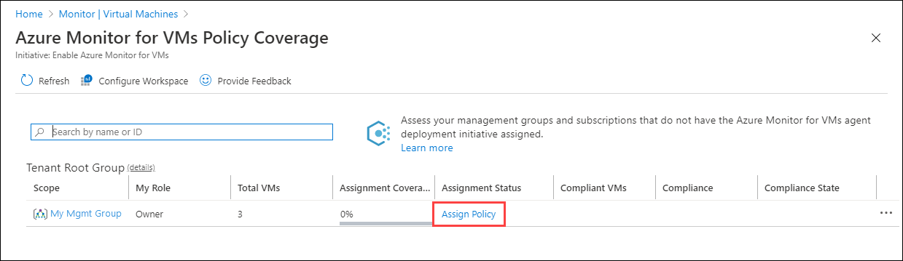

# Enable VM insights by using Azure Policy
This article explains how to enable VM insights for Azure virtual machines or hybrid virtual machine connected with Azure Arc (preview) using Azure Policy. Azure Policy allows you to assign policy definitions that install the required agents for VM insights across your Azure environment and automatically enable monitoring for VMs as each virtual machine is created. VM insights provides a feature that allows you to discover and remediate noncompliant VMs in your environment. Use this feature instead of working directly with Azure Policy.

If you're not familiar with Azure Policy, get a brief introduction at [Deploy Azure Monitor at scale using Azure Policy](../deploy-scale.md).

> [!NOTE]
> To use Azure Policy with Azure virtual machine scale sets, or to work with Azure Policy directly to enable Azure virtual machines, see [Deploy Azure Monitor at scale using Azure Policy](../deploy-scale.md#vm-insights).

## Prerequisites
- [Create and configure a Log Analytics workspace](./vminsights-configure-workspace.md).
- See [Supported operating systems](./vminsights-enable-overview.md#supported-operating-systems) to ensure that the operating system of the virtual machine or virtual machine scale set you're enabling is supported. 

## VM insights initiative
VM insights provides builtin policy definitions to install the Log Analytics agent and Dependency agent on Azure virtual machines. The initiative **Enable VM insights** includes each of these policy definitions. Assign this initiative to a management group, subscription, or resource group to automatically install the agents on any Windows or Linux Azure virtual machines in that scope.

## Open Policy Coverage feature
To access **VM insights Policy Coverage**, go the **Virtual machines** in the **Azure Monitor** menu in the Azure portal. Select **Other onboarding options** and then **Enable** under **Enable using policy**.

## Create new assignment
If you don't already have an assignment, create a new one by clicking **Assign Policy**.

This is the same page to assign an initiative in Azure Policy except that it's hardcoded with the scope that you selected and the **Enable VM insights** initiative definition. You can optionally change the **Assignment name** and add a **Description**. Select **Exclusions** if you want to provide an exclusion to the scope. For example, your scope could be a management group, and you could specify a subscription in that management group to be excluded from the assignment.

On the **Parameters** page, select a **Log Analytics workspace** to be used by all virtual machines in the assignment. If you want to specify different workspaces for different virtual machines, then you must create multiple assignments, each with their own scope. 

   > [!NOTE]
   > If the workspace is beyond the scope of the assignment, grant *Log Analytics Contributor* permissions to the policy assignment's Principal ID. If you don't do this, you might see a deployment failure like `The client '343de0fe-e724-46b8-b1fb-97090f7054ed' with object id '343de0fe-e724-46b8-b1fb-97090f7054ed' does not have authorization to perform action 'microsoft.operationalinsights/workspaces/read' over scope ...`

Click **Review + Create** to review the details of the assignment before clicking **Create** to create it. Don't create a remediation task at this point since you will most likely need multiple remediation tasks to enable existing virtual machines. See [Remediate compliance results](#remediate-compliance-results) below.

## Review compliance
Once an assignment is created, you can review and manage coverage for the **Enable VM insights** initiative across your management groups and subscriptions. This will show how many virtual machines exist in each of the management groups or subscriptions and their compliance status.

The following table provides a description of the information in this view.

| Function | Description | 
|----------|-------------| 
| **Scope** | Management group and subscriptions that you have or inherited access to with ability to drill down through the management group hierarchy.|
| **Role** | Your role in the scope, which might be reader, owner, or contributor. This will be blank if you have access to the subscription but not to the management group it belongs to. This role determines what data you can see and actions you can perform in terms of assigning policies or initiatives (owner), editing them, or viewing compliance. |
| **Total VMs** | Total number of VMs in that scope regardless of their status. For a management group, this is a sum total of VMs nested under the subscriptions or child management groups. |
| **Assignment Coverage** | Percent of VMs that are covered by the initiative. |
| **Assignment Status** | **Success** - All VMs in the scope have the Log Analytics and Dependency agents deployed to them. **Warning** - The subscription isn't under a management group. **Not Started** - A new assignment was added. **Lock** - You don't have sufficient privileges to the management group. **Blank** - No VMs exist or a policy isn't assigned. |
| **Compliant VMs** | Number of VMs that are compliant, which is the number of VMs that have both Log Analytics agent and Dependency agent installed. This will be blank if there are no assignments, no VMs in the scope, or not proper permissions. |
| **Compliance** | The overall compliance number is the sum of distinct resources that are compliant divided by the sum of all distinct resources. |
| **Compliance State** | **Compliant** - All VMs in the scope virtual machines have the Log Analytics and Dependency agents deployed to them or any new VMs in the scope subject to the assignment have not yet been evaluated. **Non-compliant** - There are VMs that have been evaluated but are not enabled and may require remediation. **Not Started** - A new assignment was added. **Lock** - You don't have sufficient privileges to the management group. **Blank** - No policy is assigned.  |

When you assign the initiative, the scope selected in the assignment could be the scope listed or a subset of it. For instance, you might have created an assignment for a subscription (policy scope) and not a management group (coverage scope). In this case, the value of **Assignment Coverage** indicates the VMs in the initiative scope divided by the VMs in coverage scope. In another case, you might have excluded some VMs, resource groups, or a subscription from policy scope. If the value is blank, it indicates that either the policy or initiative doesn't exist or you don't have permission. Information is provided under **Assignment Status**.

## Remediate compliance results
The initiative will be applied to virtual machines as they're created or modified, but it won't be applied to existing VMs. If your assignment doesn't show 100% compliance, create remediation tasks to evaluate and enable existing VMs, select **View Compliance** by selecting the ellipsis (...).

The **Compliance** page lists assignments matching the specified filter and whether they're compliant. Click on an assignment to view its details.

The **Initiative compliance** page lists the policy definitions in the initiative and whether each is in compliance.

Click on a policy definition to view its details. Scenarios that policy definitions will show as out of compliance include the following:

* Log Analytics agent or Dependency agent isn't deployed. Create a remediation task to mitigate.
* VM image (OS) isn't identified in the policy definition. The criteria of the deployment policy include only VMs that are deployed from well-known Azure VM images. Check the documentation to see whether the VM OS is supported.
* VMs aren't logging to the specified Log Analytics workspace. Some VMs in the initiative scope are connected to a Log Analytics workspace other than the one that's specified in the policy assignment.

To create a remediation task to mitigate compliance issues, click **Create Remediation Task**. 

Click **Remediate** to create the remediation task and then **Remediate** to start it. You will most likely need to create multiple remediation tasks, one for each policy definition. You can't create a remediation task for an initiative.

Once the remediation tasks are complete, your VMs should be compliant with agents installed and enabled for VM insights. 

## Next steps

Now that monitoring is enabled for your virtual machines, this information is available for analysis with VM insights. 

- To view discovered application dependencies, see [View VM insights Map](vminsights-maps.md). 
- To identify bottlenecks and overall utilization with your VM's performance, see [View Azure VM performance](vminsights-performance.md).
