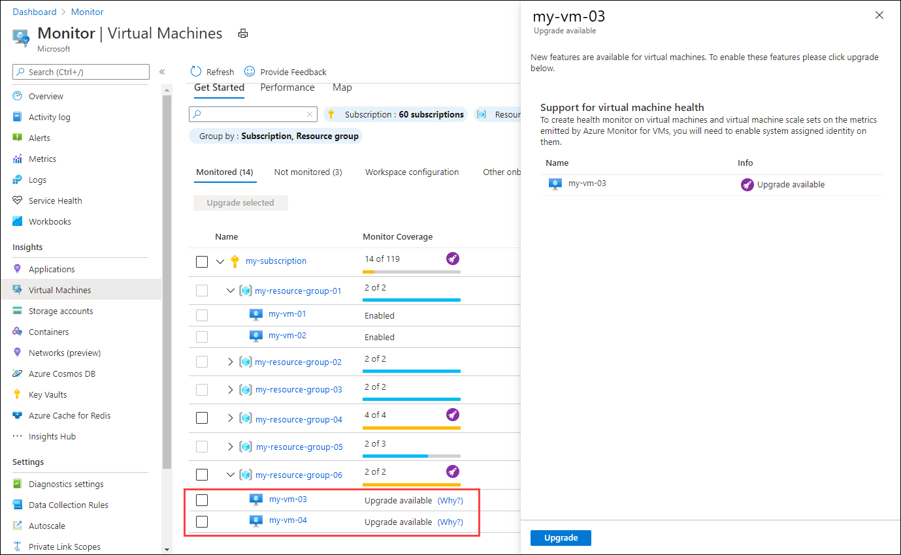

# Enable VM insights guest health (preview)
VM insights guest health allows you to view the health of a virtual machine as defined by a set of performance measurements that are sampled at regular intervals. This article describes how to enable this feature in your subscription and how to enable guest monitoring for each virtual machine.

[!INCLUDE [guest-health-deprecate](../../../includes/azure-monitor-guest-health-deprecation.md)]


## Current limitations
VM insights guest health has the following limitations in public preview:

- Only Azure virtual machines are currently supported. Azure Arc for servers is not currently supported.
- Network proxies aren't currently supported.


## Supported operating systems
Virtual Machine must run one of the following operating systems: 

  - CentOS 7.5, 7.6, 7.7, 7.8, 7.9
  - RedHat 7.5, 7.6, 7.7, 7.8, 7.9
  - Ubuntu 16.04 LTS, Ubuntu 18.04 LTS
  - Windows Server 2012 or later

## Supported regions

Virtual machine must be located in one of the following regions:

- Australia Central
- Australia East
- Australia Southeast
- Brazil South
- Canada Central
- Central India
- Central US
- East Asia
- East US
- East US 2
- East US 2 EUAP
- France Central
- Germany West Central
- Japan East
- Japan West
- Korea Central
- North Central US
- North Europe
- Norway East
- South Central US
- South Africa North
- Southeast Asia
- Switzerland North
- UAE North
- UK South
- UK West
- West Central US
- West Europe
- West US
- West US 2


Log Analytics workspace must be located in one of the following regions:

- Australia Central
- Australia East
- Australia Southeast
- Brazil South
- Brazil Southeast
- Canada Central
- Canada India
- Central US
- East Asia
- East US
- East US 2
- East US 2 EUAP
- France Central
- Japan East
- Japan West
- North Central US
- North Europe
- Norway East
- South Central US
- Southeast Asia
- Switzerland North
- Switzerland West
- UAE North
- UK South
- UK West
- West Europe region
- West US
- West US 2

## Prerequisites

- Virtual machine must be onboarded to VM insights.
- User executing onboarding steps must have a minimum Contributor level access to the subscription where virtual machine and data collection rule are located.
- Required Azure resource providers must be registered as described in the following section.

## Register required Azure resource providers
The following Azure resource providers  be registered for your subscription to enable VM insights guest health. 

- Microsoft.WorkloadMonitor
- Microsoft.Insights

You can use any of the available methods to register a resource provider as described in [Azure resource providers and types](../../azure-resource-manager/management/resource-providers-and-types.md). You can also use the following sample command using armclient, postman, or another method to make authenticated call to Azure Resource Manager:

```
POST https://management.azure.com/subscriptions/[subscriptionId]/providers/Microsoft.WorkloadMonitor/register?api-version=2019-10-01
POST https://management.azure.com/subscriptions/[subscriptionId]/providers/Microsoft.Insights/register?api-version=2019-10-01
```


## Enable a virtual machine using the Azure portal
When you enable guest health for a virtual machine in the Azure portal, all required configuration is performed for you. This includes creating the require data collection rule, installing the guest health extension on the virtual machine, and creating an association with the data collection rule.

From the **Get Started** view in VM insights, click the link next to the upgrade message for a virtual machine, and then click the **Upgrade** button. You can also select multiple virtual machines to upgrade them together.




## Enable a virtual machine using Resource Manager template
There are three steps required to enable virtual machines using Azure Resource Manager.

- Create data collection rule.
- Install the guest health extension on each virtual machine
- Create an association between the virtual machine and the data collection rule.

### Create data collection rule (DCR)

> [!NOTE]
> If you enable a virtual machine using the Azure portal, then the data collection rule described here is created for you. In this case, you do not need to perform this step.

Configuration for the monitors in VM insights guest health is stored in [data Collection Rules (DCR)](../essentials/data-collection-rule-overview.md). Each virtual machine with the guest health extension will need an association with this rule.

> [!NOTE]
> You can create additional data collection rules to modify the default configuration of monitors as described in [Configure monitoring in VM insights guest health (preview)](vminsights-health-configure.md).

The template requires values for the following parameters:

- **defaultHealthDataCollectionRuleName**: Keep the default name defined in the template.
- **destinationWorkspaceResourceId**: Resource ID of the Log Analytics workspace used for virtual machine data collection.
- **dataCollectionRuleLocation**: Region of the data collection rule. This must match the region of Log Analytics workspace.


Deploy the template using any [deployment method for Resource Manager templates](../../azure-resource-manager/templates/deploy-powershell.md). The following commands deploy the template and parameters file using PowerShell or Azure CLI.

# [PowerShell](#tab/powershell)

```powershell
New-AzResourceGroupDeployment -Name GuestHealthDataCollectionRule -ResourceGroupName my-resource-group -TemplateFile Health.DataCollectionRule.template.json -TemplateParameterFile Health.DataCollectionRule.template.parameters.json
```

# [Azure CLI](#tab/azure-cli)

```azurecli
az deployment group create --name GuestHealthDataCollectionRule --resource-group my-resource-group --template-file Health.DataCollectionRule.template.json --parameters Health.DataCollectionRule.template.parameters.json
```

---

The data collection rule defined in the Resource Manager template below enables all monitors for the virtual machines with the guest health extension. It must include data sources for each of the performance counters used by the monitors.

```json
{
  "$schema": "http://schema.management.azure.com/schemas/2015-01-01/deploymentTemplate.json#",
  "contentVersion": "1.0.0.0",
  "parameters": {
    "defaultHealthDataCollectionRuleName": {
      "type": "string",
      "metadata": {
        "description": "Specifies the name of the data collection rule to create."
      },
      "defaultValue": "Microsoft-VMInsights-Health"
    },
    "destinationWorkspaceResourceId": {
      "type": "string",
      "metadata": {
        "description": "Specifies the Azure resource ID of the Log Analytics workspace to use to store virtual machine health data."
      }
    },
    "dataCollectionRuleLocation": {
      "type": "string",
      "metadata": {
        "description": "The location code in which the data collection rule should be deployed. Examples: eastus, westeurope, etc"
      }
    }
  },
  "resources": [
    {
      "type": "Microsoft.Insights/dataCollectionRules",
      "name": "[parameters('defaultHealthDataCollectionRuleName')]",
      "location": "[parameters('dataCollectionRuleLocation')]",
      "apiVersion": "2019-11-01-preview",
      "properties": {
        "description": "Data collection rule for VM Insights health.",
        "dataSources": {
          "performanceCounters": [
              {
                  "name": "VMHealthPerfCounters",
                  "streams": [ "Microsoft-Perf" ],
                  "scheduledTransferPeriod": "PT1M",
                  "samplingFrequencyInSeconds": 60,
                  "counterSpecifiers": [
                      "\\LogicalDisk(*)\\% Free Space",
                      "\\Memory\\Available Bytes",
                      "\\Processor(_Total)\\% Processor Time"
                  ]
              }
          ],
          "extensions": [
            {
              "name": "Microsoft-VMInsights-Health",
              "streams": [
                "Microsoft-HealthStateChange"
              ],
              "extensionName": "HealthExtension",
              "extensionSettings": {
                "schemaVersion": "1.0",
                "contentVersion": "",
                "healthRuleOverrides": [
                  {
                    "scopes": [ "*" ],
                    "monitors": ["root"],
                    "alertConfiguration": {
                      "isEnabled": true
                    }
                  }
                ]
              },
              "inputDataSources": [
                  "VMHealthPerfCounters"
              ]

            }
          ]
        },
        "destinations": {
          "logAnalytics": [
            {
              "workspaceResourceId": "[parameters('destinationWorkspaceResourceId')]",
              "name": "Microsoft-HealthStateChange-Dest"
            }
          ]
        },					
        "dataFlows": [
          {
            "streams": [
              "Microsoft-HealthStateChange"
            ],
            "destinations": [
              "Microsoft-HealthStateChange-Dest"
            ]
          }
        ]
      }
    }
  ]
}
```

### Sample parameter file

```json
{
  "$schema": "https://schema.management.azure.com/schemas/2015-01-01/deploymentParameters.json#",
  "contentVersion": "1.0.0.0",
  "parameters": {
      "destinationWorkspaceResourceId": {
        "value": "/subscriptions/xxxxxxxx-xxxx-xxxx-xxxx-xxxxxxxxxxxx/resourcegroups/my-resource-group/providers/microsoft.operationalinsights/workspaces/my-workspace"
      },
      "dataCollectionRuleLocation": {
        "value": "eastus"
      }
  }
}
```


### Install guest health extension and associate with data collection rule
Use the following Resource Manager template to enable a virtual machine for guest health. This installs the guest health extension and creates the association with the data collection rule. You can deploy this template using any [deployment method for Resource Manager templates](../../azure-resource-manager/templates/deploy-powershell.md).


For example, use the following commands to deploy the template and parameters file to a resource group using PowerShell or Azure CLI.


# [PowerShell](#tab/powershell)

```powershell
New-AzResourceGroupDeployment -Name GuestHealthDeployment -ResourceGroupName my-resource-group -TemplateFile azure-monitor-deploy.json -TemplateParameterFile azure-monitor-deploy.parameters.json
```

# [Azure CLI](#tab/azure-cli)

```azurecli
az deployment group create --name GuestHealthDeployment --resource-group my-resource-group --template-file Health.VirtualMachine.template.json --parameters Health.VirtualMachine.template.parameters.json
```

---

### Template file

``` json
{
  "$schema": "http://schema.management.azure.com/schemas/2015-01-01/deploymentTemplate.json#",
  "contentVersion": "1.0.0.0",
  "parameters": {
    "virtualMachineName": {
      "type": "string",
      "metadata": {
        "description": "Specifies the name of the virtual machine."
      }
    },
    "virtualMachineLocation": {
      "type": "string",
      "metadata": {
        "description": "The location code of the virtual machine region (location). Examples: eastus, westeurope, etc"
      }
    },
    "virtualMachineOsType": {
      "type": "string",
      "metadata": {
        "description": "Specifies operating system type of the target virtual machine."
      },
      "allowedValues": ["windows", "linux"]
    },
    "dataCollectionRuleAssociationName": {
      "type": "string",
      "metadata": {
        "description": "Specifies the name of the data collection rule association to create."
      },
      "defaultValue": "VM-Health-Dcr-Association"
    },
    "healthDataCollectionRuleResourceId": {
      "type": "string",
      "metadata": {
        "description": "Specifies resource id of Azure Monitor Data Collection Rule for virtual machine health data."
      }
    }
  },
  "variables": {
    "healthExtensionProperties": {
      "windows": {
        "publisher": "Microsoft.Azure.Monitor.VirtualMachines.GuestHealth",
        "type": "GuestHealthWindowsAgent",
        "typeHandlerVersion": "1.0",
        "autoUpgradeMinorVersion": true
      },
      "linux": {
        "publisher": "Microsoft.Azure.Monitor.VirtualMachines.GuestHealth",
        "type": "GuestHealthLinuxAgent",
        "typeHandlerVersion": "1.0",
        "autoUpgradeMinorVersion": true
      }
    },
    "azureMonitorAgentExtensionProperties": {
      "windows": {
        "publisher": "Microsoft.Azure.Monitor", 
        "type": "AzureMonitorWindowsAgent", 
        "typeHandlerVersion": "1.0", 
        "autoUpgradeMinorVersion": true 
      },
      "linux": {
        "publisher": "Microsoft.Azure.Monitor", 
        "type": "AzureMonitorLinuxAgent", 
        "typeHandlerVersion": "1.0", 
        "autoUpgradeMinorVersion": true 
      }
    }
  },
  "resources": [
    {
      "type": "Microsoft.Compute/virtualMachines",
      "name": "[parameters('virtualMachineName')]",
      "location": "[parameters('virtualMachineLocation')]",
      "apiVersion": "2017-03-30",
      "identity": {
        "type": "SystemAssigned"
      }
    },
    {
      "type": "Microsoft.Compute/virtualMachines/providers/dataCollectionRuleAssociations",
      "name": "[concat(parameters('virtualMachineName'), '/Microsoft.Insights/', parameters('dataCollectionRuleAssociationName'))]",
      "apiVersion": "2019-11-01-preview",
      "properties": {
        "description": "Association of data collection rule for VM Insights Health.",
        "dataCollectionRuleId": "[parameters('healthDataCollectionRuleResourceId')]"
      }
    },
    { 
      "type": "Microsoft.Compute/virtualMachines/extensions", 
      "apiVersion": "2019-12-01", 
      "name": "[concat(parameters('virtualMachineName'), '/', variables('azureMonitorAgentExtensionProperties')[parameters('virtualMachineOsType')].type)]",
      "location": "[parameters('virtualMachineLocation')]",
      "dependsOn": [
        "[resourceId('Microsoft.Compute/virtualMachines/providers/dataCollectionRuleAssociations', parameters('virtualMachineName'), 'Microsoft.Insights', parameters('dataCollectionRuleAssociationName'))]"
      ], 
      "properties": "[variables('azureMonitorAgentExtensionProperties')[parameters('virtualMachineOsType')]]"
    },
    {
      "type": "Microsoft.Compute/virtualMachines/extensions",
      "name": "[concat(parameters('virtualMachineName'), '/', variables('healthExtensionProperties')[parameters('virtualMachineOsType')].type)]",
      "location": "[parameters('virtualMachineLocation')]",
      "apiVersion": "2018-06-01",
      "dependsOn": [ 
        "[resourceId('Microsoft.Compute/virtualMachines/extensions', parameters('virtualMachineName'), variables('azureMonitorAgentExtensionProperties')[parameters('virtualMachineOsType')].type)]",
        "[resourceId('Microsoft.Compute/virtualMachines/providers/dataCollectionRuleAssociations', parameters('virtualMachineName'), 'Microsoft.Insights', parameters('dataCollectionRuleAssociationName'))]"
      ], 	
      "properties": "[variables('healthExtensionProperties')[parameters('virtualMachineOsType')]]"
    }				
  ]
}
```

### Sample parameter file

```json
{
  "$schema": "https://schema.management.azure.com/schemas/2015-01-01/deploymentParameters.json#",
  "contentVersion": "1.0.0.0",
  "parameters": {
      "virtualMachineName": {
        "value": "myvm"
      },
      "virtualMachineLocation": {
        "value": "eastus"
      },
      "virtualMachineOsType": {
        "value": "linux"
      },
      "healthDataCollectionRuleResourceId": {
        "value": "/subscriptions/00000000-0000-0000-0000-000000000000/resourceGroups/my-resource-group/providers/Microsoft.Insights/dataCollectionRules/Microsoft-VMInsights-Health"
      }
  }
}
```

## Next steps

- [Customize monitors enabled by VM insights](vminsights-health-configure.md)
