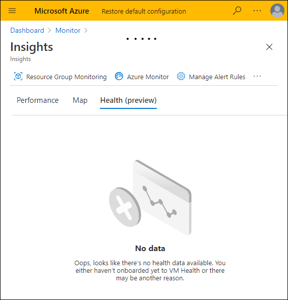
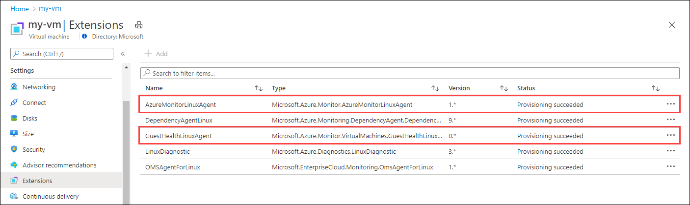

# Troubleshoot VM insights guest health (preview)
This article describes troubleshooting steps that you can take when you have issues with VM insights health.

## Installation errors
If any of the following solutions do not solve your installation issue, collect VM Health agent log located at `/var/log/azure/Microsoft.Azure.Monitor.VirtualMachines.GuestHealthLinuxAgent/*.log` and contact Microsoft for further investigation.

### Error message showing db5 error
Your installation didn’t succeed and your installation error message is similar to the following:

```
script execution exit with error: error: db5 error(5) from dbenv->open: Input/output error
error: cannot open Packages index using db5 - Input/output error (5)
error: cannot open Packages database in /var/lib/rpm
error: db5 error(5) from dbenv->open: Input/output error
error: cannot open Packages database in /var/lib/rpm
```
This is because your package manager rpm database is corrupted, try following the guidance at [RPM Database Recovery](https://rpm.org/user_doc/db_recovery.html) to recover. Once your rpm database is recovered, try to install again.

### Init file already exist error
Your installation didn’t succeed and your installation error message is similar to the following:

```
Exiting with the following error: "Failed to install VM Guest Health Agent: Init already exists: /etc/systemd/system/vmGuestHealthAgent.service"install vmGuestHealthAgent service execution failed with exit code 37
```

VM Health Agent will uninstall the existing service first before installing the current version. The reason for this error is likely because the previous service file didn’t get cleaned up due to some reason. Login to the VM and run the following command backup existing service file and try re-install again.

```
sudo mv /etc/systemd/system/vmGuestHealthAgent.service  /etc/systemd/system/vmGuestHealthAgent.service.bak
```

If the installation succeeded, run the following command to remove backup file.

```
sudo rm /etc/systemd/system/vmGuestHealthAgent.service.bak
```

### Installation Failed to Exit Code 37
Your installation didn’t succeed and your installation error message is similar to the following: 

```
Exiting with the following error: "Failed to install VM Guest Health Agent: exit status 1"install vmGuestHealthAgent service execution failed with exit code 37
```
This is likely because VM Guest Agent couldn’t acquire the lock for the service file. Try to reboot your VM which will release the lock.


## Upgrade errors

### Upgrade available message is still displayed after upgrading guest health 

- Verify that VM is running in global Azure. Azure Arc–enabled servers are not yet supported.
- Verify that the virtual machine's region and operating system version are supported as described in [Enable Azure Monitor for VMs guest health (preview)](vminsights-health-enable.md).
- Verify that guest health extension installed successfully with 0 exit code.
- Verify that Azure Monitor agent extension is installed successfully.
- Verify that system-assigned managed identity is enabled for the virtual machine.
- Verify that no user-assigned managed identities are specified for the virtual machine.
- Verify for Windows virtual machines that locale is *US English*. Localization is not currently supported by Azure Monitor agent.
- Verify that the virtual machine is not using the network proxy. Azure Monitor agent does not currently support proxies.
- Verify that the health extension agent started without errors. If the agent can't start, the agent's state may be corrupt. Delete the contents of the agent state folder and restart the agent.
  - For Linux: Daemon is *vmGuestHealthAgent*. State folder is */var/opt/vmGuestHealthAgent/**
  - For Windows: Service is *VM Guest Health agent*. State folder is _%ProgramData%\Microsoft\VMGuestHealthAgent\\*_.
- Verify the Azure Monitor agent has network connectivity. 
  - From the virtual machine, attempt to ping _<region>.handler.control.monitor.azure.com_. For example, for a virtual machine in westeurope, attempt to ping _westeurope.handler.control.monitor.azure.com:443_.
- Verify that virtual machine has an association with a data collection rule in the same region as the Log Analytics workspace.
  -  Refer to **Create data collection rule (DCR)** in [Enable Azure Monitor for VMs guest health (preview)](vminsights-health-enable.md) to ensure structure of the DCR is correct. Pay particular attention to presence of *performanceCounters* data source section set up to samples three counters and presence of *inputDataSources* section in health extension configuration to send counters to the extension.
-  Check the virtual machine for guest health extension errors.
   -  For Linux: Check logs at _/var/log/azure/Microsoft.Azure.Monitor.VirtualMachines.GuestHealthLinuxAgent/*.log_.
   -  For Windows: Check logs at _C:\WindowsAzure\Logs\Plugins\Microsoft.Azure.Monitor.VirtualMachines.GuestHealthWindowsAgent\{extension version}\*.log_.
-  Check the virtual machine for Azure Monitor agent errors.
   -  For Linux: Check logs at _/var/log/mdsd.*_.
   -  For Windows: Check logs at _C:\WindowsAzure\Resources\*{vmName}.AMADataStore_.
 

## Usage errors

### Error message that no data is available 




#### Verify that the virtual machine meets configuration requirements

1. Verify that the virtual machine is an Azure virtual machine. Azure Arc for servers is not currently supported.
2. Verify that the virtual machine is running a [supported operating system](vminsights-health-enable.md?current-limitations.md).
3. Verify that the virtual machine is installed in a [supported region](vminsights-health-enable.md?current-limitations.md).
4. Verify that the Log Analytics workspace is installed in a [supported region](vminsights-health-enable.md?current-limitations.md).

#### Verify that the VM is properly onboarded
Verify that the Azure Monitor agent extension and Guest VM Health agent are successfully provisioned on the virtual machine. Select **Extensions** from the virtual machine's menu in the Azure portal and make sure that the two agents are listed.



#### Verify the system assigned identity is enabled on the virtual machine
Verify that the system assigned identity is enabled on the virtual machine. Select **Identity** from the virtual machine's menu in the Azure portal. If user managed identity is enabled, regardless of the status of the system managed identity, Azure Monitor agent will not be able to communicate with the configuration service, and the guest health extension will not work.


#### Verify data collection rule
Verify that the data collection rule specifying health extension as a data source is associated with the virtual machine.

### Error message for bad request due to insufficient permissions
This error indicates that the **Microsoft.WorkloadMonitor** resource provider wasn’t registered in the subscription. See [Azure resource providers and types](../../azure-resource-manager/management/resource-providers-and-types.md#register-resource-provider) for details on registering this resource provider. 


### Health shows as "unknown" after guest health is enabled.

#### Verify that performance counters on Windows nodes are working correctly 
Guest health relies on the agent being able to collect performance counters from the node. he base set of performance counter libraries may become corrupted and may need to be rebuilt. Follow the instructions at [Manually rebuild performance counter library values](/troubleshoot/windows-server/performance/rebuild-performance-counter-library-values) to rebuild the performance counters.


## Next steps

- [Get an overview of the guest health feature of VM insights](vminsights-health-overview.md)
