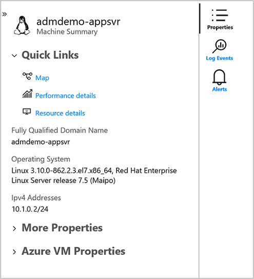

# Chart performance with VM insights

VM insights includes a set of performance charts that target several key [performance indicators](vminsights-log-query.md#performance-records) to help you determine how well a virtual machine is performing. The charts show resource utilization over a period of time. You can use them to identify bottlenecks and anomalies. You can also switch to a perspective that lists each machine to view resource utilization based on the metric selected.

VM insights monitors key operating system performance indicators related to processor, memory, network adapter, and disk utilization. Performance complements the health monitoring feature and helps to:

- Expose issues that indicate a possible system component failure.
- Support tuning and optimization to achieve efficiency.
- Support capacity planning.

## Limitations
Limitations in performance collection with VM insights:

- Available memory isn't available in all Linux versions, including Red Hat Linux (RHEL) 6 and CentOS 6. It will be available in Linux versions that use [kernel version 3.14](http://www.man7.org/linux/man-pages/man1/free.1.html) or higher. It might be available in some kernel versions between 3.0 and 3.14.
- Metrics are only available for data disks on Linux virtual machines that use XFS filesystem or EXT filesystem family (EXT2, EXT3, EXT4).

## Multi-VM perspective from Azure Monitor

From Azure Monitor, the Performance feature provides a view of all monitored VMs deployed across work groups in your subscriptions or in your environment.

To access from Azure Monitor:

1. In the Azure portal, select **Monitor**.
1. In the **Solutions** section, select **Virtual Machines**.
1. Select the **Performance** tab.

On the **Top N Charts** tab, if you have more than one Log Analytics workspace, select the workspace enabled with the solution from the **Workspace** selector at the top of the page. The **Group** selector returns subscriptions, resource groups, [computer groups](../logs/computer-groups.md), and virtual machine scale sets of computers related to the selected workspace that you can use to further filter results presented in the charts on this page and across the other pages. Your selection only applies to the Performance feature and doesn't carry over to Health or Map.

By default, the charts show the last 24 hours. By using the **TimeRange** selector, you can query for historical time ranges of up to 30 days to show how performance looked in the past.

Five capacity utilization charts are shown on the page:

* **CPU Utilization %**: Shows the top five machines with the highest average processor utilization.
* **Available Memory**: Shows the top five machines with the lowest average amount of available memory.
* **Logical Disk Space Used %**: Shows the top five machines with the highest average disk space used percent across all disk volumes.
* **Bytes Sent Rate**: Shows the top five machines with the highest average of bytes sent.
* **Bytes Receive Rate**: Shows the top five machines with the highest average of bytes received.

Selecting the pushpin icon in the upper-right corner of a chart pins it to the last Azure dashboard you viewed. From the dashboard, you can resize and reposition the chart. Selecting the chart from the dashboard redirects you to VM insights and loads the correct scope and view.

Select the icon to the left of the pushpin icon on a chart to open the **Top N List** view. This list view shows the resource utilization for a performance metric by individual VM. It also shows which machine is trending the highest.

When you select the virtual machine, the **Properties** pane opens on the right side. It shows properties like system information reported by the operating system and the properties of the Azure VM. Selecting an option under the **Quick Links** section redirects you to that feature directly from the selected VM.

You can switch to the **Aggregated Charts** tab to view the performance metrics filtered by average or percentiles measured.

The following capacity utilization charts are provided:

* **CPU Utilization %**: Defaults show the average and top 95th percentile.
* **Available Memory**: Defaults show the average, top 5th, and 10th percentile.
* **Logical Disk Space Used %**: Defaults show the average and 95th percentile.
* **Bytes Sent Rate**: Defaults show the average bytes sent.
* **Bytes Receive Rate**: Defaults show the average bytes received.

You can also change the granularity of the charts within the time range by selecting **Avg**, **Min**, **Max**, **50th**, **90th**, and **95th** in the percentile selector.

To view the resource utilization by individual VM and see which machine is trending with highest utilization, select the **Top N List** tab. The **Top N List** page shows the top 20 machines sorted by the most utilized by 95th percentile for the metric *CPU Utilization %*. To see more machines, select **Load More**. The results expand to show the top 500 machines.

>[!NOTE]
>The list can't show more than 500 machines at a time.  
>

To filter the results on a specific virtual machine in the list, enter its computer name in the **Search by name** text box.

If you want to view utilization from a different performance metric, from the **Metric** dropdown list, select **Available Memory**, **Logical Disk Space Used %**, **Network Received Byte/s**, or **Network Sent Byte/s**. The list updates to show utilization scoped to that metric.

Selecting a virtual machine from the list opens the **Properties** pane on the right side of the page. From here, you can select **Performance detail**. The **Virtual Machine Detail** page opens and is scoped to that VM. The experience is similar to accessing VM Insights Performance directly from the Azure VM.

## View performance directly from an Azure VM

To access directly from a virtual machine:

1. In the Azure portal, select **Virtual Machines**.
1. From the list, select a VM. In the **Monitoring** section, select **Insights**.
1. Select the **Performance** tab.

This page shows performance utilization charts. It also shows a table for each logical disk discovered with its capacity, utilization, and total average by each measure.

The following capacity utilization charts are provided:

* **CPU Utilization %**: Defaults show the average and top 95th percentile.
* **Available Memory**: Defaults show the average, top 5th, and 10th percentile.
* **Logical Disk Space Used %**: Defaults show the average and 95th percentile.
* **Logical Disk IOPS**: Defaults show the average and 95th percentile.
* **Logical Disk MB/s**: Defaults show the average and 95th percentile.
* **Max Logical Disk Used %**: Defaults show the average and 95th percentile.
* **Bytes Sent Rate**: Defaults show the average bytes sent.
* **Bytes Receive Rate**: Defaults show the average bytes received.

Selecting the pushpin icon in the upper-right corner of a chart pins it to the last Azure dashboard you viewed. From the dashboard, you can resize and reposition the chart. Selecting the chart from the dashboard redirects you to VM insights and loads the performance detail view for the VM.

## View performance directly from an Azure virtual machine scale set

To access directly from an Azure virtual machine scale set:

1. In the Azure portal, select **Virtual machine scale sets**.
1. From the list, select a VM.
1. In the **Monitoring** section, select **Insights** to view the **Performance** tab.

This page loads the Azure Monitor performance view scoped to the selected scale set. This view enables you to see the Top N instances in the scale set across the set of monitored metrics. You can also view the aggregate performance across the scale set. And you can see the trends for selected metrics across the individual instances in the scale set. Selecting an instance from the list view lets you load its map or move into a detailed performance view for that instance.

Selecting the pushpin icon in the upper-right corner of a chart pins it to the last Azure dashboard you viewed. From the dashboard, you can resize and reposition the chart. Selecting the chart from the dashboard redirects you to VM insights and loads the performance detail view for the VM.

>[!NOTE]
>You can also access a detailed performance view for a specific instance from the **Instances** view for your scale set. Under the **Settings** section, go to **Instances** and select **Insights**.

## Next steps

- Learn how to use [workbooks](vminsights-workbooks.md) that are included with VM insights to further analyze performance and network metrics.
- To learn about discovered application dependencies, see [View VM insights Map](vminsights-maps.md).

