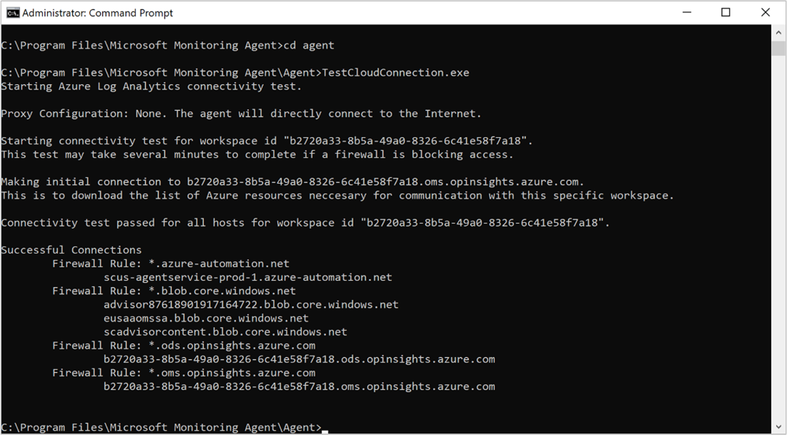

# Troubleshoot VM insights
This article provides troubleshooting information for when you have problems enabling or using VM insights.

## Cannot enable VM Insights on a machine
When onboarding an Azure virtual machine from the Azure portal, the following steps occur:

- A default Log Analytics workspace is created if that option was selected.
- The Log Analytics agent is installed on Azure virtual machines using a VM extension if the agent is already installed.
- The Dependency agent is installed on Azure virtual machines using an extension, if determined it is required.
  
During the onboarding process, each of these steps is verified and a notification status shown in the portal. Configuration of the workspace and the agent installation typically takes 5 to 10 minutes. It will take another 5 to 10 minutes for data to become available to view in the portal.

If you receive a message that the virtual machine needs to be onboarded after you've performed the onboarding process, allow for up to 30 minutes for the process to be completed. If the issue persists, then see the following sections for possible causes.

### Is the virtual machine running?
 If the virtual machine has been turned off for a while, is off currently, or was only recently turned on then you won't have data to display for a bit until data arrives.

### Is the operating system supported?
If the operating system is not in the list of [supported operating systems](vminsights-enable-overview.md#supported-operating-systems) then the extension will fail to install and you will see this message that we are waiting for data to arrive.

### Did the extension install properly?
If you still see a message  that the virtual machine needs to be onboarded, it may mean that one or both of the extensions failed to install correctly. Check the **Extensions** page for your virtual machine in the Azure portal to verify that the following extensions are listed.

| Operating system | Agents | 
|:---|:---|
| Windows | MicrosoftMonitoringAgent<br>Microsoft.Azure.Monitoring.DependencyAgent |
| Linux | OMSAgentForLinux<br>DependencyAgentLinux |

If you do not see the both extensions for your operating system in the list of installed extensions, then they need to be installed. If the extensions are listed but their status does not appear as *Provisioning succeeded*, then the extension should be removed and reinstalled.

### Do you have connectivity issues?
For Windows machines, you can use the  *TestCloudConnectivity* tool to identify connectivity issue. This tool is installed by default with the agent in the folder *%SystemDrive%\Program Files\Microsoft Monitoring Agent\Agent*. Run the tool from an elevated command prompt. It will return results and highlight where the test fails. 



### More agent troubleshooting

See the following articles for troubleshooting issues with the Log Analytics agent:

- [How to troubleshoot issues with the Log Analytics agent for Windows](../agents/agent-windows-troubleshoot.md)
- [How to troubleshoot issues with the Log Analytics agent for Linux](../agents/agent-linux-troubleshoot.md)

## Performance view has no data
If the agents appear to be installed correctly but you don't see any data in the Performance view, then see the following sections for possible causes.

### Has your Log Analytics workspace reached its data limit?
Check the [capacity reservations and the pricing for data ingestion](https://azure.microsoft.com/pricing/details/monitor/).

### Is your virtual machine agent connected to Azure Monitor Logs?

Open Log Analytics from **Logs** in the Azure Monitor menu in the Azure portal. Run the following query for your computer:

```kuso
Heartbeat
| where Computer == "my-computer"
| sort by TimeGenerated desc 
```

If you don't see any data or if the computer hasn't sent a heartbeat recently, then you may have problems with your agent. See the section above for agent troubleshooting information.

## Virtual machine doesn't appear in map view

### Is the Dependency agent installed?
 Use the information in the sections above to determine if the Dependency agent is installed and working properly.

### Are you on the Log Analytics free tier?
The [Log Analytics free tier](https://azure.microsoft.com/pricing/details/monitor/) This is a legacy pricing plan that allows for up to five unique Service Map machines. Any subsequent machines won't appear in Service Map, even if the prior five are no longer sending data.

### Is your virtual machine sending log and performance data to Azure Monitor Logs?
Use the log query in the [Performance view has no data](#performance-view-has-no-data) section to determine if data is being collected for the virtual machine. If not data is being collected, use the TestCloudConnectivity tool described above to determine if you have connectivity issues.


## Virtual machine appears in map view but has missing data
If the virtual machine is in the map view, then the Dependency agent is installed and running, but the kernel driver didn't load. Check the log file at the following locations:

| Operating system | Log | 
|:---|:---|
| Windows | C:\Program Files\Microsoft Dependency Agent\logs\wrapper.log |
| Linux | /var/opt/microsoft/dependency-agent/log/service.log |

The last lines of the file should indicate why the kernel didn't load. For example, the kernel might not be supported on Linux if you updated your kernel.
## Next steps

- For details on onboarding VM insights agents, see [Enable VM insights overview](vminsights-enable-overview.md).
