# Troubleshoot VM insights
This article provides troubleshooting information to help you with problems you might have experienced when you tried to enable or use VM insights.

## Can't enable VM insights on a machine
When you onboard an Azure virtual machine from the Azure portal, the following steps occur:

- A default Log Analytics workspace is created if that option was selected.
- Azure Monitor Agent is installed on Azure virtual machines by using a VM extension if the agent is already installed.
- The Dependency agent is installed on Azure virtual machines by using an extension if it's required.

During the onboarding process, each of these steps is verified and a notification status appears in the portal. Configuration of the workspace and the agent installation typically takes 5 to 10 minutes. It takes another 5 to 10 minutes for data to become available to view in the portal.

If you receive a message that the virtual machine needs to be onboarded after you've performed the onboarding process, allow for up to 30 minutes for the process to finish. If the issue persists, see the following sections for possible causes.

### Is the virtual machine running?
 If the virtual machine has been turned off for a while, is off currently, or was only recently turned on, you won't have data to display until data arrives.

### Is the operating system supported?
If the operating system isn't in the list of [supported operating systems](vminsights-enable-overview.md#supported-operating-systems), the extension fails to install and you see a message that we're waiting for data to arrive.

> [!IMPORTANT]
> Post April 11, 2022, if you aren't seeing your virtual machine in the VM insights solution, you might be running an older version of the Dependency agent. For more information, see the blog post [Potential breaking changes for VM insights Linux customers](https://techcommunity.microsoft.com/t5/azure-monitor-status/potential-breaking-changes-for-vm-insights-linux-customers/ba-p/3271989). Not applicable for Windows machines and before April 11, 2022.

### Did the extension install properly?
If you still see a message that the virtual machine needs to be onboarded, it might mean that one or both of the extensions failed to install correctly. Check the **Extensions** page for your virtual machine in the Azure portal to verify that the following extensions are listed.

| Operating system | Agents | 
|:---|:---|
| Windows | MicrosoftMonitoringAgent<br>Microsoft.Azure.Monitoring.DependencyAgent |
| Linux | OMSAgentForLinux<br>DependencyAgentLinux |

If you don't see both the extensions for your operating system in the list of installed extensions, they must be installed. If the extensions are listed but their status doesn't appear as *Provisioning succeeded*, remove the extensions and reinstall them.

### Do you have connectivity issues?
For Windows machines, you can use the TestCloudConnectivity tool to identify connectivity issue. This tool is installed by default with the agent in the folder *%SystemDrive%\Program Files\Microsoft Monitoring Agent\Agent*. Run the tool from an elevated command prompt. It returns results and highlights where the test fails.
<!-- convertborder later -->
:::image type="content" source="media/vminsights-troubleshoot/test-cloud-connectivity.png" lightbox="media/vminsights-troubleshoot/test-cloud-connectivity.png" alt-text="Screenshot that shows the TestCloudConnectivity tool." border="false":::

### More agent troubleshooting

See the following articles for troubleshooting issues with the Log Analytics agent:

- [Troubleshoot issues with the Log Analytics agent for Windows](../agents/agent-windows-troubleshoot.md)

- [Troubleshoot issues with the Log Analytics agent for Linux](../agents/agent-linux-troubleshoot.md)

## DCR created by VMInsight Process was modified and now data is missing

### Identifying the Issue

To identify if this is the case you would first browse to the Monitor Dashboard, locate the Data Collection Rule in Question and view the JSON properties using the link on the top right-hand side of the overview blade:
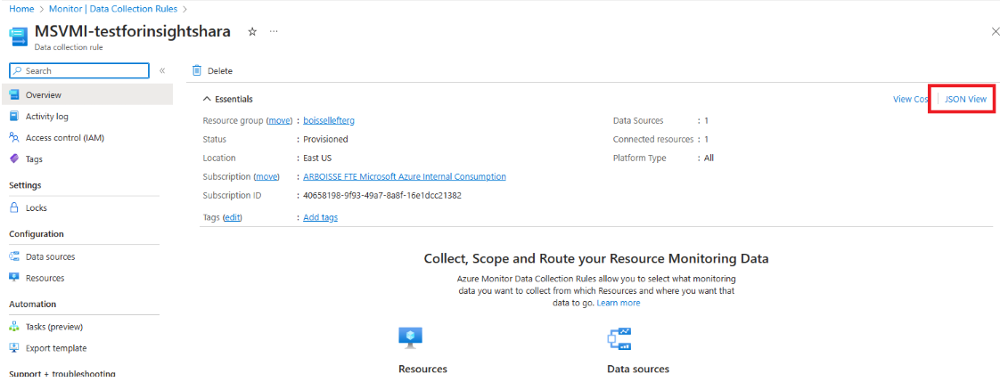

You will see that stream name has been changed from its original name to reflect the performance counter stream name:


We can see while the counter sections are pointing the perf table, the stream dataflow is still configured for the proper destination Microsof-InsightsMetrics.

### Resolving the Issue

This issue can't be resolved using the Monitor Dashboard directly, but we can fix this by exporting the template, normalizing the name and then import the modified rule over itself.

#### Export the DCR and save locally

1. To do this first we must export the DCR:
   
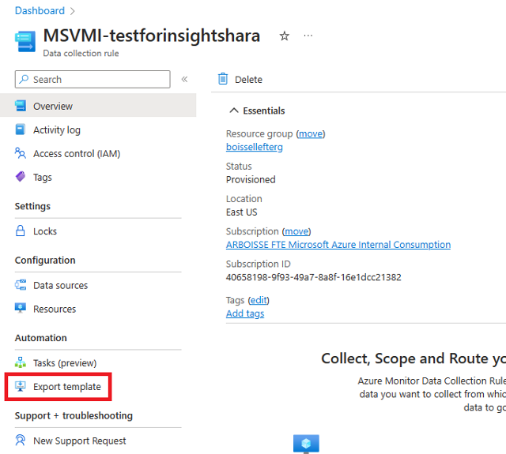

2. After selecting the Export Template blade for the selected DCR the portal will create the template file and a matching parameter file. Once this is complete, we can download the template package save and save it locally.

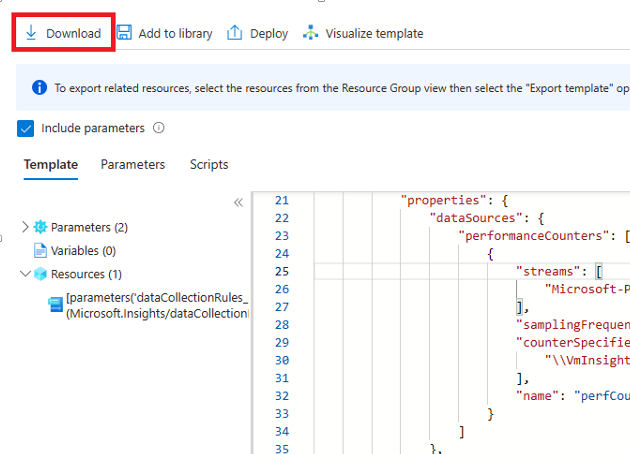

3. Open the file

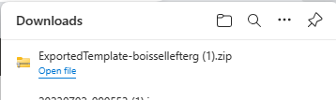

4. Copy these to a local folder:

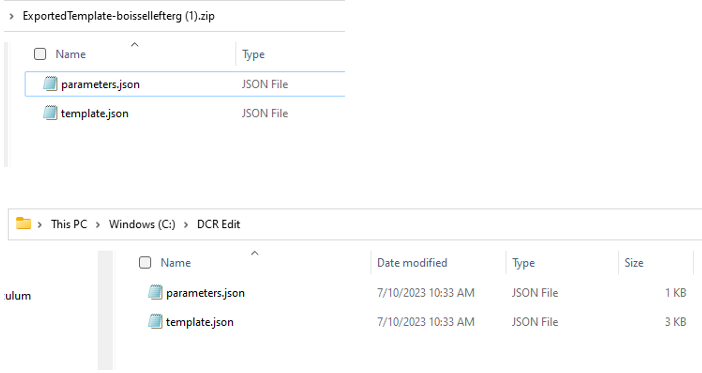

#### Modify the Template

1. Open the template file in the editor of your choice and locate the invalid stream name under the performance counter data source.
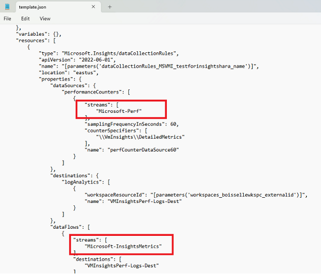

2. Using the valid stream name from the dataflow node fix the invalid reference, then save and close your file:
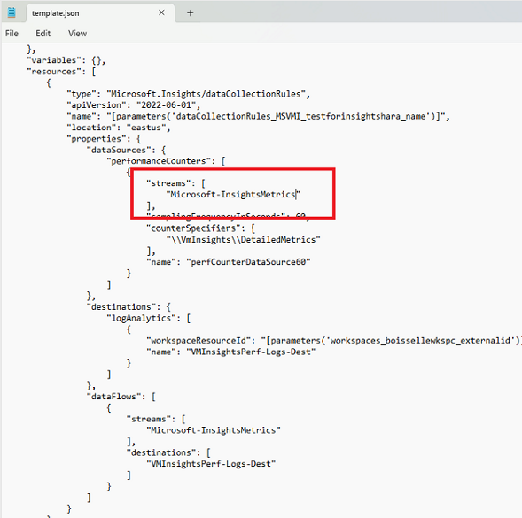

#### Import the Template using the Custom Deployment Feature

1. Back in the portal, search for and navigate to the custom template deployment:
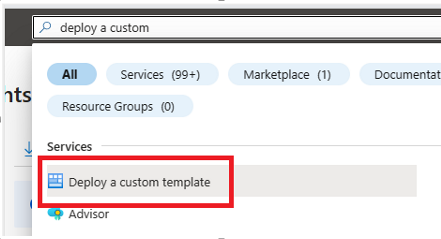

2. Choose the Option to "Build Your Own Template"
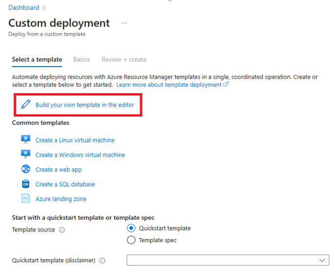

3. Using the "Load File" link browse to your saved template and parameter file:
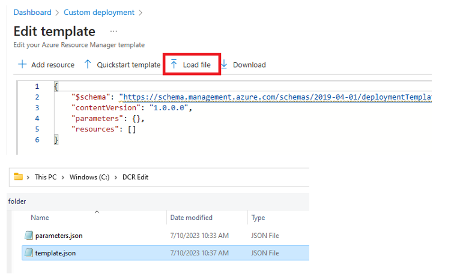

4. Visually inspect the template to validate the change is in place and select the Save button
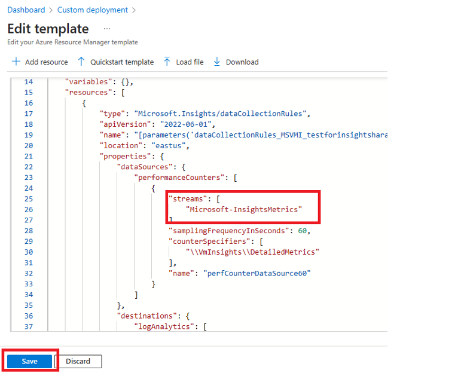

5. From here the portal will use the parameter file to fill in the deployment options (which can be changed) or left intact to overwrite the existing DCR, Once completed select the review and Create button.
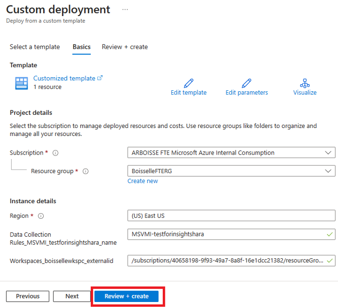

6. After validation then we can select the Create button to finalize the deployment.
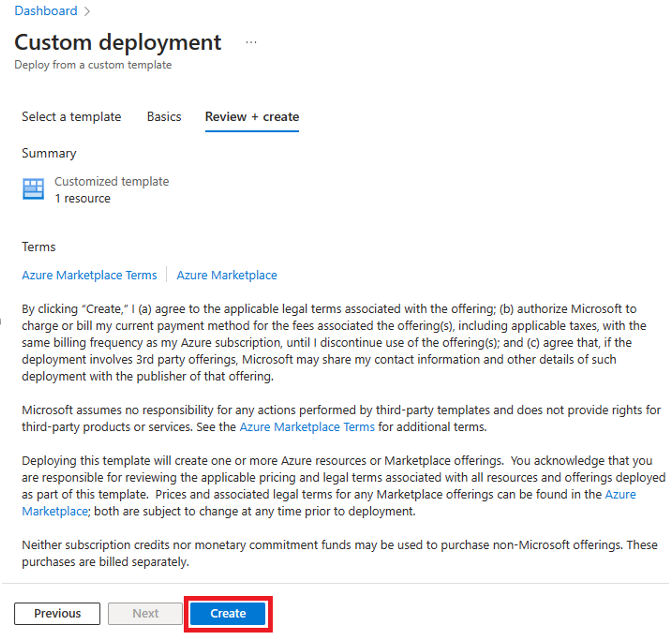

7. After the deployment is complete, we can browse to the DCR again and review the JSON in overview blade:
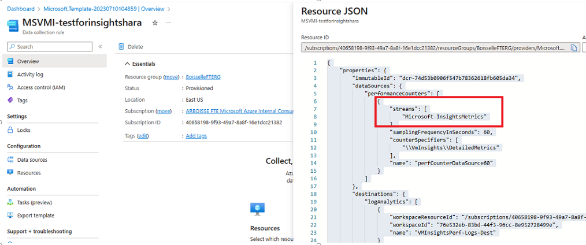

8. The agent will detect this change and download the new configuration, and this should restore ingestion to the insight metrics table.

## Performance view has no data

If the agents appear to be installed correctly but you don't see any data in the **Performance** view, see the following sections for possible causes.

### Has your Log Analytics workspace reached its data limit?
Check the [capacity reservations and the pricing for data ingestion](https://azure.microsoft.com/pricing/details/monitor/).

### Is your virtual machine agent connected to Azure Monitor Logs?

Open Log Analytics from **Logs** in the Azure Monitor menu in the Azure portal. Run the following query for your computer:

```kusto
Heartbeat
| where Computer == "my-computer"
| sort by TimeGenerated desc 
```

If you don't see any data or if the computer hasn't sent a heartbeat recently, you might have problems with your agent. See the preceding section for agent troubleshooting information.

## Virtual machine doesn't appear in the Map view

See the following sections for issues with the **Map** view.

### Is the Dependency agent installed?
 Use the information in the preceding sections to determine if the Dependency agent is installed and working properly.

### Are you on the Log Analytics free tier?
The [Log Analytics free tier](https://azure.microsoft.com/pricing/details/monitor/) is a legacy pricing plan that allows for up to five unique Service Map machines. Any subsequent machines won't appear in Service Map, even if the prior five are no longer sending data.

### Is your virtual machine sending log and performance data to Azure Monitor Logs?
Use the log query in the [Performance view has no data](#performance-view-has-no-data) section to determine if data is being collected for the virtual machine. If no data is being collected, use the TestCloudConnectivity tool to determine if you have connectivity issues.

## Virtual machine appears in the Map view but has missing data
If the virtual machine is in the **Map** view, the Dependency agent is installed and running, but the kernel driver didn't load, check the log file at the following locations:

| Operating system | Log | 
|:---|:---|
| Windows | C:\Program Files\Microsoft Dependency Agent\logs\wrapper.log |
| Linux | /var/opt/microsoft/dependency-agent/log/service.log |

The last lines of the file should indicate why the kernel didn't load. For example, the kernel might not be supported on Linux if you updated your kernel.

## Next steps

For more information on onboarding VM insights agents, see [Enable VM insights overview](vminsights-enable-overview.md).
