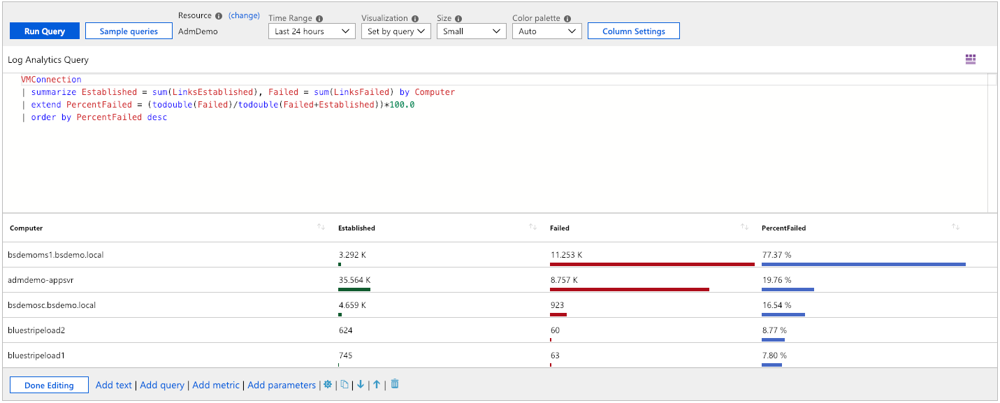
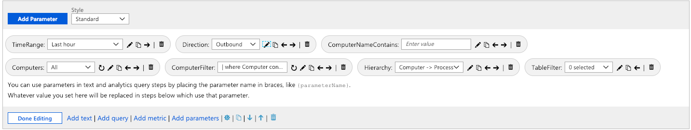
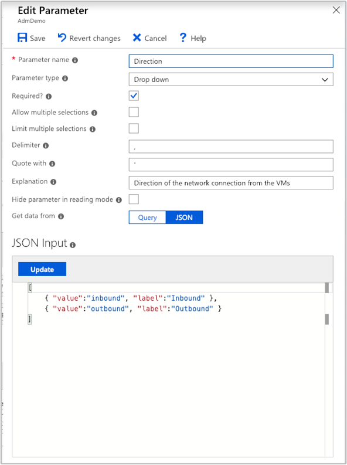

# Create interactive reports with VM insights workbooks

Workbooks combine text, [log queries](/azure/data-explorer/kusto/query/), metrics, and parameters into rich interactive reports. Workbooks can be edited by any other team members who have access to the same Azure resources.

Workbooks help you to:

* Explore the usage of your virtual machine (VM) when you don't know the metrics of interest in advance, like CPU utilization, disk space, memory, and network dependencies. Unlike other usage analytics tools, workbooks let you combine multiple kinds of visualizations and analyses, making them great for this kind of freeform exploration.
* Explain to your team how a recently provisioned VM is performing by showing metrics for key counters and other log events.
* Share the results of a resizing experiment of your VM with other members of your team. You can explain the goals for the experiment with text. Then you can show each usage metric and the analytics queries used to evaluate the experiment, along with clear call-outs for whether each metric was above or below target.
* Report the impact of an outage on the usage of your VM. You can combine data, text explanation, and a discussion of next steps to prevent outages in the future.

## VM insights workbooks
VM insights includes the following workbooks. You can use these workbooks or use them as a starting point to create custom workbooks to address your particular requirements.

### Single virtual machine

| Workbook | Description |
|----------|-------------|
| Performance | Provides a customizable version of the **Performance** view that uses all the Log Analytics performance counters that you've enabled. | 
| Connections | Provides an in-depth view of the inbound and outbound connections from your VM. | 

### Multiple virtual machines

| Workbook | Description |
|----------|-------------|
| Performance | Provides a customizable version of the **Top N List and Charts** view in a single workbook that uses all the Log Analytics performance counters that you've enabled.|
| Performance counters | Provides a **Top N Chart** view across a wide set of performance counters. |
| Connections | Provides an in-depth view of the inbound and outbound connections from your monitored VMs. |
| Active Ports | Provides a list of the processes that have bound to the ports on the monitored VMs and their activity in the chosen time frame. |
| Open Ports | Provides the number of ports open on your monitored VMs and the details on those open ports. |
| Failed Connections | Displays the count of failed connections on your monitored VMs, the failure trend, and if the percentage of failures is increasing over time. |
| Security and Audit | An analysis of your TCP/IP traffic that reports on overall connections, malicious connections, and where the IP endpoints reside globally. To enable all features, you must enable **Security Detection**. |
| TCP Traffic | A ranked report for your monitored VMs and their sent, received, and total network traffic in a grid and displayed as a trend line. |
| Traffic Comparison | Lets you compare network traffic trends for a single machine or a group of machines. |

## Create a new workbook

A workbook is made up of sections that consist of independently editable charts, tables, text, and input controls. To better understand workbooks, let's open a template and create a custom workbook.

1. Go to the **Monitor** menu in the Azure portal.

1. Select a VM.

1. On the VM insights page, select the **Performance** or **Map** tab and then select **View Workbooks** from the link on the page. From the dropdown list, select **Go To Gallery**.

    :::image type="content" source="media/vminsights-workbooks/workbook-dropdown-gallery-01.png" lightbox="media/vminsights-workbooks/workbook-dropdown-gallery-01.png" alt-text="Screenshot that shows a workbook dropdown list in V M insights.":::

    The workbook gallery opens with prebuilt workbooks to help you get started.

1. Create a new workbook by selecting **New**.

   :::image type="content" source="media/vminsights-workbooks/workbook-gallery-01.png" lightbox="media/vminsights-workbooks/workbook-gallery-01.png" alt-text="Screenshot that shows a workbook gallery in V M insights.":::

## Edit workbook sections

Workbooks have two modes: editing and reading. A new workbook opens in editing mode. This mode shows all the content of the workbook, including any steps and parameters that are otherwise hidden. Reading mode presents a simplified report-style view. Reading mode allows you to abstract away the complexity that went into creating a report while still having the underlying mechanics only a few clicks away when needed for modification.


1. After you finish editing a section, select **Done Editing** in the lower-left corner of the section.

1. To create a duplicate of a section, select the **Clone this section** icon. Creating duplicate sections is a great way to iterate on a query without losing previous iterations.

1. To move up a section in a workbook, select the **Move up** or **Move down** icon.

1. To remove a section permanently, select the **Remove** icon.

## Add text and Markdown sections

Adding headings, explanations, and commentary to your workbooks helps turn a set of tables and charts into a narrative. Text sections in workbooks support the [Markdown syntax](https://daringfireball.net/projects/markdown/) for text formatting like headings, bold, italics, and bulleted lists.

To add a text section to your workbook, select **Add text** in the lower left of the workbook or section.

## Add query sections



To add a query section to your workbook, select **Add query** in the lower left of the workbook or section.

Query sections are highly flexible and can be used to answer questions like:

* How was my CPU utilization during the same time period as an increase in network traffic?
* What was the trend in available disk space over the last month?
* How many network connection failures did my VM experience over the last two weeks?

You also aren't limited to querying from the context of the VM from which you opened the workbook. To query across multiple VMs and Log Analytics workspaces, you must have access permission to those resources.

To include data from other Log Analytics workspaces or from a specific Application Insights app, use the workspace identifier. To learn more about cross-resource queries, see the [official guidance](../logs/cross-workspace-query.md).

### Advanced analytic query settings

Each section has its own advanced settings, which are accessible via the settings  icon located to the right of **Add parameters**.


| Setting | Description |
| ---------------- |:-----|
| Custom width    | Makes an item an arbitrary size so that you can fit many items on a single line to organize your charts and tables into rich interactive reports.  |
| Conditionally visible | Specifies to hide steps based on a parameter when in reading mode. |
| Export a parameter| Allows a selected row in the grid or chart to cause later steps to change values or become visible.  |
| Show query when not editing | Displays the query that precedes the chart or table even when in reading mode.
| Show open in analytics button when not editing | Adds the **Analytics** icon to the right corner of the chart to allow one-click access.|

Most of these settings are fairly intuitive, but to understand **Export a parameter** it's better to examine a workbook that makes use of this functionality.

One of the prebuilt workbooks, **TCP Traffic**, provides information on connection metrics from a VM.

The first section of the workbook is based on log query data. The second section is also based on log query data, but selecting a row in the first table interactively updates the contents of the charts.


The behavior is possible through use of the **When an item is selected, export a parameter** advanced settings, which are enabled in the table's log query.


The second log query then utilizes the exported values when a row is selected to create a set of values that are used by the section heading and charts. If no row is selected, it hides the section heading and charts.

For example, the hidden parameter in the second section uses the following reference from the row selected in the grid:

```
VMConnection
| where TimeGenerated {TimeRange}
| where Computer in ("{ComputerName}") or '*' in ("{ComputerName}") 
| summarize Sent = sum(BytesSent), Received = sum(BytesReceived) by bin(TimeGenerated, {TimeRange:grain})
```

## Add metrics sections

Metrics sections give you full access to incorporate Azure Monitor metrics data into your interactive reports. In VM insights, the prebuilt workbooks typically contain analytic query data rather than metric data. You can create workbooks with metric data, which allows you to take full advantage of the best of both features all in one place. You also have the ability to pull in metric data from resources in any of the subscriptions to which you have access.

Here's an example of VM data being pulled into a workbook to provide a grid visualization of CPU performance.


## Add parameter sections

Workbook parameters allow you to change values in the workbook without having to manually edit the query or text sections. This removes the requirement of needing to understand the underlying analytics query language and greatly expands the potential audience of workbook-based reporting.

The values of parameters are replaced in query, text, or other parameter sections by putting the name of the parameter in braces, like ``{parameterName}``. Parameter names are limited to similar rules as JavaScript identifiers, alphabetic characters, or underscores, followed by alphanumeric characters or underscores. For example, *a1* is allowed but *1a* isn't allowed.

Parameters are linear, starting from the top of a workbook and flowing down to later steps. Parameters declared later in a workbook can override parameters that were declared earlier. Parameters that use queries can access the values from parameters defined earlier. Within a parameter's step itself, parameters are also linear, left to right, where parameters to the right can depend on a parameter declared earlier in that same step.

Four different types of parameters are currently supported:

| Parameter | Description |
| ---------------- |:-----|
| Text    | Allows the user to edit a text box. You can optionally supply a query to fill in the default value. |
| Drop down | Allows the user to choose from a set of values. |
| Time range picker| Allows the user to choose from a predefined set of time range values or pick from a custom time range.|
| Resource picker | Allows the user to choose from the resources selected for the workbook.|

### Use a text parameter

The value a user enters in the text box is replaced directly in the query, with no escaping or quoting. If the value you need is a string, the query should have single quotation marks around the parameter. An example is **'{parameter}'**.

The text parameter allows the value in a text box to be used anywhere. It can be a table name, column name, function name, or operator. The text parameter type has a setting **Get default value from analytics query**, which allows the workbook author to use a query to populate the default value for that text box.

When the default value is used from a log query, only the first value of the first row (row 0, column 0) is used as the default value. For this reason, we recommend that you limit your query to return only one row and one column. Any other data returned by the query is ignored.

Whatever value the query returns is replaced directly with no escaping or quoting. If the query returns no rows, the result of the parameter is either an empty string (if the parameter isn't required) or undefined (if the parameter is required).

### Use a dropdown

The dropdown parameter type lets you create a dropdown control, which is used to select one or many values.

The dropdown is populated by a log query or JSON. If the query returns one column, the values in that column are both the value and the label in the dropdown control. If the query returns two columns, the first column is the value, and the second column is the label shown in the dropdown. If the query returns three columns, the third column is used to indicate the default selection in that dropdown. This column can be any type, but the simplest is to use bool or numeric types, where 0 is false and 1 is true.

If the column is a string type, null/empty string is considered false. Any other value is considered true. For single-selection dropdowns, the first value with a true value is used as the default selection. For multiple-selection dropdowns, all values with a true value are used as the default selected set. The items in the dropdown are shown in whatever order the query returned rows.

Let's look at the parameters present in the Connections Overview report. Select the edit symbol next to **Direction**.



This action opens the **Edit Parameter** pane.



The JSON lets you generate an arbitrary table populated with content. For example, the following JSON generates two values in the dropdown:

```
[
    { "value": "inbound", "label": "Inbound"},
    { "value": "outbound", "label": "Outbound"}
]
```

A more applicable example is using a dropdown list to pick from a set of performance counters by name:

```
Perf
| summarize by CounterName, ObjectName
| order by ObjectName asc, CounterName asc
| project Counter = pack('counter', CounterName, 'object', ObjectName), CounterName, group = ObjectName
```

The query shows the following results:


Dropdown lists are powerful tools you can use to customize and create interactive reports.

### Time range parameters

You can make your own custom time range parameter via the dropdown parameter type. You can also use the out-of-box time range parameter type if you don't need the same degree of flexibility.

Time range parameter types have 15 default ranges that go from five minutes to the last 90 days. There's also an option to allow custom time range selection. The operator of the report can choose explicit start and stop values for the time range.

### Resource picker

The resource picker parameter type gives you the ability to scope your report to certain types of resources. An example of a prebuilt workbook that uses the resource picker type is the **Performance** workbook.


## Save and share workbooks with your team

Workbooks are saved within a Log Analytics workspace or a VM resource, depending on how you access the workbooks gallery. The workbook can be saved to the **My Reports** section that's private to you or in the **Shared Reports** section that's accessible to everyone with access to the resource. To view all the workbooks in the resource, select **Open**.

To share a workbook that's currently in **My Reports**:

1. Select **Open**.
1. Select the ellipsis (**...**) next to the workbook you want to share.
1. Select **Move to Shared Reports**.

To share a workbook with a link or via email, select **Share**. Keep in mind that recipients of the link need access to this resource in the Azure portal to view the workbook. To make edits, recipients need at least Contributor permissions for the resource.

To pin a link to a workbook to an Azure dashboard:

1. Select **Open**.
1. Select the ellipsis (**...**) next to the workbook you want to pin.
1. Select **Pin to dashboard**.

## Next steps

- To identify limitations and overall VM performance, see [View Azure VM performance](vminsights-performance.md).
- To learn about discovered application dependencies, see [View VM insights map](vminsights-maps.md).
