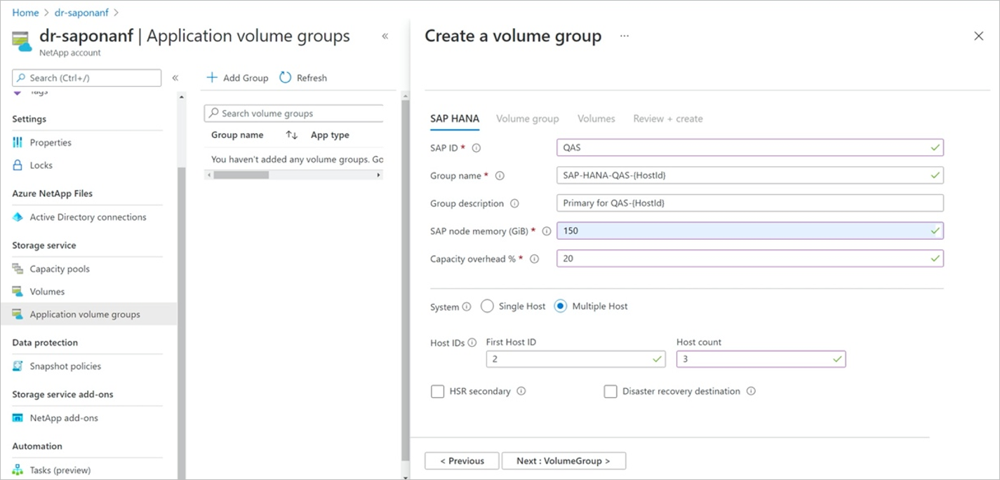
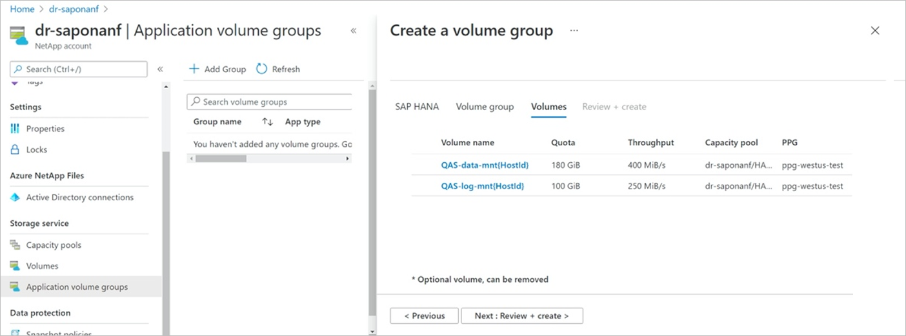
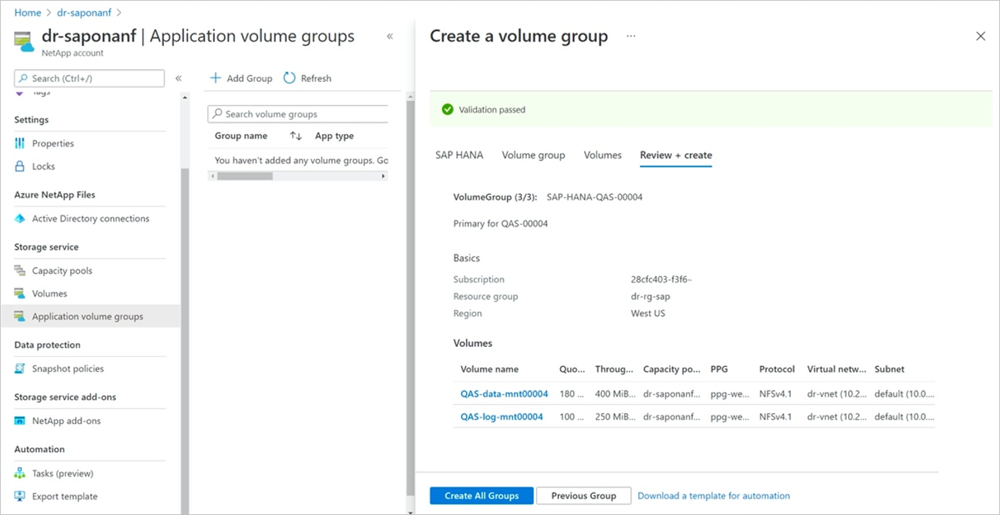

# Add hosts to a multiple-host SAP HANA system using application volume group for SAP HANA

Building a multiple-host SAP HANA database always starts with creating a volume group for the first host. You need to have created the first host in an SAP HANA multiple-host setup (see [Deploy the first SAP HANA host](application-volume-group-deploy-first-host.md)). After that, you can add additional HANA hosts by following steps in this article. 

> [!IMPORTANT]
> SAP recommends that you size the HANA shared volume to 1 x RAM of a HANA host for every four SAP HANA hosts of a multiple-host SAP HANA database. You might need to adjust the size for the shared volume you created with the initial host to adapt for the required capacity.

## Steps

1. From your NetApp account, select **Application volume groups**, and click **+Add Group**.  Then in Deployment Type, select **SAP HANA** and click **Next**.   

2. In the **SAP HANA** tab for adding a volume group, specify the following information:  

    * **SAP ID (SID)**:    
        The three alphanumeric-character SAP HANA system identifier.
    * **Group name**:  
        The volume group name. For a multiple-host SAP HANA, each host will create its own group.   
        In the example screenshot below, the group name `SAP-HANA-SH9-{HostId}` is a generic name. `{HostId}` will be replaced with the corresponding numeric host ID for each host you add. `{HostId}` will also be replaced with the numeric host ID for the volume group description. If `{HostId}` is not specified, it is appended to the end for both the group name and description.
    * **SAP node memory**:   
        This value defines the size of the SAP HANA database on the host. It is used to calculate the required volume size and throughput. 
    * **Capacity overhead (%)**:   
        When you use snapshots for data protection, you need to plan for extra capacity. This field will add an additional size (%) for the data volume.  
        You can estimate this value by using `"change rate per day" X "number of days retention"`.
    * **Multiple-host**:   
        Select this option to add additional hosts to a multiple-host HANA.
    * **First host ID**:   
        Specify the number of the first host you want to add. This value is typically "2" if you are adding hosts for the first time.
    * **Host count**:   
        Specify the number of hosts you want to add to the multiple-host setup.

    Click **Next: Volume Group**.

    

3. In the **Volume group** tab, provide identical input as you did when you created the first HANA host.  

    Then click **Next** and continue through the **Protocol** and **Tags** sections, providing the same input as the first HANA host. (See Step 4 through Step 6 in [Deploy the first SAP HANA host](application-volume-group-deploy-first-host.md).)   

    Click **Next: Volumes** when you reach the end of the sections. 

    For additional hosts that you add, only the data and the log volumes will be created. The **Volumes** page displays the two volumes in a generic form, using the `{HostId}` as a placeholder. This process simplifies the workflow, because changes are made only once for the data and log volumes for all the hosts that are being created.

    > [!NOTE]
    > SAP HANA allows you to add different compute volume types to a multiple-host setup. If you use this setup, you should add only one host for the same compute type at one time.

    Click **Next: Review + Create**.  

    

4. In the **Review + Create** tab, the `{HostId}` placeholder is replaced with the individual numbers for each of the volume groups that will be created. 

    You can click **Next Group** to navigate through all volume groups that are being created (one for each host). You can also click a particular volume to view its details.

    

5. After you navigate through the volume groups, click **Create All Groups** to create all the volumes for the HANA hosts you are adding. 

    

    The **Create Volume Group** page shows the added volume groups with the "Creating" status.

## Next steps  

* [Understand Azure NetApp Files application volume group for SAP HANA](application-volume-group-introduction.md)
* [Requirements and considerations for application volume group for SAP HANA](application-volume-group-considerations.md)
* [Deploy the first SAP HANA host using application volume group for SAP HANA](application-volume-group-deploy-first-host.md)
* [Add volumes for an SAP HANA system as a secondary database in HSR](application-volume-group-add-volume-secondary.md)
* [Add volumes for an SAP HANA system as a DR system using cross-region replication](application-volume-group-disaster-recovery.md)
* [Manage volumes in an application volume group](application-volume-group-manage-volumes.md)
* [Delete an application volume group](application-volume-group-delete.md)
* [Application volume group FAQs](faq-application-volume-group.md)
* [Troubleshoot application volume group errors](troubleshoot-application-volume-groups.md)
