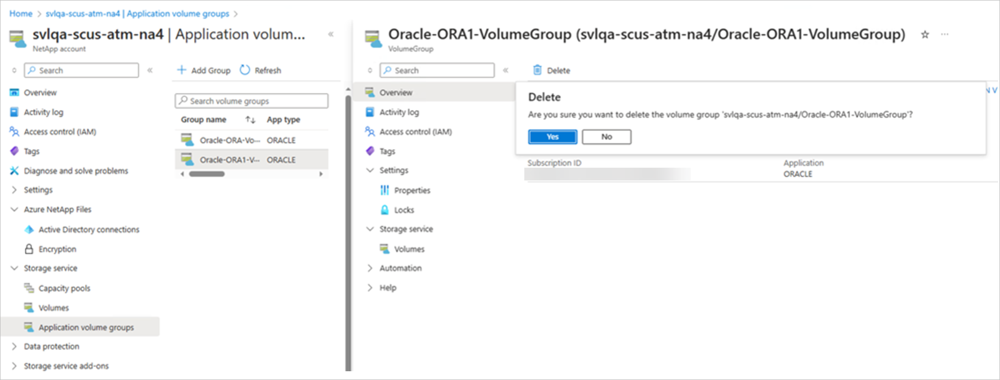

# Delete an application volume group

This article describes how to delete an application volume group.

> [!IMPORTANT]
> You can delete a volume group only if it contains no volumes. Before deleting a volume group, delete all volumes in the group. Otherwise, an error occurs, preventing you from deleting the volume group.  

## Steps

1. Click **Application volume groups**. Select the volume group you want to delete.

    

2. To delete the volume group, click **Delete**. If you are prompted, type the volume group name to confirm the deletion.  

     

## Next steps  

* [Understand Azure NetApp Files application volume group for SAP HANA](application-volume-group-introduction.md)
* [Requirements and considerations for application volume group for SAP HANA](application-volume-group-considerations.md)
* [Deploy the first SAP HANA host using application volume group for SAP HANA](application-volume-group-deploy-first-host.md)
* [Add hosts to a multiple-host SAP HANA system using application volume group for SAP HANA](application-volume-group-add-hosts.md)
* [Add volumes for an SAP HANA system as a secondary database in HSR](application-volume-group-add-volume-secondary.md)
* [Add volumes for an SAP HANA system as a DR system using cross-region replication](application-volume-group-disaster-recovery.md)
* [Manage volumes in an application volume group](application-volume-group-manage-volumes.md)
* [Application volume group FAQs](faq-application-volume-group.md)
* [Troubleshoot application volume group errors](troubleshoot-application-volume-groups.md)
