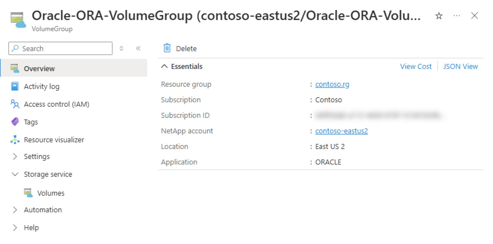

# Delete an application volume group

This article describes how to delete an application volume group.

> [!IMPORTANT]
> You can delete a volume group only if it contains no volumes. Before deleting a volume group, delete all volumes in the group. An error occurs preventing you from deleting the volume group if it contains one or more volumes.

## Steps

1. Select **Application volume groups**. Select the volume group you want to delete.

2. To delete the volume group, select **Delete**. If you are prompted, type the volume group name to confirm the deletion.  

    

## Next steps  

* [Application volume group FAQs](faq-application-volume-group.md)
* [Troubleshoot application volume group errors](troubleshoot-application-volume-groups.md)
