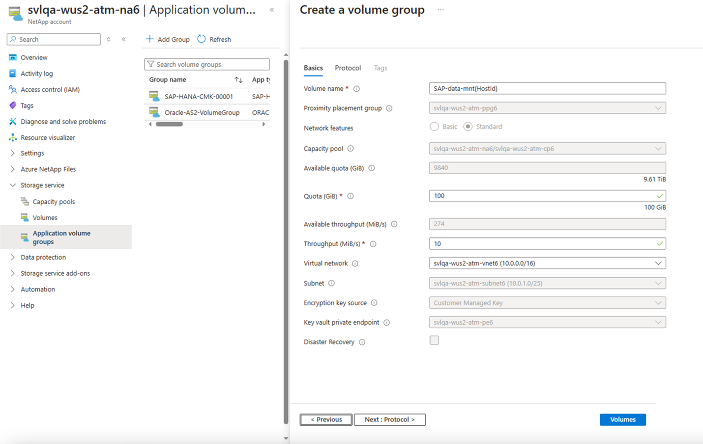

# Deploy the first SAP HANA host using application volume group for SAP HANA

All deployments start with the volumes for a single SAP HANA host. This is the case even for large, multiple-host installations. The shared, log-backup, and data-backup volumes are created only for the first host. All other hosts in a multiple-host environment share these volumes, and they add only data and log volumes for each additional host.

This article describes how to deploy the first SAP HANA host using Azure NetApp Files application volume group for SAP HANA.

## Before you begin

- Understand the [requirements and considerations for application volume group for SAP HANA](application-volume-group-considerations.md). 

- Application volume group for SAP HANA extension 1 enables you to select Standard network features and availability zone volume placement without using volume pinning. You must register for [extension 1](#register-for-extension-1) to use the function. 
    Alternately, adhere to the **[pinning recommendations](https://aka.ms/HANAPINNING)**. Have at least one HANA virtual machine (VM) in the availability set started. Alternately, you can use [Application volume group for SAP HANA extension 1](application-volume-group-introduction.md#extension-1-features). 

### Register for extension 1 

Azure NetApp Files application volume group for SAP HANA Extension 1 is currently in preview. You need to register the feature before using it for the first time. Feature registration may take up to 60 minutes to complete.

1. Register the feature

    ```azurepowershell-interactive
    Register-AzProviderFeature -ProviderNamespace Microsoft.NetApp -FeatureName ANFHANAVolumeGroupExtension1 
    ```

2. Check the status of the feature registration: 

    > [!NOTE]
    > The **RegistrationState** may be in the `Registering` state for up to 60 minutes before changing to `Registered`. Wait until the status is `Registered` before continuing.

    ```azurepowershell-interactive
    Get-AzProviderFeature -ProviderNamespace Microsoft.NetApp -FeatureName ANFHANAVolumeGroupExtension1 
    ```
You can also use [Azure CLI commands](/cli/azure/feature) `az feature register` and `az feature show` to register the feature and display the registration status. 

## Steps 

[!INCLUDE [Extension 1 interface call-out](./includes/extension-one.md)]

### [Without Extension 1](#tab/without-extension-1)

1. From your NetApp account, select **Application volume groups**, then **+Add Group**.

    [  ](./media/application-volume-group-deploy-first-host/application-volume-group-add-group.png#lightbox)

2. In Deployment Type, select **SAP HANA** then **Next**. 

    [  ](./media/application-volume-group-deploy-first-host/application-volume-group-create-group.png#lightbox)

3. In the **SAP HANA** tab, provide HANA-specific information:   

    * **SAP ID (SID**):    
        The three alphanumeric-character SAP HANA system identifier.
    * **Group name**: 
        The volume group name. For a multiple-host SAP HANA system, each host creates its own group. Because you're creating the first host, the group name starts with `'Name-proposal'-00001`.
    * **SAP node memory**:  
        This value defines the size of the SAP HANA database on the host. It's used to calculate the required volume size and throughput. 
    * **Capacity overhead (%)**:  
        When you use snapshots for data protection, you need to plan for extra capacity. This field adds an additional size (%) for the data volume. 
        You can estimate this value by using `"change rate per day" X "number of days retention"`.
    * **Single-host**:  
        Select this option for an SAP HANA single-host system or the first host for a multiple-host system. Only the shared, log-backup, and data-backup volumes are created with the first host.
    * **Multiple-host**:
        Select this option for adding additional hosts to a multiple-hosts HANA system.

    Select **Next: Volume Group**.

    [  ](./media/application-volume-group-deploy-first-host/application-sap-hana-tag.png#lightbox)

4. In the **Volume group** tab, provide information for creating the volume group:  

    * **Proximity placement group (PPG)**:  
        Specifies that the data, log, and shared volumes are to be created close to the VMs.
    * **Capacity pool**:  
        All volumes are placed in a single manual QoS capacity pool. 
        If you want to create the log-backup and data-backup volumes in a separate capacity pool, you can choose not to add those volumes to the volume group and create them separately. 
    * **Virtual network**:  
        Specify an existing VNet where the VMs are placed. 
    * **Subnet**:  
        Specify the delegated subnet where the IP addresses for the NFS exports are created. Ensure that you have a delegated subnet with enough free IP addresses.
    
    Select **Next: Tags**. 

    [  ](./media/application-volume-group-deploy-first-host/application-volume-group-tag.png#lightbox)
    
5. In the **Tags** section of the Volume Group tab, you can add tags as needed for the volumes.  

    Select **Next: Protocol**. 

    [  ](./media/application-volume-group-deploy-first-host/application-add-tags.png#lightbox)

6. In the **Protocols** section of the Volume Group tab, you can modify the **Export Policy**, which should be common to all volumes. 

    Select **Next: Volumes**. 

    [  ](./media/application-volume-group-deploy-first-host/application-protocols-tag.png#lightbox)

7. The **Volumes** tab summarizes the volumes that are being created with proposed volume name, quota, and throughput. 

    The Volumes tab also shows that only the data, log, and shared volumes are created close to the HANA VMs. The other volumes (data-backup and log-backup) are created at a different location within the region.

    The creation for the data-backup and log-backup volumes is optional.

    [  ](./media/application-volume-group-deploy-first-host/application-volume-list.png#lightbox)

8. In the **Volumes** tab, you can select each volume to view or change the volume details. For example, select "data-*volume-name*". 

    Not all settings can be changed because of SAP HANA certification restrictions.
 
    When you select a volume, you can change the following values in the **Basics** tab:  

    * **Volume Name**:   
        It's recommended that you retain the suggested naming conventions.
    * **Quota**:   
        The size of the volume.
    * **Throughput**:  
        You can reduce the throughput requirements for development or test systems accordingly to the value required for your use cases.

    Select **Next: Protocols** to review the protocol settings. 

    [  ](./media/application-volume-group-deploy-first-host/application-create-volume-basics-tab.png#lightbox)

9. In the **Protocols** tab of a volume, you can modify **File path** (the export name where the volume can be mounted) and **Export policy** as needed.

    You cannot change the protocol for the data and log volumes. 

    Select the **Tags** tab if you want to specify tags for a volume. Or select **Volumes** to return to the Volumes overview page.

    [  ](./media/application-volume-group-deploy-first-host/application-create-volume-protocol-tab.png#lightbox)

10.	The **Volumes** page displays volume details. 

    [  ](./media/application-volume-group-deploy-first-host/application-volume-details.png#lightbox)

    If you want to remove the optional volumes (marked with a `*`), such as data-backup volume or log-backup volume from the volume group, select the volume then select **Remove volume**. Confirm the removal in the dialog box that appears.

    > [!IMPORTANT]
    > You cannot add a removed volume back to the volume group again. You need to stop and restart the application volume group configuration.

    [  ](./media/application-volume-group-deploy-first-host/application-volume-remove.png#lightbox)

    Select **Volumes** to return to the Volume overview page. Select **Next: Review + create**.

11.	The **Review + Create** tab lists all the volumes and their creation method. Select **Create Volume Group** to start the volume group creation.

    [  ](./media/application-volume-group-deploy-first-host/application-review-create.png#lightbox)

12. The **Volume Groups** deployment workflow starts. You can monitor the progress. This process can take a few minutes to complete.

    [  ](./media/application-volume-group-deploy-first-host/application-deployment-in-progress.png#lightbox)

    You can display the list of volume groups to see the new volume group. You can select the new volume group to see the details and status of each of the volumes being created.

    Creating a volume group is an "all-or-none" operation. If one volume cannot be created, all remaining volumes are removed.

    [  ](./media/application-volume-group-deploy-first-host/application-new-volume-group.png#lightbox)

### [Extension 1](#tab/extension-1)

1. From your NetApp account, select **Application volume groups**, then **+Add Group**.

    [  ](./media/application-volume-group-deploy-first-host/application-volume-group-add-group.png#lightbox)

2. In Deployment Type, select **SAP HANA** then **Next**. 

    [  ](./media/application-volume-group-deploy-first-host/application-volume-group-create-group.png#lightbox)

3. In the **SAP HANA** tab, provide HANA-specific information:   

    * **SAP ID (SID**):    
        The three alphanumeric-character SAP HANA system identifier.
    * **Group name**: 
        The volume group name. For a multiple-host SAP HANA system, each host creates its own group. Because you're creating the first host, the group name starts with `'Name-proposal'-00001`.
    * **SAP node memory**:  
        This value defines the size of the SAP HANA database on the host. It's used to calculate the required volume size and throughput. 
    * **Capacity overhead (%)**:  
        When you use snapshots for data protection, you need to plan for extra capacity. This field adds an additional size (%) for the data volume. 
        You can estimate this value by using `"change rate per day" X "number of days retention"`.
    * **Single-host**:  
        Select this option for an SAP HANA single-host system or the first host for a multiple-host system. Only the shared, log-backup, and data-backup volumes are created with the first host.
    * **Multiple-host**:
        Select this option for adding additional hosts to a multiple-hosts HANA system.

    Select **Next: Volume Group**.

    [  ](./media/application-volume-group-deploy-first-host/application-sap-hana-tag.png#lightbox)

4. In the **Volume group** tab, provide information for creating the volume group:  

    * **Availability option**:

        Select either **Availability zone** or **Proximity placement group**. 
        When selecting **Availability zone**, you must select the appropriate availability zone in the next field. 
        * **Proximity placement group (PPG)**:  
            Specifies that the data, log, and shared volumes are to be created close to the VMs.
        * **Availability Zone**: 
            This option lets you deploy the volumes in the logical availability zone that you specify. Select an availability zone where Azure NetApp Files resources are present. For details, see [Manage availability zone volume placement](manage-availability-zone-volume-placement.md).
    * **Network features**: 

        Standard network features is the default, however you can still use Basic network features. 
        See [Configure network features for a volume](configure-network-features.md) and [Guidelines for Azure NetApp Files network planning](azure-netapp-files-network-topologies.md) for details.
    * **Capacity pool**:  
        All volumes are placed in a single manual QoS capacity pool. 
        If you want to create the log-backup and data-backup volumes in a separate capacity pool, you can choose not to add those volumes to the volume group.
    * **Virtual network**:  
        Specify an existing VNet where the VMs are placed. 
    * **Subnet**:  
        Specify the delegated subnet where the IP addresses for the NFS exports are created. Ensure that you have a delegated subnet with enough free IP addresses.
    * **Encryption key source**:

        Select [Customer Managed Key](configure-customer-managed-keys.md) or Microsoft Managed Key. If you choose Customer Managed Key, provide the key vault private endpoint.
    
    Select **Next: Tags**. 
    
    :::image type="content" source="./media/shared/application-volume-group-create.png" alt-text="Screenshot of create application volume group interface." lightbox="./media/shared/application-volume-group-create.png":::
    
5. In the **Tags** section of the Volume Group tab, you can add tags as needed for the volumes.  

    Select **Next: Protocol**. 

    [  ](./media/application-volume-group-deploy-first-host/application-add-tags.png#lightbox)

6. In the **Protocols** section of the Volume Group tab, you can modify the **Export Policy**, which should be common to all volumes. 

    Select **Next: Volumes**. 

    [  ](./media/application-volume-group-deploy-first-host/application-protocols-tag.png#lightbox)

7. The **Volumes** tab summarizes the volumes being created, showing protocol, volume name, quota, and throughput. 

    The Volumes tab also shows that only the data, log, and shared volumes are created close to the HANA VMs. The other volumes (data-backup and log-backup) are created at a different location within the region.

    The creation for the data-backup and log-backup volumes is optional.

    [ (./media/application-volume-group-deploy-first-host/volume-validation-extension-one.png#lightbox)]

8. In the **Volumes** tab, you can select each volume to view or change the volume details. For example, select "data-*volume-name*". 

    Not all settings can be changed because of SAP HANA certification restrictions.
 
    When you select a volume, you can change the following values in the **Basics** tab:  

    * **Volume Name**:   
        It's recommended that you retain the suggested naming conventions.
    * **Quota**:   
        The size of the volume.
    * **Throughput**:  
        You can reduce the throughput requirements for development or test systems accordingly to the value required for your use cases.
    * **Encryption key source**:
        Select [Customer Managed Key](configure-customer-managed-keys.md) or Microsoft Managed Key. If you choose Customer Managed Key, provide the key vault private endpoint.

    Select **Next: Protocols** to review the protocol settings. 

    [  ](./media/application-volume-group-deploy-first-host/application-create-volume-basics-tab.png#lightbox)

9. In the **Protocols** tab of a volume, you can modify **File path** (the export name where the volume can be mounted) and **Export policy** as needed.

    You cannot change the protocol for the data and log volumes. 

    Select the **Tags** tab if you want to specify tags for a volume. Or select **Volumes** to return to the Volumes overview page.

    [  ](./media/application-volume-group-deploy-first-host/application-create-volume-protocol-tab.png#lightbox)

10.	The **Volumes** page displays volume details. 

    [  ](./media/application-volume-group-deploy-first-host/application-volume-details.png#lightbox)

    If you want to remove the optional volumes (marked with a `*`), such as data-backup volume or log-backup volume from the volume group, select the volume then select **Remove volume**. Confirm the removal in the dialog box that appears.

    > [!IMPORTANT]
    > You cannot add a removed volume back to the volume group again. You need to stop and restart the application volume group configuration.

    :::image type="content" source="./media/application-volume-group-deploy-first-host/application-review-create.png" alt-text="Screenshot of the review + create tab for extension one." lightbox="./media/application-volume-group-deploy-first-host/application-review-create.png":::

    Select **Volumes** to return to the Volume overview page. Select **Next: Review + create**.

11.	The **Review + Create** tab lists all the volumes and their creation method. Select **Create Volume Group** to start the volume group creation. This process can take a few minutes to complete.

    A notification confirms when the operation completes successfully. When you see this message, you can select **Go to resource** to view the newly created volume group. 

    :::image type="content" source="./media/application-volume-group-deploy-first-host/go-to-resource.png" alt-text="Screenshot of a successfully created resource." lightbox="./media/application-volume-group-deploy-first-host/go-to-resource.png":::

---

## Next steps  

* [Understand Azure NetApp Files application volume group for SAP HANA](application-volume-group-introduction.md)
* [Requirements and considerations for application volume group for SAP HANA](application-volume-group-considerations.md)
* [Add hosts to a multiple-host SAP HANA system using application volume group for SAP HANA](application-volume-group-add-hosts.md)
* [Add volumes for an SAP HANA system as a secondary database in HSR](application-volume-group-add-volume-secondary.md)
* [Add volumes for an SAP HANA system as a DR system using cross-region replication](application-volume-group-disaster-recovery.md)
* [Manage volumes in an application volume group](application-volume-group-manage-volumes.md)
* [Delete an application volume group](application-volume-group-delete.md)
* [Application volume group FAQs](faq-application-volume-group.md)
* [Troubleshoot application volume group errors](troubleshoot-application-volume-groups.md)
