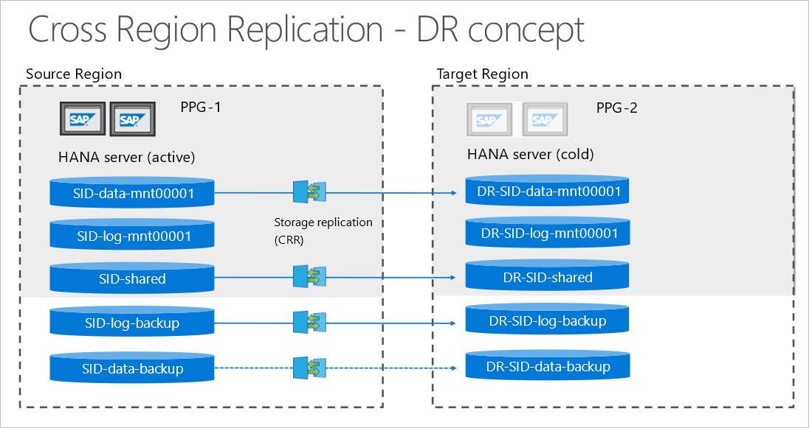
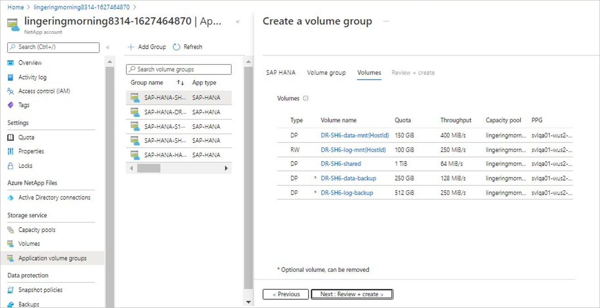
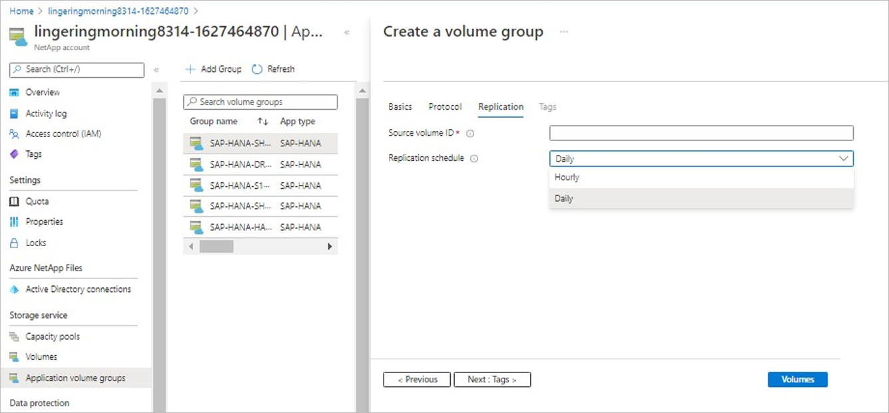

# Add volumes for an SAP HANA system as a DR system using cross-region replication

This article describes using an application volume group to add volumes for an SAP HANA system as a disaster recovery (DR) system. This configuration uses Azure NetApp Files cross-region replication functionality.

## Cross-region replication between the source and destination HANA servers

The Azure NetApp Files [cross-region replication](cross-region-replication-introduction.md) functionality enables you to replicate volumes between [supported cross-region replication pairs](cross-region-replication-introduction.md#supported-region-pairs). This functionality allows you to [replicate a volume](cross-region-replication-create-peering.md) from a source region to a volume on the destination region for disaster recovery (DR). 

Instead of using HANA System Replication (HSR), you can use cross-region replication to protect a database without needing a HANA database server that runs all the time. You need to create replication destination volumes in a region supported for cross-region replication. Application volume group for SAP HANA ensures that the destination volumes are created with the correct volume type that meets all SAP HANA specific requirements.

The following diagram illustrates cross-region replication between the source and destination HANA servers. Cross-region replication is asynchronous. As such, not all volumes need to be replicated.  

  

> [!IMPORTANT]
> * Recovering the HANA database at the destination region requires that you use application-consistent storage snapshots for your HANA backup. You can create such snapshots by using data-protection solutions such as the [Azure Application Consistent Snapshot tool](azacsnap-introduction.md) (AzAcSnap).
> * You need to replicate at least the data volume and the log-backup volume. 
> * You can optionally replicate the data-backup volume and the shared volume. 
> * You should *never* replicate the log volume. The application volume group will create the log volume as a standard volume.

## Replication schedules, RTO, and RPO

The following table summarizes the replication schedule options. It also describes the default settings proposed by the application volume group:

|     Volume type    |     Default replication schedule    |     Available options    |     Notes    |
|---|---|---|---|
|     Data    |     Daily    |     Daily, hourly    |     The choice   you select impacts Recover Time Objective (RTO) and the amount of transferred   data.    |
|     Log    |     -    |     -    |     Log volumes   are not replicated.    |
|     SAP shared    |     Every 10 minutes    |     Every 10 minutes, hourly, daily    |     You should   choose a schedule based on your SLA requirements and the data stored in the shared   volume.    |
|     Data-backup    |     Daily    |     Daily, weekly    |     Replicating   the data-backup volumes is optional.    |
|     Log-backup    |     Every 10 minutes    |     Every 10 minutes    |     This setting   impacts Recover Point Objective (RPO).     |

The schedule for replication frequency has impacts on the SLAs: 

* Recover Time Objective (RTO):  The minimum amount of time a recovery would take.
To recover by using the latest available application-consistent snapshot, all available log backups need to be replayed. RTO depends on your backup frequency and the data volume replication frequency. For example, if your backup frequency is every 6 hours and your replication schedule is "Daily", then the oldest backup could be 30 hours (24 hours + 6 hours) old. In this scenario, replaying up to 30 hours of log backups would be required.
* Recover Point Objective (RPO): The minimum data loss that might occur.
The SAP HANA log-backup frequency is typically 15 minutes, but this setting can be configured differently. Assuming a 10-minute replication schedule for log backups, the maximum loss of transaction would be `[15+10+transfer_time]` minutes.

## Add volumes  

The following example adds volumes to an SAP HANA system. The system serves as a DR destination system using cross-region replication.

1. From your NetApp account, select **Application volume groups**, and click **+Add Group**. Then, in Deployment Type, select **SAP HANA** and click **Next**. 

2. In the **SAP HANA** tab, provide HANA-specific information. 

    > [!IMPORTANT]
    > Be sure to select the **Disaster recovery destination** option to indicate that you are creating a HANA system as a cross-region replication destination.  

    * **SAP ID (SID)**:    
        The three alphanumeric-character SAP HANA system identifier.
    * **Group name**:  
        The volume group name. 
    * **SAP node memory**:  
        This value defines the size of the SAP HANA database on the host. It is used to calculate the required volume size and throughput. 
    * **Capacity overhead (%)**:  
        When you use snapshots for data protection, you need to plan for extra capacity. This field will add additional size (%) for the data volume.  
        You can estimate this value by using `"change rate per day" X "number of days retention"`.
    * **Single-host**:  
        Select this option for an SAP HANA single-host system or the first host for a multiple-host system. Only the shared, log-backup, and data-backup volumes will be created with the first host.
    * **Multiple-host**:  
        Select this option if you are adding additional hosts to a multiple-hosts HANA system.
    * **Disaster recover destination**:  
        Select this option to create volumes for a HANA system as a DR site using [cross-region replication](cross-region-replication-introduction.md).  
    
        Selecting **Disaster recover destination** triggers the naming convention for the volume group name to include `"-DR-"` to indicate a disaster-recovery setup. 

    Click **Next: Volume Group**.    

    

3. In the **Volume group** tab, provide information for creating the volume group:

    * **Proximity placement group (PPG)**:  
        Specifies that the data and shared volumes are to be created close to the disaster recovery VMs.  
        Even if you do not need the VM’s for replication, you need to start at least one VM to anchor the PPG while provisioning the volumes.
    * **Capacity pool**:  
        All volumes will be placed in a single manual QoS capacity pool.   
        If you want to create the log-backup and data-backup volumes in a separate capacity pool, you can choose not to add those volumes to the volume group.
    * **Virtual network**:  
        Specify an existing VNet where the VMs are placed. 
    * **Subnet**:  
        Specify the delegated subnet where the IP addresses for the NFS exports will be created. Ensure that you have a delegated subnet with enough free IP addresses.

    Click **Next: Protocols**. 

4. In the **Protocols** section of the Volume Group tab, you can modify the **Export Policy**, which should be common to all volumes.

    Click **Next: Replication**.

5. In the **Replication** section of the Volume Group tab, the Replication Schedule field defaults to "Multiple" (disabled). The default replication schedules are different for the replicated volumes. As such, you can modify the replication schedules only for each volume individually from the Volumes tab, and not globally for the entire volume group. 

    

    Click **Next: Tags**.

6. In the **Tags** section of the Volume Group tab, you can add tags as needed for the volumes.   

    Click **Next: Volumes**. 

7. The **Volumes** tab displays the volume list.

    The volume naming convention includes a `"DR-"` prefix to indicate that the volumes belong to the disaster-recovery (destination) side of the setup.

    The Volumes tab also displays the volume type: 
 
    * **DP** - Indicates destination in the cross-region replication setting. Volumes of this type are not online but in replication mode.
    * **RW** - Indicates that reads and writes are allowed.

    The default type for the log volume is RW, and the setting cannot be changed.

    The default type for the data, shared, and log-backup volumes is DP, and the setting cannot be changed.

    The default type for the data-backup volume is DP, but this setting can be changed to RW.  

    

8. Click each volume with the DP type to specify the **Source volume ID**. See [Locate the source volume resource ID](cross-region-replication-create-peering.md#locate-the-source-volume-resource-id) for details. 
 
    You can optionally change the default replication schedule of a volume. See [Replication schedules, RTO, and RPO](#replication-schedules-rto-and-rpo) for the replication schedule options. 

    

9. After you create the volume group, set up replication by following instructions in [Authorize replication from the source volume](cross-region-replication-create-peering.md#authorize-replication-from-the-source-volume).  

    1. For each DP volume that you created, copy the volume **Resource ID**.

    2. For each source volume, click **Replication** and then **Authorize**. Paste the **Resource ID** of each corresponding destination volume. 

## Next steps  

* [Understand Azure NetApp Files application volume group for SAP HANA](application-volume-group-introduction.md)
* [Requirements and considerations for application volume group for SAP HANA](application-volume-group-considerations.md)
* [Deploy the first SAP HANA host using application volume group for SAP HANA](application-volume-group-deploy-first-host.md)
* [Add hosts to a multiple-host SAP HANA system using application volume group for SAP HANA](application-volume-group-add-hosts.md)
* [Add volumes for an SAP HANA system as a secondary database in HSR](application-volume-group-add-volume-secondary.md)
* [Manage volumes in an application volume group](application-volume-group-manage-volumes.md)
* [Delete an application volume group](application-volume-group-delete.md)
* [Application volume group FAQs](faq-application-volume-group.md)

