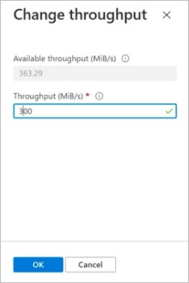

# Manage volumes in an application volume group for SAP HANA

You can manage a volume from its volume group. You can resize, delete, or change throughput for the volume. 

[!INCLUDE [Application volume group CLI & PowerShell limitation](includes/application-volume-group-powershell.md)]

## Steps

1. From your NetApp account, select **Application volume groups**. Select a volume group to display the volumes in the group.  

2. Select the volume you want to resize, delete, or change throughput. The volume overview is displayed. 

      

    * To resize the volume, select **Resize** and specify the quota in GiB.
    
    

    * To change the throughput for the volume, select **Change throughput** and specify the intended throughput in MiB/s.

    

    * To delete the volume in the volume group, select **Delete**. If prompted, enter the volume name to confirm the deletion.  

    > [!IMPORTANT]
    > Volume deletion is permanent. It can't be undone.
    
    

## Next steps  

* [Understand Azure NetApp Files application volume group for SAP HANA](application-volume-group-introduction.md)
* [Requirements and considerations for application volume group for SAP HANA](application-volume-group-considerations.md)
* [Deploy the first SAP HANA host using application volume group for SAP HANA](application-volume-group-deploy-first-host.md)
* [Add hosts to a multiple-host SAP HANA system using application volume group for SAP HANA](application-volume-group-add-hosts.md)
* [Add volumes for an SAP HANA system as a secondary database in HSR](application-volume-group-add-volume-secondary.md)
* [Add volumes for an SAP HANA system as a DR system using cross-region replication](application-volume-group-disaster-recovery.md)
* [Delete an application volume group](application-volume-group-delete.md)
* [Application volume group FAQs](faq-application-volume-group.md)
* [Troubleshoot application volume group errors](troubleshoot-application-volume-groups.md)
