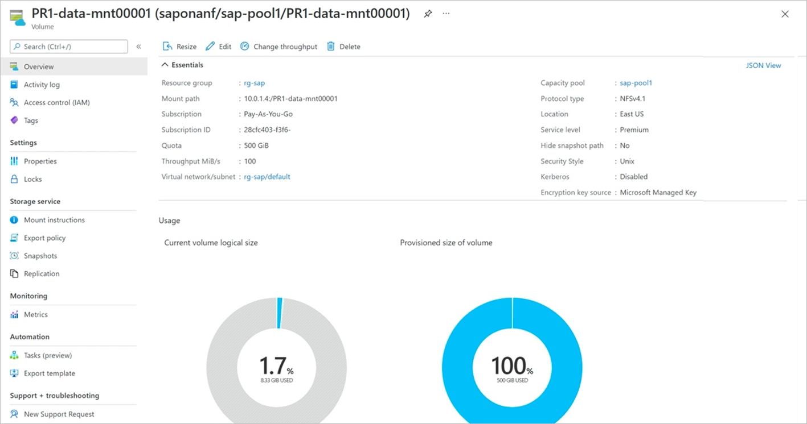
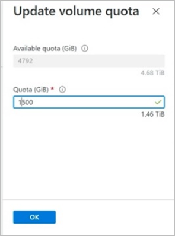
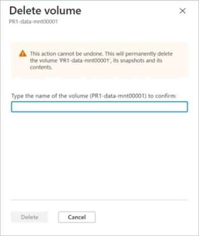

# Manage volumes in application volume group

You can manage a volume from its volume group. You can resize, delete, or change throughput for the volume. 

## Steps

1. From your NetApp account, select **Application volume groups**. Click a volume group to display the volumes in the group. Select the volume you want to resize, delete, or change throughput. The volume overview will be displayed. 

     

    1. To resize the volume, click **Resize** and specify the quota in GiB.
    
     

    2. To change the throughput for the volume, click **Change throughput** and specify the intended throughput in MiB/s.

     

    3. To delete the volume in the volume group, click **Delete**. If you are prompted, type the volume name to confirm the deletion.  

    > [!IMPORTANT]
    > The volume deletion operation cannot be undone.
    
     

## Next steps  

* 
