# Deploy application volume group for Oracle

This article describes how to deploy all required volumes for your Oracle database using Azure NetApp Files application volume group for Oracle.

## Before you begin

You should understand the [requirements and considerations for application volume group for Oracle](application-volume-group-oracle-considerations.md). 

## Steps 

1. From your NetApp account, select **Application volume groups**, and click **+Add Group**.

    [ 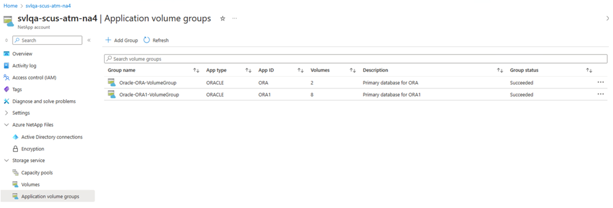 ](../media/azure-netapp-files/application-volume-group-oracle-add-group.png#lightbox)

2. In Deployment Type, select **ORACLE** and click **Next**. 

    [ 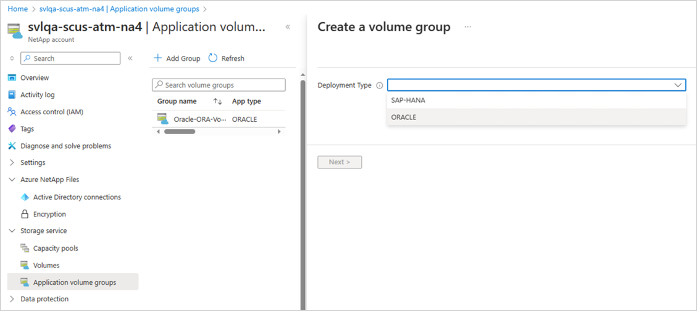 ](../media/azure-netapp-files/application-volume-group-oracle-create-group.png#lightbox)

3. In the **ORACLE** tab, provide Oracle-specific information:   

    * **SAP ID (SID**):    
        Choose a unique identifier that will be used in the naming proposals for all your storage objects and helps to uniquely identify the volumes for this database.
    * **Group name / Group description**:  
        Provide the volume group name and description.
    * **Number of Oracle data volumes (1-8):**:  
        Depending on your sizing and performance requirements of the database you may can create a minimum of 1 and up to 8 data volumes. 
    * **Oracle database size in (TiB)**:   
        Specify the total capacity required for your database. If you select more than one database volume, the capacity is distributed evenly among all volumes. You may change each individual volume once the proposals have been created. See Step 8 in this article.
    * **Additional capacity for snapshots (%)**:   
        If you use snapshots for data protection, you need to plan for extra capacity. This field will add an additional size (%) for the data volume.
    * **Oracle Throughput (MiB/s)**:   
        Specify the total throughput required for your database. If you select more than one database volume, the throughput is distributed evenly among all volumes. You may change each individual volume once the proposals have been created. See Step in this article.

    Click **Next: Volume Group**.

    [ 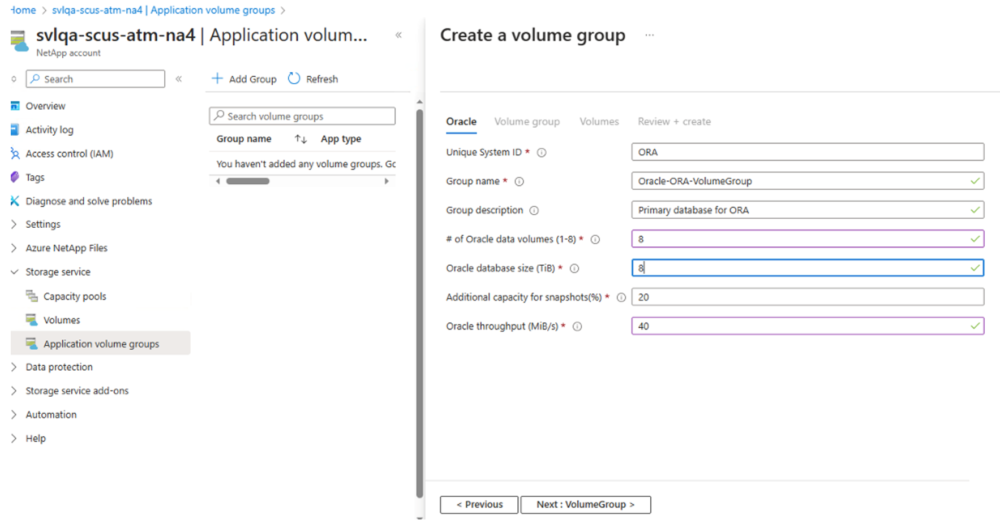 ](../media/azure-netapp-files/application-oracle-tag.png#lightbox)

4. In the **Volume group** tab, provide information for creating the volume group:

    * **Availability options**:  
        There are two **Availability** options. This screenshot is for a volume placement using **Availability Zone**.  
    * **Availability Zone**:  
        Select the zone where Azure NetApp Files is available. In regions without zones, you can select **none**.
    * **Network features**:  
        Select either **Basic** network or **Standard** network. Because all volumes should use the same network feature, this selection is set for each individual volume.
    * **Capacity pool**:  
        All volumes will be placed in a single manual QoS capacity pool.
    * **Virtual network**:  
        Specify an existing VNet where the VMs are placed. 
    * **Subnet**:  
        Specify the delegated subnet where the IP addresses for the NFS exports will be created. Ensure that you have a delegated subnet with enough free IP addresses.

    Click **Next: Tag** and continue with Step 6. 

    

5. If you select **Proximity placement group**, then specify the following information in the **Volume group** tab: 

    * **Availability options**:   
        This screenshot is for a volume placement using **Proximity placement group**.
    * **Proximity placement group**:
        Specify the proximity placement group for all volumes.

    > [!NOTE]
    > The use of proximity placement group requires activation and needs to be requested.

    Click **Next: Tag**. 

    [ 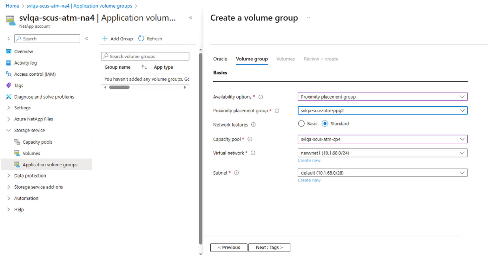 ](../media/azure-netapp-files/proximity-placement-group-oracle.png#lightbox)

6. In the **Tags** section of the Volume Group tab, you can add tags as needed for the volumes.   

    Click **Next: Protocol**. 

    [ 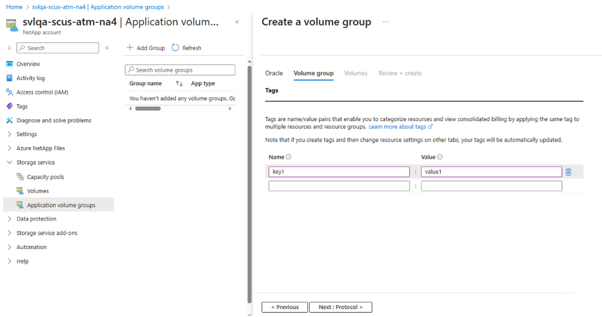 ](../media/azure-netapp-files/application-add-tags-oracle.png#lightbox)

7. In the **Protocols** section of the Volume Group tab, you can select the NFS version, modify the Export Policy, and select [LDAP-enabled volume](lightweight-directory-access-protocol.md). These settings need to be common to all volumes.  

    > [!NOTE]
    > For optimal performance, use Oracle dNFS to mount the volumes at the database server. Consider using NFSv3 as a base for dNFS, although NFSv4.1 is also supported. Check the support documentation of your Azure VM operating system for guidance about which NFS protocol version to use in combination with dNFS and your operating system. 

    Click **Next: Volumes**. 

    [ 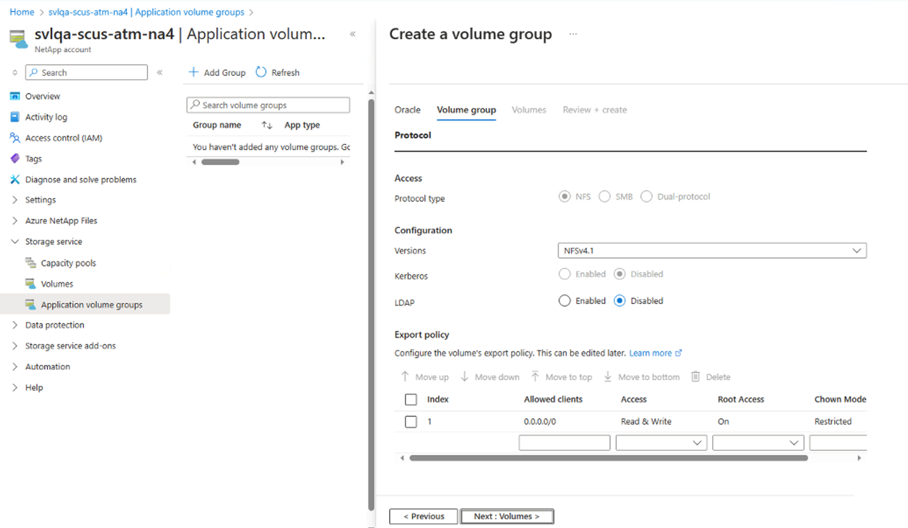 ](../media/azure-netapp-files/application-protocols-tag-oracle.png#lightbox)

8. The **Volumes** tab summarizes the volumes that are being created with proposed volume name, quota, and throughput. 

    The Volumes tab also shows the zone or proximity placement group in which the volumes are created.

    The creation for the data-backup and log-backup volumes is optional.

    

9. In the **Volumes** tab, you can select each volume to view or change the volume details.   

    When you select a volume, you can change the following values in the **Volume-Detail-Basics** tab:

    * **Volume Name**:   
        It's recommended that you retain the suggested naming conventions.
    * **Quota**:   
        The size of the volume.
    * **Throughput**:  
        You can edit the proposed throughput requirements for the selected volume.

    Click **Next: Protocols** to review the protocol settings. 

    [ 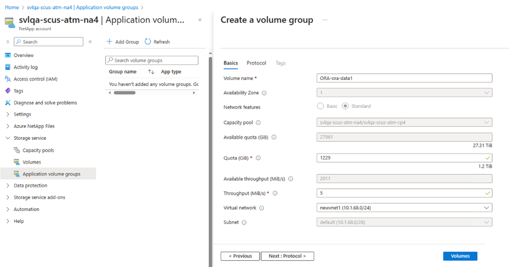 ](../media/azure-netapp-files/application-create-volume-basics-tab-oracle.png#lightbox)

10. In the **Volume Details - Protocol** tab of a volume, the defaults are based on the volume group input you provided previously. You can adjust the file path that is used for mounting the volume, as well as the export policy.

    > [!NOTE]
    > For consistency, consider keeping volume name and file path identical.

    Click **Next: Tags** to review the tags settings. 

    

11. In the **Volume Detail – Tags** tab of a volume, the defaults are based on the volume group input you provided previously. You can adjust volume specific tags here.

    Click **Volumes** to return to the Volumes tab.

    

12. The **Volumes Tab** enables you to remove optional volumes.  
    On the Volumes tab, optional volumes are marked with an asterisk (`*`) in front of the name.   
    If you want to remove the optional volumes, such as `ORA1-ora-data4` volume or `ORA1-ora-binary` volume from the volume group, select the volume and click **Remove volume**. Confirm the removal in the dialog box that appears.

    > [!IMPORTANT]    
    > You cannot add a removed volume back to the volume group again.

    Click **Next: Review + Create** after completing the changes of the volumes.

    [ 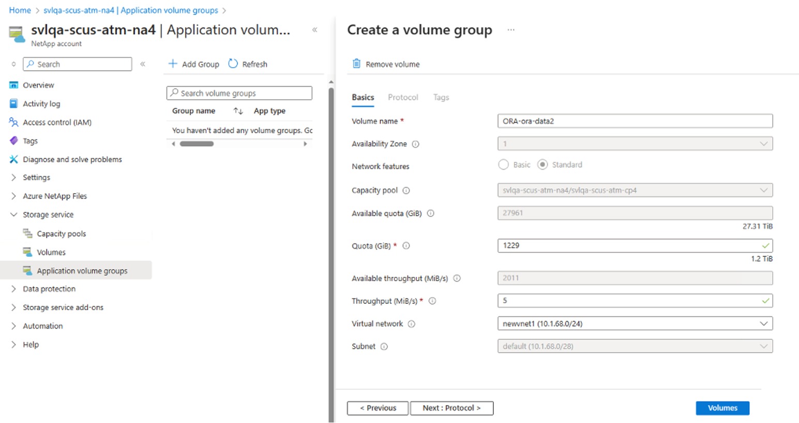 ](../media/azure-netapp-files/application-volume-remove-oracle.png#lightbox)   

    [ 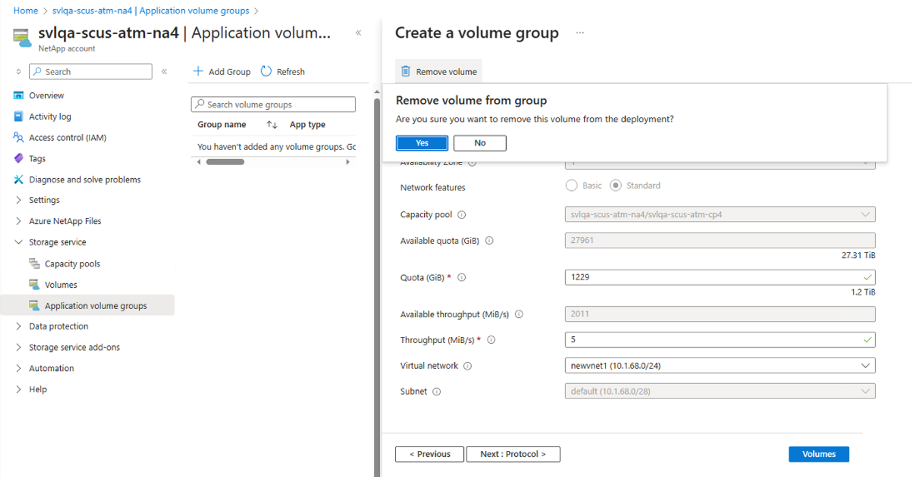 ](../media/azure-netapp-files/application-volume-remove-confirm-oracle.png#lightbox)

13.	The **Review + Create** tab lists all the volumes that will be created.  

    Click **Create Volume Group** to start the volume group creation.

    [ 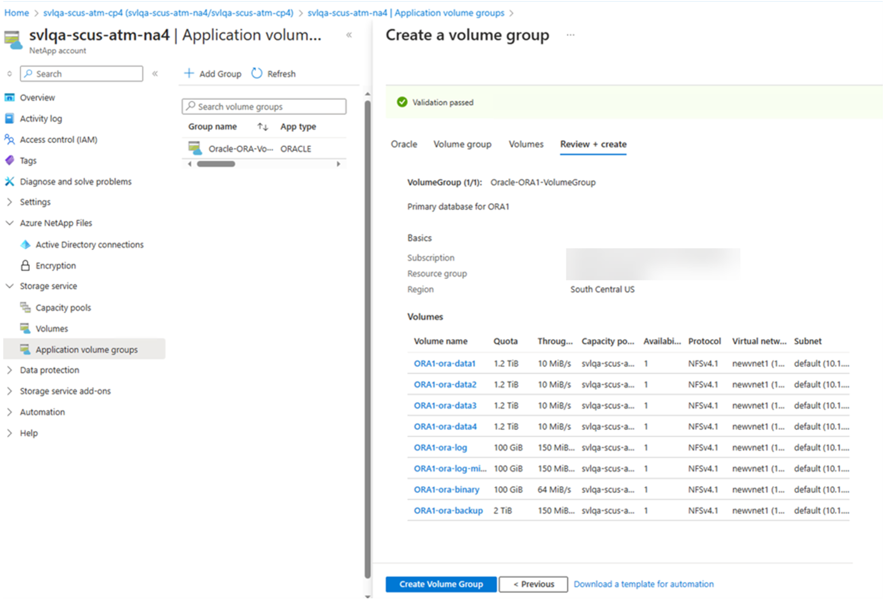 ](../media/azure-netapp-files/application-review-create-oracle.png#lightbox)

14. The **Volume Groups** deployment workflow starts, and the progress is displayed. This process can take a few minutes to complete.

    [ 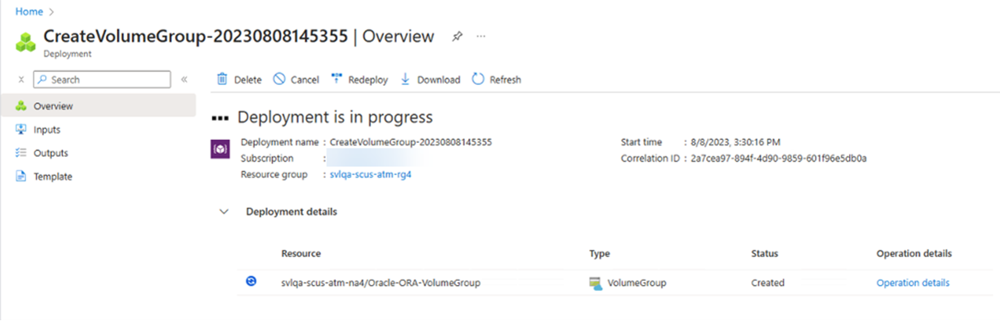 ](../media/azure-netapp-files/application-deployment-in-progress-oracle.png#lightbox)

    You can display the list of volume groups to see the new volume group. You can select the new volume group to see the details and status of each of the volumes being created.

    Creating a volume group is an "all-or-none" operation. If one volume can't be created, all remaining volumes will be removed also.

    [ 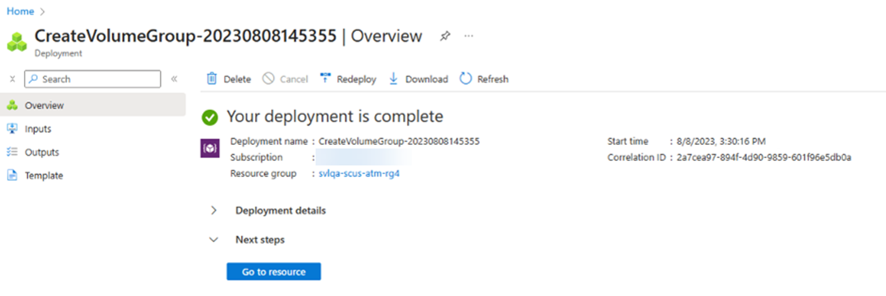 ](../media/azure-netapp-files/application-new-volume-group-oracle.png#lightbox)

15. You can display the list of volume groups to see the new volume group. You can select the new volume group to see the details and status of each of the volumes being created.

    [ 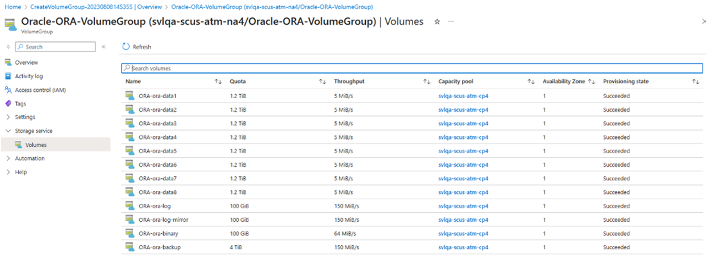 ](../media/azure-netapp-files/application-list-volume-group-oracle.png#lightbox)

## Next steps

* [Understand application volume group for Oracle](application-volume-group-oracle-introduction.md)
* [Requirements and considerations for application volume group for Oracle](application-volume-group-oracle-considerations.md)
* [Manage volumes in an application volume group for Oracle](application-volume-group-manage-volumes-oracle.md)
* [Configure application volume group for Oracle using REST API](configure-application-volume-oracle-api.md) 
* [Deploy application volume group for Oracle using Azure Resource Manager](configure-application-volume-oracle-azure-resource-manager.md) 
* [Troubleshoot application volume group errors](troubleshoot-application-volume-groups.md)
* [Delete an application volume group](application-volume-group-delete.md)
* [Application volume group FAQs](faq-application-volume-group.md)
