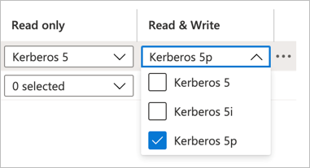
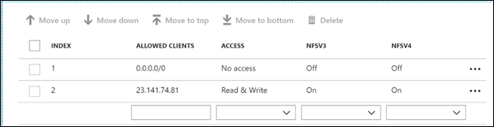

# Configure export policy for NFS or dual-protocol volumes

You can configure export policy to control access to an Azure NetApp Files volume that uses the NFS protocol (NFSv3 and NFSv4.1) or the dual protocol (NFSv3 and SMB, or NFSv4.1 and SMB). 

You can create up to five export policy rules.

## Configure the policy 

1.	On the **Volumes** page, select the volume for which you want to configure the export policy, and then select **Export policy**. You can also configure the export policy during the creation of the volume.

2.	To create an export policy rule, specify the following information:   
    * **Index**: Specify the index number for the rule.  
      
      An export policy can consist of up to five rules. Rules are evaluated according to their order in the list of index numbers. Rules with lower index numbers are evaluated first. For example, the rule with index number 1 is evaluated before the rule with index number 2. 

    * **Allowed Clients**: Specify the value in one of the following formats:  
      * IPv4 address. Example: `10.1.12.24`
      * IPv4 address with a subnet mask expressed as a number of bits. Example: `10.1.12.10/4`
      * Comma-separated IP addresses. You can enter multiple host IPs or subnet masks in a single rule by separating them with commas. The length limit is 4096 characters. Example: `10.1.12.25,10.1.12.28,10.1.12.29,10.1.12.10/4`

    * **Access**: Select one of the following access types:  
      * No Access 
      * Read & Write
      * Read Only

    * **Read-only** and **Read/Write**: If you use Kerberos encryption with NFSv4.1, follow the instructions in [Configure NFSv4.1 Kerberos encryption](configure-kerberos-encryption.md).  For performance impact of Kerberos, see [Performance impact of Kerberos on NFSv4.1 volumes](performance-impact-kerberos.md). 

       

    * **Root Access**: Specify whether the `root` account can access the volume.  By default, Root Access is set to **On**, and the `root` account has access to the volume.  This option is not available for NFSv4.1 Kerberos volumes.

       

    * **Chown Mode**:	Modify the change ownership mode as needed to set the ownership management capabilities of files and directories.  Two options are available:   

      * `Restricted` (default) - Only the root user can change the ownership of files and directories.
      * `Unrestricted` - Non-root users can change the ownership for files and directories that they own.  

        Registration requirement and considerations apply for setting **`Chown Mode`**. Follow instructions in [Configure Unix permissions and change ownership mode](configure-unix-permissions-change-ownership-mode.md).  

       

## Next steps 
* [Mount or unmount a volume](azure-netapp-files-mount-unmount-volumes-for-virtual-machines.md)
* [Configure Unix permissions and change ownership mode](configure-unix-permissions-change-ownership-mode.md) 
* [Manage snapshots](azure-netapp-files-manage-snapshots.md)
