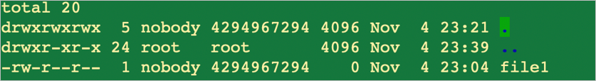
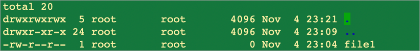
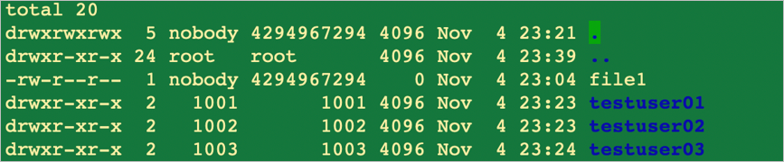

# Configure NFSv4.1 domain for Azure NetApp Files

NFSv4 introduces the concept of an authentication domain. Azure NetApp Files currently supports root-only user mapping from the service to the NFS client. To use the NFSv4.1 functionality with Azure NetApp Files, you need to update the NFS client.

## Default behavior of user/group mapping

Root mapping defaults to the `nobody` user because the NFSv4 domain is set to `localdomain` by default. When you mount an Azure NetApp Files NFSv4.1 volume as root, you'll see file permissions as follows:  



As the above example shows, the user for `file1` should be `root`, but it maps to `nobody` by default.  This article shows you how to set the `file1` user to `root` by changing the `idmap Domain` setting to `defaultv4iddomain.com`.  

## Configure NFSv4.1 domain  

1. Edit the `/etc/idmapd.conf` file on the NFS client.   
    Uncomment the line `#Domain` (that is, remove the `#` from the line), and change the value `localdomain` as follows:

    * If the volume isn’t enabled for LDAP, set `Domain = defaultv4iddomain.com`.
    * If the volume is [enabled for LDAP](configure-ldap-extended-groups.md), set `Domain` to the domain that is configured in the Active Directory Connection on your NetApp account.
        For instance, if `contoso.com` is the configured domain in the NetApp account, then set `Domain = contoso.com`.

    The following examples show the initial configuration of `/etc/idmapd.conf` before changes:

    ```
    [General]
    Verbosity = O 
    Pipefs—Directory = /run/rpc_pipefs 
    # set your own domain here, if it differs from FQDN minus hostname 
    # Domain = localdomain 
     
    [Mapping] 
    Nobody-User = nobody 
    Nobody-Group = nogroup 
    ```

    The following example shows updated configuration of *non-LDAP* NFSv4.1 volumes:

    ```
    [General]
    Verbosity = O 
    Pipefs—Directory = /run/rpc_pipefs 
    # set your own domain here, if it differs from FQDN minus hostname 
    Domain = defaultv4iddomain.com 
 
    [Mapping] 
    Nobody-User = nobody 
    Nobody-Group = nogroup 
    ```

    The following example shows updated configuration of *LDAP-enabled* NFSv4.1 volumes. In this example, `contoso.com` is the configured domain in the NetApp account:

    ```
    [General]
    Verbosity = O 
    Pipefs—Directory = /run/rpc_pipefs 
    # set your own domain here, if it differs from FQDN minus hostname 
    Domain = contoso.com
    
    [Mapping] 
    Nobody-User = nobody 
    Nobody-Group = nogroup 
    ```

2. Unmount any currently mounted NFS volumes.
3. Update the `/etc/idmapd.conf` file.
4. Clear the keyring of the NFS `idmapper` (`nfsidmap -c`).
5. Mount the NFS volumes as required.   

    See [Mount a volume for Windows or Linux VMs](azure-netapp-files-mount-unmount-volumes-for-virtual-machines.md). 

The following example shows the resulting user/group change: 



As the example shows, the user/group has now changed from `nobody` to `root`.

## Behavior of other (nonroot) users and groups

Azure NetApp Files supports local users (users created locally on a host) who have permissions associated with files or folders in NFSv4.1 volumes. However, the service doesn't currently support mapping the users/groups across multiple nodes. Therefore, users created on one host don't map by default to users created on another host. 

In the following example, `Host1` has three existing test user accounts (`testuser01`, `testuser02`, `testuser03`): 


On `Host2`, the test user accounts haven't been created, but the same volume is mounted on both hosts:



## Next step 

* [Mount a volume for Windows or Linux VMs](azure-netapp-files-mount-unmount-volumes-for-virtual-machines.md)
* [Configure AD DS LDAP with extended groups for NFS volume access](configure-ldap-extended-groups.md)

