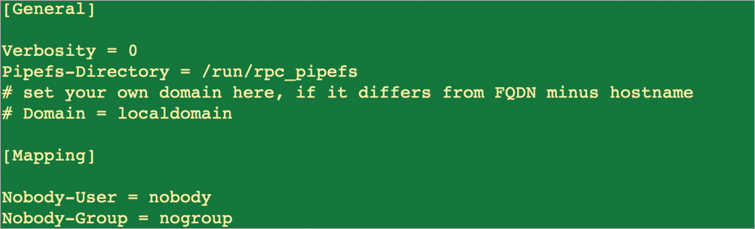
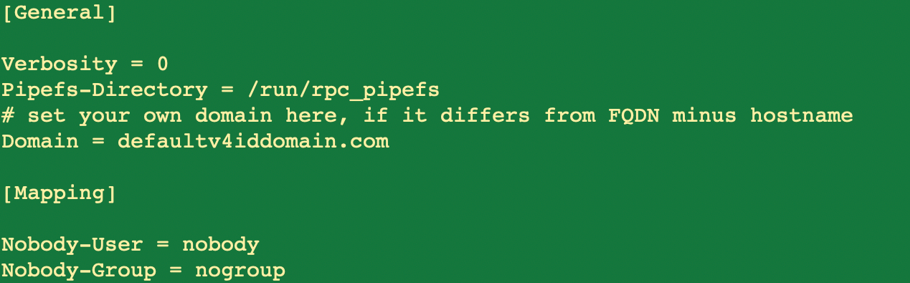

# Configure NFSv4.1 default domain for Azure NetApp Files

NFSv4 introduces the concept of an authentication domain. Azure NetApp Files currently supports root-only user mapping from the service to the NFS client. To use the NFSv4.1 functionality with Azure NetApp Files, you need to update the NFS client.

## Default behavior of user/group mapping

Root mapping defaults to the `nobody` user because the NFSv4 domain is set to `localdomain`. When you mount an Azure NetApp Files NFSv4.1 volume as root, you will see file permissions as follows:  

As the above example shows, the user for `file1` should be `root`, but it maps to `nobody` by default.  This article shows you how to set the `file1` user to `root`.  

## Steps 

1. Edit the `/etc/idmapd.conf` file on the NFS client.   
    Uncomment the line `#Domain` (that is, remove the `#` from the line), and change the value `localdomain` to `defaultv4iddomain.com`. 

    Initial configuration: 
    
    

    Updated configuration:
    
    

2. Unmount any currently mounted NFS volumes.
3. Update the `/etc/idmapd.conf` file.
4. Restart the `rpcbind` service on your host (`service rpcbind restart`), or simply reboot the host.
5. Mount the NFS volumes as required.   

    See [Mount or unmount a volume for Windows or Linux virtual machines](azure-netapp-files-mount-unmount-volumes-for-virtual-machines.md). 

The following example shows the resulting user/group change: 

As the example shows, the user/group has now changed from `nobody` to `root`.

## Behavior of other (non-root) users and groups

Azure NetApp Files supports local users (users created locally on a host) who have permissions associated with files or folders in NFSv4.1 volumes. However, the service does not currently support mapping the users/groups across multiple nodes. Therefore, users created on one host do not map by default to users created on another host. 

In the following example, `Host1` has three existing test user accounts (`testuser01`, `testuser02`, `testuser03`): 

On `Host2`, note that the test user accounts have not been created, but the same volume is mounted on both hosts:

## Next step 

[Mount or unmount a volume for Windows or Linux virtual machines](azure-netapp-files-mount-unmount-volumes-for-virtual-machines.md)

