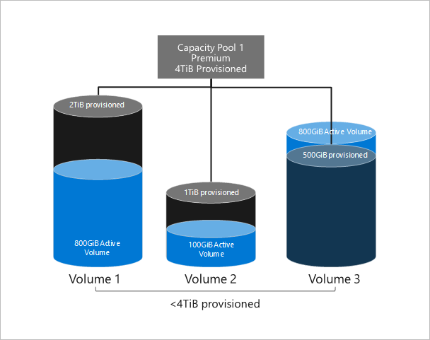
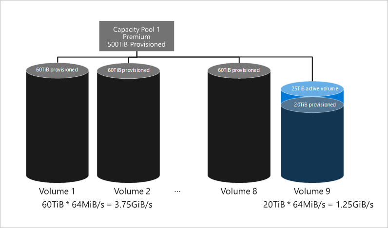

# Cost model for Azure NetApp Files 

Understanding the cost model for Azure NetApp Files helps you manage your expenses from the service.

## Calculation of capacity consumption

Azure NetApp Files is billed on provisioned storage capacity.  Provisioned capacity is allocated by creating capacity pools.  Capacity pools are billed based on $/provisioned-GiB/month in hourly increments. The minimum size for a single capacity pool is 4 TiB, and capacity pools can be subsequently expanded in 1-TiB increments. Volumes are created within capacity pools.  Each volume is assigned a quota that decrements from the pools-provisioned capacity. The quota that can be assigned to volumes ranges from a minimum of 100 GiB to a maximum of 92 TiB.  

For an active volume, capacity consumption against quota is based on logical (effective) capacity.

If the actual capacity consumption of a volume exceeds its storage quota, the volume can continue to grow. Writes will still be permitted as long as the actual volume size is less than the system limit (100 TiB).  

The total used capacity in a capacity pool against its provisioned amount is the sum of the greater of either the assigned quota or actual consumption of all volumes within the pool: 

   

The diagram below illustrates these concepts.  
* We have a capacity pool with 4 TiB of provisioned capacity.  The pool contains three volumes.  
    * Volume 1 is assigned a quota of 2 TiB and has 800 GiB of consumption.  
    * Volume 2 is assigned a quota of 1 TiB and has 100 GiB of consumption.  
    * Volume 3 is assigned a quota of 500 GiB but has 800 GiB of consumption (overage).  
* The capacity pool is metered for 4 TiB of capacity (the provisioned amount).  
    3.8 TiB of capacity is consumed (2 TiB and 1 TiB of quota from Volumes 1 and 2, and 800 GiB of actual consumption for Volume 3). And 200 GiB of capacity is remaining.

   

## Overage in capacity consumption  

When the total used capacity of a pool exceeds its provisioned capacity, data writes are still permitted.  After the grace period (one hour), if the used capacity of the pool still exceeds its provisioned capacity, then the pool size will be automatically increased in increments of 1 TiB until the provisioned capacity is greater than the total used capacity.  For example, in the illustration above, if Volume 3 continues to grow and the actual consumption reaches 1.2 TiB, then after the grace period, the pool will automatically be resized to 5 TiB.  The result is that the provisioned pool capacity (5 TiB) exceeds the used capacity (4.2 TiB).  

## Manual changes of the pool size  

You can manually increase or decrease the pool size. However, the following constraints apply:
* Service minimum and maximum limits  
    See the article about [resource limits](azure-netapp-files-resource-limits.md).
* A 1-TiB increment after the initial 4-TiB minimum purchase
* A one-hour minimum billing increment
* The provisioned pool size may not be decreased to less than the total used capacity in the pool.

## Behavior of maximum-size pool overage   

The maximum size of a capacity pool that you can create or resize to is 500 TiB.  When the total used capacity in a capacity pool exceeds 500 TiB, the following situations will occur:
* Data writes will still be permitted (if the volume is below the system maximum of 100 TiB).
* After the one-hour grace period, the pool will be automatically resized in 1-TiB increments, until the pool provisioned capacity exceeds total used capacity.
* The additional provisioned and billed pool capacity exceeding 500 TiB cannot be used to assign volume quota. It also cannot be used to expand performance QoS limits.  
    See [service levels](azure-netapp-files-service-levels.md) about performance limits and QoS sizing.

The diagram below illustrates these concepts:
* We have a capacity pool with a Premium storage tier and a 500-TiB capacity. The pool contains nine volumes.
    * Volumes 1 through 8 are assigned a quota of 60 TiB each.  The total used capacity is 480 TiB.  
        Each volume has a QoS limit of 3.75 GiB/s of throughput (60 TiB * 64 MiB/s).  
    * Volume 9 is assigned a quota of 20 TiB.  
        Volume 9 has a QoS limit of 1.25 GiB/s of throughput (60 TiB * 64 MiB/s).
* Volume 9 is an overage scenario. It has 25 TiB of actual consumption.  
    * After the one-hour grace period, the capacity pool will be resized to 505 TiB.  
        That is, total used capacity = 8 * 60-TiB quota for Volumes 1 through 8, and 25 TiB of actual consumption for Volume 9.
    * The billed capacity is 505 TiB.
    * Volume quota for Volume 9 cannot be increased (because the total assigned quota for the pool may not exceed 500 TiB).
    * Additional QoS throughput may not be assigned (because the total QoS for the pool is still based on 500 TiB).

   

## Capacity consumption of snapshots 

The capacity consumption of snapshots in Azure NetApp Files is charged against the quota of the parent volume.  As a result, it shares the same billing rate as the capacity pool to which the volume belongs.  However, unlike the active volume, snapshot consumption is measured based on the incremental capacity consumed.  Azure NetApp Files snapshots are differential in nature. Depending on the change rate of the data, the snapshots often consume much less capacity than the logical capacity of the active volume. For example, assume that you have a snapshot of a 500-GiB volume that only contains 10 GiB of differential data. The capacity that is charged against the volume quota for that snapshot would be 10 GiB, not 500 GiB. 

## Next steps

* [Azure NetApp Files pricing page](https://azure.microsoft.com/pricing/details/storage/netapp/)
* [Service levels for Azure NetApp Files](azure-netapp-files-service-levels.md)
* [Resource limits for Azure NetApp Files](azure-netapp-files-resource-limits.md)
