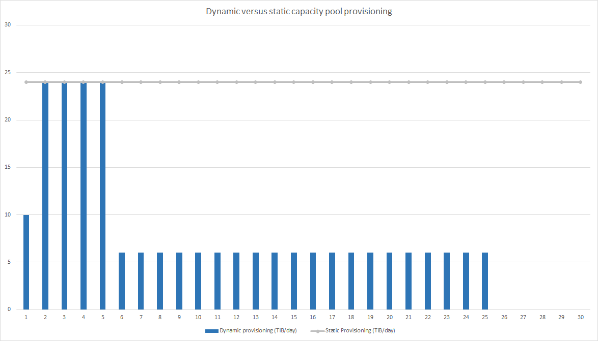
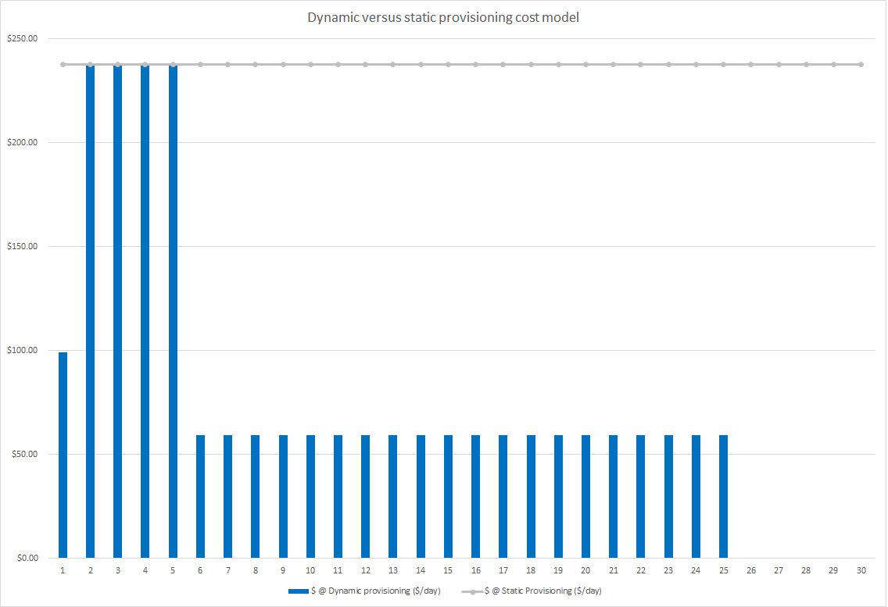
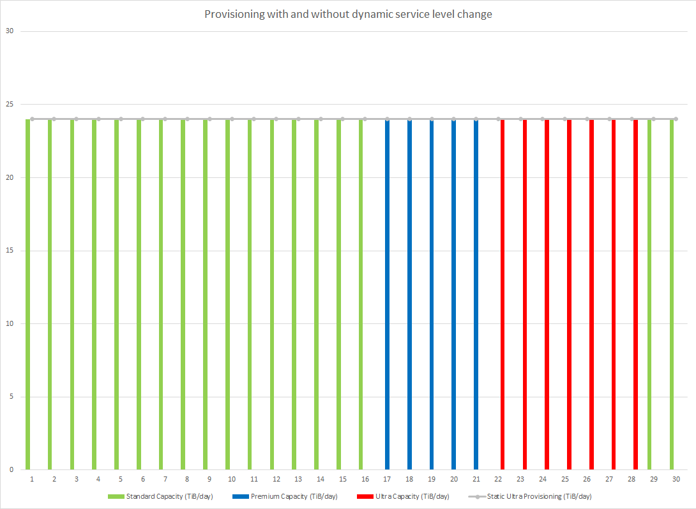
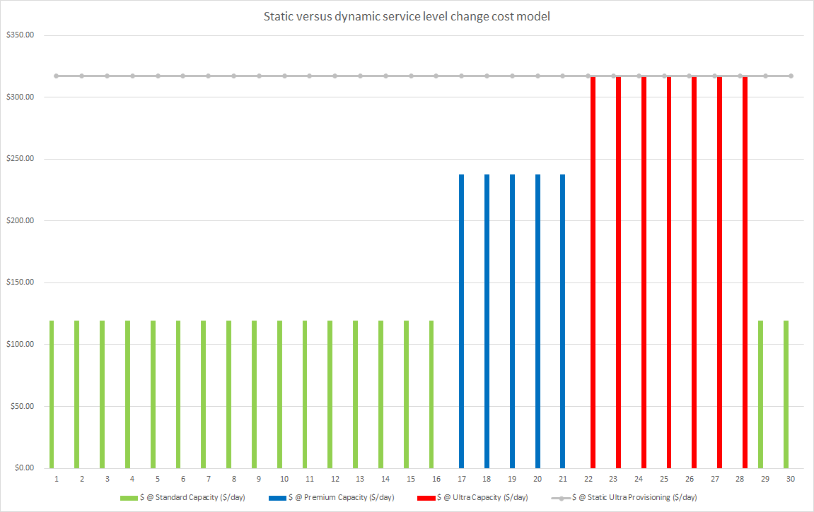

# Cost model for Azure NetApp Files 

Understanding the cost model for Azure NetApp Files helps you manage your expenses from the service. 

For cost model specific to cross-region replication, see [Cost model for cross-region replication](cross-region-replication-introduction.md#cost-model-for-cross-region-replication).

## Calculation of capacity consumption

Azure NetApp Files is billed on provisioned storage capacity, which is allocated by creating capacity pools. Capacity pools are billed monthly based on a set cost per allocated GiB per hour. Capacity pool allocation is measured hourly.  

Capacity pools must be at least 2 TiB and can be increased or decreased in 1-TiB intervals. Capacity pools contain volumes that range in size from a minimum of 100 GiB to a maximum of 100 TiB. Volumes are assigned quotas that are subtracted from the capacity pool’s provisioned size. For an active volume, capacity consumption against the quota is based on logical (effective) capacity, being active filesystem data or snapshot data. See [How Azure NetApp Files snapshots work](snapshots-introduction.md) for details. 

### Pricing examples

This section shows you examples to help you understand the Azure NetApp Files cost model.

#### Example 1: One month cost with static versus dynamic capacity pool provisioning 

If your capacity pool size requirements fluctuate (for example, because of variable capacity or performance needs), consider [dynamically resizing your volumes and capacity pools](azure-netapp-files-resize-capacity-pools-or-volumes.md) to balance cost with capacity and performance needs.

For example, you are using the Premium capacity 24 hours (1 day) at 10 TiB, 96 hours (4 days) at 24 TiB, four times at 6 hours (1 day) at 5 TiB, 480 hours (20 days) at 6 TiB, and the month’s remaining hours at 0 TiB. A dynamic cloud consumption deployment profile looks different from a traditional static on-premises consumption profile: 

When costs are billed at $0.000403 per GiB/hour ([pricing depending on the region](https://azure.microsoft.com/pricing/details/netapp/)), the monthly cost breakdown looks like this:

*Static provisioning on Premium (peak capacity/performance)*

* 24 TiB x 720 hours x $0.000403 per GiB/hour = $7,130.97 per month ($237.70 per day) 

*Dynamic provisioning using volume and capacity pool resizing* 

* 10 TiB x 24 hours x $0.000403 per GiB/hour = 	$99.04
* 24 TiB x 96 hours x $0.000403 per GiB/hour = 	$950.80
* 6 TiB x 480 hours x $0.000403 per GiB/hour =	$1,188.50
* Total = **$2,238.33**

This scenario constitutes a monthly savings of $4,892.64 compared to static provisioning.

#### Example 2: One month cost with and without dynamic service level change

If your capacity pool size requirements remain the same but performance requirements fluctuate, consider [dynamically changing the service level of a volume](dynamic-change-volume-service-level.md). You can provision and deprovision capacity pools of different types throughout the month, providing just-in-time performance, and lowering costs during periods where performance is not needed. 

Consider a scenario where the capacity requirement is a constant 24 TiB. But your performance needs fluctuate between 384 hours (16 days) of Standard service level, 120 hours (5 days) of Premium service level, 168 hours (7 days) of Ultra service level, and then back to 48 hours (2 days) of standard service level performance. In this scenario, a dynamic cloud consumption deployment profile looks different compared to a traditional static on-premises consumption profile: 

In this case, when costs are billed at $0.000202 per GiB/hour (Standard), $0.000403 per GiB/hour (Premium) and $0.000538 per GiB/hour (Ultra) respectively ([pricing depending on the region](https://azure.microsoft.com/pricing/details/netapp/)), the monthly cost breakdown looks like this: 

*Static provisioning on Ultra service level (peak performance)*

* 24 TiB x 720 hours x $0.000538 per GiB/hour = $9,519.76 per month ($317.33 per day) 
 
*Dynamic provisioning using dynamic service level change*

* 24 TiB x 384 hours x $0.000202 per GiB/hour  = $1,901.31  
* 24 TiB x 120 hours x $0.000403 per GiB/hour  = $1,188.50  
* 24 TiB x 168 hours x $0.000538 per GiB/hour  = $2,221.28  
* 24 TiB x 48 hours x $0.000202 per GiB/hour   = $238.29 
* Total = **$5,554.37** 

This scenario constitutes a monthly savings of $3,965.39 compared to static provisioning.

## Capacity consumption of snapshots 

The capacity consumption of snapshots in Azure NetApp Files is charged against the quota of the parent volume.  As a result, it shares the same billing rate as the capacity pool to which the volume belongs.  However, unlike the active volume, snapshot consumption is measured based on the incremental capacity consumed.  Azure NetApp Files snapshots are differential in nature. Depending on the change rate of the data, the snapshots often consume much less capacity than the logical capacity of the active volume. For example, assume that you have a snapshot of a 500-GiB volume that only contains 10 GiB of differential data. 

The capacity consumption that is counted towards the volume quota for the active filesystem and snapshot would be 510 GiB, not 1000 GiB. As a general rule, a recommended 20% of capacity can be assumed to retain a week's worth of snapshot data (depending on snapshot frequency and application daily block level change rates). 

The following diagram illustrates the concepts. 

* Assume a capacity pool with 10 TiB of provisioned capacity. The pool contains three volumes:    
    * Volume 1 is assigned a quota of 5 TiB and has 3.5 TiB (3 TiB active, 500 GiB snapshots) of consumption.
    * Volume 2 is assigned a quota of 900 GiB and has 400 GiB of consumption.
    * Volume 3 is assigned a quota of 4 TiB but is full, with 4 TiB (3.5 TiB active, 500 GiB snapshots) of consumption.  
* The capacity pool is metered (and billed) for 10 TiB of capacity (the _provisioned_ amount):
    * 9.9 TiB of capacity is _allocated_ (5 TiB, 900 GiB, and 4 TiB of quota from Volumes 1, 2, and 3).
    * 7.9 TiB of capacity is used (3.5 TiB, 400 GiB, 4 TiB in Volumes 1, 2, and 3).
* The capacity pool has 100 GiB of unprovisioned capacity remaining.   

:::image type="content" source="../media/azure-netapp-files/azure-netapp-files-capacity-pool-with-three-vols.png" alt-text="Diagram showing capacity pool with three volumes." lightbox="../media/azure-netapp-files/azure-netapp-files-capacity-pool-with-three-vols.png":::

## Next steps

* [Azure NetApp Files pricing page](https://azure.microsoft.com/pricing/details/storage/netapp/)
* [Service levels for Azure NetApp Files](azure-netapp-files-service-levels.md)
* [Resource limits for Azure NetApp Files](azure-netapp-files-resource-limits.md)
* [Cost model for cross-region replication](cross-region-replication-introduction.md#cost-model-for-cross-region-replication)
* [Understand volume quota](volume-quota-introduction.md)
* [Monitor the capacity of a volume](monitor-volume-capacity.md)
* [Resize the capacity pool or a volume](azure-netapp-files-resize-capacity-pools-or-volumes.md)
* [Manage billing by using tags](manage-billing-tags.md)
* [Capacity management FAQs](faq-capacity-management.md)
* [Azure NetApp Files pricing calculator](https://azure.microsoft.com/pricing/calculator/?service=netapp)
