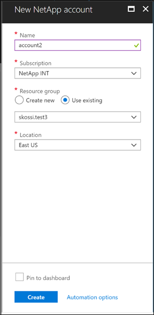

# Create a NetApp account
Creating a NetApp account enables you to set up a capacity pool and subsequently create a volume. You use the Azure NetApp Files blade to create a new NetApp account.

## Before you begin

You must have registered your subscription for using the NetApp Resource Provider. See [Register the NetApp Resource Provider](azure-netapp-files-register.md).

## Steps 

1. Sign in to the Azure portal. 
2. Access the Azure NetApp Files blade by using one of the following methods:  
   * Search for **Azure NetApp Files** in the Azure portal search box.  
   * Click **All services** in the navigation, and then filter to Azure NetApp Files.  

   You can "favorite" the Azure NetApp Files blade by clicking the star icon next to it. 

3. Click **+ Add** to create a new NetApp account.  
   The New NetApp account window appears.  

4. Provide the following information for your NetApp account: 
   * **Account name**  
     Specify a unique name for the subscription.
   * **Subscription**  
     Select a subscription from your existing subscriptions.
   * **Resource group**   
     Use an existing Resource Group or create a new one.
   * **Location**  
     Select the region where you want the account and its child resources to be located.  

     

5. Click **Create**.     
   The NetApp account you created now appears in the Azure NetApp Files blade. 

> [!NOTE] 
> If you haven't registered your subscription for using the NetApp Resource Provider, you will receive the following error when you try to create the first NetApp account:  
>
> `{"code":"DeploymentFailed","message":"At least one resource deployment operation failed. Please list deployment operations for details. Please see https://aka.ms/arm-debug for usage details.","details":[{"code":"NotFound","message":"{\r\n \"error\": {\r\n \"code\": \"InvalidResourceType\",\r\n \"message\": \"The resource type could not be found in the namespace 'Microsoft.NetApp' for api version '20xx-xx-xx'.\"\r\n }\r\n}"}]}`

## Next steps  

[Create a capacity pool](azure-netapp-files-set-up-capacity-pool.md)

