# Create an SMB volume for Azure NetApp Files

Azure NetApp Files supports NFS and SMBv3 volumes. A volume's capacity consumption counts against its pool's provisioned capacity. This article shows you how to create an SMBv3 volume. If you want to create an NFS volume, see [Create an NFS volume for Azure NetApp Files](azure-netapp-files-create-volumes.md). 

## Before you begin 
You must have already set up a capacity pool.   
[Set up a capacity pool](azure-netapp-files-set-up-capacity-pool.md)   
A subnet must be delegated to Azure NetApp Files.  
[Delegate a subnet to Azure NetApp Files](azure-netapp-files-delegate-subnet.md)

## Requirements for Active Directory connections

 You need to create Active Directory connections before creating an SMB volume. The requirements for Active Directory connections are as follows: 

* The admin account you use must have the capability to create machine accounts in the organizational unit (OU) path that you will specify.  

* Proper ports must be open on the applicable Windows Active Directory (AD) server.  
    The required ports are as follows: 

    |     Service           |     Port     |     Protocol     |
    |-----------------------|--------------|------------------|
    |    AD Web Services    |    9389      |    TCP           |
    |    DNS                |    53        |    TCP           |
    |    DNS                |    53        |    UDP           |
    |    ICMPv4             |    N/A       |    Echo Reply    |
    |    Kerberos           |    464       |    TCP           |
    |    Kerberos           |    464       |    UDP           |
    |    Kerberos           |    88        |    TCP           |
    |    Kerberos           |    88        |    UDP           |
    |    LDAP               |    389       |    TCP           |
    |    LDAP               |    389       |    UDP           |
    |    LDAP               |    3268      |    TCP           |
    |    NetBIOS name       |    138       |    UDP           |
    |    SAM/LSA            |    445       |    TCP           |
    |    SAM/LSA            |    445       |    UDP           |
    |    w32time            |    123       |    UDP           |

* The site topology for the targeted Active Directory Domain Services must adhere to the guidelines, in particular the Azure VNet where Azure NetApp Files is deployed.  

    The address space for the virtual network where Azure NetApp Files is deployed must be added to a new or existing Active Directory site (where a domain controller reachable by Azure NetApp Files is). 

* The specified DNS servers must be reachable from the [delegated subnet](https://docs.microsoft.com/azure/azure-netapp-files/azure-netapp-files-delegate-subnet) of Azure NetApp Files.  

    See [Guidelines for Azure NetApp Files network planning](https://docs.microsoft.com/azure/azure-netapp-files/azure-netapp-files-network-topologies) for supported network topologies.

    The Network Security Groups (NSGs) and firewalls must have appropriately configured rules to allow for Active Directory and DNS traffic requests. 

* The Azure NetApp Files delegated subnet must be able to reach all Active Directory Domain Services (ADDS) domain controllers in the domain, including all local and remote domain controllers. Otherwise, service interruption can occur.  

    If you have domain controllers that are unreachable by the Azure NetApp Files delegated subnet, you can specify an Active Directory site during creation of the Active Directory connection.  Azure NetApp Files needs to communicate only with domain controllers in the site where the Azure NetApp Files delegated subnet address space is.

    See [Designing the site topology](https://docs.microsoft.com/windows-server/identity/ad-ds/plan/designing-the-site-topology) about AD sites and services. 
    
<!--
* Azure NetApp Files supports DES, Kerberos AES 128, and Kerberos AES 256 encryption types (from the least secure to the most secure). The user credentials used to join Active Directory must have the highest corresponding account option enabled that matches the capabilities enabled for your Active Directory.   

    For example, if your Active Directory has only the AES-128 capability, you must enable the AES-128 account option for the user credentials. If your Active Directory has the AES-256 capability, you must enable the AES-256 account option (which also supports AES-128). If your Active Directory does not have any Kerberos encryption capability, Azure NetApp Files uses DES by default.  

    You can enable the account options in the properties of the Active Directory Users and Computers Microsoft Management Console (MMC):   

    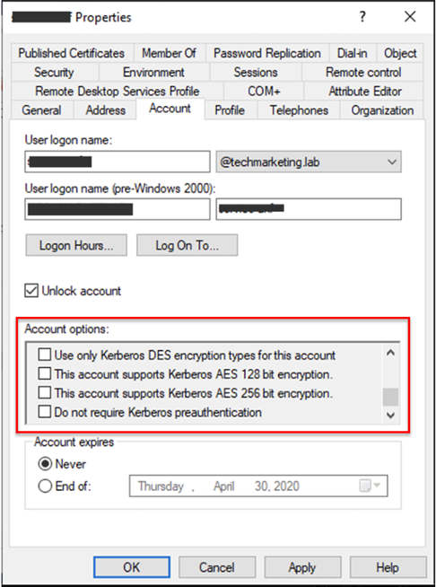
-->

See Azure NetApp Files [SMB FAQs](https://docs.microsoft.com/azure/azure-netapp-files/azure-netapp-files-faqs#smb-faqs) about additional AD information. 

## Decide which Domain Services to use 

Azure NetApp Files supports both [Active Directory Domain Services](https://docs.microsoft.com/windows-server/identity/ad-ds/plan/understanding-active-directory-site-topology) (ADDS) and Azure Active Directory Domain Services (AADDS) for AD connections.  Before you create an AD connection, you need to decide whether to use ADDS or AADDS.  

For more information, see [Compare self-managed Active Directory Domain Services, Azure Active Directory, and managed Azure Active Directory Domain Services](https://docs.microsoft.com/azure/active-directory-domain-services/compare-identity-solutions). 

### Active Directory Domain Services

You can use your preferred [Active Directory Sites and Services](https://docs.microsoft.com/windows-server/identity/ad-ds/plan/understanding-active-directory-site-topology) scope for Azure NetApp Files. This option enables reads and writes to Active Directory Domain Services (ADDS) domain controllers that are [accessible by Azure NetApp Files](azure-netapp-files-network-topologies.md). It also prevents the service from communicating with domain controllers that are not in the specified Active Directory Sites and Services site. 

To find your site name when you use ADDS, you can contact the administrative group in your organization that is responsible for Active Directory Domain Services. The example below shows the Active Directory Sites and Services plugin where the site name is displayed: 

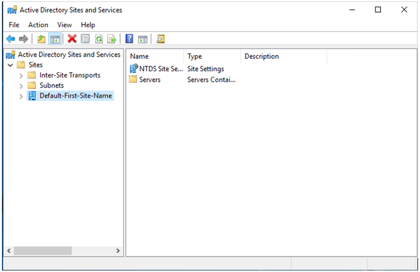

When you configure an AD connection for Azure NetApp Files, you specify the site name in scope for the **AD Site Name** field.

### Azure Active Directory Domain Services 

For Azure Active Directory Domain Services (AADDS) configuration and guidance, see [Azure AD Domain Services documentation](https://docs.microsoft.com/azure/active-directory-domain-services/).

Additional AADDS considerations apply for Azure NetApp Files: 

* Ensure the VNet or subnet where AADDS is deployed is in the same Azure region as the Azure NetApp Files deployment.
* If you use another VNet in the region where Azure NetApp Files is deployed, you should create a peering between the two VNets.
* Azure NetApp Files supports `user` and `resource forest` types.
* For synchronization type, you can select `All` or `Scoped`.   
    If you select `Scoped`, ensure the correct Azure AD group is selected for accessing SMB shares.  If you are uncertain, you can use the `All` synchronization type.
* Use of the Enterprise or Premium SKU is required. The Standard SKU is not supported.

When you create an Active Directory connection, note the following specifics for AADDS:

* You can find information for **Primary DNS**, **Secondary DNS**, and **AD DNS Domain Name** in the AADDS menu.  
For DNS servers, two IP addresses will be used for configuring the Active Directory connection. 
* The **organizational unit path** is `OU=AADDC Computers`.  
This setting is configured in the **Active Directory Connections** under **NetApp Account**:

  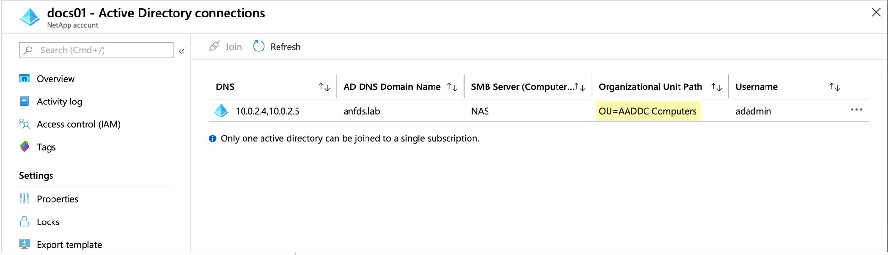

* **Username** credentials can be any user that is a member of the Azure AD group **Azure AD DC Administrators**.

## Create an Active Directory connection

1. From your NetApp account, click **Active Directory connections**, then click **Join**.  

    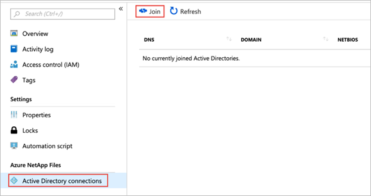

2. In the Join Active Directory window, provide the following information, based on the Domain Services you want to use:  

    For information specific to the Domain Services you use, see [Decide which Domain Services to use](#decide-which-domain-services-to-use). 

    * **Primary DNS**  
        This is the DNS that is required for the Active Directory domain join and SMB authentication operations. 
    * **Secondary DNS**   
        This is the secondary DNS server for ensuring redundant name services. 
    * **AD DNS Domain Name**  
        This is the domain name of your Active Directory Domain Services that you want to join.
    * **AD Site Name**  
        This is the site name that the Domain Controller discovery will be limited to.
    * **SMB server (computer account) prefix**  
        This is the naming prefix for the machine account in Active Directory that Azure NetApp Files will use for creation of new accounts.

        For example, if the naming standard that your organization uses for file servers is NAS-01, NAS-02..., NAS-045, then you would enter "NAS" for the prefix. 

        The service will create additional machine accounts in Active Directory as needed.

        > [!IMPORTANT] 
        > Renaming the SMB server prefix after you create the Active Directory connection is disruptive. You will need to re-mount existing SMB shares after renaming the SMB server prefix.

    * **Organizational unit path**  
        This is the LDAP path for the organizational unit (OU) where SMB server machine accounts will be created. That is, OU=second level, OU=first level. 

        If you are using Azure NetApp Files with Azure Active Directory Domain Services, the organizational unit path is `OU=AADDC Computers` when you configure Active Directory for your NetApp account.

     * **Backup policy users**  
        You can include additional accounts that require elevated privileges to the computer account created for use with Azure NetApp Files. The specified accounts will be allowed to change the NTFS permissions at the file or folder level. For example, you can specify a non-privileged service account used for migrating data to an SMB file share in Azure NetApp Files.  

        > [!IMPORTANT] 
        > Using the backup policy user feature requires whitelisting. Email anffeedback@microsoft.com with your subscription ID to request this feature. 

    * Credentials, including your **username** and **password**

    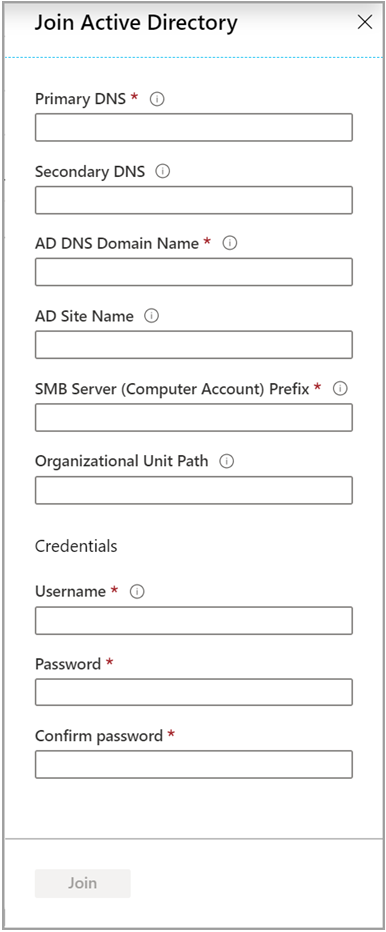

3. Click **Join**.  

    The Active Directory connection you created appears.

    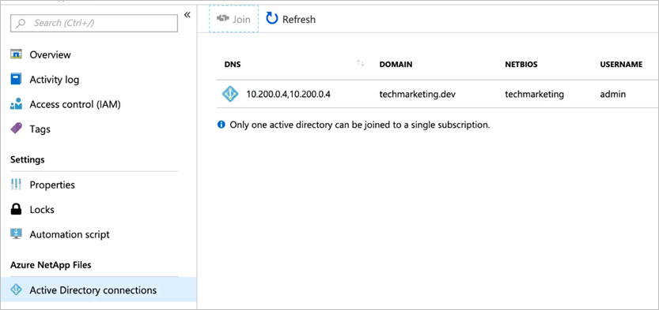

## Add an SMB volume

1. Click the **Volumes** blade from the Capacity Pools blade. 

    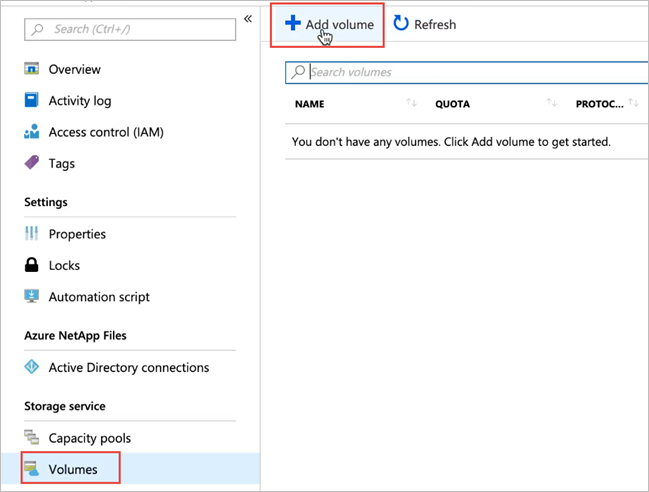

2. Click **+ Add volume** to create a volume.  
    The Create a Volume window appears.

3. In the Create a Volume window, click **Create** and provide information for the following fields:   
    * **Volume name**      
        Specify the name for the volume that you are creating.   

        A volume name must be unique within each capacity pool. It must be at least three characters long. You can use any alphanumeric characters.   

        You can't use `default` as the volume name.

    * **Capacity pool**  
        Specify the capacity pool where you want the volume to be created.

    * **Quota**  
        Specify the amount of logical storage that is allocated to the volume.  

        The **Available quota** field shows the amount of unused space in the chosen capacity pool that you can use towards creating a new volume. The size of the new volume must not exceed the available quota.  

    * **Virtual network**  
        Specify the Azure virtual network (VNet) from which you want to access the volume.  

        The VNet you specify must have a subnet delegated to Azure NetApp Files. The Azure NetApp Files service can be accessed only from the same VNet or from a VNet that is in the same region as the volume through VNet peering. You can also access the volume from  your on-premises network through Express Route.   

    * **Subnet**  
        Specify the subnet that you want to use for the volume.  
        The subnet you specify must be delegated to Azure NetApp Files. 
        
        If you haven't delegated a subnet, you can click **Create new** on the Create a Volume page. Then in the Create Subnet page, specify the subnet information, and select **Microsoft.NetApp/volumes** to delegate the subnet for Azure NetApp Files. In each VNet, only one subnet can be delegated to Azure NetApp Files.   
 
        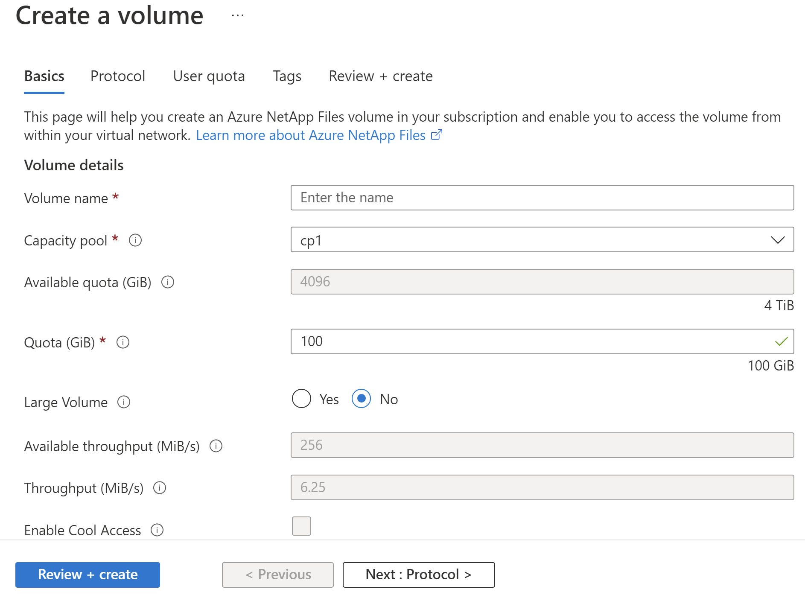
    
        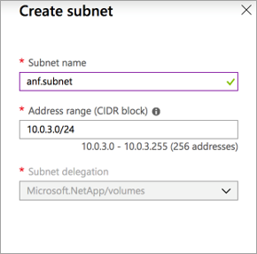

4. Click **Protocol** and complete the following information:  
    * Select **SMB** as the protocol type for the volume. 
    * Select your **Active Directory** connection from the drop-down list.
    * Specify the name of the shared volume in  **Share name**.

    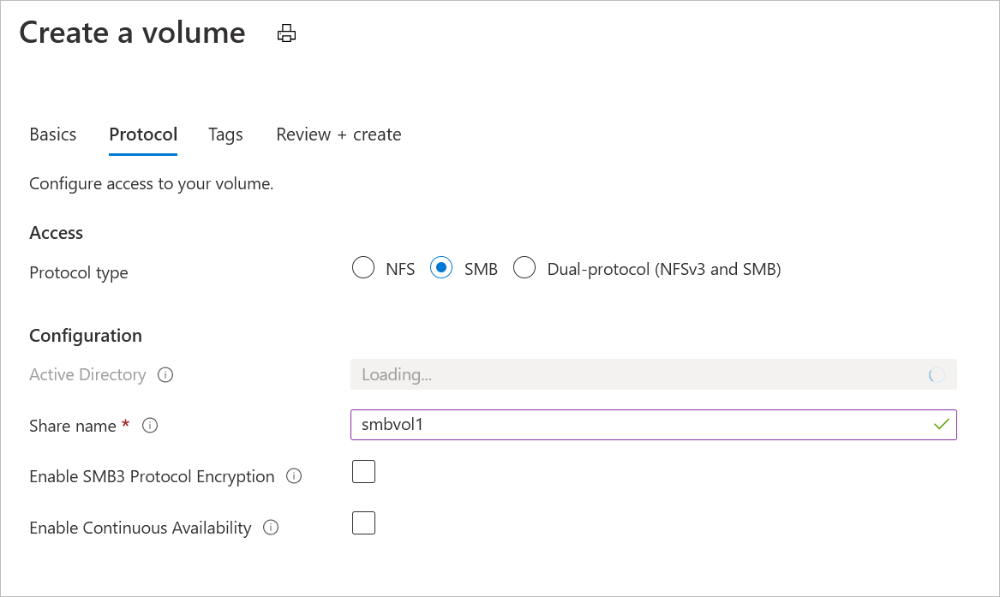

5. Click **Review + Create** to review the volume details.  Then click **Create** to create the SMB volume.

    The volume you created appears in the Volumes page. 
 
    A volume inherits subscription, resource group, location attributes from its capacity pool. To monitor the volume deployment status, you can use the Notifications tab.

## Control access to an SMB volume  

Access to an SMB volume is managed through permissions.  

### Share permissions  

By default, a new volume has the **Everyone / Full Control** share permissions. Members of the Domain Admins group can change the share permissions by using Computer Management on the computer account that is used for the Azure NetApp Files volume.

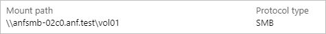 
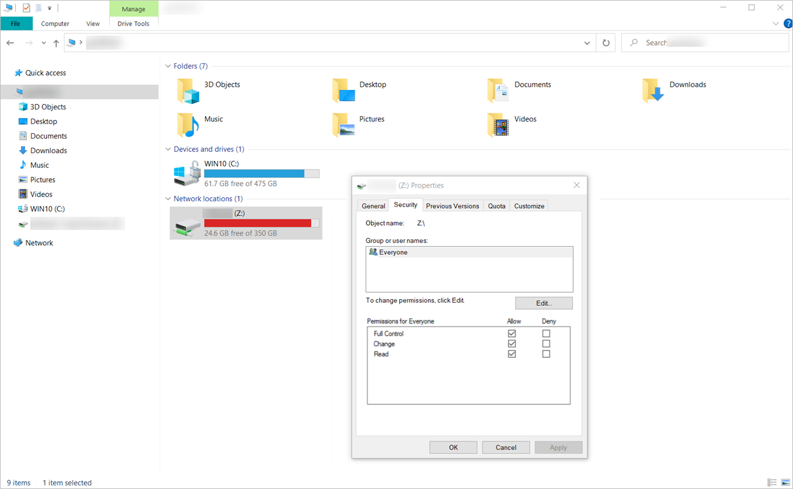 

### NTFS file and folder permissions  

You can set permissions for a file or folder by using the **Security** tab of the object's properties in the Windows SMB client.
 
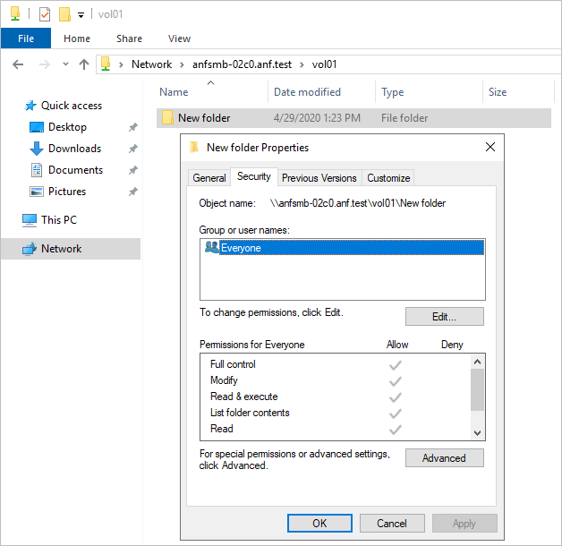 

## Next steps  

* [Mount or unmount a volume for Windows or Linux virtual machines](azure-netapp-files-mount-unmount-volumes-for-virtual-machines.md)
* [Resource limits for Azure NetApp Files](azure-netapp-files-resource-limits.md)
* [SMB FAQs](https://docs.microsoft.com/azure/azure-netapp-files/azure-netapp-files-faqs#smb-faqs)
* [Learn about virtual network integration for Azure services](https://docs.microsoft.com/azure/virtual-network/virtual-network-for-azure-services)
* [Install a new Active Directory forest using Azure CLI](https://docs.microsoft.com/windows-server/identity/ad-ds/deploy/virtual-dc/adds-on-azure-vm)
