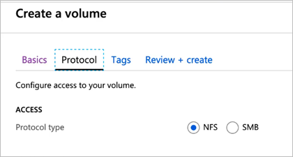

# Create an NFS volume for Azure NetApp Files

Azure NetApp Files supports creating volumes using NFS (NFSv3 or NFSv4.1), SMB3, or dual protocol (NFSv3 and SMB, or NFSv4.1 and SMB). A volume's capacity consumption counts against its pool's provisioned capacity. 

This article shows you how to create an NFS volume. For SMB volumes, see [Create an SMB volume](azure-netapp-files-create-volumes-smb.md). For dual-protocol volumes, see [Create a dual-protocol volume](create-volumes-dual-protocol.md).

## Before you begin 
* You must have already set up a capacity pool.  
    See [Create a capacity pool](azure-netapp-files-set-up-capacity-pool.md).   
* A subnet must be delegated to Azure NetApp Files.  
    See [Delegate a subnet to Azure NetApp Files](azure-netapp-files-delegate-subnet.md).

## Considerations 

* Deciding which NFS version to use  
  NFSv3 can handle a wide variety of use cases and is commonly deployed in most enterprise applications. You should validate what version (NFSv3 or NFSv4.1) your application requires and create your volume using the appropriate version. For example, if you use [Apache ActiveMQ](https://activemq.apache.org/shared-file-system-master-slave), file locking with NFSv4.1 is recommended over NFSv3. 

* Security  
  Support for UNIX mode bits (read, write, and execute) is available for NFSv3 and NFSv4.1. Root-level access is required on the NFS client to mount NFS volumes.

* User ID mapping in NFSv4.1 for LDAP-enabled and non-LDAP volumes  
  To avoid permission issues, including access for a root user, when using NFSv4.1, the ID domain configuration on the NFS client and Azure NetApp Files must match. User ID mapping can use centralized user management with LDAP or use local users for non-LDAP volumes. To configure the ID Domain in Azure NetApp Files for non-LDAP volumes, see [Configure NFSv4.1 ID domain for Azure NetApp Files](azure-netapp-files-configure-nfsv41-domain.md). 

## Best practice

* Ensure that you’re using the proper mount instructions for the volume. See [Mount a volume for Windows or Linux VMs](azure-netapp-files-mount-unmount-volumes-for-virtual-machines.md).

* The NFS client should be in the same VNet or peered VNet as the Azure NetApp Files volume. Connecting from outside the VNet is supported; however, it will introduce additional latency and decrease overall performance.

* Ensure that the NFS client is up to date and running the latest updates for the operating system.

## Create an NFS volume

1.	Click the **Volumes** blade from the Capacity Pools blade. Click **+ Add volume** to create a volume. 

     

2.	In the Create a Volume window, click **Create**, and provide information for the following fields under the Basics tab:   
    * **Volume name**      
        Specify the name for the volume that you are creating. 

        Refer to [Naming rules and restrictions for Azure resources](../azure-resource-manager/management/resource-name-rules.md#microsoftnetapp) for naming conventions on volumes. Additionally, you cannot use `default` or `bin` as the volume name.

    * **Capacity pool**  
        Specify the capacity pool where you want the volume to be created.

    * **Quota**  
        Specify the amount of logical storage that is allocated to the volume.  

        The **Available quota** field shows the amount of unused space in the chosen capacity pool that you can use towards creating a new volume. The size of the new volume must not exceed the available quota.  

    * **Large Volume**
        If the quota of your volume is less than 100 TiB, select **No**. If the quota of your volume is greater than 100 TiB, select **Yes**.
        [!INCLUDE [Large volumes warning](includes/large-volumes-notice.md)]

    * **Throughput (MiB/S)**   
        If the volume is created in a manual QoS capacity pool, specify the throughput you want for the volume.   

        If the volume is created in an auto QoS capacity pool, the value displayed in this field is (quota x service level throughput).   

    * **Enable Cool Access**, **Coolness Period**, and **Cool Access Retrieval Policy**      
        These fields configure [standard storage with cool access in Azure NetApp Files](cool-access-introduction.md). For descriptions, see [Manage Azure NetApp Files standard storage with cool access](manage-cool-access.md). 

    * **Virtual network**  
        Specify the Azure virtual network (VNet) from which you want to access the volume.  

        The VNet you specify must have a subnet delegated to Azure NetApp Files. The Azure NetApp Files service can be accessed only from the same Vnet or from a Vnet that is in the same region as the volume through VNet peering. You can also access the volume from  your on-premises network through Express Route.   

    * **Subnet**  
        Specify the subnet that you want to use for the volume.  
        The subnet you specify must be delegated to Azure NetApp Files. 
        
        If you have not delegated a subnet, you can click **Create new** on the Create a Volume page. Then in the Create Subnet page, specify the subnet information, and select **Microsoft.NetApp/volumes** to delegate the subnet for Azure NetApp Files. In each VNet, only one subnet can be delegated to Azure NetApp Files.   
    
        

    * **Network features**  
        In supported regions, you can specify whether you want to use **Basic** or **Standard** network features for the volume. See [Configure network features for a volume](configure-network-features.md) and [Guidelines for Azure NetApp Files network planning](azure-netapp-files-network-topologies.md) for details.

    * **Encryption key source** 
        You can select `Microsoft Managed Key` or `Customer Managed Key`. See [Configure customer-managed keys for Azure NetApp Files volume encryption](configure-customer-managed-keys.md) and [Azure NetApp Files double encryption at rest](double-encryption-at-rest.md) about using this field. 

    * **Availability zone**   
        This option lets you deploy the new volume in the logical availability zone that you specify. Select an availability zone where Azure NetApp Files resources are present. For details, see [Manage availability zone volume placement](manage-availability-zone-volume-placement.md).

    * If you want to apply an existing snapshot policy to the volume, click **Show advanced section** to expand it, specify whether you want to hide the snapshot path, and select a snapshot policy in the pull-down menu. 

        For information about creating a snapshot policy, see [Manage snapshot policies](snapshots-manage-policy.md).

        

        >[!NOTE]
        >By default, the `.snapshot` directory path is hidden from NFSv4.1 clients. Enabling the **Hide snapshot path** option will hide the .snapshot directory from NFSv3 clients; the directory will still be accessible.

3. Select **Protocol** then complete the following actions:  
    * Select **NFS** as the protocol type for the volume.   

    * Specify a unique **file path** for the volume. This path is used when you create mount targets. The requirements for the path are as follows:   
        - It must be unique within each subnet in the region. 
        - It must start with an alphabetical character.
        - It can contain only letters, numbers, or dashes (`-`). 
        - The length must not exceed 80 characters.

    * Select the **Version** (**NFSv3** or **NFSv4.1**) for the volume.  

    * If you are using NFSv4.1, indicate whether you want to enable **Kerberos** encryption for the volume.  

        Additional configurations are required if you use Kerberos with NFSv4.1. Follow the instructions in [Configure NFSv4.1 Kerberos encryption](configure-kerberos-encryption.md).

    * If you want to enable Active Directory LDAP users and extended groups (up to 1024 groups) to access the volume, select the **LDAP** option. Follow instructions in [Configure AD DS LDAP with extended groups for NFS volume access](configure-ldap-extended-groups.md) to complete the required configurations. 
 
    *  Customize **Unix Permissions** as needed to specify change permissions for the mount path. The setting does not apply to the files under the mount path. The default setting is `0770`. This default setting grants read, write, and execute permissions to the owner and the group, but no permissions are granted to other users.     
        Registration requirement and considerations apply for setting **Unix Permissions**. Follow instructions in [Configure Unix permissions and change ownership mode](configure-unix-permissions-change-ownership-mode.md).   

    * Optionally, [configure export policy for the NFS volume](azure-netapp-files-configure-export-policy.md).

    

4. Select **Review + Create** to review the volume details. Select **Create** to create the volume.

    The volume you created appears in the Volumes page. 
 
    A volume inherits subscription, resource group, location attributes from its capacity pool. To monitor the volume deployment status, you can use the Notifications tab.

## Next steps  

* [Manage availability zone volume placement for Azure NetApp Files](manage-availability-zone-volume-placement.md)
* [Configure NFSv4.1 default domain for Azure NetApp Files](azure-netapp-files-configure-nfsv41-domain.md)
* [Configure NFSv4.1 Kerberos encryption](configure-kerberos-encryption.md)
* [Enable Active Directory Domain Services (AD DS) LDAP authentication for NFS volumes](configure-ldap-over-tls.md)
* [Configure AD DS LDAP with extended groups for NFS volume access](configure-ldap-extended-groups.md)
* [Mount a volume for Windows or Linux VMs](azure-netapp-files-mount-unmount-volumes-for-virtual-machines.md)
* [Configure export policy for an NFS volume](azure-netapp-files-configure-export-policy.md)
* [Configure Unix permissions and change ownership mode](configure-unix-permissions-change-ownership-mode.md). 
* [Resource limits for Azure NetApp Files](azure-netapp-files-resource-limits.md)
* [Learn about virtual network integration for Azure services](../virtual-network/virtual-network-for-azure-services.md)
* [Configure access control lists on NFSv4.1 with Azure NetApp Files](configure-access-control-lists.md)
* [Application resilience FAQs for Azure NetApp Files](faq-application-resilience.md)
* [Requirements and considerations for large volumes](large-volumes-requirements-considerations.md)
