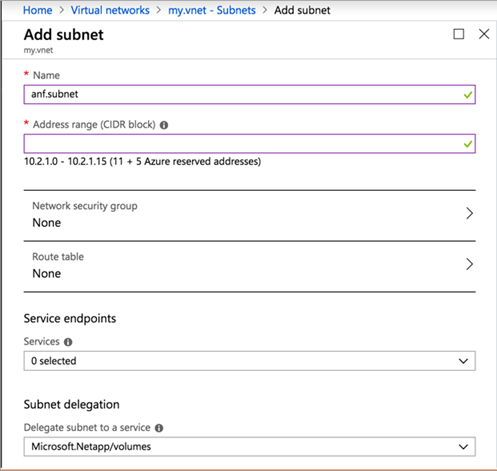

# Delegate a subnet to Azure NetApp Files 

You must delegate a subnet to Azure NetApp Files. When you create a volume, you need to specify the delegated subnet.

## Considerations

* When creating the delegated subnet for _Azure NetApp Files_, consider the size of the subnet. A subnet with a **/28 network mask** provides only **11 usable IP addresses**, which might be insufficient for certain use cases. Consider creating a larger subnet mask. For example: 

    - A **/26 network mask** provides **59 usable IP addresses**
    - A **/24 network mask** provides **251 usable IP addresses**

    In scenarios involving high application volume counts such as _SAP HANA_, consider larger subnets, like a **/23 network mask.** Larger subnets are especially beneficial if you expect many volumes and storage endpoints.
    
    Once the delegated network is created, its network mask cannot be altered. Thus it's essential to thoughtfully plan your virtual network (VNet) and delegated subnet sizes with an eye toward the future.

* In each VNet, only one subnet can be delegated to Azure NetApp Files.   
   Azure enables you to create multiple delegated subnets in a VNet.  However, any attempts to create a new volume would fail if you use more than one delegated subnet.  
   You can have only a single delegated subnet in a VNet. A NetApp account can deploy volumes into multiple VNets, each having its own delegated subnet.  
* If you're using Basic network features, you can't designate a network security group (NSG) or service endpoint in the delegated subnet. Doing so causes the subnet delegation to fail. To designate an NSG or service endpoint, [upgrade to Standard network features](configure-network-features.md).
* Access to a volume from a globally peered virtual network isn't currently supported using Basic networks features. Global VNet peering is supported with Standard network features. For more information, see [Supported network topologies](azure-netapp-files-network-topologies.md#supported-network-topologies).
* For Azure NetApp Files support of [User-defined routes](../virtual-network/virtual-networks-udr-overview.md#custom-routes) (UDRs) and Network security groups (NSGs), see [Constraints in Guidelines for Azure NetApp Files network planning](azure-netapp-files-network-topologies.md#constraints).   
   To establish routing or access control ***to*** the Azure NetApp Files delegated subnet, you can apply UDRs and NSGs to other subnets, even within the same VNet as the subnet delegated to Azure NetApp Files.  

## Steps

1.	Navigate to **Virtual networks** in the Azure portal. Select the virtual network that you want to use for Azure NetApp Files.    

1. From Virtual network, select  **Subnets** then the **+Subnet** button. 

1. Create a new subnet to use for Azure NetApp Files by completing the following required fields in the Add Subnet page:
    * **Name**: Specify the subnet name.
    * **Address range**: Specify the IP address range.
    * **Subnet delegation**: Select **Microsoft.NetApp/volumes**. 

      
    
You can also create and delegate a subnet when you [create a volume for Azure NetApp Files](azure-netapp-files-create-volumes.md). 

## Next steps

* [Create a volume for Azure NetApp Files](azure-netapp-files-create-volumes.md)
* [Learn about virtual network integration for Azure services](../virtual-network/virtual-network-for-azure-services.md)
* [Application resilience FAQs for Azure NetApp Files](faq-application-resilience.md)
