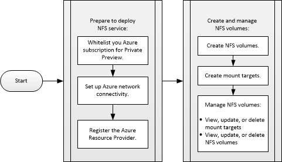

# Introduction to Azure NetApp Files
Azure NetApp Files provide a native, first-party NFS service to enable business critical enterprise applications, databases, scalable web services, and agile development operations.  Unlike traditional storage technologies or solutions that require you to refactor your applications, stand up a large IT or storage team, or simply do not meet your enterprise standards, Azure NetApp Files provide unmatched performance, reliability, and data management with the benefits of a native, integrated cloud service.

[!IMPORTANT] All tasks described in this documentation require that you be whitelisted for accessing the Microsoft.NetApp Azure Resource Provider and using the Azure NetApp Files service.  For details about the whitelisting process, see the [Azure NetApp Files Public Preview survey page](#https://aka.ms/nfspublicpreview). 

## Requirements
You must meet a few requirements before setting up and using Azure NetApp Files.  

### Skills and knowledge

* Linux server administration
* NFSv3 commands
* Access to and knowledge of using the Azure Portal environment, including the Azure Cloud Shell

### Compute resources
You need a valid Azure subscription for using Azure NetApp Files.

## Workflow overview for setting up and using Azure NetApp Files
^^^^^^^^^ WORKFLOW DIAGRAM STALE; NEEDS UPDATING ^^^^^^^^^

<!--

-->

## Get started  
1. [Prepare to deploy Azure NetApp Files](azure-netapp-files-prepare-to-deploy.md)
2. [Create a NetApp account]
3. Set up a capacity pool
4. [Set up an NFS volume](azure-netapp-files-set-up-nfs-volumes.md)

