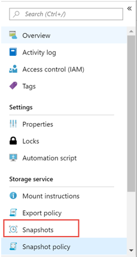
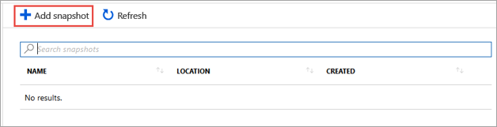
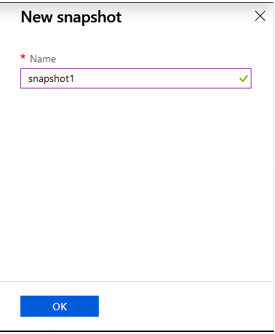

# Create an on-demand snapshot for a volume

Azure NetApp Files supports creating on-demand [snapshots](snapshots-introduction.md) and using snapshot policies to schedule automatic snapshot creation. You can also restore a [snapshot to a new volume](snapshots-restore-new-volume.md), [restore a single file by using a client](snapshots-restore-file-client.md), or [revert an existing volume by using a snapshot](snapshots-revert-volume.md). This article explains how to create an on-demand snapshot for a volume. 

> [!NOTE] 
> * For considerations about snapshot management in cross-region replication, see [Requirements and considerations for using cross-region replication](cross-region-replication-requirements-considerations.md).
> * You can use Azure Application Consistent Snapshot tool (AzAcSnap) to enable data protection for third-party databases. For more information, see What is [Azure Application Consistent Snapshot tool](azacsnap-introduction.md).
 
## Steps

1.	Go to the volume that you want to create a snapshot for. Select **Snapshots**.

    

2.  Select **+ Add snapshot** to create an on-demand snapshot for a volume.

    

3.	In the New Snapshot window, provide a name for the new snapshot that you are creating.   

    

4. Select **OK**. 

## Next steps

* [Learn more about snapshots](snapshots-introduction.md)
* [Manage snapshot policies with Azure NetApp Files](snapshots-manage-policy.md)
* [Resource limits for Azure NetApp Files](azure-netapp-files-resource-limits.md)
* [Azure NetApp Files Snapshots 101 video](https://www.youtube.com/watch?v=uxbTXhtXCkw&feature=youtu.be)
* [What is Azure Application Consistent Snapshot Tool](azacsnap-introduction.md)
