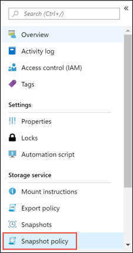
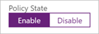
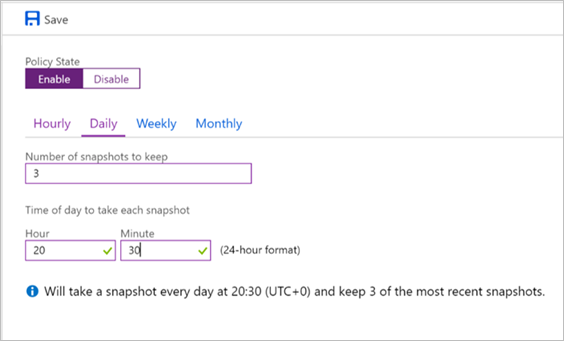
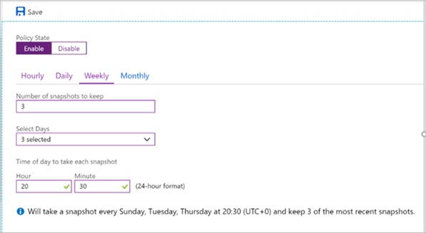
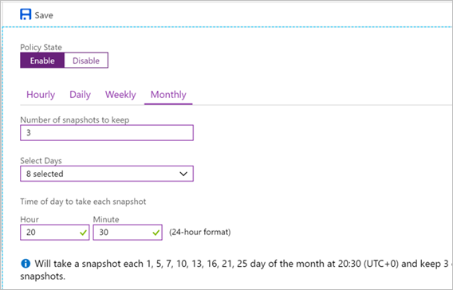
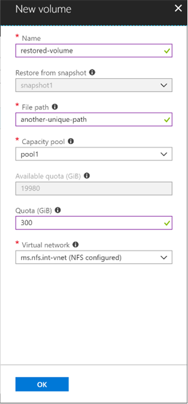

# Manage snapshots by using Azure NetApp Files

You can use Azure NetApp Files to create an on-demand snapshot for a volume, create a snapshot policy, and restore from a snapshot to a new volume.

## Create an on-demand snapshot for a volume

You can create snapshots on demand (that is, manually) without creating a snapshot policy.

1.	From the Volume blade, click **Snapshots**.

    

2.  Click **+ Add snapshot** to create an on-demand snapshot for a volume.

    

3.	In the New Snapshot window, provide a name for the new snapshot that you are creating.   

    

4. Click **OK**. 

## Create a snapshot policy

You can schedule for volume snapshots to be taken automatically by using snapshot policies.  You can specify the frequency in hourly, daily, weekly, and monthly cycles.  You can also specify the maximum number of snapshots to keep.  

1. From the Volume blade, click **Snapshot policy**.

    

2. Under Policy State, click **Enable** to enable snapshot policies. 

    

3. Click the **Hourly**, **Daily**, **Weekly**, or **Monthly** tab to create hourly, daily, weekly, or monthly snapshot policies.  
4. Specify the number of snapshots to keep.  

    Each volume can have a maximum of 255 snapshots.  

5. For each snapshot policy, specify the time when the snapshot should be taken:  
    * For hourly snapshots, specify a value for **Minute**.
    * For daily snapshots, specify values for **Hour** and **Minute**.
    * For weekly snapshots, specify values for **Days** of the week, **Hour**, and **Minute**.
    * For monthly snapshots, specify values for **Days** of the month, **Hour**, and **Minute**.  

    

    

    

6. If you need to create additional snapshot policies, repeat steps 3 through 5 above. 
7. Click **Save**. 

## Restore a snapshot to a new volume

Currently, you can restore a snapshot only to a new volume. 
1. Go to the **Manage Snapshots** blade from the Volume blade to display the snapshot list. 
2. Select a snapshot to restore.  
3. Right-click the snapshot name and select **Restore to new volume** from the menu option.  

    

4. In the New Volume window, provide information for the new volume:  
    * **Name**   
        Specify the name for the volume that you are creating.  
        
        The name must be unique within a resource group. It must be at least three characters long.  It can use any alphanumeric characters.

    * **File path**     
        Specify the file path that will be used to create the export path for the new volume. The export path is used to mount and access the volume.   
        
        A mount target is the endpoint of the NFS service IP address. It is automatically generated.   
        
        The file path name can contain letters, numbers, and hyphens ("-") only. It must be between 16 and 40 characters in length. 

    * **Quota**  
        Specify the amount of logical storage that is allocated to the volume.  

        The **Available quota** field shows the amount of unused space in the chosen capacity pool that you can use towards creating a new volume. The size of the new volume must not exceed the available quota.

    *   **Virtual network**  
        Specify the Azure virtual network (Vnet) from which you want to access the volume.  
        The Vnet you specify must have a subnet delegated to Azure NetApp Files. You can access Azure NetApp Files only from the same Vnet or from a Vnet that is in the same region as the volume through Vnet peering. You can access the volume from your on-premise network through Express Route. 

    * **Subnet**  
        Specify the subnet that you want to use for the volume.  
        The subnet you specify must be delegated to the Azure NetApp Files service. 
        You can create a new subnet by selecting **Create new** under the Subnet field.  
<!--
     
-->

5. Click **OK**.   
    The new volume to which the snapshot is restored appears in the Volumes blade.

## Next steps

[Understand the storage hierarchy of Azure NetApp Files](azure-netapp-files-understand-storage-hierarchy.md)