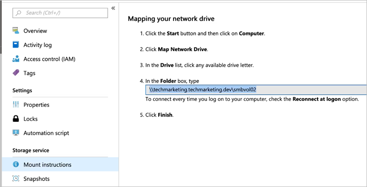

# Mount or unmount a volume for Windows or Linux virtual machines 

You can mount or unmount a volume for Windows or Linux virtual machines as necessary.  The mount instructions for Linux virtual machines are available on Azure NetApp Files.  

> [!IMPORTANT] 
> You must have at least one export policy to be able to access an NFS volume.

1. Click the **Volumes** blade, and then select the volume for which you want to mount. 
2. Click **Mount instructions** from the selected volume, and then follow the instructions to mount the volume. 

    

    
    
    If you are using NFSv4.1, use the following command to mount your file system:  `sudo mount -t nfs -o rw,hard,rsize=65536,wsize=65536,vers=4.1,tcp,sec=sys $MOUNTTARGETIPADDRESS:/$VOLUMENAME $MOUNTPOINT`  

3. If you want to have an NFS volume automatically mounted when an Azure VM is started or rebooted, add an entry to the `/etc/fstab` file on the host. 

    For example:  `$ANFIP:/$FILEPATH		/$MOUNTPOINT	nfs bg,rw,hard,noatime,nolock,rsize=65536,wsize=65536,vers=3,tcp,_netdev 0 0`

    * `$ANFIP` is the IP address of the Azure NetApp Files volume found in the volume properties blade.
    * `$FILEPATH` is the export path of the Azure NetApp Files volume.
    * `$MOUNTPOINT` is the directory created on the Linux host used to mount the NFS export.

4. If you want to mount the volume to Windows using NFS:

    a. Mount the volume onto a Unix or Linux VM first.  
    b. Run a `chmod 777` or `chmod 775` command against the volume.  
    c. Mount the volume via the NFS client on Windows.

## Next steps

* [Configure NFSv4.1 default domain for Azure NetApp Files](azure-netapp-files-configure-nfsv41-domain.md)
* [NFS FAQs](https://docs.microsoft.com/azure/azure-netapp-files/azure-netapp-files-faqs#nfs-faqs)
* [Network File System overview](https://docs.microsoft.com/windows-server/storage/nfs/nfs-overview)
