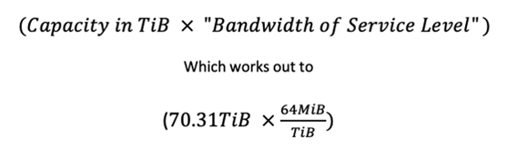
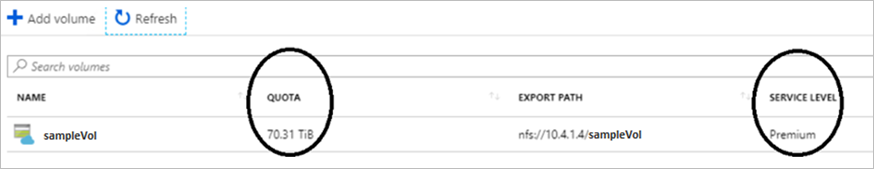
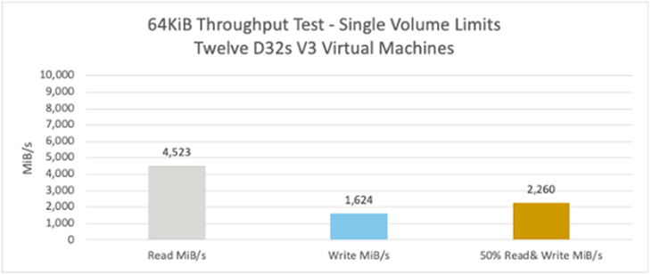
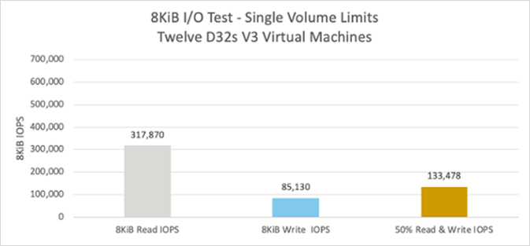
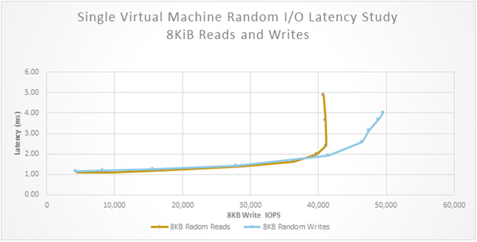

# Performance benchmarks for Azure NetApp Files

This article describes results of performance benchmark tests for Azure NetApp Files at the volume level. 

## Sample application used for the tests

Performance tests were run with a sample application using Azure NetApp Files. The application has the following characteristics: 

* A Linux-based application built for the cloud
* Can scale linearly with added virtual machines (VMs) to increase compute power as needed
* Requires rapid accessibility of the data lake
* Has I/O patterns that are sometimes random and sometimes sequential 
    * A random pattern requires low latency for large amounts of I/O. 
    * A sequential pattern requires large amounts of bandwidth. 

## About the workload generator

The results come from Vdbench summary files. [Vdbench](https://www.oracle.com/technetwork/server-storage/vdbench-downloads-1901681.html) is a command-line utility that generates disk I/O workloads for validating storage performance. The client-server configuration used is scalable.  It includes a single mixed master/client and 14 dedicated client VMs.

## About the tests

The tests were designed to identify the limits that the sample application might have and the response time that curves up to the limits.  

The following tests were run: 

* 100% 8-KiB random read
* 100% 8-KiB random write
* 100% 64-KiB sequential read
* 100% 64-KiB sequential write
* 50% 64-KiB sequential read, 50% 64-KiB sequential write
* 50% 8-KiB random read, 50% 8-KiB random write

## Bandwidth

Azure NetApp Files offers multiple [service levels](azure-netapp-files-service-levels.md). Each service level offers a different amount of bandwidth per TiB of provisioned capacity (volume quota). The bandwidth limit for a volume is provisioned based on the combination of the service level and the volume quota. The bandwidth limit is only one factor in determining the actual amount of throughput that will be realized.  

Currently, 4,500 MiB is the highest throughput that has been achieved by a workload against a single volume in testing.  With the Premium service level, a volume quota of 70.31 TiB will provision enough bandwidth to realize this throughput per the calculation below: 

## Throughput-intensive workloads

The throughput test used Vdbench and a combination of 12xD32s V3 storage VMs. The sample volume in the test achieved the following throughput numbers:

## I/O-intensive workloads

The I/O test used Vdbench and a combination of 12xD32s V3 storage VMs. The sample volume in the test achieved the following I/O numbers:

## Latency

The distance between the test VMs and the Azure NetApp Files volume has an impact on the I/O performance.  The chart below compares the IOPS versus latency response curves for two different sets of VMs.  One set of VMs is near Azure NetApp Files and the other set is further away.  The increased latency for the further set of VMs has an impact on the amount of IOPS achieved at a given level of parallelism.  Regardless, reads against a volume can exceed 300,000 IOPS as illustrated below: 

## Summary

Latency-sensitive workloads (databases) can have a one-millisecond response time. The transactional performance can be over 300k IOPS for a single volume.

Throughput-sensitive applications (for streaming and imaging) can have 4.5GiB/s throughput.

## Example scripts

The following example scripts are for demonstration purpose only.  They are not to be used for production purposes.  

    #
    #This script makes the following assumptions about the environment
    #VM Naming Convention:
    #   VM naming convention: vdbench-vnet1-1 .. vdbench-vnet1-x
    #
    #VM Count:
    #   The script is written for 24 VM's, 
    #   If you wish to test with a different number of vm's replace {1..24} with {1..Some Number}
    #
    #Volume mount point:
    #    The volumes in this script are mounted at the following mount points on all virtual machines
    #    /mnt/vdb1 ... /mnt/vdb6
    #   
    #Virtual machines must have
    #   make sure that vdbench is present on all vms in the environment and that java has been installed on each vm as well as nfs-utils
    #
    #The following tunables were configured on all virtual machines in the environment
    #    No special tunables were used to extract the results identified in this paper.
    #    Even rsize and wsize were left at the default (64K)
    #
    #Special Notes (thread counts) 
    #   You can hone in on the amount of I/O you hope to achieve in your testing using littles law,
    #   Run each test with a thread count of 1 to determnine the best possible latency.
    #   Thread count equals latency in seconds * desired I/O rate.  
    #   If you find a minimum latency of 1.14ms for example, divide that by 1000 to convert 1.3ms to .0013 seconds.
    #   
    #   If your goal from a single machine is for example 3,500 IOPS, a thread count of 4.0 is required.
    
    #   thread count 4.0 == .0013s * 5,000ops
    #
    #    
    #Special Notes: Increased window size:
    #   As round-trip time increases; corresponding increases are required in TCP Window Size – think Littles law as shown above. 
    #   Check the values of the following and adjust as needed: net.core.rmem_max, net.core.rmem_default, net.ipv4.tcp_rmem
    #
    #Run the utility like this:
    #    vdbench -f vnet1-SeqMix-workload
    #
    #When the utility is finished its run, grep 'avg' from the summary file to see overall run performance.
     
    
    
    #LUN CONFIG FILES
    for vnet in 1; do
        echo "sd=default,size=693g" > vnet${vnet}-luns-nfs
        for vm in {1..24}; do
            for vol in {1..6}; do
                echo "sd=sd-${vm}-${vol},host=vm${vm},lun=/mnt/vdb${vol}/file-${vm}-${vol},openflags=o_direct" >> vnet${vnet}-luns-nfs
            done
        done
    done
    
    
    #HOST CONFIG FILES
    for vnet in 1; do
        echo "hd=default,jvms=1,shell=ssh" > vnet${vnet}-hosts-nfs
        for vm in {1..24}; do
            echo "hd=vm${vm},system=vdbench-vnet${vnet}-${vm},user=root" >> vnet${vnet}-hosts-nfs
        done
    done
    
    #VDBENCH WORK SCRIPTS
    for vnet in 1; do
        for pattern in FillWrite SeqRead SeqWrite RndRead RndWrite SeqMix RndMix; do
            echo "include=vnet${vnet}-hosts-nfs" > vnet${vnet}-${pattern}-workload
            echo "include=vnet${vnet}-luns-nfs" >> vnet${vnet}-${pattern}-workload
        done 
        #Fill Write File
        echo "wd=FillWrite,sd=sd*,rdpct=0,seekpct=eof,xfersize=64k" >> vnet${vnet}-FillWrite-workload
        echo "* Run Defaults" >> vnet${vnet}-FillWrite-workload
        echo 'rd=Initialize-LUNs-Full,wd=FillWrite,sd=("sd*"),iorate=max,interval=1,forthreads=1,elapsed=259200' >> vnet${vnet}-FillWrite-workload
    
        #The actual workload files - feel free to add more or use less.
        #   The thread counts shown below were used to generate the performance collateral, 
        #   feel free to change to suite your needs.
    
        echo "wd=SeqWrite,sd=sd*,rdpct=0,seekpct=0,xfersize=64k" >> vnet${vnet}-SeqWrite-workload
        echo "wd=SeqRead,sd=sd*,rdpct=100,seekpct=0,xfersize=64k" >> vnet${vnet}-SeqRead-workload
        echo "wd=RndRead,sd=sd*,rdpct=100,seekpct=100,xfersize=8k" >> vnet${vnet}-RndRead-workload
        echo "wd=RndWrite,sd=sd*,rdpct=0,seekpct=100,xfersize=8k" >> vnet${vnet}-RndWrite-workload
        echo "wd=SeqMix,sd=sd*,rdpct=50,seekpct=0,xfersize=64k" >> vnet${vnet}-SeqMix-workload
        echo "wd=RndMix,sd=sd*,rdpct=50,seekpct=100,xfersize=8k" >> vnet${vnet}-RndMix-workload
        for pattern in SeqRead SeqWrite RndRead RndWrite SeqMix RndMix; do
            echo "* Run Defaults" >> vnet${vnet}-${pattern}-workload
            #echo "rd=default,curve=(50,100),iorate=curve,warmup=60,elapsed=600,iorate=curve" >> vnet${vnet}-${pattern}-workload
            echo "rd=default,warmup=60,elapsed=600,iorate=max" >> vnet${vnet}-${pattern}-workload
            echo "* Run Definitions" >> vnet${vnet}-${pattern}-workload
        done
        echo 'rd=RndRead,wd=RndRead,sd=("sd*"),threads=25' >> vnet${vnet}-RndRead-workload
        echo 'rd=RndWrite,wd=RndWrite,sd=("sd*"),threads=20' >> vnet${vnet}-RndWrite-workload
        echo 'rd=SeqRead-4,wd=SeqRead,sd=("sd*"),threads=20' >> vnet${vnet}-SeqRead-workload
        echo 'rd=SeqWrite-26,wd=SeqWrite,sd=("sd*"),threads=26' >> vnet${vnet}-SeqWrite-workload
        echo 'rd=SeqWrite-32,wd=SeqWrite,sd=("sd*"),threads=32' >> vnet${vnet}-SeqWrite-workload
        echo 'rd=SeqWrite-40,wd=SeqWrite,sd=("sd*"),threads=40' >> vnet${vnet}-SeqWrite-workload
        echo 'rd=RndMix,wd=RndMix,sd=("sd*"),threads=25' >> vnet${vnet}-RndMix-workload
        echo 'rd=SeqMix-6,wd=SeqMix,sd=("sd*"),threads=6' >> vnet${vnet}-SeqMix-workload
        echo 'rd=SeqMix-7,wd=SeqMix,sd=("sd*"),threads=7' >> vnet${vnet}-SeqMix-workload
    done
